# Java Notes

## 基础

### 安装jdk

#### 1.windows安装jdk

- 1.下载jdk压缩包xxx.zip，解压到指定目录（解压后bin文件夹所在目录为jdk根目录，假设为`D:\java\jdk\xxx`）
- 2.新增环境变量`JAVA_HOME：D:\java\jdk\xxx`
- 3.`Path`中添加：`%JAVA_HOME%\bin`

#### 2.linux安装jdk

- 1.下载jdk压缩包xxx.tar.gz，解压到指定目录

```sh
# 新建目录
mkdir -p 指定目录

tar -zxvf xxx.tar.gz -C 指定目录
```

- 2.设置环境变量（解压后bin文件夹所在目录为jdk根目录，假设为`/usr/local/java/jdk/xxx`）

```sh
# 1.先备份profile文件
cp /etc/profile /etc/profile.bk

# 2.编辑profile文件
vi /etc/profile

# 3.在profile文件末尾添加
export JAVA_HOME=/usr/local/java/jdk/xxx
export PATH=$PATH:${JAVA_HOME}/bin
```

- 3.重新加载配置文件

```sh
source /etc/profile
```

- 4.测试

```sh
java -version
```

### 代码笔记

- 若将多个类的声明放在一个文档中，只能有一个类声明为公有类。

```java
public class A {}

class B {}

class C {}
```

- Java源文档名必须与文档中公有类名一致（区分大小写）。

```java
// 文件名必须为 A.java
public class A {}

class B {}
```

- 以集合作为参数的任何方法，参数应该尽可能地使用接口类型，而不要使用具体的实现类型。

```java
// 推荐
public void function(List<Integer> list) {}

// 不推荐
public void function(ArrayList<Integer> list) {}
```

- 继承写法：子类名 extends 父类名；子类名 implements 父接口名；子接口名 extends 父接口名。
- 用来存储对象的变量称为引用变量。
- 方法名有final修饰，表示此方法是终结方法，不能被子类重写。
- 可变长参数在一个方法中最多只能有一个，并且必须放在最后。
- Java编译器自动引入java.lang。
- 内存回收：调用System.gc()；在类中重写finalize()方法：`protected void finalize() throws throwable`
- 子类不能继承父类的静态属性，但可以对父类静态属性操作
- `方法的签名`（signature): 要完整地描述一个方法，需要指出`方法名`以及`参数类型`。返回类型不是方法签名的一部分。也就是说， 不能有两个名字相同、参数类型也相同却返回不同类型值的方法。
- 枚举:所有的枚举类型都是`Enum`类的子类。在比较两个枚举类型的值时， 永远不需要调用equals, 而直接使用`==`。如果需要的话， 可以在枚举类型中添加一些构造器、方法和域。当然，构造器只是在构造枚举常量的时候被调用。可以定义构造函数，默认是`private`。

```java
import lombok.Getter;

@Getter
public enum ColorEnum {
    RED("red"), GREEN("green"), BLUE("blue");

    private String value;

    ColorEnum(String value) {
        this.value = value;
    }
}
```

- VO（View Object）：视图对象，前端和控制层之间的数据传输对象。
- DTO（Data Transfer Object）：数据传输对象，控制层与服务层之间的数据传输对象。
- DO（Domain Object）：领域对象，就是从现实世界中抽象出来的有形或无形的业务实体。
- PO（Persistent Object）：持久化对象，它跟持久层（通常是关系型数据库）的数据结构形成一一对应的映射关系，如果持久层是关系型数据库，那么，数据表中的每个字段（或若干个）就对应PO的一个（或若干个）属性。

- 类型比较运算符
  
  1) point instanceof Point; // 如果point是Point类的一个实例，结果为true
  
  2) `基本数据类型`，== 比较的是`值`
  
  3) `复合数据类型`，== 比较的是`地址`
  
  4) 复合数据类型，`equals在没有复写`的情况下，比较的也是`地址`

- 定义常量

```java
public class C() {
    // 定义类常量
    private final double PI =3.14;

    // 定义局部常量
    public void fun() {
        final double PI =3.14;
    }
}
```

- 静态方法中获取所在类实例

```java
Class clazz = MethodHandles.lookup().lookupClass();
```

- 打印对象内存地址

```java
Object object = new Object();
// 方法1，推荐
String hexAddress1 = Integer.toHexString(System.identityHashCode(object));

// 方法2，前提是没有重写toString()
String hexAddress2 = object.toString().substring(object.toString().indexOf("@") + 1);
```

- 文件复制

```java
try (InputStream inputStream = Application.class.getClassLoader().getResourceAsStream(fileName);
    BufferedInputStream in = new BufferedInputStream(inputStream);
    BufferedOutputStream out = new BufferedOutputStream(new FileOutputStream(outputFileName));) {
    int length = 0;
    byte[] buffer = new byte[1024];
    while (-1 != (length = in.read(buffer))) {
        out.write(buffer, 0, length);
    }
}
```

- `JRE` 是 Java 运行时环境。它是运行已编译 Java 程序所需的所有内容的集合，包括 Java 虚拟机（JVM），Java 类库，java 命令和其他的一些基础构件。但是，它不能用于创建新程序。
- `JDK` 是 Java Development Kit 缩写，它是功能齐全的 Java SDK。它拥有 JRE 所拥有的一切，还有编译器（javac）和工具（如 javadoc 和 jdb）。它能够创建和编译程序。

### 二进制

- 原码：一个正数，按照绝对值大小转换成的二进制数；一个负数，先按照绝对值大小转换成的二进制数，然后最高位置1

- 反码：正数的反码与原码相同，负数的反码为其原码`除符号位`外`按位取反`

- 补码：正数的补码与原码相同，负数的补码为其反码加1

- 正数的二进制数为其原码，负数的二进制数为其补码

```java
// 原码 10000000 00000000 00000000 00000010
// 反码 11111111 11111111 11111111 11111101
// 反码 11111111 11111111 11111111 11111110
String b = Integer.toBinaryString(-2); // 11111111 11111111 11111111 11111110
```

### 进制转换

- 8位二进制为一个字节，范围值从0B00000000～0B11111111，程序中用十六进制表示的时候就是从0X00到0XFF

- 二进制4位一组，遵循8,4,2,1的规律比如 1111，那么从最高位开始算，数字大小是8*1+4*1+2*1+1*1 = 15，那么十进制就是15，十六进制就是0XF。

- 二进制转十六进制的时候，十六进制一位刚好是和二进制4位相互对应的。8位二进制为一个字节，对应十六进制2位。

- Java中，byte、short、int、long分别占1、2、4、8个字节，char占2个字节

#### 十进制转其它进制

```java
int a = 10;
System.out.println(Integer.toBinaryString(a)); // 二进制   1010
System.out.println(Integer.toOctalString(a));  // 八进制   12
System.out.println(Integer.toHexString(a));    // 十六进制 a
```

#### byte[] 和十六进制字符串互转

- 用Java自带方法转换

```java
byte[] data = {1, 2};
String hexString = new BigInteger(1, data).toString(16);
```

- 引入第三方库转换

```xml
<dependency>
    <groupId>commons-codec</groupId>
    <artifactId>commons-codec</artifactId>
    <version>1.14</version>
</dependency>
```

```java
// byte[] 转 16进制字符串
String hexString = Hex.encodeHexString(datas);

// 16进制字符串 转 byte[]
byte[] datas = Hex.decodeHex(hexString);
```

- Hex.encodeHexString 底层代码剖析

```java
public String encodeHexString(final byte[] data) {
    char[] DIGITS_UPPER = {'0', '1', '2', '3', '4', '5', '6', '7', '8', '9', 'A', 'B', 'C', 'D', 'E', 'F'};
    final int outlength = data.length;
    // 一个字节用两位16进制表示，out长度为data长度乘以2
    final char[] out = new char[outlength << 1];
    for (int i = 0, j = 0; i < outlength; i++) {
    // 取高4位，无符号右移四位，得到16进制高位
    // 0100 0001
    // 1111 0000
    // 0100 0000
    // 0000 0100 = 4
    // 相当于 out[j++] = DIGITS_UPPER[data[i] / 16];
    out[j++] = DIGITS_UPPER[(0xF0 & data[i]) >>> 4];
    // 取低4位，，得到16进制地位
    // 0100 0001
    // 0000 1111
    // 0000 0001 = 1
    // 相当于 out[j++] = DIGITS_UPPER[data[i] % 16];
    out[j++] = DIGITS_UPPER[0x0F & data[i]];
    }
    return new String(out);
}
```

### 移位运算

对byte和short类型进行移位时，会首先转换为int再进行位移

- 左移`<<`，最低位补0，十进制数m左移n位相当于m乘以2的n次方

```java
int m = 1;       // 00000000 00000000 00000000 00000001 = 1
int r = m << 1;  // 00000000 00000000 00000000 00000010 = 2
```

- 右移`>>`，最高位补0，十进制数m右移n位相当于m除以2的n次方

```java
int m = 2;       // 00000000 00000000 00000000 00000010 = 2
int r = m >> 1;  // 00000000 00000000 00000000 00000001 = 1
```

- 无符号右移`>>>`，高位总是补0，注意，`没有无符号左移`！

```java
int m = -2;        // 11111111 11111111 11111111 11111110 = -2
int r = m >>> 1;   // 01111111 11111111 11111111 11111111 = 2147483647
```

### java 数据类型

#### BigDecimal

- 防止精度丢失，推荐使用它的`BigDecimal(String val)`构造方法或者`BigDecimal.valueOf(double val)`静态方法来创建对象。

### 集合

#### 生成List

```java
// List.of生成
List<Integer> list = List.of(1, 2, 3);

// Stream.of生成
List<Integer> list = Stream.of(1, 2, 3).toList();

// IntStream.rangeClosed生成
List<Integer> list = IntStream.rangeClosed(1, 3).boxed().toList();

// Stream.iterate：依次生成一系列值
List<Integer> list = Stream.iterate(0, n -> n + 1)
    .limit(3)
    .collect(Collectors.toList());
```

#### Concurrent 集合

| interface | non-thread-safe         | thread-safe                              |
|:--------- |:----------------------- |:---------------------------------------- |
| List      | ArrayList               | CopyOnWriteArrayList                     |
| Map       | HashMap                 | ConcurrentHashMap                        |
| Set       | HashSet / TreeSet       | CopyOnWriteArraySet                      |
| Queue     | ArrayDeque / LinkedList | ArrayBlockingQueue / LinkedBlockingQueue |
| Deque     | ArrayDeque / LinkedList | LinkedBlockingDeque                      |

使用这些并发集合与使用非线程安全的集合类完全相同。我们以`ConcurrentHashMap`为例：

```java
Map<String, String> map = new ConcurrentHashMap<>();
// 在不同的线程读写:
map.put("A", "1");
map.put("B", "2");
String a = map.get("A");
```

`java.util.Collections`工具类还提供了一个旧的线程安全集合转换器，可以这么用：

```java
Map unsafeMap = new HashMap();
Map safeMap = Collections.synchronizedMap(unsafeMap);
```

但是它实际上是用一个包装类包装了非线程安全的`Map`，然后对所有读写方法都用`synchronized`加锁，这样获得的线程安全集合的性能比`java.util.concurrent`集合要低很多，所以不推荐使用。

### jdbc

#### jdbc连接数据库

```java
final String url="jdbc:oracle:thin:@//127.0.0.1/handle";
final String userName="root";
final String password="root";
Connection connection=null;
Statement statement=null;
try {
    // 1.装载驱动器
    Class.forName("oracle.jdbc.OracleDriver");
} catch(ClassNotFoundException e) {
    log.error("", e);
}
try {
    // 2.创建连接
    connection=DriverManager.getConnection(url,userName,password);
    // 3.创建Statement对象用来操作数据库
    statement=connection.createStatement();
    // 4.执行sql语句
    ResultSet resultSet=statement.executeQuery("select * from person");
    // 5.处理执行结果
    while(resultSet.next()) { 

    }
    resultSet.close();
} catch(SQLException e) {
    log.error("", e);
}
try {
    // 6.关闭资源
    if (statement!=null) { 
        statement.close();
    }
    if(connection!=null) {
        connection.close();
    }
} catch(SQLException e) {
    log.error("", e);
}
```

#### ResultSet获取行列数

- 获取列数

```java
ResultSet resultSet=statement.executeQuery("select count(*) from person");
int columnNumbers = resultSet.getMetaData().getColumnCount();
```

- 获取行数

```java
ResultSet resultSet=statement.executeQuery("select count(*) from person");
int rowNumbers = resultSet.getInt(1);
```

### 判null和判空语句

- 判断对象是否为null

```java
if (null == object) {}
if (null != object) {}
if (Objects.isNull(object)) {}
if (Objects.nonNull(object)) {}
```

- 判断字符串对象s是否为空串

```java
if (Objects.isNull(s) || "".equals(s)) {}
if (Objects.isNull(s) || s.isEmpty()) {}
if (Objects.nonNull(s) && !"".equals(s)) {}
if (Objects.nonNull(s) && !s.isEmpty()) {}
```

- 集合判空

```java
if (Objects.isNull(list) || list.isEmpty()) {}
if (Objects.nonNull(list) && !list.isEmpty()) {}
```

### excel转pdf

```java
public void  els2pdf(String els,String pdf) throws Throwable{ 
    File dFile = new File(pdf);
    if (dFile.exists()) {
        dFile.delete();
    }
    ComThread.InitSTA();
    ActiveXComponent excelApp = new ActiveXComponent("Excel.Application"); //构建ActiveX组件实例
    try { 
    excelApp.setProperty("Visible",false);//设置excelApp不可见
    Dispatch workbooks = excelApp.getProperty("Workbooks").toDispatch();

    Dispatch workbook = Dispatch.invoke(
    workbooks,//要执行操作的对象
    "Open", //要执行的操作名称
    Dispatch.Method,//Dispatch.Method、Dispatch.Put、Dispatch.Get三种，指定让此方法可以执行put、set、call操作
    new Object[]{//对象数组，Method时为三个参数，Get时没有参数，Put时为两个参数
    els,
    new Variant(false),
    new Variant(false)
    },
    new int[3]//一般为new int[1]
    ).toDispatch(); 
    Dispatch.invoke(workbook, "SaveAs", Dispatch.Method, new Object[] { 
        pdf, 
        new Variant(57), 
        new Variant(false), 
        new Variant(57), 
        new Variant(57), 
        new Variant(false),
        new Variant(true), 
        new Variant(57),
        new Variant(true),
        new Variant(true), 
        new Variant(true)
        },
        new int[1]); 
        Dispatch.call(workbook, "Close",new Variant(false));
     } 
   catch (Exception e) 
   {
       System.out.println("========Error:Operation fail:" + e.getMessage()); 
   } finally {
       if (excelApp != null) {
           excelApp.invoke("Quit", new Variant[] {});
       }
   }
   ComThread.Release(); 
} 
```

### 类型转换

#### List与数组互转

- List转数组

```java
List<Integer> list = List.of(1, 2, 3);

Integer[] array = list.toArray(new Integer[list.size()]);
```

- 数组转List

```java
Integer[] array = {1, 2, 3};

// 数组元素不支持增删
List<Integer> list1 = Arrays.asList(array);

// 数组元素支持增删，数据量不大时适用
List<Integer> list2 = new ArrayList<>(Arrays.asList(array));

// 数组元素支持增删，数据量大时推荐使用
List<Integer> list3 = new ArrayList<>(array.length);
Collections.addAll(list3, array);
```

#### String与byte[]互转

- String 转 byte[]

```java
byte[] input ="老六".getBytes(StandardCharsets.UTF_8);
```

- byte[] 转 String

```java
byte[] input = { -24, -128, -127, -27, -123, -83 };
String s = new String(input, StandardCharsets.UTF_8);
```

### 部署

- 生成jre
1、打开cmd（权限不够时用管理员身份打开cmd）
2、进入某个目录，生成的jre会在这个目录下
3、执行 jlink.exe --module-path jmods --add-modules java.base --output jre

- 发布
1.复制jre、可执行jar文档、run.bat（springboot项目看需求创建config文档夹，里面放application.properties配置文档），到同一目录下即可
2.运行run.bat快速启动可执行jar文档

### foreach遍历顺序

1. 对于数组，foreach按顺序从数组的第一个元素遍历到最后一个元素；
2. 对于Iterable容器，则依照迭代器的遍历顺序

### 默认域初始化

- 如果在构造器中没有显式地给域赋予初值，那么就会被自动地赋为默认值： 数值为0、布尔值为false、对象引用为null。

- 如果在编写一个类时没有编写构造器，那么系统就会提供一个无参数构造器。这个构造器将所有的实例域设置为默认值。

- 仅当类没有提供任何构造器的时候，系统才会提供一个默认的构造器。如果类中提供了至少一个构造器，但是没有提供无参数的构造器，则在构造对象时如果没有提供参数就会被视为不合法。

- 如果希望所有域被赋予默认值，可以采用下列格式

```java
public ClassName () {}
```

- 在执行构造器之前，先执行赋值操作。当一个类的所有构造器都希望把相同的值赋予某个特定的实例域时，这种方式特别有用。可以在类定义中， 直接将一个值赋给任何域。

```java
class Person {
    private String name = "";
}
```

- 初始值不是常量值，可以调用方法对域进行初始化：

```java
class Person {
    private static int nextId;
    private int id = assignId();

    private static int assignId() {
        return nextId++;
    }
}
```

- 在一个类的声明中，可以包含多个代码块。只要构造类的对象，这些块就会被执行。在这个示例中，无论使用哪个构造器构造对象，id域都在对象初始化块中被初始化。首先运行初始化块，然后才运行构造器的主体部分。

```java
class Person {
    private static int nextId;
    private int id;

    // 初始化块
    {
        id = nextId++;
    }
}
```

### 多线程

### CompletableFuture

- `xxx()`：表示该方法将继续在已有的线程中执行；
- `xxxAsync()`：表示将异步在线程池中执行。
- `xxx()`有对应的异步方法`xxxAsync()`
- 通常而言，名称中不带Async 的方法和它的前一个任务一样，在同一个线程中运行
- CompletableFuture的静态工厂方法

| 方法名                                                    | 描述                                            |
|:------------------------------------------------------ |:--------------------------------------------- |
| runAsync(Runnable runnable)                            | 使用ForkJoinPool.commonPool()作为它的线程池执行异步代码，无返回值 |
| runAsync(Runnable runnable, Executor executor)         | 使用指定的thread pool执行异步代码，无返回值                   |
| supplyAsync(`Supplier<U>` supplier)                    | 使用ForkJoinPool.commonPool()作为它的线程池执行异步代码，有返回值 |
| supplyAsync(`Supplier<U>` supplier, Executor executor) | 使用指定的thread pool执行异步代码，有返回值                   |

- CompletableFuture的实例方法

| 方法名                                 | 描述                                                                        |
|:----------------------------------- |:------------------------------------------------------------------------- |
| exceptionally                       | 执行异步代码发生异常时执行                                                             |
| whenComplete                        | future完成或异常时执行                                                            |
| handle                              | 如果在链式调用的时候抛出异常，则可以在最后使用handle来接收                                          |
| thenRun                             | 无返回值的future执行成功后执行                                                        |
| thenAccept                          | 有返回值的future执行成功后执行                                                        |
| runAfterBoth                        | 等待两个无返回值的future完成，然后执行                                                    |
| thenAcceptBoth                      | 等待两个有返回值的future完成，然后执行                                                    |
| thenCompose                         | step1.thenCompose() 将 step1 的结果作为输入，对两个异步操作进行流水线，返回新的CompletableFuture，阻塞 |
| thenApply                           | step1.thenApply() 将 step1 的结果作为输入，同一个CompletableFuture，不阻塞                |
| thenCombine                         | 两个有返回值的future完成，然后合并其结果                                                   |
| join                                | 获取future返回结果，阻塞                                                           |
| acceptEither                        | 两个future任意一个执行完毕，无返回值                                                     |
| applyToEither                       | 两个future任意一个执行完毕，有返回值                                                     |
| runAfterEither                      | 两个future任意一个执行完毕，无返回值                                                     |
| allOf                               | 等待所有future都执行完毕，无返回值                                                      |
| anyOf                               | 任意个future只要一个成功，返回值类型为Object                                              |
| complete(T t)                       | 完成异步执行，并返回future的结果                                                       |
| completeExceptionally(Throwable ex) | 抛出future执行异常                                                              |

### 线程池

- 处理器核的数目：cpuNumbers = Runtime.getRuntime().availableProcessors();
- CPU利用率：cpuUsage = (0, 1]
- 等待时间：waitTime
- 计算时间：computeTime
- 建议线程池大小：`threadSize = cpuNumbers * cpuUsage * (1 + waitTime / computeTime)`
- 建议设置线程大小上限：maxThreadSize = 100

### 泛型

- 定义泛型类

```java
public class ClassName<T> {
    private T field;

    public T getField() {
        return field;
    }
}
```

- 定义泛型方法
  
```java
public class ClassName {
    public <T> T function(T t) {
        return t;
    }
}
```

- 定义泛型类的对象：
  
```java
泛型类名<具体类型> object = new 泛型类名<具体类型>();
```

### 1. 通配符类型(wildcard type)

在Java库中， 使用变量E表示集合的元素类型，K和V分别表示表的关键字与值的类型。T(需要时还可以用临近的
字母U和S)表示“任意类型”。

### 2. 类型变量的限定（子类型限定）

`<T extends BoundingType>`，表示T应该是绑定类型的子类型（subtype)。T和绑定类型可以是类，也可以是接口。

一个类型变量或通配符可以有多个限定， 例如：
`T extends Comparable & Serializable`
限定类型用`&`分隔，而逗号用来分隔类型变量。在Java的继承中，可以根据需要拥有多个接口超类型，但限定中至多有一个类。如果用一个类作为限定，它必须是限定列表中的第一个。为了提高效率，应该将标签（tagging）接口（即没有方法的接口）放在边界列表的末尾。

### 3. 通配符的超类型限定

`<? super BoundingType>`，表示这个通配符限制为绑定类型的所有超类型。

直观地讲，带有超类型限定的通配符可以向泛型对象写入，带有子类型限定的通配符可以从泛型对象读取。

### 4. 无限定通配符<?>

### 匿名类

匿名类和你熟悉的Java局部类（块中定义的类）差不多，但匿名类没有名字。它允许你同时
声明并实例化一个类。换句话说，它允许你随用随建。

```java
Thread t = new Thread(new Runnable() {
    public void run(){
        System.out.println("Hello world");
    }
});
```

### Lambda表达式

- `Lambda`的基本语法

```java
// 单表达式（单语句）
(parameters) -> expression

// 多语句
(parameters) -> { 
    statement1; 
    statement2; 
    statementn; 
}
```

- 无参，单表达式（单语句）

```java
// 隐式返回
() -> "Handle"

// 显式返回
() -> {return "Handle";}
```

- 有参，单表达式（单语句）

```java
// 声明参数类型
(String s) -> s.length()

// 不声明参数类型
(s) -> s.length()

// 不声明参数类型，仅单个参数可以这么写
s -> s.length()
```

- 如果一个Lambda的主体是一个语句表达式，它就和一个参数列表类型、顺序一样，且返回void的函数描述符兼容

```java
// 尽管list.add(s)返回boolean，但是这个写法也是合法的
Consumer<String> c = s -> list.add(s);
```

- Lambda中使用局部变量

```java
// port必须隐式为final或显式声明为final
int port = 8888;
Runnable r = () -> System.out.println(port);
```

- Lambda方法引用

```java
List<Integer> list = IntStream.rangeClosed(1, 3).boxed().collect(Collectors.toList());
list.forEach(System.out::println);
```

- 构造函数引用

```java
Supplier<String> integer = String::new;
```

- 比较器

```java
Comparator.nullsFirst(Integer::compareTo);
Comparator.comparing(String::valueOf, Comparator.nullsFirst(Integer::compareTo));
```

- 复合Lambda

```java
// 比较器复合
students.sort(Comparator.comparing(Student::getClassName)
    .reversed()
    .thenComparing(Student::getAge));

// 谓词复合
predicate = predicate.negate().and(...).or(...)

// 函数复合
Function<Integer, Integer> f = x -> x + 1;
Function<Integer, Integer> g = x -> x * 2;

// g(f(x))
Function<Integer, Integer> h = f.andThen(g);
// f(g(x))
Function<Integer, Integer> h2 = f.compose(g);
```

#### 函数式接口

- 函数式接口就是只定义一个抽象方法的接口

- 函数式接口可以有默认方法

- 函数式接口不允许抛出受检异常

- `@FunctionalInterface` 注解表明此接口是函数式接口

- Java 8中的常用函数式接口

| 函数式接口 | 函数描述符 | 原始类型特化 |
|:--------- | --------- | ----------- |
| `Predicate<T>` | T -> boolean | IntPredicate, LongPredicate, DoublePredicate |
| `Consumer<T>`       | T -> void        | IntConsumer, LongConsumer, DoubleConsumer |
| `Function<T,R>`     | T -> R           | `IntFunction<R>`, `LongFunction<R>`, `DoubleFunction<R>`,`ToIntFunction<T>`, `ToLongFunction<T>` `ToDoubleFunction<T>`, IntToLongFunction, IntToDoubleFunction, LongToIntFunction, LongToDoubleFunction |
| `Supplier<T>`       | () -> T          | BooleanSupplier, IntSupplier, LongSupplier, DoubleSupplier |
| `UnaryOperator<T>`  | T -> T           | IntUnaryOperator, LongUnaryOperator, DoubleUnaryOperator|
| `BinaryOperator<T>` | (T,T) -> T       | IntBinaryOperator, LongBinaryOperator, DoubleBinaryOperator |
| `BiPredicate<L,R>`  | (L,R) -> boolean ||
| `BiConsumer<T,U>`   | (T,U) -> void    | `ObjIntConsumer<T>`, `ObjLongConsumer<T>`, `ObjDoubleConsumer<T>` |
| `BiFunction<T,U,R>` | (T, U) -> R      | `ToIntBiFunction<T, U>`, `ToLongBiFunction<T, U>`, `ToDoubleBiFunction<T, U>` |

### Stream

- 中间操作：中间操作会返回另一个流

- 终端操作：终端操作会从流的流水线生成结果。其结果是任何不是流的值。

#### 构建流

```java
// 空流
Stream<String> emptyStream = Stream.empty();

// 由值创建流
Stream<String> stream = Stream.of("a", "b", "c");

// 由数组创建流
int[] numbers = {1, 2, 3};
IntStream stream = Arrays.stream(numbers);

// 由文件生成流
Stream<String> lines = Files.lines(Paths.get("data.txt"), Charset.defaultCharset());

// 由函数生成流
List<Integer> list = Stream.iterate(1, n -> n + 1).limit(3).collect(Collectors.toList());
List<Double> list = Stream.generate(Math::random).limit(3).collect(Collectors.toList());
```

#### 规约

```java
// 统计流中元素个数
long count = numbers.stream().count();

// 使用收集器统计流中元素个数
long count = numbers.stream().collect(Collectors.counting());

// 对流中所有的元素求和，初始值为0
int sum = numbers.stream().reduce(0, (a, b) -> a + b);

// 使用方法引用
int sum = numbers.stream().reduce(0, Integer::sum);

int totalCalories = menu.stream().collect(Collectors.reducing(0, Dish::getCalories, (i, j) -> i + j));

// 考虑流中没有任何元素的情况。reduce操作无法返回其和，因为它没有初始值
Optional<Integer> sum = numbers.stream().reduce((a, b) -> (a + b)); 

// IntStream、DoubleStream和LongStream，分别将流中的元素特化为int、long和double，从而避免了暗含的装箱成本。
// 每个接口都包含常用数值归约的新方法，比如对数值流求和的sum，max、min、average等
int sum = IntStream.rangeClosed(1, 3).sum();

// 使用收集器汇总
int totalCalories = menu.stream().collect(Collectors.summingInt(Dish::getCalories));

OptionalInt max = IntStream.rangeClosed(1, 3).max();

OptionalInt min = IntStream.rangeClosed(1, 3).min();

OptionalDouble average = IntStream.rangeClosed(1, 3).average();

// 使用收集器计算平均值
double avgCalories = menu.stream().collect(Collectors.averagingInt(Dish::getCalories));

// 最大值
Optional<Integer> max = numbers.stream().reduce(Integer::max);

// 最小值
Optional<Integer> min = numbers.stream().reduce(Integer::min);

// 使用收集器计算最大值
Comparator<Dish> dishCaloriesComparator = Comparator.comparingInt(Dish::getCalories); 
Optional<Dish> mostCalorieDish = menu.stream().collect(Collectors.maxBy(dishCaloriesComparator));

// 使用收集器一次获取个数、和、最大最小、平均值
IntSummaryStatistics menuStatistics = menu.stream().collect(Collectors.summarizingInt(Dish::getCalories));

// 使用收集器连接字符串
String shortMenu = menu.stream().map(Dish::getName).collect(Collectors.joining());
```

#### 分组 Collectors.groupingBy

```java
Map<Dish.Type, List<Dish>> dishesByType = menu.stream().collect(groupingBy(Dish::getType));
```

```java
public enum CaloricLevel { DIET, NORMAL, FAT }
Map<CaloricLevel, List<Dish>> dishesByCaloricLevel = menu.stream().collect(
    groupingBy(dish -> {
        if (dish.getCalories() <= 400) return CaloricLevel.DIET;
        else if (dish.getCalories() <= 700) return
        CaloricLevel.NORMAL;
        else return CaloricLevel.FAT;
})); 
```

- 多级分组
  
  ```java
  Map<Dish.Type, Map<CaloricLevel, List<Dish>>> dishesByTypeCaloricLevel = menu.stream().collect(
      groupingBy(Dish::getType, groupingBy(dish -> {
          if (dish.getCalories() <= 400) return CaloricLevel.DIET;
          else if (dish.getCalories() <= 700) return CaloricLevel.NORMAL;
          else return CaloricLevel.FAT;
  })));
  ```

- 按子组收集数据
  
  ```java
  // 每类菜有多少个
  Map<Dish.Type, Long> typesCount = menu.stream().collect(
      groupingBy(Dish::getType, counting()));
  
  // 查找每个子组中热量最高的Dish
  Map<Dish.Type, Optional<Dish>> mostCaloricByType = menu.stream().collect(
      groupingBy(Dish::getType, maxBy(comparingInt(Dish::getCalories))));
  
  // 查找每个子组中热量最高的Dish, 把收集器的结果转换为另一种类型
  Map<Dish.Type, Dish> mostCaloricByType = menu.stream().collect(
      groupingBy(Dish::getType, collectingAndThen(maxBy(comparingInt(Dish::getCalories)), Optional::get)));
  
  // 每类菜肴热量总和 
  Map<Dish.Type, Integer> totalCaloriesByType = menu.stream().collect(
      groupingBy(Dish::getType, summingInt(Dish::getCalories))); 
  
  // 每种类型的Dish，菜单中都有哪些CaloricLevel
  Map<Dish.Type, Set<CaloricLevel>> caloricLevelsByType = menu.stream().collect(
      groupingBy(Dish::getType, mapping(dish -> { 
          if (dish.getCalories() <= 400) return CaloricLevel.DIET;
          else if (dish.getCalories() <= 700) return CaloricLevel.NORMAL;
          else return CaloricLevel.FAT; },toSet())));
  
  // 每种类型的Dish，菜单中都有哪些CaloricLevel 指定set类型为HashSet
  Map<Dish.Type, Set<CaloricLevel>> caloricLevelsByType = menu.stream().collect(
      groupingBy(Dish::getType, mapping(dish -> { 
          if (dish.getCalories() <= 400) return CaloricLevel.DIET;
          else if (dish.getCalories() <= 700) return CaloricLevel.NORMAL;
          else return CaloricLevel.FAT; },toCollection(HashSet::new) ))); 
  ```

### 分区 partitioningBy

分区是分组的特殊情况:最多可以分为两组——true是一组，false是一组。

```java
// 用分区找出所有的素食菜肴
Map<Boolean, List<Dish>> partitionedMenu = menu.stream().collect(partitioningBy(Dish::isVegetarian)); 
List<Dish> vegetarianDishes = partitionedMenu.get(true);

// 或者用筛选找出所有的素食菜肴
List<Dish> vegetarianDishes = menu.stream().filter(Dish::isVegetarian).collect(toList()); 

// 二级分区
Map<Boolean, Map<Dish.Type, List<Dish>>> vegetarianDishesByType =menu.stream().collect(
    partitioningBy(Dish::isVegetarian,groupingBy(Dish::getType)));

// 二级分区
Map<Boolean, Dish> mostCaloricPartitionedByVegetarian = menu.stream().collect(
    partitioningBy(Dish::isVegetariancollectingAndThen(
        maxBy(comparingInt(Dish::getCalories)),Optional::get))); 
```

### 正则表达式

- 如果正则表达式有特殊字符，那就需要用`\`转义，如`\&`是用来匹配特殊字符`&`的
- 要注意正则表达式在Java代码中是一个字符串，`\&`对应的字符串是`"\\&"`
- 精确匹配实际上用处不大，用`String.equals()`就可以做到。大多数情况下，我们想要的匹配规则更多的是模糊匹配
- 使用括号把一个子规则括起来，如`learn\\s(java|php|go)`，匹配字符串`learn java`、`learn php`或`learn go`

### 单个字符的匹配规则

| 正则表达式    | 规则           | 可以匹配                          |
|:-------- |:------------ |:----------------------------- |
| `A`      | 指定字符         | `A`                           |
| `\u548c` | 指定Unicode字符  | `和`                           |
| `.`      | 任意字符         | `a`，`b`，`&`，`0`               |
| `\d`     | 数字0~9        | `0`~`9`                       |
| `\D`     | 非数字          | `a`，`A`，`&`，`_`，……            |
| `\w`     | 大小写字母，数字和下划线 | `a`~ `z`，`A`~ `Z`，`0`~`9`，`_` |
| `\W`     | 非`\w`        | `&`，`@`，`中`，……                |
| `\s`     | 空格、Tab键      | 空格，Tab                        |
| `\S`     | 非`\s`        | `a`，`A`，`&`，`_`，……            |

### 多个字符的匹配规则

| 正则表达式     | 规则      | 可以匹配                 |
|:--------- |:------- |:-------------------- |
| `A*`      | 任意个字符   | 空，`A`，`AA`，`AAA`，……  |
| `A+`      | 至少1个字符  | `A`，`AA`，`AAA`，……    |
| `A?`      | 0个或1个字符 | 空，`A`                |
| `A{n}`    | n个字符    | `AAA`                |
| `A{m, n}` | m-n个字符  | `AA`，`AAA`           |
| `A{n, }`  | 至少n个字符  | `AA`，`AAA`，`AAAA`，…… |
| `A{0, n}` | 最多n个字符  | 空，`A`，`AA`，`AAA`     |

### 复杂匹配规则

| 正则表达式      | 规则         | 可以匹配                          |
|:---------- |:---------- |:----------------------------- |
| ^          | 开头         | 字符串开头                         |
| $          | 结尾         | 字符串结束                         |
| [ABC]      | […]内任意字符   | A，B，C                         |
| [A-F0-9xy] | 指定范围的字符    | `A`，……，`F`，`0`，……，`9`，`x`，`y` |
| [^A-F]     | 指定范围外的任意字符 | 非`A`~`F`                      |
| AB\|CD\|EF | AB或CD或EF   | `AB`，`CD`，`EF`                |

### 类路径

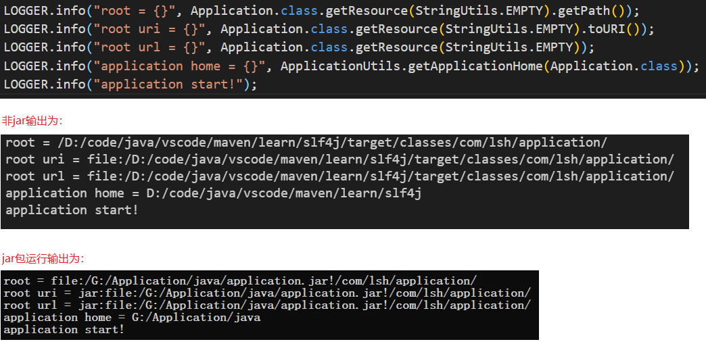

### 异常

- 当某个方法抛出了异常时，如果当前方法没有捕获异常，异常就会被抛到上层调用方法，直到遇到某个try {...} catch {...} finally {}被捕获为止

#### 捕获异常

- 捕获异常使用try {...} catch {...} finally {} 语句，把可能发生异常的代码放到try中，然后使用catch捕获对应的Exception及其子类

- 多个catch语句只有一个能被执行

- 存在多个catch的时候，子类异常的catch必须写在前面

- 如果某些异常的处理逻辑相同，但是异常本身不存在继承关系，可以用`|`合并到一起

```java
try {
    // do something
} catch (UnsupportedEncodingException e) {
    // do something else
} catch (IOException | NumberFormatException e) {
    // do something other
} finally {
    // do something must be done
}
```

#### 抛出异常

- 用 `throw new 异常名` 抛出异常

- 为了能追踪到完整的异常栈，在构造异常的时候，把原始的Exception实例传进去，新的Exception就可以持有原始Exception信息
  
  ```java
  try {
  // do something
  } catch (NullPointerException e) {
      throw new IllegalArgumentException(e);
  }
  ```

- 如果在try或者catch语句块中抛出异常，JVM会先执行finally，然后抛出异常

- 如果在执行finally语句时抛出异常，在catch中准备抛出的异常就被屏蔽不会再被抛出了，这时候可以先用origin变量保存原始异常，然后调用Throwable.addSuppressed()，把原始异常添加进来，最后在finally抛出。绝大多数情况下，在finally中不要抛出异常

```java
Exception origin = null;
try {
    // do something
} catch (Exception e) {
    origin = e;
    throw e;
} finally {
    Exception e = new IllegalArgumentException();
    if (origin != null) {
        e.addSuppressed(origin);
    }
    throw e;
}
```

#### 自定义异常

在一个大型项目中，可以自定义新的异常类型，但是，保持一个合理的异常继承体系是非常重要的。

一个常见的做法是自定义一个BaseException作为“根异常”，然后，派生出各种业务类型的异常。

BaseException需要从一个适合的Exception派生，通常建议从RuntimeException派生

```java
public class BaseException extends RuntimeException {
    public BaseException() {
        super();
    }

    public BaseException(String message) {
        super(message);
    }

    public BaseException(String message, Throwable cause) {
        super(message, cause);
    }

    public BaseException(Throwable cause) {
        super(cause);
    }
}
```

### 加密

```java
package com.lsh.demo.common;

import java.nio.charset.StandardCharsets;
import java.security.InvalidKeyException;
import java.security.NoSuchAlgorithmException;

import javax.crypto.KeyGenerator;
import javax.crypto.Mac;
import javax.crypto.SecretKey;
import javax.crypto.spec.SecretKeySpec;

import org.apache.commons.codec.DecoderException;
import org.apache.commons.codec.binary.Hex;
import org.apache.commons.codec.digest.HmacAlgorithms;

import lombok.AccessLevel;
import lombok.NoArgsConstructor;

/**
 * HmacUtils
 *
 * @author lsh
 * @date 2023-03-22 16:00:37
 * @since jdk-1.8
 */
@NoArgsConstructor(access = AccessLevel.PRIVATE)
public final class HmacUtils {
    public static final String HMAC_MD5 = HmacAlgorithms.HMAC_MD5.getName();

    /**
     * 生成随机盐
     * 
     * @return
     * @throws NoSuchAlgorithmException
     */
    public static byte[] getRandomSalt() throws NoSuchAlgorithmException {
        return getRandomSalt(HMAC_MD5);
    }

    /**
     * 生成随机盐
     * 
     * @param algorithm
     * @return
     * @throws NoSuchAlgorithmException
     */
    public static byte[] getRandomSalt(String algorithm) throws NoSuchAlgorithmException {
        // 1.获取HmacMD5的KeyGenerator实例
        KeyGenerator keyGenerator = KeyGenerator.getInstance(algorithm);

        // 2.通过KeyGenerator创建SecretKey实例
        SecretKey secretKey = keyGenerator.generateKey();

        // 3.生成随机的key字节数组，得到salt
        return secretKey.getEncoded();
    }

    /**
     * 获取HmacMD5加盐哈希值
     * 
     * @param salt
     * @param input
     * @return
     * @throws NoSuchAlgorithmException
     * @throws InvalidKeyException
     * @throws DecoderException
     */
    public static String getHmac(String salt, String input) throws NoSuchAlgorithmException, InvalidKeyException, DecoderException {
        return getHmac(salt, input, HMAC_MD5);
    }

    /**
     * 获取加盐哈希值
     * 
     * @param salt
     * @param input
     * @param algorithm
     * @return
     * @throws NoSuchAlgorithmException
     * @throws InvalidKeyException
     * @throws DecoderException
     */
    public static String getHmac(String salt, String input, String algorithm) throws NoSuchAlgorithmException, InvalidKeyException, DecoderException {
        // 16进制salt字符串 转 byte[]
        byte[] salts = Hex.decodeHex(salt);
        return getHmac(salts, input, algorithm);
    }

    /**
     * 获取HmacMD5加盐哈希值
     * 
     * @param salts
     * @param input
     * @return
     * @throws NoSuchAlgorithmException
     * @throws InvalidKeyException
     * @throws DecoderException
     */
    public static String getHmac(byte[] salts, String input) throws NoSuchAlgorithmException, InvalidKeyException, DecoderException {
        return getHmac(salts, input, HMAC_MD5);
    }

    /**
     * 获取加盐哈希值
     * 
     * @param salts
     * @param input
     * @param algorithm
     * @return
     * @throws NoSuchAlgorithmException
     * @throws InvalidKeyException
     * @throws DecoderException
     */
    public static String getHmac(byte[] salts, String input, String algorithm)
            throws NoSuchAlgorithmException, InvalidKeyException, DecoderException {
        // 恢复成SecretKey
        SecretKey secretKey = new SecretKeySpec(salts, algorithm);

        // 通过HmacMD5 获取Mac 实例
        Mac mac = Mac.getInstance(algorithm);

        // 用SecretKey 实例初始化Mac 实例
        mac.init(secretKey);

        // 对Mac实例反复调用update(byte[])输入数据
        mac.update(input.getBytes(StandardCharsets.UTF_8));

        // 调用Mac实例的doFinal()获取最终的哈希值
        byte[] password = mac.doFinal();

        // byte[] 转为16进制字符串
        return Hex.encodeHexString(password);
    }
}

```

### 日志

#### self4j

自定义生成的log文件路径

1. 定义LOG_HOME

```java
/**
 * 指定log文件路径为项目根路径
 */
public class LogHomeConfiguration extends PropertyDefinerBase {
    private static final String LOG_HOME = ApplicationUtils.getApplicationHome(LogHomeConfiguration.class);

    @Override
    public String getPropertyValue() {
        return LOG_HOME;
    }
}
```

2.logback.xml定义LOG_HOME

```xml
<define name="LOG_HOME" class="com.lsh.application.configuration.LogHomeConfiguration"/>
```

### GUI

#### JFrame

```java
public class MainFrame extends JFrame {

    private final float scale = 1.5F;

    public MainFrame() {

        // 设置标题栏的文本
        this.setTitle("Home");

        // 设置框架的图标
        URL url = this.getClass().getClassLoader().getResource("static/icons/favicon.png");
        Image img = new ImageIcon(url).getImage();
        this.setIconImage(img);

        // 设置框架的位置居中和大小
        Dimension dimension = this.getSystemResolution();
        this.setBounds((int) (dimension.width * (1 - 1 / scale) / 2), (int) (dimension.height* (1 - 1 / scale) / 2), (int) (dimension.width / scale), (int) (dimension.height / scale));

        // 框架的大小是否允许用户改变
        this.setResizable(false);

        // 设置框架大小
        // this.setSize(DEFAULT_WIDTH, DEFAULT_HEIGHT);

        // 将框架设置为最大
        // this.setExtendedState(Frame.MAXIMIZED_BOTH);

        // 让窗口系统控制窗口的位置
        // this.setLocationByPlatform(true);

        // 设置框架的位置
        // this.setLocation(400, 200);

        // 关闭所有框架装饰（按钮、标题栏、图标）,设置后， 框架显示中将没有标题栏或关闭按钮这样的装饰。
        // this.setUndecorated(false);

    }

    public Dimension getSystemResolution() {
        return Toolkit.getDefaultToolkit().getScreenSize();
    }
}
```

#### 设置框架图标

```java
// 方法1
try(InputStream inputStream = this.getClass().getClassLoader().getResourceAsStream("static/icons/favicon.png")) {
    Image image = ImageIO.read(inputStream);
    this.setIconImage(image);
} catch (IOException e) {
    e.printStackTrace();
}

// 方法2
URL url = this.getClass().getClassLoader().getResource("static/icons/favicon.png");
try {
    Image image = ImageIO.read(url.openStream());
    this.setIconImage(image);
} catch (IOException e) {
    e.printStackTrace();
}

// 方法3 推荐
URL url = this.getClass().getClassLoader().getResource("static/icons/favicon.png");
Image img = new ImageIcon(url).getImage();
this.setIconImage(img);
```

#### 添加组件到容器

```java
// 方法1
// 将组件添加到内容窗格中,自动调用contentPane.add(component)
frame.add(component);

// 方法2
// 获取内容窗格
Container contentPane = frame.getContentPane();
// 将组件添加到内容窗格中
contentPane.add(component);
```

### XML

XML是可扩展标记语言（eXtensible Markup Language）的缩写，它是是一种数据表示格式，可以描述非常复杂的数据结构，常用于传输和存储数据。

XML有几个特点：一是纯文本，默认使用UTF-8编码，二是可嵌套，适合表示结构化数据。如果把XML内容存为文档，那幺它就是一个XML文档，例如`book.xml`。此外，XML内容经常通过网络作为消息传输。

#### XML的结构

1. 首行必定是`<?xml version="1.0"?>`，可以加上可选的编码。如 `<?xml version="1.0" encoding="UTF-8"?>`

2. 紧接着，是文档定义类型（DTD：Document Type Definition），DTD是可选的。如`<!DOCTYPE note SYSTEM "book.dtd">`

3. 接下来是XML的文档内容，一个XML文档有且仅有一个根元素，根元素可以包含任意个子元素，元素可以包含属性，例如，`<isbn lang="CN">1234567</isbn>`包含一个属性`lang="CN"`，且元素必须正确嵌套。如果是空元素，可以用`<tag/>`表示。

4. 如果使用了`<`、`>`以及引号等标识符，如果内容出现了特殊符号，需要使用`&???;`表示转义。

常见的特殊字符如下：

| 字符  | 表示       |
|:--- |:-------- |
| <   | `&lt;`   |
| >   | `&gt;`   |
| &   | `&amp;`  |
| "   | `&quot;` |
| '   | `&apos;` |

格式正确的XML（Well Formed）是指XML的格式是正确的，可以被解析器正常读取。而合法的XML是指，不但XML格式正确，而且它的数据结构可以被DTD或者XSD验证。

DTD文档可以指定一系列规则，例如：

- 根元素必须是`book`
- `book`元素必须包含`name`，`author`等指定元素
- `isbn`元素必须包含属性`lang`
- ...

如何验证XML文档的正确性呢？最简单的方式是通过浏览器验证。可以直接把XML文档拖拽到浏览器窗口，如果格式错误，浏览器会报错。

和结构类似的HTML不同，浏览器对HTML有一定的“容错性”，缺少关闭标签也可以被解析，但XML要求严格的格式，任何没有正确嵌套的标签都会导致错误。

XML是一个技术体系，除了我们经常用到的XML文档本身外，XML还支持：

- DTD和XSD：验证XML结构和数据是否有效；
- Namespace：XML节点和属性的名字空间；
- XSLT：把XML转化为另一种文本；
- XPath：一种XML节点查询语言；
- ...

实际上，XML的这些相关技术实现起来非常复杂，在实际应用中很少用到，通常了解一下就可以了。

### JSON

JSON作为数据传输的格式，有几个显着的优点：

- JSON只允许使用UTF-8编码，不存在编码问题；
- JSON只允许使用双引号作为key，特殊字符用`\`转义，格式简单；
- 浏览器内置JSON支持，如果把数据用JSON发送给浏览器，可以用JavaScript直接处理。

因此，JSON适合表示层次结构，因为它格式简单，仅支持以下几种数据类型：

- 键值对：`{"key": value}`
- 数组：`[1, 2, 3]`
- 字符串：`"abc"`
- 数值（整数和浮点数）：`12.34`
- 布尔值：`true`或`false`
- 空值：`null`

### Servlet

#### 1. Servlet 组件

#### 2. Filter 组件

JavaEE的Servlet规范还提供了一种Filter组件，即过滤器，它的作用是，在HTTP请求到达Servlet之前，可以被一个或多个Filter预处理，类似打印日志、登录检查等逻辑，完全可以放到Filter中。

编写Filter时，必须实现`Filter`接口，在`doFilter()`方法内部，要继续处理请求，必须调用`chain.doFilter()`。最后，用`@WebFilter`注解标注该Filter需要过滤的URL。这里的`/*`表示所有路径。

多个Filter会组成一个链，每个请求都被链上的Filter依次处理。如果一定要给每个Filter指定顺序，就必须在`web.xml`文档中对这些Filter再配置一遍。

```java
// 过滤所有url
@WebFilter(urlPatterns = "/*")
public class EncodingFilter implements Filter {

    @Override
    public void doFilter(ServletRequest request, ServletResponse response, FilterChain chain)
            throws IOException, ServletException {

        request.setCharacterEncoding("UTF-8");
        response.setCharacterEncoding("UTF-8");
        // 如果还要继续处理请求，必须调用chain.doFilter()
        chain.doFilter(request, response);
    }

}
```

#### 3. Listener 组件

1. ==ServletContextListener==：一个Web服务器可以运行一个或多个WebApp，对于每个WebApp，Web服务器都会为其创建一个全局唯一的`ServletContext`实例，`ServletContext`实例最大的作用就是设置和共享全局信息；此外，`ServletContext`还提供了动态添加Servlet、Filter、Listener等功能，它允许应用进程在运行期间动态添加一个组件，虽然这个功能不是很常用；
2. `HttpSessionListener`：监听HttpSession的创建和销毁事件；
3. `ServletRequestListener`：监听ServletRequest请求的创建和销毁事件；
4. `ServletRequestAttributeListener`：监听ServletRequest请求的属性变化事件（即调用`ServletRequest.setAttribute()`方法）；
5. `ServletContextAttributeListener`：监听ServletContext的属性变化事件（即调用`ServletContext.setAttribute()`方法）；

- 任何标注为`@WebListener`，且实现了特定接口的类会被Web服务器自动初始化。
- 可以把初始化数据库连接池等工作放到`contextInitialized()`回调方法中，把清理资源的工作放到`contextDestroyed()`回调方法中，因为Web服务器保证在`contextInitialized()`执行后，才会接受用户的HTTP请求

```java
@WebListener
public class Applistener implements ServletContextListener {

    private final Logger LOGGER = LoggerFactory.getLogger(getClass());

    // 在此初始化WebApp,例如打开数据库连接池等
    @Override
    public void contextInitialized(ServletContextEvent sce) {
        LOGGER.info("WebApp Initialized....");
    }

    // 在此清理WebApp,例如关闭数据库连接池等
    @Override
    public void contextDestroyed(ServletContextEvent sce) {
        LOGGER.info("WebApp Destroyed!");
    }

}
```

### CSS

#### CSS 语法

- CSS 规则由两个主要的部分构成：选择器，以及一条或多条声明。
- 选择器通常是您需要改变样式的 HTML 元素。
- 每条声明由一个==属性==和一个==值==组成。
- 属性（property）是您希望设置的样式属性（style attribute）。每个属性有一个值。属性和值被冒号(`:`)分开。
- CSS声明总是以分号(`;`)结束，声明总以大括号(`{}`)括起来。
- CSS注释以 **/\*** 开始, 以 ***/** 结束。

```css
p {
    color:red;
    text-align:center;
}
```

#### 选择器

- #### id 选择器(#id)

- #### class 选择器(.class)

- #### *element* 选择器(*element* )

```css
#username {

}
#.mydiv {

}
div,p {

}
```

#### 插入样式表

- 1. 外部样式表

```html
<link rel="stylesheet" type="text/css" href="xxx/xxx.css">
```

- 2. 内部样式表

```html
<style type="text/css">
    ...
</style>
```

- 3. 内联样式表

```html
<div style="..."></div>
```

#### @keyframes

语法：@keyframes *animationname* {*keyframes-selector* {*css-styles;}*}

| 值                    | 说明                                                                                      |
|:-------------------- |:--------------------------------------------------------------------------------------- |
| *animationname*      | 必需的。定义animation的名称。                                                                     |
| *keyframes-selector* | 必需的。动画持续时间的百分比。合法值：0-100% from (和0%相同) to (和100%相同)**注意：** 您可以用一个动画keyframes-selectors。 |
| *css-styles*         | 必需的。一个或多个合法的CSS样式属性                                                                     |

例：

```css
@keyframes dynamicBorder {
    0% {
        background: linear-gradient(to right, #2196F3,#fdfdfd,#2196F3) repeat-x 0 0;
    }
    100% {
        background: linear-gradient(to right, #2196F3,#fdfdfd,#2196F3) repeat-x 500px 0;
    }
}
```

#### animation

语法：animation: name duration timing-function delay iteration-count direction fill-mode play-state;

| 值                                                                                                   | 说明                                                                                   |
|:--------------------------------------------------------------------------------------------------- |:------------------------------------------------------------------------------------ |
| *[animation-name](https://www.runoob.com/cssref/css3-pr-animation-name.html)*                       | 指定要绑定到选择器的关键帧的名称                                                                     |
| *[animation-duration](https://www.runoob.com/cssref/css3-pr-animation-duration.html)*               | 动画指定需要多少秒或毫秒完成                                                                       |
| *[animation-timing-function](https://www.runoob.com/cssref/css3-pr-animation-timing-function.html)* | 设置动画将如何完成一个周期                                                                        |
| *[animation-delay](https://www.runoob.com/cssref/css3-pr-animation-delay.html)*                     | 设置动画在启动前的延迟间隔。                                                                       |
| *[animation-iteration-count](https://www.runoob.com/cssref/css3-pr-animation-iteration-count.html)* | 定义动画的播放次数。                                                                           |
| *[animation-direction](https://www.runoob.com/cssref/css3-pr-animation-direction.html)*             | 指定是否应该轮流反向播放动画。                                                                      |
| [animation-fill-mode](https://www.runoob.com/cssref/css3-pr-animation-fill-mode.html)               | 规定当动画不播放时（当动画完成时，或当动画有一个延迟未开始播放时），要应用到元素的样式。                                         |
| *[animation-play-state](https://www.runoob.com/cssref/css3-pr-animation-play-state.html)*           | 指定动画是否正在运行或已暂停。                                                                      |
| initial                                                                                             | 设置属性为其默认值。 [阅读关于 *initial*的介绍。](https://www.runoob.com/cssref/css-initial.html)      |
| inherit                                                                                             | 从父元素继承属性。 [阅读关于 *initinherital*的介绍。](https://www.runoob.com/cssref/css-inherit.html) |

例：

```css
.div {
    animation:mymove 5s infinite;
    -webkit-animation:mymove 5s infinite; /* Safari 和 Chrome */
}
```

#### calc 函数

calc() 函数用于动态计算长度值，运算符（ "+", "-", "*", "/" ）前后都需要保留一个空格

语法：calc(expression)

| 值            | 描述                       |
|:------------ |:------------------------ |
| *expression* | 必须，一个数学表达式，结果将采用运算后的返回值。 |

### JSP

1) 输出<%:在文本中写<\%

2) 使用<%--......--%>注释，在浏览器查看/源文档菜单中看不到

3) 使用<!--......-->注释，在浏览器查看/源文档菜单中看得到

4) request、response:每次请求新页面，就会产生新的request、response对象

5) session:打开浏览器，首次访问服务目录的某个JSP页面时创立，到关闭浏览器或session对象达到最大生存时间时，session对象才被取消

6) application:所有客户共享，服务器启动产生，直到服务器关闭，application对象才被取消

- 居中
  table居中：margin:0 auto;或align:center;

- JSP页面控件 click事件写法
  1）控件属性添加 onclick="javascript:方法名()"
  2）控件`<head></head>`中添加方法体：

```html
<script type="text/javascript">
    function fun() {
        // 方法体
    }
</script>
```

3）在script 方法中显示确定取消弹窗

```javascript
if(window.confirm("是否确定撤销？")) {

}
```

- ajax 只调用方法不传参写法

```javascript
$.ajax({
    url:"<%=basePath%>ClearDownload.action" 
});
```

- 表单提交方式：

```java
// 1
document.czbListform.action="${pageContext.request.contextPath }/revokePregnantRecord.action?index="+index;//这种情况下传参为字符型可能在后台收到乱七八糟的符号，最好只传数值型参数
document.czbListform.submit();

// 2
//这里不传参，但是相应控件全部放在提交的form标签里面，后台action方法形参里面加上需要传参的控件name就可以了
document.czbListform.action="${pageContext.request.contextPath }/revokePregnantRecord.action?;
document.czbListform.submit();
String AddNew(HttpSession session,HttpServletRequest request,int index) {
}

// 3
window.location.href="${pageContext.request.contextPath }/DeleteRecord.action?emp_no="+emp_no+"&pregnantDate="+pregnantDate+"&index="+index;
```

```html
<!-- 4 -->
$.ajax({
    type:"post",
<%--url:"<%=basePath%>addPregnantRecord.action", --%>
    data:{"emp_no":emp_no,"pregnantDate":document.getElementById("pregnantDate").value},
    dataType:"json",
    success:function(data) {
    }
});
```

```jsp
<!-- 条件判断1 -->
<c:if test="${item.getFilePath().length()>0}">
    <c:forTokens items="${item.getFilePath()}" delims=";" var="path" varStatus="s">
        <a href="${pageContext.request.contextPath }/PregnantEmployeeSubmitWeb/FileList.jsp" style="text-decoration: underline;">${fn:substring(path,lfn:lastIndexOf(path,"-")+1,-1)}</a><br>
    </c:forTokens>
</c:if>

<!-- 条件判断1 -->
<c:choose>
    <c:when test="${sign_state== '待签核'}">
    </c:when>
    <c:when test="${emp_no == null}">
    </c:when>
    <c:otherwise>
    </c:otherwise>
</c:choose>
```

10.下拉框 select
1）标签写法

```jsp
<select id="select1" name="select1" >
    <option value="id" <c:if test="${search_mode== 'id'}">selected="selected"</c:if>>
        id
    </option>
    <option value="name" <c:if test="${search_mode== 'name'}">selected="selected" </c:if>>
        name
    </option>
</select>
```

2）javascript获取select的值

```js
 function querySignState() {
    var select=document.getElementById('search_mode').value;
    document.form1.action="${pageContext.request.contextPath }/opaSearch.action?";
    document.form1.submit();
}
```

3）后台获取select的值
jsp中将select标签放在form1中，和form1一起提交，select的name属性作为后台的形参，在函数体中直接使用

```java
@RequestMapping(value = "/hello")
String opaSearch(String select1) {
    // 直接使用 select1
}
```

11.jsp中,文本框没有填写字符串时
1）javascript 函数中的值为
var emp_no=document.getElementById("emp_no").value;//emp_no=""
2）action中的值为
String empno=emp_no;//empno=""

12.jsp中没有写相应的文本框hr_check_signtime时，
1）get方法返回的值为null
public String getHr_check_signtime() {
        if(hr_check_signtime==null)
        {
            hr_check_signtime="";
        }
        return hr_check_signtime;
    }
2）传到mapper的值为
getter为 null时，为null;
getter为 ""时，为'';

- 请求处理方法返回字符串（页面）的写法
    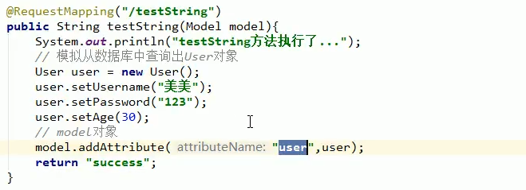
- 请求处理方法返回类型为void的写法
    
- 请求处理方法返回字符串，使用关键字进行转发或者重定向
    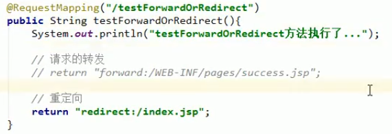
- ResponseBody 响应json数据（用于ajax请求）
    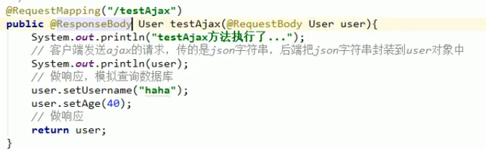
- 返回ModelAndView，和返回字符串（页面）功能一样
    

Servlet就是一个能处理HTTP请求，发送HTTP响应的小进程，而发送响应无非就是获取`PrintWriter`，然后输出HTML。

JSP是一种在HTML中嵌入动态输出的文档，它和Servlet正好相反，Servlet是在Java代码中嵌入输出HTML；

```java
PrintWriter pw = resp.getWriter();
pw.write("<html>");
pw.write("<body>");
pw.write("<h1>Welcome, " + name + "!</h1>");
pw.write("</body>");
pw.write("</html>");
pw.flush();
```

只不过，用PrintWriter输出HTML比较痛苦，因为不但要正确编写HTML，还需要插入各种变量。如果想在Servlet中输出一个类似新浪首页的HTML，写对HTML基本上不太可能。就可以用jsp了。

JSP是Java Server Pages的缩写，它的文档必须放到`/src/main/webapp`下，文档名必须以`.jsp`结尾，整个文档与HTML并无太大区别，但需要插入变量，或者动态输出的地方，使用特殊指令`<% ... %>`

整个JSP的内容实际上是一个HTML，但是稍有不同：

- 包含在`<%--`和`--%>`之间的是JSP的注释，它们会被完全忽略；
- 包含在`<%`和`%>`之间的是Java代码，可以编写任意Java代码；
- 如果使用`<%= xxx %>`则可以快捷输出一个变量的值。

JSP页面内置了几个变量，这几个变量可以直接使用：

- out：表示HttpServletResponse的PrintWriter；
- session：表示当前HttpSession对象；
- request：表示HttpServletRequest对象。

JSP和Servlet有什幺区别？其实它们没有任何区别，因为JSP在执行前首先被编译成一个Servlet。在Tomcat的临时目录下，可以找到一个`xxx_jsp.java`的源文档，这个文档就是Tomcat把JSP自动转换成的Servlet源码。

可见JSP本质上就是一个Servlet，只不过无需配置映射路径，Web Server会根据路径查找对应的`.jsp`文档，如果找到了，就自动编译成Servlet再执行。在服务器运行过程中，如果修改了JSP的内容，那幺服务器会自动重新编译。

```jsp
<%@ page language="java" contentType="text/html; charset=UTF-8" pageEncoding="UTF-8"%>
<!DOCTYPE html PUBLIC "-//W3C//DTD HTML 4.01 Transitional//EN" "http://www.w3.org/TR/html4/loose.dtd">
<html lang="zh-CN">
    <head>
        <meta charset="UTF-8">
        <title></title>
    </head>
    <body>
    </body>
</html>
```

jsp页面乱码解决方案：

1） jsp页面头部加上：<%@ page language="java" contentType="text/html; charset=UTF-8" pageEncoding="UTF-8"%>

2）Servlet响应代码中加上：resp.setCharacterEncoding("UTF-8"); //设置HTTP 响应的编码

#### JSP高级功能

JSP的指令非常复杂，除了`<% ... %>`外，JSP页面本身可以通过`page`指令引入Java类：

```jsp
<%@ page import="java.io.*" %>
<%@ page import="java.util.*" %>
```

这样后续的Java代码才能引用简单类名而不是完整类名。

使用`include`指令可以引入另一个JSP文档：

```jsp
<html>
<body>
    <%@ include file="header.jsp"%>
    <h1>Index Page</h1>
    <%@ include file="footer.jsp"%>
</body>
```

#### JSP Tag

JSP还允许自定义输出的tag，例如：

```jsp
<c:out value = "${sessionScope.user.name}"/>
```

JSP Tag需要正确引入taglib的jar包，并且还需要正确声明，使用起来非常复杂，对于页面开发来说，*不推荐*使用JSP Tag，因为我们后续会介绍更简单的模板引擎，这里我们不再介绍如何使用taglib。

1. 表单提交方式：

```javascript
// 1.这种情况下传参为字符型可能在后台收到乱七八糟的符号，最好只传数值型参数
document.czbListform.action="${pageContext.request.contextPath }/revokePregnantRecord.action?index="+index;
document.czbListform.submit();

// 2.这里不传参，但是相应控件全部放在提交的form标签里面，后台action方法形参里面加上需要传参的控件id就可以了
document.czbListform.action="${pageContext.request.contextPath }/revokePregnantRecord.action?;
document.czbListform.submit();
String AddNew(HttpSession session,HttpServletRequest request,int index) {

}

// 3
window.location.href="${pageContext.request.contextPath }/DeleteRecord.action?emp_no="+emp_no+"&pregnantDate="+pregnantDate+"&index="+index;

$.ajax({
    type:"post",
    url:"<%=basePath%>addPregnantRecord.action",
    data:{"emp_no":emp_no,"pregnantDate":document.getElementById("pregnantDate").value},
    dataType:"json",
    success:function(data) {

    }
});
```

```jsp
<c:if test="${item.getFilePath().length()>0}">
    <c:forTokens items="${item.getFilePath()}" delims=";" var="path" varStatus="s">
        <a href="${pageContext.request.contextPath }/PregnantEmployeeSubmitWeb/FileList.jsp" style="text-decoration: underline;">${fn:substring(path,lfn:lastIndexOf(path,"-")+1,-1)}</a><br>
    </c:forTokens>
</c:if>
```

#### 页面预览pdf

```java
    @RequestMapping(value = "OnlineBrowse")
    public void OnlineBrowse(HttpServletResponse response, String fileName) throws UnsupportedEncodingException {
        File file = new File(fileName);
        // Response.setContentType(MIME)的作用是使客户端的浏览器区分不同种类的数据
        // 并根据不同的MIME调用浏览器内不同的进程嵌入模块来处理相应的数据
        // response.setContentType 指定 HTTP 响应的编码,同时指定了浏览器显示的编码
        response.setContentType("application/pdf;charset=UTF-8");
        // 设置下载文档名
        // 在设置Content-Disposition头字段之前，一定要设置Content-Type头字段
        // Content-Disposition属性有两种类型：inline 和 attachment
        // inline ：将文档内容直接显示在页面
        // attachment：弹出对话框让用户下载
        // URLEncoder.encode(file.getName(),"UTF-8") 防止文档名乱码
        // response.setHeader("Content-Type","application/pdf");
        response.setHeader("Content-Disposition", "inline; filename="+URLEncoder.encode(file.getName(),"UTF-8"));
        // 设置从request中取得的值或从数据库中取出的值
        // request.setCharacterEncoding("utf-8");
        // response.setCharacterEncoding 设置HTTP 响应的编码
        // 如果之前使用response.setContentType设置了编码格式
        // 则使用response.setCharacterEncoding指定的编码格式覆盖之前的设置
        // response.setCharacterEncoding("utf-8");

        if (file.exists()) {
            byte[] data = null;
            FileInputStream fileInputStream=null;
            try {
                fileInputStream= new FileInputStream(file);
                data = new byte[fileInputStream.available()];
                fileInputStream.read(data);

                //加载pdf
                PDDocument document = PDDocument.load(data); 
                //获得文档属性对象
                PDDocumentInformation documentInformation = document.getDocumentInformation(); 
                //修改标题属性 这个标题会被展示
                documentInformation.setTitle(file.getName()); 
                document.setDocumentInformation(documentInformation);
                document.setAllSecurityToBeRemoved(true);
                //修改完直接输出到响应体中
                document.save(response.getOutputStream()); 
                document.close();
                //response.getOutputStream().write(data);
            } catch (Exception e) {
                System.out.println("pdf文档处理异常：" + e);
            }finally{
                try {
                    if(fileInputStream!=null){
                        fileInputStream.close();
                    }
                } catch (IOException e) {
                    e.printStackTrace();
                }
            }
        }
    }
```

### Tomcat

1) 下载tomcat压缩包.zip，解压到任意目录，不用配置环境变量
2) 启动Tomcat：找到并运行tomcat根目录/bin/startup.bat，出现Server startup in...时表示启动成功，可以最小化Tomcat小黑窗但不要关闭，有且只能有一个Tomcat运行
3) 编写.jsp文档mainWeb.jsp，保存到WebPage目录下，PS：在Tomcat开启的状态下也可以网目录中放.jsp文档
4) .jsp文档放到Tomcat 的JSP 默认目录：tomcat根目录/webapps/ROOT
5) .jsp文档放到自定新的JSP的Web服务目录：打开tomcat根目录/conf/server.xml文档，在</Host>的前面加入

```xml
<Context path="/web" docBase="E:/Code/Java/workspace/LWeb/WebContent/WebPage" debug="0" reloadable="true"></Context>
```

其中"/web"为虚拟目录，对应的为服务目录为"E:/Code/Java/workspace/LWeb/WebContent/WebPage"，可自行定义，修改server.xml后要重启Tomcat
6) 访问：
    1. 默认目录访问：`http://localhost:8080`
    2. 自定目录访问：`http://localhost:8080/web/mainWeb.jsp`
    必要时将localhost:8080替换成服务器的ip地址
7) 关闭Tomcat：找到并运行tomcat根目录/bin/shutdown.bat

### jvm

#### jvm参数

- 指定新生代的大小

```properties
# 方法1
-XX:NewSize=512m
-XX:MaxNewSize=1024m

# 方法2（NewSize，MaxNewSize设置为一致）
-Xmn512m

# 方法3，设置老年代/新生代内存的比值，在Xms=Xmx并且设置了Xmn的情况下，该参数不需要进行设置
-XX:NewRatio=4

# 表示eden/两个survivor
-XX:SurvivorRatio=8
```

- 指定元空间的大小

```properties
# 元空间的初始大小，若未指定，则元空间将根据运行时的应用程序需求动态地重新调整大小
-XX:MetaspaceSize=1024m

# 元空间的最大大小，默认值为unlimited，只受系统内存的限制
-XX:MaxMetaspaceSize=2048m
```

- 指定垃圾收集器

```properties
# 串行垃圾收集器
-XX:+UseSerialGC

# 并行垃圾收集器
-XX:+UseParallelGC

# CMS垃圾收集器
-XX:+UseParNewGC

# G1垃圾收集器
-XX:+UseG1GC
```

- 记录GC活动

```properties
-XX:+UseGCLogFileRotation 
-XX:NumberOfGCLogFiles=50 
-XX:GCLogFileSize=100m
-Xloggc:/.../gc.log
```

- 在OOM时，打印输出

```properties
-XX:+HeapDumpOnOutOfMemoryError -XX:HeapDumpPath=你要输出的日志路径
```

```properties
# 对象晋升到老年代的年龄阈值
-XX:MaxTenuringThreshold

# 指定最小堆内存(单位：g、m、k)
-Xms4g

# 指定最大堆内存(单位：g、m、k)
-Xmx8g

# 字符串常量池大小
-XX:StringTableSize
```

#### JDK命令行工具

## lombok

- maven依赖

```xml
<dependency>
    <groupId>org.projectlombok</groupId>
    <artifactId>lombok</artifactId>
    <version>1.18.24</version>
    <scope>provided</scope>
</dependency>
```

- 常用注解

```java
@Getter
@Setter
@ToString
@NoArgsConstructor(access = AccessLevel.PRIVATE)
public class Account {
    private Long id;
}
```

## EasyExcel

```java
// 同步读，headRowNumber(0)：标题行和数据行都读到列表中
List<Map<Integer, String>> listMap = EasyExcel.read(inputStream).sheet().headRowNumber(0).doReadSync();
```

## Mybatis

### 需要转义的符号

也可以用`<![CDATA[特殊符号]]>`，无需进行转义

| 符号 | 原符号| 替换符号 |
| ---  | ---- | ------- |
| 小于 | < | `&lt;` |
| 小于等于 | <= | `&lt;=` |
| 大于 | > | `&gt;` |
| 大于等于 | >= | `&gt;=` |
| 不等于 | <> | `&lt;&gt;` |
| 与 | & | `&amp;` |
| 单引号 | ' | `&apos;` |
| 双引号 | " | `&quot;` |

### `if`元素

- 字符串判空

```xml
<if test="id != null and id != ''">
    and id = #{id}
</if>
```

- 字符串判等

```xml
<if test="name != null and name == 'handle'.toString()">
    and id = #{id}
</if>
```

- 集合判空

```xml
<if test="ids != null and ids.size() > 0">
    and id in
    <foreach collection="ids" item="item" open="(" separator="," close=")">
        #{item}
    </foreach>
</if>
<if test="ids != null and !ids.isEmpty()">
    and id in
    <foreach collection="ids" item="item" open="(" separator="," close=")">
        #{item}
    </foreach>
</if>
```

- 布尔值判断

```xml
<if test="true == deleteFlag">
</if>
```

### `foreach`元素

```xml
<foreach collection="集合变量名称" item="item" index="index" open="(" separator="," close=")">
 #{item}
</foreach>
```

### `where`元素

- 只有在一个以上的`if`条件有值的情况下才去插入`where`子句
- 自动去掉开头、末尾的`and`或`or`

```xml
<select id="findActiveBlogLike" resultType="Blog">
    select * from blog
    <where>
        <if test="state != null">
            state = #{state}
        </if>
        <if test="author != null and author.name != null">
            and author_name like #{author.name}
        </if>
    </where>
</select>
```

### `set`元素

- 用于动态包含需要更新的列
- 会动态前置`set`关键字
- 消除无关的逗号

```xml
<update id="updateAccount" parameterType="java.lang.String">
    update account
    <set>
        <if test="username != null">username=#{username},</if>
        <if test="password != null">password=#{password}</if>
    </set>
    where id=#{id}
</update>
```

### choose元素

```xml
<choose>  
    <when test="username != null and username != ''">  
        user_name=#{username} 
    </when >  
    <otherwise>
        user_name is null
    </otherwise>  
</choose>  

```

### in 条件大于1000

- 待验证

```xml
(
    id in
    <foreach collection="ids" item="item" index="index" open="(" separator="," close=")">
        <if test="index % 999 == 998">) or id in (</if>
        #{item}
    </foreach>
)
```

- 更直观

```xml
(1, id) in
<foreach collection="ids" item="item" index="index" open="(" separator=',' close=")">
    (1, #{item})
</foreach>
```

### `resultMap`

#### 一对一

从表实体包含主表实体的对象引用，一个账号对应一个用户

- 用户实体

```java
@Getter
@Setter
public class User {
    private Long userId;

    private String userName;
}
```

- 账户实体

```java
@Getter
@Setter
public class Account {
    private Long accountId;

    private Long userId;

    private BigDecimal money;

    private User user;
}
```

```xml
<resultMap id="accountUserMap" type="com.lsh.application.Account">
    <id property="accountId" column="account_id"/>
    <result property="userId" column="user_id"/>
    <result property="money" column="money"/>
    <association property="user" column="user_id" javaType="com.lsh.application.User">
        <id property="userId" column="user_id"/>
        <result property="userName" column="user_name"/>
    </association>
</resultMap>
```

#### 一对多

主表实体包含从表实体的集合引用，一个用户有多个账户

- 用户实体

```java
@Getter
@Setter
public class User {
    private Long userId;

    private String userName;

    private List<Account> accounts;
}
```

- 账户实体

```java
@Getter
@Setter
public class Account {
    private Long accountId;

    private Long userId;

    private BigDecimal money;
}
```

```xml
<resultMap id="userAccountMap" type="com.lsh.application.User">
    <id property="userId" column="user_id"/>
    <result property="userName" column="user_name"/>
    <collection property="accounts" javaType="com.lsh.application.Account">
        <id property="accountId" column="account_id"/>
        <result property="userId" column="user_id"/>
        <result property="money" column="money"/>
    </collection>
</resultMap>
```

#### 多对多

一个角色可以赋予给多个用户，一个用户可以拥有多个角色，这里只展示前者（跟一对多一样）

- 用户实体

```java
@Getter
@Setter
public class User {
    private Long userId;

    private String userName;
}
```

- 角色实体

```java
@Getter
@Setter
public class Role {
    private Long roleId;

    private String roleName;

    private List<User> users;
}
```

```xml
<resultMap id="someName" type="com.lsh.application.Role">
    <id property="roleId" column="role_id"/>
    <result property="roleName" column="role_name"/>
    <collection property="users" ofType="com.lsh.application.User">
        <id property="userId" column="user_id"/>
        <result property="userName" column="user_name"/>
    </collection>
</resultMap>
```

### Mybatis中的延迟加载

一个用户对应多个账户，多个账号对应一个用户，一个账号对应一个用户

- 在查询用户时，用户下的账户信息什么时候使用才什么时候查询
- 在查询账户时，账户所属的用户信息应该随着账户查询时一起查询出来
- 延迟加载（懒加载）：在真正使用数据是才发起查询，不用的时候不查询（一对多、多对多表关系）
- 立即加载：不管用不用，只要一调用方法，马上发起查询（多对一、一对一表关系）

#### 开启延迟加载

- SqlMapConfig.xml

```xml
<settings>
    <setting name="lazyLoadingEnabled" value="true"/>
    <setting name="aggressiveLazyLoading" value="false"/>
</settings>
```

- 一对一表关系开启延迟加载

- IUserDAO.xml

```xml
<mapper namespace="com.lsh.dao.IUserDAO">
    <select id="queryUserById" resultType="com.lsh.entity.User">
        select user_id as userId, user_name as userName from user where user_id=#{userId}
    </select>
</mapper>
```

- IAccountDAO.xml

`association`元素添加select标签

```xml
<mapper namespace="com.lsh.dao.IAccountDAO">
    <resultMap id="accountUserMap" type="com.lsh.entity.Account">
        <id property="accountId" column="account_id"/>
        <result property="userId" column="user_id"/>
        <result property="money" column="money"/>
        <association property="user" column="user_id" javaType="com.lsh.entity.User" select="com.lsh.dao.IAccountDao.queryUserById">
            <id property="userId" column="user_id"/>
            <result property="userName" column="user_name"/>
        </association>
    </resultMap>
</mapper>
```

- 一对多表关系开启延迟加载

- IAccountDAO.xml

```xml
<mapper namespace="com.lsh.dao.IAccountDAO">
    <select id="queryAccountByUserId" resultType="com.lsh.entity.Account">
        select account_id as accountId, user_id as userId, money from account where account_id=#{accountId}
    </select>
</mapper>
```

- IUserDAO.xml

`collection`元素添加select标签

```xml
<mapper namespace="com.lsh.application.IUserDAO">
    <resultMap id="userAccountMap" type="com.lsh.entity.User">
        <id property="userId" column="user_id"/>
        <result property="userName" column="user_name"/>
        <collection property="accounts" javaType="com.lsh.entity.Account" select="com.lsh.dao.IAccountDAO.queryAccountByUserId">
            <id property="accountId" column="account_id"/>
            <result property="userId" column="user_id"/>
            <result property="money" column="money"/>
        </collection>
    </resultMap>
</mapper>
```

### mybatis中的一级缓存和二级缓存

#### 一级缓存

指的是SqlSession对象的缓存。当我们执行查询后，查询的结果会存入到SqlSession为我们提供的一块区域中。该区域是一个Map。当我们再次查询同样的数据，mybatis会先去SqlSession中查询是否有，有的话直接拿出来用。

- 一级缓存默认是开启的
- 当调用SqlSession的添加、修改、删除，提交，关闭等方法是，会清空一级缓存
- 也可以通过SqlSession的clearCache方法清空缓存。
- 当SqlSession对象消失时，一级缓存也不存在了。

#### 二级缓存

指的是SqlSessionFactory对象的缓存。同一个SqlSessionFactory对象创建的SqlSession共享其缓存。二级缓存存放的是数据，不是（同一个结果集）对象

- 配置文件配置支持二级缓存，SqlMapConfig.xml

```xml
<settings>
    <setting name="cacheEnabled" value="true">
</settings>
```

- 配置当前映射文件支持二级缓存，mapper.xml

```xml
<mapper namespace="com.lsh.application.IUserDAO">
    <cache/>
</mapper>
```

- 配置当前操作支持二级缓存

```xml
<mapper namespace="com.lsh.application.IUserDAO">
    <select id="queryUserById" resultType="com.lsh.entity.User" useCache="true>
        select user_id as userId, user_name as userName from user where user_id=#{userId}
    </select>
</mapper>
```

### `mybatis`注解开发

#### 常规开发

```java
public interface IUserDAO {
    // 传统用as做字段-属性映射
    @Select("select user_id as userId, user_name as userName from user where user_id=#{userId}")
    User queryUserById(Long userId);

    @Select("select * from user where user_id=#{userId}")
    // mybatis支持@Results做字段-属性映射。如果Results里面的映射还想应用到别的方法，可以指定Results的id属性，然后在对应的方法上使用注解@ResultMap(value={"userMap"})
    @Results(id="userMap", value={
        @Result(id=true, property="userId", column="user_id"),
        @Result(id=false, property="userName", column="user_name")
    })
    User queryUserById(Long userId);

    @Select("select * from user limit 10")
    @ResultMap(value={"userMap"})
    List<User> queryUsers();

    @Insert("insert into user (user_id,user_name) values (#{userId}, #{userName})")
    int addUser(User user);

    @Update("update user set user_name = #{userName} where user_id=#{userId}")
    int updateUser(User user);

    @Delete("delete from user where user_id=#{userId}")
    int deleteUser(Long userId);
}
```

#### 一对一表关系注解开发

- IUserDAO.java

```java
public interface IUserDAO {
    @Select("select user_id as userId, user_name as userName from user where user_id=#{userId}")
    User queryUserById(Long userId);
}
```

- IAccountDAO.java

```java
public interface IAccountDAO {
    @Select("select * from account")
    @Results(id = "accountMap", value = {
        @Result(id = true,  property = "accountId", column = "account_id"),
        @Result(id = false,  property = "userId", column = "user_id"),
        @Result(id = false,  property = "money", column = "money"),
        @Result(id = false,  property = "user", column = "user_id", one = @One(select = "com.lsh.dao.IUserDAO.queryUserById"), fetchType = FetchType.EAGER)
    })
    List<Account> queryAll();
}

```

#### 一对多表关系注解开发

- IAccountDAO.java

```java
public interface IAccountDAO {
    @Select("select account_id as accountId, user_id as userId, money from account where user_id=#{userId}")
    List<Account> queryAccountByUserId(Long userId);
}
```

- IUserDAO.java

```java
public interface IUserDAO {
    @Select("select * from user")
    @Results(id = "userAccountMap", value = {
        @Result(id = true,  property = "userId", column = "user_id"),
        @Result(id = false,  property = "userName", column = "user_name"),
        // 在支持延迟加载的情况下fetchType = FetchType.LAZY可以延迟加载
        @Result(id = false,  property = "accounts", column = "user_id", many = @Many(select = "com.lsh.dao.IAccountDAO.queryAccountByUserId"), fetchType = FetchType.EAGER)
    })
    List<Account> queryAll();
}

```

#### mybatis注解开启二级缓存

- 配置文件配置支持二级缓存，SqlMapConfig.xml

```xml
<settings>
    <setting name="cacheEnabled" value="true">
</settings>
```

- DAO添加`@CacheNamespace(blacking = true)`

```java
@CacheNamespace(blacking = true)
public interface IAccountDAO {
    @Select("select account_id as accountId, user_id as userId, money from account where user_id=#{userId}")
    List<Account> queryAccountByUserId(Long userId);
}
```

### `#{参数名}` 和 `${参数名}` 的区别

1) #{参数名}：结果等于参数值加‘’号，即‘参数值’，功能为PreparedStatement的参数占位符，防sql注入

2) ${参数名}：结果等于参数值，功能为Statement对象的字符串拼接SQL，不防sql注入

### 模糊查询

```xml
<select id="queryUserByName" parameterType="java.lang.String" resultType="User">
    select id, name from user where name like "%" #{name} "%"
</select>
```

### 插入数据后返回id

```xml
<!-- keyProperty为实体类属性名称，keyColumn为数据库字段名称，resultType为返回值类型，AFTER表示执行插入语句后，再执行获取id的操作 -->
<select id="addUser" parameterType="com.lsh.application.domain.UserDO">
    <selectKey keyProperty="id" keyColumn="id" resultType="java.lang.Integer" order="AFTER">
        select last_insert_id()
    </selectKey>
    insert into user (id, name) values (null, #{name})
</select>
```

### DAO接口返回值

当DAO接口返回单个对象数据时，如果sql的结果为空，则返回值为null

```java
// 当没有用户id为userId的记录时，user为null
UserDO user = userDAO.queryUser(userId);
```

当DAO接口返回集合对象数据时，如果sql的结果为空，则返回长度为0的空集合

```java
// 当没有用户年龄为userAge的记录时，users不为null，其长度为0
List<UserDO> users = userDAO.queryUsers(userAge);
```

## Spring

### IOC

作用：削减计算机程序的耦合（降低代码之间的依赖关系）

#### xml配置文件方式

- Account.java

```java
@Getter
@Setter
@ToString
public class Account {
    private Integer id;

    private String name;
}
```

- spring.xml

```xml
<?xml version="1.0" encoding="UTF-8"?>
<beans xmlns="http://www.springframework.org/schema/beans"
xmlns:xsi="http://www.w3.org/2001/XMLSchema-instance"
xsi:schemaLocation="http://www.springframework.org/schema/beans
https://www.springframework.org/schema/beans/spring-beans.xsd">

    <bean id="account" class="com.lsh.application.entity.Account">
        <property name="id" value="001"></property>
        <property name="name" value="lsh"></property>
    </bean>

    <!-- 定义bean的别名 -->
    <alias name="account" alias="account1" />
</beans>
```

- test

```java
@Test
public void test() {
    ApplicationContext context = new ClassPathXmlApplicationContext("spring.xml");
    ApplicationContext context2 = new FileSystemXmlApplicationContext("...\\spring.xml");
    ApplicationContext context3 = new AnnotationConfigApplicationContext(ApplicationConfiguration.class);
    Account a = context.getBean("account1", Account.class);
    log.info(a.toString());
}
```

#### ApplicationContext的三个常用实现类

- `ClassPathXmlApplicationContext`：加载累路径下的配置文件
- `FileSystemXmlApplicationContext`：加载磁盘任意路径下的配置文件（必须有访问权限）
- `AnnotationConfigApplicationContext`：读取注解创建容器

#### 两个核心容器

- `ApplicationContext`：它在构建核心容器时，创建对象采用`立即加载`的方式，只要一读取完配置文件就马上创建配置文件中配置的对象。`单例对象适用`。
- `BeanFactory`：它在构建核心容器时，创建对象采用`延迟加载`的方式，什么时候根据id获取对象，什么时候才真正创建对象。`多例对象适用`。

#### spring对bean的管理

- 创建 bean 的三种方式

```xml
    <!-- 1）使用默认构造函数创建：bean标签里面只有id 和 class 属性，如果类没有默认构造函数，则无法创建对象 -->
    <bean id="accountService" class="com.handle.learn.service.AccountServiceImpl"></bean>

    <!-- 2）使用某个类（普通工厂）中的方法创建对象，并存入spring容器 -->
    <bean id="instanceFactory" class="com.handle.learn.factory.InstanceFactory"></bean>
    <bean id="accountService2" factory-bean="instanceFactory" factory-method="getAccountService"></bean>

    <!-- 3）使用某个类（普通工厂）中的静态方法创建对象，并存入spring容器 -->
    <bean id="accountService3" class="com.handle.learn.factory.StaticFactory" factory-method="getAccountService"></bean>
```

- bean 对象的作用范围

```xml
<!-- bean标签的 scope 属性指定 bean 的作用范围，取值有：
    1）singleton：单例（默认）
    2）prototype：多例
    3）request：作用于web应用的请求范围
    4）session：作用于web应用的会话范围
    5）global-session：作用于集群环境的会话范围（全局会话范围），当不是集群环境是，相当于session
-->
<bean id="accountService4" class="com.handle.learn.service.AccountServiceImpl" scope="singleton"></bean>
```

- bean 对象的生命周期

```xml
<!--
    1）单例对象
        出生：当容器创建时出生
        活着：只要容器还在，对象一直存活
        死亡：容器销毁，对象死亡
        总结：单例对象的生命周期和容器相同
    2）多例对象
        出生：使用对象时spring框架才开始创建
        活着：对象只要是在使用过程中就一直活着
        死亡：当对象长时间不用，且没有别的对象引用是，由java的垃圾回收器回收
-->
<bean id="accountService5" class="com.handle.learn.service.AccountServiceImpl" scope="singleton" init-method="init" destroy-method="destroy"></bean>
```

- spring 的依赖注入（Dependency Injection）

```xml
<?xml version="1.0" encoding="UTF-8"?>
<beans xmlns="http://www.springframework.org/schema/beans"
        xmlns:xsi="http://www.w3.org/2001/XMLSchema-instance"
        xsi:schemaLocation="http://www.springframework.org/schema/beans
        https://www.springframework.org/schema/beans/spring-beans.xsd">
    
    <!-- IOC 的作用：降低程序间的耦合（依赖关系）
            依赖关系的管理：交给 Spring 来维护
            当前类需要用到其他类的对象，由 Spring 提供，我们只需在配置文件中说明
            依赖关系的维护：
                就称之为依赖注入
            能注入的数据有三类：
                1）基本数据类型和String
                2）其他bean类型（在配置文件中或者注解配置过的bean）
                3）复杂类型/集合类型
            注入的方式有三种：
                1）使用构造函数注入
                2）使用set方法注入（常用）
                3）使用注解注入
    -->

    <!-- 1）使用构造函数注入 
            使用标签：constructor-arg，标签在bean标签内部
            标签constructor-arg的属性：
                1）type：指定数据类型，该类型是构造函数中某个或某些参数的类型
                2）index：指定给构造函数中指定索引位置的参数赋值，索引从0开始
                3）name：指定给构造函数中指定名称的参数赋值（最常用）
                以上三个属性用于给指定构造函数中的指定参数赋值
                4）value：指定基本数据类型和String类型的数据
                5）ref：指定其他bean类型数据（在spring的ioc核心容器中出现过的bean对象）
            优点：在获取bean对象时，注入数据是必须的操作，否则对象无法创建
            缺点：改变了bean对象的实例化方式，使得在创建对象时，如果用不到这些数据也必须提供
    -->
    <bean id="accountService6" class="com.handle.learn.service.AccountServiceImpl">
        <constructor-arg name="parameterName1" value="123456"></constructor-arg>
        <constructor-arg name="parameterName2" ref="now"></constructor-arg>
    </bean>
    <bean id="now" class="java.util.Date"></bean>

    <!-- 2）使用set方法注入 
            涉及的标签：property，标签在bean标签内部
            标签property的属性：
                1）name：指定注入时调用的set方法名称（不是类属性名称）
                2）value：指定基本数据类型和String类型的数据
                3）ref：指定其他bean类型数据（在spring的ioc核心容器中出现过的bean对象）
            优点：创建对象没有明确限制，可以直接使用默认构造函数
            缺点：如果有某个成员必须有值，则获取对象时有可能set方法没有执行
    -->
    <bean id="accountService6" class="com.handle.learn.service.AccountServiceImpl">
        <property name="parameterName1" value="123456"></property>
        <property name="parameterName2" ref="now"></property>
    </bean>
    <bean id="now" class="java.util.Date"></bean>

    <!-- 用于给list结构集合注入的标签有：list、array、set，这些标签可以互换 -->
    <!-- array的注入 -->
    <bean id="accountService" class="com.lsh.application.service.AccountServiceImpl">
        <property name="myArray">
            <array>
                <value>a</value>
                <value>b</value>
            </array>
        </property>
    </bean>

    <!-- list的注入 -->
    <bean id="accountService" class="com.lsh.application.service.AccountServiceImpl">
        <property name="myList">
            <list>
                <value>a</value>
                <value>b</value>
            </list>
        </property>
    </bean>

    <!-- set的注入 -->
    <bean id="accountService" class="com.lsh.application.service.AccountServiceImpl">
        <property name="mySet">
            <set>
                <value>a</value>
                <value>b</value>
            </set>
        </property>
    </bean>

    <!-- 用于给map结构集合注入的标签有：map、props，这些标签可以互换 -->
    <!-- map的注入 -->
    <bean id="accountService" class="com.lsh.application.service.AccountServiceImpl">
        <property name="myMap">
            <map>
                <entry key="dog" value="1"></entry>
                <entry key="cat">
                    <value>2</value>
                </entry>
            </set>
        </property>
    </bean>

    <!-- property的注入 -->
    <bean id="accountService" class="com.lsh.application.service.AccountServiceImpl">
        <property name="myPropertys">
            <props>
                <prop key="username">tomcat</prop>
            </props>
        </property>
    </bean>
</beans>

```

### AOP

#### AOP相关术语

- JoinPoint连接点：被拦截的点（方法）

- PointCut切入点：被增强的点（方法），没被增强的只算连接点，不算切入点

- Advice通知/增强：拦截到连接点之后要做的事情，分为前置通知，后置通知，异常通知，最终通知，环绕通知

- Introduction引介：一种特殊的通知，在不修改类代码的前提下，引介可以在运行期为类动态地添加一些方法或属性

- Target目标对象：被代理对象

- Weaving织入：把通知应用到被代理对象从而创建新的代理对象的过程

- Proxy代理：一个类被AOP织入后，就产生一个代理类

- Aspect切面：切入点和通知（引介）的结合

#### 切入点表达式写法

- execution(访问修饰符 返回值 包名.包名.包名...类名.方法名(参数列表))
- 访问修饰符可以省略
- 返回值可以使用通配符，表示任意返回值
- 包名可以使用通配符，表示任意包，有几级包就写几个`*.`，也可以用`..`表示当前包及其子包
- 类名和方法名也可以使用*来实现通配
- 参数列表可以直接写数据类型，基本数据类型直接写类型名，引用类型写全限定类名，如：int，java.lang.String
- 参数列表还可以使用通配符表示任意类型，但是只匹配有参数的方法
- 参数列表还可以使用`..`表示有无参数均可，有参数时可以是任意类型
- 全通配写法：`* *..*.*(..)`，实际开发不会这么写
- 实际开发中通常切入到业务层实现了下的所有方法：*`com.lsh.application.service.impl.*.*(..)`

#### xml版本配置切面

- xml方式配置

```xml
<!-- 1.配置包含切入点（方法）的Service对象 -->
<bean id="accountService" class="com.lsh.application.service.impl.AccountServiceImpl" />

<!-- 2.配置通知类Logger的对象 -->
<bean id="logger" class="com.lsh.application.logger.Logger" />

<!-- 3.配置AOP -->
<aop:config>
    <!-- 7.aop:pointcut写在aop:config标签内，并且在所有aop:pointcut标签前，则变成所有切面使用-->
    <aop:pointcut id="pointcut02" expression="execution(public void com.lsh.application.service.impl.AccountServiceImpl.saveAccount())" />

    <!-- 4.配置切面，id为切面的唯一标识，ref为第二部配置的bean的id -->
    <aop:ascept id="logAdvice" ref="logger">
        <!-- 5.配置通知的类型为前置通知，并且建立通知方法和切入点（方法）的关联 -->
        <aop:before method="printLog" pointcut="execution(public void com.lsh.application.service.impl.AccountServiceImpl.saveAccount())" />

        <!-- 6.第二种方法配置切入点表达式 -->
        <aop:before method="printLog" pointcut-ref="pointcut01" />

        <!-- aop:pointcut写在aop:ascept标签内只能是该切面使用-->
        <aop:pointcut id="pointcut01" expression="execution(public void com.lsh.application.service.impl.AccountServiceImpl.saveAccount())" />
    </aop:ascept>
</aop:config>
```

- 注解方式配置

```java
@Component
// 表示当前类是一个切面类，里面可以定义各种通知
@Aspect
@Slf4j
public class AopAspect {
    @Pointcut("execution(* com.lsh.spring.service.impl.*.*(..))")
    private void pointCut() {}

    // 表达式引用切入点方法的时候必须加括号，单单写方法名是无效的
    @Before("pointCut()")
    public void beforeAdvice() {
        // 前置通知逻辑
    }

    @AfterReturning("pointCut()")
    public void afterReturningAdvice() {
        // 后置通知逻辑
        log.info("execute afterReturningAdvice");
    }

    @AfterThrowing("pointCut()")
    public void afterThrowingAdvice() {
        // 异常通知逻辑
        log.info("execute afterThrowingAdvice");
    }

    @After("pointCut()")
    public void afterAdvice() {
        // 最终通知逻辑
        log.info("execute afterAdvice");
    }

    /**
     * Spring框架提供了一个接口ProceedingJointPoint，该接口有一个proceed()方法，调用次方法相当于调用了切入点方法。该接口可以作为环绕通知的方法参数，在程序执行时，Spring框架会提供该接口的实现类以供使用。
     * Spring中的环绕通知，是Spring框架提供的一种可以在代码中手动控制增强方法何时执行的方式。
     */
    @Around("pointCut()")
    public Object aroundAdvice(ProceedingJoinPoint joinPoint) {
        Object result = null;
        try {
            // 此处可以写前置通知代码
            log.info("execute aroundAdvice: before");

            // 得到切入点方法执行所需参数
            Object[] args = joinPoint.getArgs();
            // 调用切入点方法
            result = joinPoint.proceed(args);

            // 此处可以写后置通知代码
            log.info("execute aroundAdvice: afterReturning");
        } catch (Throwable t) {
            // 此处可以写异常通知代码
            log.error("execute aroundAdvice: afterThrowing", t);
        } finally {
            // 此处可以写最终通知代码
            log.info("execute aroundAdvice: after");
        }
        return result;
    }
}
```

#### spring4切面执行顺序

- 正常执行：@Around环绕前 -> `@Before` -> 切入点 -> @Around环绕后 -> `@After` -> `@AfterReturning`
- 异常执行：@Around环绕前 -> `@Before` -> 切入点 -> `@After` -> `@AfterThrowing`
  
#### spring5切面执行顺序

- 正常执行：@Around环绕前 -> `@Before` -> 切入点 -> `@AfterReturning` -> `@After` -> @Around环绕后
- 异常执行：@Around环绕前 -> `@Before` -> 切入点 -> `@AfterThrowing`  -> `@After`

### TX

- 事务的传播行为：增删改操作一般用默认的REQUIRED，查询操作一般用SUPPORT

- 配置事务管理器

```xml
<bean id="txManager" class="...TransactionManager">

<aop:config>
    <!-- 配置通用切入点表达式 -->
    <aop:pointcut id="pointcut01" expression="execution(* com.lsh.service.impl.*.*(..))" />
    <aop:aspect id="txAdvice" ref="txManager">
        <!-- 配置前置通知：开启事务 -->
        <aop:before method="beginTransaction", pointcut-ref="pointcut01" />
        <!-- 配置后置通知：提交事务 -->
        <aop:after-returning method="commitTransaction", pointcut-ref="pointcut01" />
        <!-- 配置异常通知：回滚事务 -->
        <aop:before method="rollbackTransaction", pointcut-ref="pointcut01" />
        <!-- 配置最终通知：释放连接 -->
        <aop:before method="releaseTransaction", pointcut-ref="pointcut01" />
    </aop:aspect>
</aop:config>
```

#### JdbcTemplate

- jdbcTemplate的增删改都是用update方法，不同的只有执行的sql

## SPRING BOOT

- maven dependency

```xml
<!-- 适用于聚合项目 -->
<dependencyManagement>
    <dependencies>
        <dependency>
            <groupId>org.springframework.boot</groupId>
            <artifactId>spring-boot-dependencies</artifactId>
            <version>${spring.boot.version}</version>
            <type>pom</type>
            <scope>import</scope>
        </dependency>
    </dependencies>
</dependencyManagement>
<!-- 适用于单体项目 -->
<parent>
    <groupId>org.springframework.boot</groupId>
    <artifactId>spring-boot-starter-parent</artifactId>
    <version>2.3.12.RELEASE</version>
    <relativePath /> <!-- lookup parent from repository -->
</parent>
```

### 根据需要修改主启动类主函数

```java
/**
 * 启动项目后会生成存放 pid 的 application.pid 文档
 * pid存放到指定目录：在application.properties(yml)配置文档中添加spring.pid.file=/var/log/app.pid
 */
public static void main(String[] args) {
    SpringApplication app = new SpringApplication(Application.class);
    // 生成进程pid文档
    app.addListeners(new ApplicationPidFileWriter());

    // 关闭banner
    app.setBannerMode(Banner.Mode.OFF);
    app.run(args);
}
```

### 常用注解

- 集合类型的注入只能通过XML来实现

#### `@Configuration`

- 类注解，表明该类是一个配置类，用来替代Spring的bean.xml配置文件

```java
@Configuration
public class ApplicationConfiguration {}
```

- 当配置类作为创建AnnotationConfigApplicationContext对象的参数时，@Configuration可不写，参数中的配置类为并列关系

```java
public class ApplicationConfiguration {}

public class DruidConfiguration {}

public class ApplicationTest {
    @Test
    public void test() {
        ApplicationContext context = new AnnotationConfigApplicationContext(ApplicationConfiguration.class, DruidConfiguration.class);
        Account account = context.getBean("account", Account.class);
        log.info(account.toString());
    }
}
```

#### `@Import`

- 用于导入其他的配置类

- @Import所在类是父配置类

- value属性指定类的都是子配置类，子配置类不用写@Configuration

```java
@Configuration
@Import(DruidConfiguration.class)
public class ApplicationConfiguration {}

public class DruidConfiguration {}
```

#### `@ComponentScan`

- 指定spring创建容器时要扫描的包，相当于在bean.xml配置了：
<context:component-scan base-package="package1,package2,..." />
- 该注解指定的包含有@Configuration注解的配置类，也会扫描该配置类

```java
@Configuration
@ComponentScan(basePackages = {"com.lsh"})
public class ApplicationConfiguration {}
```

#### `@Bean`

```java
@Configuration
public class ApplicationContextConfiguration {
    @Bean
    public DruidDataSource dataSource() {
        return new DruidDataSource();
    }
}
```

- 在配置类的方法上添加此注解，把当前方法的返回值存入spring的ioc容器中
- 当注解的方法有参数时，spring框架会去容器中查找是否有可用的bean对象，查找的方式和@AutoWired一样
- name属性用于指定bean的id，不指定时默认是当前方法名

```java
@Configuration
@ComponentScan(basePackages = {"com.lsh"})
public class ApplicationConfiguration {
    @Bean(name = "queryRunner")
    public QueryRunner queryRunner(DataSource dataSource) {
        return new QueryRunner(dataSource);
    }
}
```

#### `@Component、@Controller、@Service、@Repository`

- 都表示将所注解的类的对象存入Spring容器，交给Spring管理
- 当注解的value属性不写是，默认为当前类名（首字母小写）
- 当不方便区分时，一般使用@Component注解

#### `@AutoWired`

- 按照类型注入，可以对类成员变量、方法及构造函数进行注解
- 如果Spring容器没有任何bean的类型和要注入的变量类型匹配，则报错
- 如果Spring容器有多个类型匹配时，则先按照类型匹配到多个名称，再根据名称进行匹配，如果没有匹配的名称，也报错

#### `@Qualifier`

- 在按照类型注入的基础上，再按照名称注入

- 在给类成员注入时需要和`@Autowired`一起使用

- 在给方法参数注入时可以单独使用，用于该参数类型有多个实例的情况

```java
@Configuration
@ComponentScan(basePackages = {"com.lsh"})
public class ApplicationConfiguration {
    @Bean(name = "queryRunner")
    public QueryRunner queryRunner(@Qualifier("dataSource2") DataSource dataSource) {
        return new QueryRunner(dataSource);
    }
}
```

#### `@Resource`

- 按照名称注入，name属性用于指定bean的id（名称）

#### `@Value`

- 作用在字段上，可以使用Spring的spel表达式，也可以用来注入配置文件中的属性值

- 此注解所在的类也必须是一个组件

- @AutoWired、@Qualifier和@Resource都只能注入其他bean类型的数据，基本类型和String类型无法使用这些注解实现，而@Value可以

- 假设配置文件application.yml存在配置

```yml
user01:
    name: 张三
```

- 则应该这样注入

```java
@Component
public class UserDO {
    @Value("${user01.name}")
    private String name;
}
```

#### `@Scope`

- 指定bean的作用范围，value属性的常用取值：singleton、prototype

```java
@Configuration
@ComponentScan(basePackages = {"com.lsh"})
public class ApplicationConfiguration {
    @Bean(name = "queryRunner")
    // 使用场景1
    @Scope("singleton")
    public QueryRunner queryRunner(DataSource dataSource) {
        return new QueryRunner(dataSource);
    }
}

@Service
// 使用场景2
@Scope("singleton")
public class ApplicationService {}
```

#### `@PostConstruct`

- 用于指定初始化方法

```java
@PostConstruct
public void init() {}
```

#### `@PreDestroy`

- 用于指定销毁方法

```java
@PreDestroy
public void destroy() {}
```

#### `@InitBinder`

为当前控制器注册一个属性编辑器，只对当前Controller有效，参数webDataBinder是用于表单到方法的数据绑定的

#### `@ConfigurationProperties`

- 将类中所有属性和配置文件中的相关配置进行绑定
- 默认从application.properties(.yml)文件中获取值
- 在类上注解
- 此注解所在的类也必须是一个组件

假设配置文件application.yml存在配置

```yml
user01:
    name: 张三
```

则可以通过如下方式将配置文件中persion.name的值封装到Person对象

```java
@Component
@ConfigurationProperties(prefix = "user01")
public class UserDO {
    private String name;
}
```

- 在方法上注解

spring.datasource 中的配置和 DruidDataSource 中的属性绑定

```java
@Configuration
public class MySqlDataSourceConfig {
    @Bean
    @ConfigurationProperties(prefix = "spring.datasource")
    public DruidDataSource dataSource() {
        return new DruidDataSource();
    }
}
```

#### `@PropertySource`

- 用于加载指定的配置文件

- person.yml

```yml
user01:
    name: 张三
```

- 将配置文件中persion.name的值封装到Person对象

```java
@Component
@PropertySource(value = "classpath:persion.yml")
@ConfigurationProperties(prefix = "user01")
public class UserDO {
    private String name;
}
```

#### `@ImportResource`

- 导入spring的xml配置文件，让其生效
- 可以标注在主启动类上

#### `@RequestMapping`

- 建立请求url和处理请求的方法之间的对应关系

```java
// 一级请求路径
@RequestMapping("/application")
public class ApplicationController { 
    // 二级请求路径
    @RequestMapping("/hello")
    public String hello() {
        return "hello world";
    }
}
```

#### `@ResponseBody`

- 方法结果直接写回浏览器

- 在类上注解

```Java
@ResponseBody
public class ApplicationController {}
```

- 在方法上加注解

```java
public class ApplicationController {
    @GetMapping("/hello")
    @ResponseBody
    public String hello() {
        return "hello world";
    }
}
```

#### `@Mapper`

- 在DAO接口上注解

```java
@Mapper
public interface UserDAO {
 List<User> findAll();
}
```

#### `@MapperScan`

如果嫌每个DAO接口都加@Mapper注解太麻烦，可以在主启动类上面加上注解@MapperScan，就会自动扫描指定的包下的DAO

```java
@MapperScan("com.lsh.application.dao")
@SpringBootApplication
public class Application {
    public static void main(String[] args) {
        SpringApplication.run(Application.class, args);
    }
}
```

#### 自定义数据库连接属性并配置

- /config/jdbc.properties

```properties
jdbc.mysql.driver = com.mysql.cj.jdbc.Driver
jdbc.mysql.url = jdbc:mysql://localhost:3306/hr?serverTimezone=GMT%2B8
jdbc.mysql.username = root
jdbc.mysql.password = mysql123
```

- 从jdbc.properties文件获取属性

```java

// @PropertySource：加载指定配置文件,第二個路徑為另一個jdbc.properties在磁盤上（jar包外）的路徑

// @ConstructorBinding 构造函数注入只能提取application.properties(.yml)文件中的值
// 想要提取别的配置文件中的值，需要通过@Component，同时必须设置getter和setter
@Getter
@ConstructorBinding
@PropertySource(value = {"classpath:config/jdbc.properties", "file:${spring.profiles.path}/jdbc.properties"}, ignoreResourceNotFound = true)
@ConfigurationProperties(prefix = "jdbc.mysql")
public class JdbcProperties {
    private String driver;

    private String url;

    private String username;

    private String password;

    public JdbcProperties(String driver, String url, String username, String password) {
        this.driver = driver;
        this.url = url;
        this.username = username;
        this.password = password;
    }
}
```

- 从properties类的对象获取属性来配置连接池

```java
@Configuration
@EnableConfigurationProperties(JdbcProperties.class)
public class JdbcConfig {
    // @Bean 将方法的返回值添加到容器之中,并且容器中这个组件的id就是方法名
    // 此处作为参数的JdbcProperties jdbcProperties 直接从容器中捞到值
    @Bean
    public DruidDataSource dataSource(JdbcProperties properties) {
        DruidDataSource druidDataSource = new DruidDataSource();
        druidDataSource.setDriverClassName(properties.getDriver());
        druidDataSource.setUrl(properties.getUrl());
        druidDataSource.setUsername(properties.getUsername());
        druidDataSource.setPassword(properties.getPassword());
        return druidDataSource;
    }

}
```

## SPRING CLOUD

- 服务注册：Eureka（废弃）、Zookeeper（Eureka升级为zookeeper，不过很少用）、Consul、`Nacos`（推荐）
- 服务调用：Ribbon、LoadBalancer、Feign（废弃）、OpenFeign
- 服务降级：Hystrix（废弃）、resilience4j、sentinel
- 服务网关：Zuul（废弃）、Zuul2（还没出完整）、`gateway`
- 服务配置：Config（废弃）、`Nacos`
- 服务总线：Bus（废弃）、`Nacos`
- 综上：Nacos=Eureka+Config+Bus
- CAP：C-一致性；A-高可用；P-分区容错性

### Eureka

#### Eureka服务器

- maven dependency

```xml
<dependency>
    <groupId>org.springframework.cloud</groupId>
    <artifactId>spring-cloud-starter-netflix-eureka-server</artifactId>
</dependency>
```

- 应用配置

```properties
server.port=7001

# eureka服务器的实例名称
eureka.instance.hostname=eureka7001.com

# 是否注册到eureka注册中心
eureka.client.register-with-eureka=false

# false表示自己就是注册中心，自己的职责就是维护服务实例，并不需要去检索服务
eureka.client.fetch-registry=false

# 与eureka服务器交互的地址查询服务和注册服务都需要依赖这个地址
# 单机版配置
# eureka.client.service-url.defaultZone=http://${eureka.instance.hostname}:${server.port}/eureka

eureka.client.service-url.defaultZone=http://eureka7002.com:7002/eureka,http://eureka7003.com:7003/eureka

# 关闭Eureka自我保护，使得不可用服务及时被剔除
eureka.server.enable-self-preservation=false

# 扫描失效服务的间隔时间（毫秒）
eureka.server.eviction-interval-timer-in-ms=3000
```

- 主启动类

```java
@SpringBootApplication
@EnableEurekaServer
public class Application {
    public static void main(String[] args) {
        SpringApplication.run(Application.class, args);
    }
}
```

#### Eureka客户端

- maven dependency

```xmln
<dependency>
    <groupId>org.springframework.cloud</groupId>
    <artifactId>spring-cloud-starter-netflix-eureka-client</artifactId>
</dependency>
```

- 应用配置

```properties
server.port=8001

# 作为注册进Eureka服务器的应用名称
spring.application.name=cloud-payment-service

# Eureka客户端配置

# 定义服务实例名称
eureka.instance.instance-id=payment8001

# 访问路径可以显示ip地址
eureka.instance.prefer-ip-address=true

# 是否注册到eureka服务器
eureka.client.register-with-eureka=true

# 是否从eureka服务器抓取已有的注册信息，集群必须设置为true才能配合ribbon使用负载均衡
eureka.client.fetch-registry=true

# Eureka服务器地址，即Eureka服务器的eureka.client.service-url.defaultZone

# eureka单机版
# eureka.client.service-url.defaultZone=http://localhost:7001/eureka

# eureka集群版
eureka.client.service-url.defaultZone=http://eureka7001.com:7001/eureka,http://eureka7002.com:7002/eureka

# Eureka客户端向服务器发送心跳的时间间隔（秒）
eureka.instance.lease-renewal-interval-in-seconds=1
# Eureka服务器在收到最后一次心跳后等待的时间上限（秒），超时剔除服务
eureka.instance.lease-expiration-duration-in-seconds=2
```

- 主启动类

```java
@SpringBootApplication
@EnableEurekaClient
public class Application {
    public static void main(String[] args) {
        SpringApplication.run(Application.class, args);
    }
}
```

#### 服务发现

对注册进Eureka注册中心的微服务，可以通过服务发现获取该微服务的信息

- 主启动类

```java
@SpringBootApplication
@EnableEurekaClient
@EnableDiscoveryClient
public class Application {
    public static void main(String[] args) {
        SpringApplication.run(Application.class, args);
    }
}
```

- 控制器类

```java
@Resource
private DiscoveryClient discoveryClient;

/**
* 通过discoveryClient获取注册到Eureka的微服务信息
*/
@GetMapping("/payment/discovery")
public Object discovery() {
    // 获取注册到Eureka的微服务名称列表
    List<String> services = discoveryClient.getServices();
    for (String service : services) {
        log.info("service: {}", service);
    }

    // 通过微服务名称获取微服务的实例
    List<ServiceInstance> instances = discoveryClient.getInstances("CLOUD-PAYMENT-SERVICE");
    for (ServiceInstance instance : instances) {
        log.info("{}", instance.toString());
    }
    return discoveryClient;
}
```

### BUS 消息总线

- maven dependency

```xml
<dependency>
    <groupId>org.springframework.cloud</groupId>
    <artifactId>spring-cloud-starter-bus-amqp</artifactId>
</dependency>
<dependency>
    <groupId>org.springframework.boot</groupId>
    <artifactId>spring-boot-starter-actuator</artifactId>
</dependency>
```

- 应用配置

```properties
# rebbitmq配置
rebbitmq.host=host
rebbitmq.port=5672
rebbitmq.username=guest
rebbitmq.password=guest

# 暴露bus刷新配置的端点
management.endpoints.web.exposure.include=bus-refresh
```

### sleuth

- maven dependency

```xml
<!-- sluth + zipkin -->
<dependency>
    <groupId>org.springframework.cloud</groupId>
    <artifactId>spring-cloud-starter-zipkin</artifactId>
</dependency>
```

- properties

```properties
# zipkin 服务器
spring.zipkin.base-url=http://192.168.31.8:9411

# 采样率介于0到1,1表示全部采集
spring.sleuth.sampler.probability=1
```

请求链路追踪：一条链路通过 trace id 唯一标识， span表示发起的请求信息，各span通过parent id 关联起来

### Spring Cloud Alibaba

- maven dependency

```xml
<dependencyManagement>
    <dependencies>
        <dependency>
            <groupId>com.alibaba.cloud</groupId>
            <artifactId>spring-cloud-alibaba-dependencies</artifactId>
            <version>{project-version}</version>
            <type>pom</type>
            <scope>import</scope>
        </dependency>
    </dependencies>
</dependencyManagement>
```

### Nacos

- 官网：<https://nacos.io/zh-cn/index.html>

- github：<https://github.com/alibaba/nacos>

Nacos Client/Server Version `2.0.3`

#### Nacos Server

##### 数据持久化

- 1）创建数据库

```sql
create database if not exists `nacos_config` default character set utf8mb4 collate utf8mb4_unicode_ci;
```

- 2）选择刚刚创建的数据库

```sql
use nacos_config;
```

- 3）执行nacos-mysql.sql脚本

- 4）执行脚本前，选择刚刚创建的数据库

- 5）修改conf/application.properties配置

```properties
spring.datasource.platform=mysql
db.num=1
db.url.0=jdbc:mysql://127.0.0.1:3306/nacos_config?useUnicode=true&characterEncoding=utf8&connectTimeout=1000&socketTimeout=3000&autoReconnect=true&useSSL=false&serverTimezone=GMT%2B8
db.user=root
db.password=mysql123
```

- 6）运行nacos服务

```sh
# 集群启动
sh startup.sh

# 单机启动
sh startup.sh -m standalone
```

##### nacos集群

- 1）nacos解压缩后复制成n份

- 2）修改cluster.conf文件配置

```properties
# 填 hostname -i 命令显示的ip，如果是同一ip端口不能连号！
192.168.31.149:3333
192.168.31.149:4444
192.168.31.149:5555
```

- 3）分别修改n个nacos的application.properties文件里面的端口号

- 4）分别启动n个nacos服务

#### Nacos注册中心客户端

微服务注册到Nacos注册中心

- maven dependency

```xml
<dependency>
    <groupId>com.alibaba.cloud</groupId>
    <artifactId>spring-cloud-starter-alibaba-nacos-discovery</artifactId>
</dependency>
```

- 应用配置

```properties
server.port=9001

spring.application.name=nacos-payment-provider

# nacos服务器地址，不用加http://
spring.cloud.nacos.discovery.server-addr=www.laodeli.top:8848

# 设置注册中心的命名空间id
spring.cloud.nacos.discovery.namespace=6643e6b9-6ca9-4d8f-86bd-34fbb893a976

# 设置注册中心的分组名称
spring.cloud.nacos.discovery.group=DEFAULT_GROUP

# 全部暴露监控端点
management.endpoints.web.exposure.include=*
```

- 主启动类

```java
@SpringBootApplication
@EnableDiscoveryClient
public class Application {
    public static void main(String[] args) {
        SpringApplication.run(Application.class, args);
    }
}
```

- 配置负载均衡

注册到Nacos的微服务消费者新建配置类

```java
@Configuration
public class ApplicationContextConfiguration {
    @Bean
    @LoadBalanced
    public RestTemplate getRestTemplate() {
        return new RestTemplate();
    }
}
```

#### Nacos配置中心客户端

- maven dependency

```xml
<dependency>
    <groupId>com.alibaba.cloud</groupId>
    <artifactId>spring-cloud-starter-alibaba-nacos-config</artifactId>
</dependency>
<dependency>
    <groupId>com.alibaba.cloud</groupId>
    <artifactId>spring-cloud-starter-alibaba-nacos-discovery</artifactId>
</dependency>
```

- application.properties作为应用配置

```properties
# 读配置中心${spring.application.name}-${spring.profiles.active}.${spring.cloud.nacos.config.file-extension}文件
# dev、test、pro
spring.profiles.active=dev
```

- bootstrap.properties作为全局配置

```properties
server.port=3377

spring.application.name=nacos-config-client

# nacos注册中心地址
spring.cloud.nacos.discovery.server-addr=www.laodeli.top:8848

# nacos注册中心命名空间id
spring.cloud.nacos.discovery.namespace=6643e6b9-6ca9-4d8f-86bd-34fbb893a976

# nacos注册中心分组名称
spring.cloud.nacos.discovery.group=DEV_GROUP

# nacos服务配置中心地址
spring.cloud.nacos.config.server-addr=www.laodeli.top:8848

# 设置配置中心命名空间id
spring.cloud.nacos.config.namespace=6643e6b9-6ca9-4d8f-86bd-34fbb893a976

# 设置配置中心分组名称
spring.cloud.nacos.config.group=DEV_GROUP

# 配置文件后缀
spring.cloud.nacos.config.file-extension=properties
```

- 主启动类

```java
@SpringBootApplication
// 注册到服务注册中心
@EnableDiscoveryClient
public class Application {
    public static void main(String[] args) {
        SpringApplication.run(Application.class, args);
    }
}
```

- 控制器类

```java
@RestController
// 支持nacos的配置自动更新
@RefreshScope
public class ApplicationController {
    @Value("${config.info}")
    private String configInfo;

    @GetMapping("/config/info")
    public String getConfigInfo() {
        return configInfo;
    }
}
```

### Spring Cloud Alibaba Sentinel

github:<https://github.com/alibaba/Sentinel/>
官网：<https://sentinelguard.io/zh-cn/>

#### Sentinel 服务器

- 下载sentinel-dashboard-1.8.1.jar

- 启动sentinel-dashboard-1.8.1.jar

- 页面：<http://localhost:8080>

- 用户名/密码：sentinel

```xml
<dependency>
    <groupId>com.alibaba.cloud</groupId>
    <artifactId>spring-cloud-starter-alibaba-sentinel</artifactId>
</dependency>
```

- 应用配置

```properties

```

- 主启动类

```java

```

- 控制器类

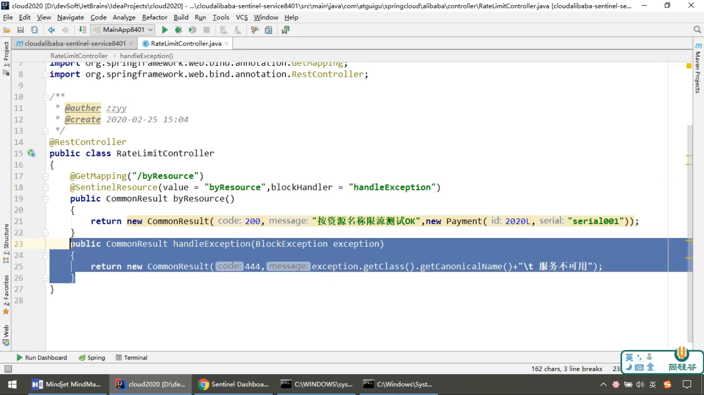

- 自定义全局兜底异常
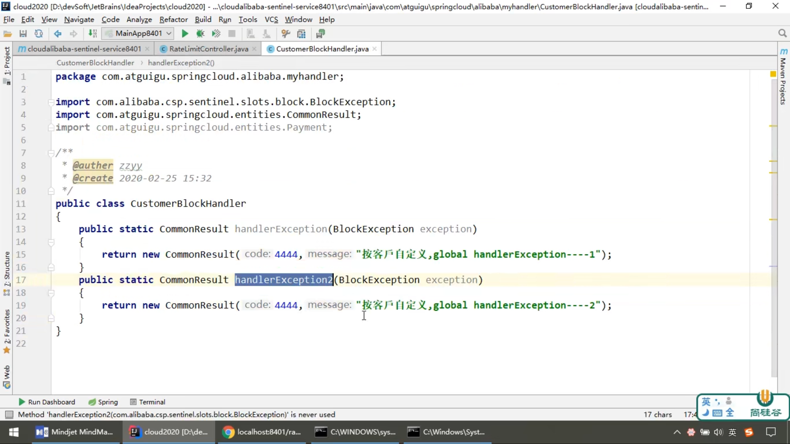


- fallback管理运行时异常

- blockHandler只处理配置异常

- fallback 和 blockHandler 都配置，则blockHandler处理
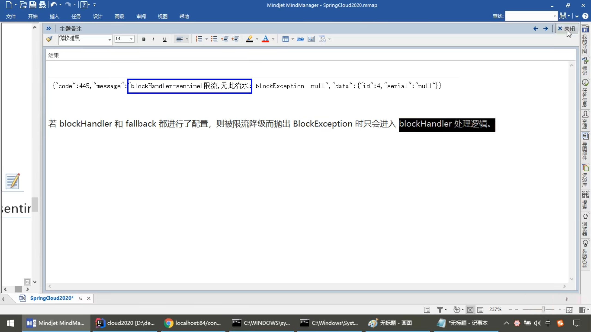

- 忽略异常处理
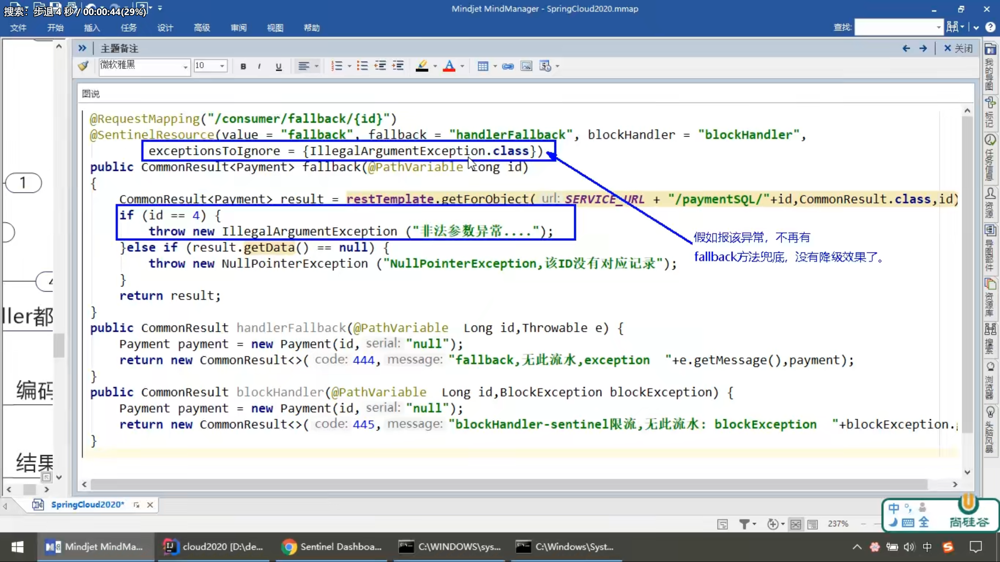

### SEATA

Seata Client/Server Version `1.3.0`

#### seata-server

- 创建seata数据库并添加表

```sql
create database if not exists `seata` default character set utf8mb4 collate utf8mb4_unicode_ci;

use seata;

-- -------------------------------- The script used when storeMode is 'db' --------------------------------
-- the table to store GlobalSession data
CREATE TABLE IF NOT EXISTS `global_table`
(
    `xid`                       VARCHAR(128) NOT NULL,
    `transaction_id`            BIGINT,
    `status`                    TINYINT      NOT NULL,
    `application_id`            VARCHAR(32),
    `transaction_service_group` VARCHAR(32),
    `transaction_name`          VARCHAR(128),
    `timeout`                   INT,
    `begin_time`                BIGINT,
    `application_data`          VARCHAR(2000),
    `gmt_create`                DATETIME,
    `gmt_modified`              DATETIME,
    PRIMARY KEY (`xid`),
    KEY `idx_gmt_modified_status` (`gmt_modified`, `status`),
    KEY `idx_transaction_id` (`transaction_id`)
) ENGINE = InnoDB
  DEFAULT CHARSET = utf8mb4;

-- the table to store BranchSession data
CREATE TABLE IF NOT EXISTS `branch_table`
(
    `branch_id`         BIGINT       NOT NULL,
    `xid`               VARCHAR(128) NOT NULL,
    `transaction_id`    BIGINT,
    `resource_group_id` VARCHAR(32),
    `resource_id`       VARCHAR(256),
    `branch_type`       VARCHAR(8),
    `status`            TINYINT,
    `client_id`         VARCHAR(64),
    `application_data`  VARCHAR(2000),
    `gmt_create`        DATETIME,
    `gmt_modified`      DATETIME,
    PRIMARY KEY (`branch_id`),
    KEY `idx_xid` (`xid`)
) ENGINE = InnoDB
  DEFAULT CHARSET = utf8mb4;

-- the table to store lock data
CREATE TABLE IF NOT EXISTS `lock_table`
(
    `row_key`        VARCHAR(128) NOT NULL,
    `xid`            VARCHAR(96),
    `transaction_id` BIGINT,
    `branch_id`      BIGINT       NOT NULL,
    `resource_id`    VARCHAR(256),
    `table_name`     VARCHAR(32),
    `pk`             VARCHAR(36),
    `gmt_create`     DATETIME,
    `gmt_modified`   DATETIME,
    PRIMARY KEY (`row_key`),
    KEY `idx_branch_id` (`branch_id`)
) ENGINE = InnoDB
  DEFAULT CHARSET = utf8mb4;
```

- 配置registry.conf

```conf
registry {
  type = "nacos"

  # 要确保seata服务器和客户端的nacos命名空间和分组名称一致
  nacos {
    application = "seata-server"
    serverAddr = "127.0.0.1:8848"
    # nacos 命名空间id
    namespace = "6643e6b9-6ca9-4d8f-86bd-34fbb893a976"
    # nacos 分组名称
    group = "SEATA_GROUP"
    # nacos 集群
    cluster = "default"
    username = "nacos"
    password = "nacos"
  }
}

config {
  type = "nacos"

  nacos {
    serverAddr = "127.0.0.1:8848"
    # nacos 命名空间id
    namespace = "6643e6b9-6ca9-4d8f-86bd-34fbb893a976"
    # nacos 分组名称
    group = "SEATA_GROUP"
    username = "nacos"
    password = "nacos"
    dataId = "seataServer.properties"
  }
}
```

- 配置file.conf(file.conf是注册、配置都为file的时候读的文件，如果注册为nacos可以直接删除该文件不用理会)

```conf
## transaction log store, only used in seata-server
store {
  ## store mode: file、db、redis
  mode = "db"

  ## database store property
  db {
    ## the implement of javax.sql.DataSource, such as DruidDataSource(druid)/BasicDataSource(dbcp)/HikariDataSource(hikari) etc.
    datasource = "druid"
    ## mysql/oracle/postgresql/h2/oceanbase etc.
    dbType = "mysql"
    driverClassName = "com.mysql.cj.jdbc.Driver"
    url = "jdbc:mysql://127.0.0.1:3306/seata?rewriteBatchedStatements=true&useUnicode=true&characterEncoding=utf8&connectTimeout=1000&socketTimeout=3000&autoReconnect=true&useSSL=false&serverTimezone=GMT%2B8"
    user = "root"
    password = "mysql123"
    minConn = 5
    maxConn = 30
    globalTable = "global_table"
    branchTable = "branch_table"
    lockTable = "lock_table"
    queryLimit = 100
    maxWait = 5000
  }
}
```

- 修改源文件配置/seata-1.3.0/script/config-center/config.txt然后复制到seata-server根目录

```properties
transport.type=TCP
transport.server=NIO
transport.heartbeat=true
transport.enableClientBatchSendRequest=false
transport.threadFactory.bossThreadPrefix=NettyBoss
transport.threadFactory.workerThreadPrefix=NettyServerNIOWorker
transport.threadFactory.serverExecutorThreadPrefix=NettyServerBizHandler
transport.threadFactory.shareBossWorker=false
transport.threadFactory.clientSelectorThreadPrefix=NettyClientSelector
transport.threadFactory.clientSelectorThreadSize=1
transport.threadFactory.clientWorkerThreadPrefix=NettyClientWorkerThread
transport.threadFactory.bossThreadSize=1
transport.threadFactory.workerThreadSize=default
transport.shutdown.wait=3
# 事务分组，guangxi-tx-group可以定义为其他名称，但必须和客户端一样
# default也可以定义为其他名称，但必须等于registry.conf中nacos注册中心的cluster的值一样
service.vgroupMapping.guangxi-tx-group=default
# 集群，default 必须跟service.vgroupMapping.my_test_tx_group的值一样
service.default.grouplist=127.0.0.1:8091
service.enableDegrade=false
service.disableGlobalTransaction=false
client.rm.asyncCommitBufferLimit=10000
client.rm.lock.retryInterval=10
client.rm.lock.retryTimes=30
client.rm.lock.retryPolicyBranchRollbackOnConflict=true
client.rm.reportRetryCount=5
client.rm.tableMetaCheckEnable=false
client.rm.sqlParserType=druid
client.rm.reportSuccessEnable=false
client.rm.sagaBranchRegisterEnable=false
client.tm.commitRetryCount=5
client.tm.rollbackRetryCount=5
client.tm.degradeCheck=false
client.tm.degradeCheckAllowTimes=10
client.tm.degradeCheckPeriod=2000
# 数据存储模式
store.mode=db
store.file.dir=file_store/data
store.file.maxBranchSessionSize=16384
store.file.maxGlobalSessionSize=512
store.file.fileWriteBufferCacheSize=16384
store.file.flushDiskMode=async
store.file.sessionReloadReadSize=100
store.db.datasource=druid
store.db.dbType=mysql
store.db.driverClassName=com.mysql.cj.jdbc.Driver
store.db.url=jdbc:mysql://127.0.0.1:3306/seata?rewriteBatchedStatements=true&useUnicode=true&characterEncoding=utf8&connectTimeout=1000&socketTimeout=3000&autoReconnect=true&useSSL=false&serverTimezone=GMT%2B8
store.db.user=root
store.db.password=mysql123
store.db.minConn=5
store.db.maxConn=30
store.db.globalTable=global_table
store.db.branchTable=branch_table
store.db.queryLimit=100
store.db.lockTable=lock_table
store.db.maxWait=5000
store.redis.host=127.0.0.1
store.redis.port=6379
store.redis.maxConn=10
store.redis.minConn=1
store.redis.database=0
store.redis.password=null
store.redis.queryLimit=100
server.recovery.committingRetryPeriod=1000
server.recovery.asynCommittingRetryPeriod=1000
server.recovery.rollbackingRetryPeriod=1000
server.recovery.timeoutRetryPeriod=1000
server.maxCommitRetryTimeout=-1
server.maxRollbackRetryTimeout=-1
server.rollbackRetryTimeoutUnlockEnable=false
client.undo.dataValidation=true
client.undo.logSerialization=jackson
client.undo.onlyCareUpdateColumns=true
server.undo.logSaveDays=7
server.undo.logDeletePeriod=86400000
client.undo.logTable=undo_log
client.log.exceptionRate=100
transport.serialization=seata
transport.compressor=none
metrics.enabled=false
metrics.registryType=compact
metrics.exporterList=prometheus
metrics.exporterPrometheusPort=9898
```

- 修改源文件/seata-1.3.0/script/config-center/nacos/nacos-config.sh然后复制到seata-server根目录

```sh
$(dirname "$PWD")/config.txt 改为 ./config.txt
```

- config.txt上传到nacos配置中心

```sh
sh nacos-config.sh -h nacos地址 -p nacos端口 -g 分组名称 -t 命名空间id -u nacos用户 -w nacos密码
```

- 启动seata-server

-h --host 指定在注册中心注册的 IP 不指定时获取当前的 IP，外部访问部署在云环境和容器中的 server 建议指定
-p --port 指定 server 启动的端口 默认为 8091
-m --storeMode 事务日志存储方式 支持file,db,redis，默认为 file 注:redis需seata-server 1.3版本及以上
-n --serverNode 用于指定seata-server节点ID 如 1,2,3..., 默认为 1
-e --seataEnv 指定 seata-server 运行环境 如 dev, test 等, 服务启动时会使用 registry-dev.conf 这样的配置

```sh
# 启动多个seata-server，注册到注册中心，即可实现其高可用
sh seata-server.sh -p 8091 -h 127.0.0.1 -m db
```

#### seata-client

- 在客户端与seata事务相关的数据库添加表

```sql
-- for AT mode you must to init this sql for you business database. the seata server not need it.
CREATE TABLE IF NOT EXISTS `undo_log`
(
    `branch_id`     BIGINT   NOT NULL COMMENT 'branch transaction id',
    `xid`           VARCHAR(100) NOT NULL COMMENT 'global transaction id',
    `context`       VARCHAR(128) NOT NULL COMMENT 'undo_log context,such as serialization',
    `rollback_info` LONGBLOB     NOT NULL COMMENT 'rollback info',
    `log_status`    INT      NOT NULL COMMENT '0:normal status,1:defense status',
    `log_created`   DATETIME  NOT NULL COMMENT 'create datetime',
    `log_modified`  DATETIME  NOT NULL COMMENT 'modify datetime',
    UNIQUE KEY `ux_undo_log` (`xid`, `branch_id`)
) ENGINE = InnoDB
  AUTO_INCREMENT = 1
  DEFAULT CHARSET = utf8mb4 COMMENT ='AT transaction mode undo table';
```

- maven dependency

```xml
<!-- seata 版本需要跟seata服务器版本一致 -->
<dependency>
    <groupId>io.seata</groupId>
    <artifactId>seata-spring-boot-starter</artifactId>
    <version>1.3.0</version>
</dependency>
<dependency>
    <groupId>com.alibaba.cloud</groupId>
    <artifactId>spring-cloud-starter-alibaba-seata</artifactId>
    <exclusions>
        <exclusion>
            <groupId>io.seata</groupId>
            <artifactId>seata-spring-boot-starter</artifactId>
        </exclusion>
    </exclusions>
</dependency>
```

- 应用配置

```properties
# seata 配置中心
seata.config.type=nacos
seata.config.nacos.namespace=6643e6b9-6ca9-4d8f-86bd-34fbb893a976
seata.config.nacos.server-addr=www.laodeli.top:8848
seata.config.nacos.group=SEATA_GROUP
seata.config.nacos.username=nacos
seata.config.nacos.password=nacos

# seata 注册中心
seata.registry.type=nacos
seata.registry.nacos.application=seata-server
seata.registry.nacos.server-addr=www.laodeli.top:8848
seata.registry.nacos.group=SEATA_GROUP
seata.registry.nacos.namespace=6643e6b9-6ca9-4d8f-86bd-34fbb893a976
seata.registry.nacos.username=nacos
seata.registry.nacos.password=nacos

# 与seata服务器的service.vgroupMapping.guangxi-tx-group=default事务组名称名称一致，事务组的命名不要用下划线’_‘
seata.tx-service-group=guangxi-tx-group
# 与seata服务器的service.vgroupMapping.guangxi-tx-group=default事务组名称和集群名称一致
seata.service.vgroup-mapping.guangxi-tx-group=default

seata.enabled=true
# 是否开启数据源自动代理
seata.enableAutoDataSourceProxy=true
seata.enable-auto-data-source-proxy=true
seata.use-jdk-proxy=true
seata.client.rm.async-commit-buffer-limit=10000
seata.client.rm.report-retry-count=5
seata.client.rm.table-meta-check-enable=false
seata.client.rm.report-success-enable=false
seata.client.rm.saga-branch-register-enable=false
seata.client.rm.saga-json-parser=fastjson
seata.client.rm.saga-retry-persist-mode-update=false
seata.client.rm.saga-compensate-persist-mode-update=false
seata.client.rm.lock.retry-interval=10
seata.client.rm.lock.retry-times=30
seata.client.rm.lock.retry-policy-branch-rollback-on-conflict=true
seata.client.tm.commit-retry-count=5
seata.client.tm.rollback-retry-count=5
seata.client.tm.default-global-transaction-timeout=60000
seata.client.tm.degrade-check=false
seata.client.tm.degrade-check-allow-times=10
seata.client.tm.degrade-check-period=2000
seata.client.undo.data-validation=true
seata.client.undo.log-serialization=jackson
seata.client.undo.only-care-update-columns=true
seata.client.undo.log-table=undo_log
seata.client.undo.compress.enable=true
seata.client.undo.compress.type=zip
seata.client.undo.compress.threshold=64k
seata.client.load-balance.type=RandomLoadBalance
seata.client.load-balance.virtual-nodes=10
seata.log.exception-rate=100
seata.service.grouplist.default=www.laodeli.top:8091
seata.service.enable-degrade=false
seata.service.disable-global-transaction=false
seata.transport.shutdown.wait=3
seata.transport.thread-factory.boss-thread-prefix=NettyBoss
seata.transport.thread-factory.worker-thread-prefix=NettyServerNIOWorker
seata.transport.thread-factory.server-executor-thread-prefix=NettyServerBizHandler
seata.transport.thread-factory.share-boss-worker=false
seata.transport.thread-factory.client-selector-thread-prefix=NettyClientSelector
seata.transport.thread-factory.client-selector-thread-size=1
seata.transport.thread-factory.client-worker-thread-prefix=NettyClientWorkerThread
seata.transport.thread-factory.worker-thread-size=default
seata.transport.thread-factory.boss-thread-size=1
seata.transport.type=TCP
seata.transport.server=NIO
seata.transport.heartbeat=true
seata.transport.serialization=seata
seata.transport.compressor=none
seata.transport.enable-client-batch-send-request=true
```

- 在需要全局事务处理的控制器类、业务类实现方法上加@GlobalTransactional注解

## zookeeper

### 启动zookeeper

```sh
# 启动zookeeper服务器1
bin/zkServer.sh start

# 启动zookeeper服务器2
./zkServer.sh start

# 启动zookeeper客户端1
bin/zkCli.sh

# 启动zookeeper客户端2
./zkCli.sh

# 退出客户端
quit

# 停止zookeeper
bin/zkServer.sh stop

# 查看zookeeper状态
bin/zkServer.sh status
```

## docker

- docker的基本组成：镜像、容器、仓库

- 虚悬镜像：仓库名、标签都是`<none>`的镜像

### 安装docker

```sh
# 如果安装过docker，先卸载旧版本的docker
sudo yum remove docker \
    docker-client \
    docker-client-latest \
    docker-common \
    docker-latest \
    docker-latest-logrotate \
    docker-logrotate \
    docker-engine


# 安装yum-utils，其提供了yum-config-manager
sudo yum install -y yum-utils

# 配置yum-config-manager，添加仓库地址，这里需要配置成国内仓库，比如阿里云，不要用官网默认的
sudo yum-config-manager \
    --add-repo \
    http://mirrors.aliyun.com/docker-ce/linux/centos/docker-ce.repo

# 更新yum软件包索引（可选操作）
sudo yum makecache fast 

# 安装docker引擎，如果提示接受GPG密钥，请验证指纹是否匹配060A 61C5 1B55 8A7F 742B 77AA C52F EB6B 621E 9F35，如果是，则接受它
sudo yum install docker-ce docker-ce-cli containerd.io docker-buildx-plugin docker-compose-plugin

# 卸载docker引擎，但不会删除docker镜像、容器和配置文件，docker镜像、容器和配置文件需要手动删除
sudo yum remove docker-ce docker-ce-cli containerd.io docker-buildx-plugin docker-compose-plugin docker-ce-rootless-extras

# 删除docker镜像
sudo rm -rf /var/lib/docker

# 删除docker容器
sudo rm -rf /var/lib/containerd
```

#### 配置国内镜像源

- 1.配置文件`/etc/docker/daemon.json`中加入

```json
{
    "registry-mirrors": [
        "https://docker.mirrors.ustc.edu.cn"
    ]
}
```

- 2.重新启动docker

```sh
sudo systemctl daemon-reload

sudo systemctl restart docker
```

- 3.在命令行执行`docker info` ，如果从结果中看到了如下内容，说明配置成功:

```sh
Registry Mirrors:
    <https://docker.mirrors.ustc.edu.cn/>
```

#### 启动docker

```sh
# 启动docker
sudo systemctl start docker

# 重启docker
sudo systemctl restart docker

# 关闭docker
sudo systemctl stop docker

# 查看docker状态信息
sudo systemctl status docker

# 将docker服务设置为开机启动
sudo systemctl enable docker
```

### docker常用命令

#### 帮助命令

```sh
# docker版本
docker version

# docker概要信息
docker info

# docker总体帮助文档
docker help

# docker命令帮助文档
docker 具体命令 --help
```

#### 镜像命令

- 列出本地主机所有镜像

```sh
# -a 列出本地所有镜像（含历史映像层），-q 只显示镜像id
docker images [-aq]
```

- 查询镜像

```sh
# 最好是去docker hub查询指定版本的详细信息，如镜像标签，只列出25个镜像（默认）
docker search [--limit 25] 镜像关键字 

docker search --limit 25 tomcat
```

- 拉取镜像

```sh
# 不指定标签会拉取最新镜像，相当于docker pull 镜像名:latest
docker pull 镜像名[:标签]

docker pull mysql:8.0.29
```

- 查看镜像/容器/数据卷所占的空间

```sh
docker system df
```

- 删除镜像

```sh
# -f 强行删除
docker rmi [-f] 镜像id或镜像名:标签

# 删除单个镜像
docker rmi -f mysql:8.0.29

# 删除多个镜像
docker rmi -f 镜像名1:标签 镜像名2:标签

# 删除全部镜像
docker rmi -f $(docker images -aq)
```

#### 容器命令

- 新建容器并运行

```sh
# --name 自定义容器名
# -d 后台运行容器并返回容器id，也即启动守护式容器
# -i 以交互模式运行容器，通常与-t同时使用
# -t 为容器重新分配一个伪输入终端，通常与-i同时使用，-it即启动交互式容器（前台有伪终端，等待交互）
# -p 主机端口:容器端口
# -P 随机分配主机端口，很少用
docker run [选项] 镜像名:标签 [命令] [ARG...]

# 使用镜像centos:latest以交互模式新建一个容器并运行，在容器内执行/bin/bash命令
# 放在镜像名后的是命令，这里我们希望有个交互式shell，这里用的是/bin/bash
# 要退出终端，输入exit
docker run -it centos /bin/bash
```

- 展示容器列表（默认正在运行的容器）

```sh
# -a 列出所有的容器
# -l 显示最近创建的容器
# -n 任意正整数 显示任意个最近创建的容器
# -q 静默模式，只显示容器编号
docker ps [选项]
```

- 退出容器

```sh
# 在交互式伪终端，用exit退出，容器停止
exit

# 在交互式伪终端，按ctrl + p + q，容器不停止
ctrl + p + q
```

- 删除容器

```sh
# 单个删除已停止的容器，如果容器正在运行要加-f强制删除
docker rm [-f] 容器id

# 删除全部容器
docker rm -f $(docker ps -a -q)

# 删除全部容器
docker ps -a -q | xargs docker rm
```

```sh
# 启动已停止运行的容器
docker start 容器id/容器名

# 重启容器
docker restart 容器id/容器名

# 停止正在运行的容器
docker stop 容器id或容器名

# 强制停止容器
docker kill 容器id或容器名

# 查看容器日志，-t显示时间，-f 跟随最新的日志显示，--tail限制显示的日志行数
docker logs -t -f --tail 5 容器id

# 查看容器内运行的进程
docker top 容器id

# 查看容器内部细节
docker inspect 容器id

# 重新进入容器，不会启动新进程
docker attach 容器id

# 在docker容器内执行命令 ls -l， 会在容器中打开新的终端，并且可以启动新的进程
docker exec -t 容器id ls -l

# 复制容器内的文件到linux主机
docker cp 容器id:容器内路径 主机路径

# 复制linux主机的文件到容器内
docker cp 主机路径 容器id:容器内路径

# 设置容器开机启动
docker update 容器id --restart always
```

#### docker提交命令

```sh
# 提交容器副本使之成为一个新的镜像
docker commit -m="描述信息" -a="作者" 容器id 要创建的目标镜像名:标签
```

## 消息队列

### rabbitmq

#### 安装rabbitmq

```sh
# management版本的有web管理页面
docker pull rabbitmq:3.9.16-management
```

#### 启动rabbitmq

```sh
# 5672是rabbitmq客户端与服务器交互的端口，15672是rabbitmq管理页面的端口
docker run -d -p 5672:5672 -p 15672:15672 --name rabbitmq 66a12a0cafcc
```

#### 登录rabbitmq管理页面

```properties
管理页面：主机地址:15672
账号：guest
密码：guest
```

#### rabbitmq四种模式

- 1.direct，点对点，只发送到路由键完全匹配的队列
- 2.fanout，广播，不管路由键是什么都全部发送到绑定的队列
- 3.topic，根据路由键匹配规则匹配，*匹配一个，#匹配0个或多个，只发送到匹配的队列
- 4.headers，很少用

#### maven dependency

```xml
<dependency>
    <groupId>org.springframework.boot</groupId>
    <artifactId>spring-boot-starter-amqp</artifactId>
</dependency>
```

#### 应用配置

```properties
spring.rabbitmq.host=192.168.31.149
spring.rabbitmq.port=5672
spring.rabbitmq.username=guest
spring.rabbitmq.password=guest
spring.rabbitmq.virtual-host=/
```

#### 监听消息

- 启动类

```java
package com.lsh.amqp;

import org.springframework.amqp.rabbit.annotation.EnableRabbit;
import org.springframework.boot.SpringApplication;
import org.springframework.boot.autoconfigure.SpringBootApplication;

@SpringBootApplication
// 开启基于注解的rabbitmq模式
@EnableRabbit
public class AmqpApplication {
 public static void main(String[] args) {
  SpringApplication.run(AmqpApplication.class, args);
 }

}

```

- 监听服务类

```java
package com.lsh.amqp.service;

import java.util.Map;

import org.springframework.amqp.core.Message;
import org.springframework.amqp.rabbit.annotation.RabbitListener;
import org.springframework.stereotype.Service;

import lombok.extern.slf4j.Slf4j;

@Service
@Slf4j
public class OrderService {
    /**
     * 直接接收消息内容，@RabbitListener指定监听队列
     * 
     * @param map
     */
    @RabbitListener(queues = "order")
    public void receiveObject(Map<String, String> map) {
        log.info("receive from rabbitmq: {}", map);
    }

    /**
     * 接收消息对象：包含消息体、消息头等信息，@RabbitListener指定监听队列
     * 
     * @param message
     */
    @RabbitListener(queues = "order.hat")
    public void receiveMessage(Message message) {
        log.info("receive from rabbitmq: {}", message.toString());
    }
}
```

#### 定义默认消息转换器

```java
package com.lsh.amqp.configuration;

import org.springframework.amqp.support.converter.Jackson2JsonMessageConverter;
import org.springframework.amqp.support.converter.MessageConverter;
import org.springframework.context.annotation.Bean;
import org.springframework.context.annotation.Configuration;

/**
 * 配置amqp默认的消息转换器，将对象转成json发送
 *
 * @author lsh
 * @date 2022-05-06 22:24:30
 * @since jdk-1.8
 */
@Configuration
public class AmqpConfiguration {
    @Bean
    public MessageConverter messageConverter() {
        return new Jackson2JsonMessageConverter();
    }
}

```

#### 发送消息

```java
package com.lsh.amqp;

import java.time.LocalDateTime;
import java.util.HashMap;
import java.util.Map;

import org.junit.jupiter.api.Test;
import org.springframework.amqp.core.AmqpAdmin;
import org.springframework.amqp.core.Binding;
import org.springframework.amqp.core.DirectExchange;
import org.springframework.amqp.core.Queue;
import org.springframework.amqp.rabbit.core.RabbitTemplate;
import org.springframework.beans.factory.annotation.Autowired;
import org.springframework.boot.test.context.SpringBootTest;

/**
 * AmqpApplicationTests
 *
 * @author lsh
 * @date 2022-05-06 22:41:14
 * @since jdk-1.8
 */
@SpringBootTest
public class AmqpApplicationTests {
    @Autowired
    private RabbitTemplate rabbitTemplate;

    /*
    * 创建、绑定或删除交换器、队列
    */
    @Autowired
    private AmqpAdmin amqpAdmin;

    @Test
    public void testAmqpAdmin() {
        // 创建交换器
        amqpAdmin.declareExchange(new DirectExchange("amqpAdmin.direct"));

        // 创建队列
        amqpAdmin.declareQueue(new Queue("amqpAdmin.queue"));

        // 绑定队列到交换器
        amqpAdmin.declareBinding(
        new Binding("amqpAdmin.queue", Binding.DestinationType.QUEUE, "amqpAdmin.direct", "amqpAdmin", null));
        // 删除队列
        amqpAdmin.deleteQueue("amqpAdmin.queue");
        // 删除交换器
        amqpAdmin.deleteExchange("amqpAdmin.direct");
    }

    @Test
    void testSendDirectMessage() {
        Map<String, String> map = new HashMap<>();
        map.put("message", "java to rabbitmq, hello " + LocalDateTime.now().toString());
        rabbitTemplate.convertAndSend("lsh.direct", "order.hat", map);
    }

    @Test
    void testReceiveDirectMessage() {
        Object message = rabbitTemplate.receiveAndConvert("order");
        System.out.println(message);
    }

    @Test
    void testSendFanoutMessage() {
        Map<String, String> map = new HashMap<>();
        map.put("message", "java to rabbitmq, fanout hello");
        rabbitTemplate.convertAndSend("lsh.fanout", "", map);
    }
}
```

## 注解

- @ImportResource
  
    作用：导入Spring配置文件
  
    用法：==@Configuration + @ImportResource("classpath:xxx.xml")== 一起用

例子：读取spring.xml文件中的Pet

1. 定义宠物类

```java
@Getter
@Setter
@ToString
public class Pet {
    private String name;

    private int age;
}
```

2.设置spring.xml配置Pet

```xml
<?xml version="1.0" encoding="UTF-8"?>
<beans xmlns="http://www.springframework.org/schema/beans"
xmlns:xsi="http://www.w3.org/2001/XMLSchema-instance"
xsi:schemaLocation="http://www.springframework.org/schema/beans
https://www.springframework.org/schema/beans/spring-beans.xsd">

    <bean id="pet" class="com.handle.use_annotation_import_resource.Pet">
        <property name="name" value="cat"></property>
        <property name="age" value="2"></property>
    </bean>
</beans>
```

3.定义.定义配置类

```java
@Configuration
@ImportResource("classpath:spring.xml")
public class MainConfiguration {

}
```

- @ConfigurationProperties
  
    作用：配置绑定，导入application.properties（application.yml）配置文件的值到对象属性中
  
    属性：prefix：取前缀为xxx的属性
  
    用法：
  
  1. @Component + @ConfigurationProperties 一起使用

  2. @Configuration + @EnableConfigurationProperties + @ConfigurationProperties 一起使用

例子：封装application.properties的pet前缀的属性到Pet对象中

用法1：

1. application.properties 设置属性如下

```properties
pet.name = dog
pet.age = 3
```

2.定义宠物类

```java
@Getter
@Setter
@ToString
@Component
@ConfigurationProperties(prefix = "pet")
public class Pet {
    private String name;

    private int age;
}
```

用法2：

1.application.properties 设置属性如下

```java
pet.name = dog
pet.age = 3
```

2.定义宠物类

```java
@Getter
@Setter
@ToString
@ConfigurationProperties(prefix = "pet")
public class Pet {
    private String name;

    private int age;
}
```

3.定义配置类，开启配置绑定，加载Pet类

```java
@Configuration
@EnableConfigurationProperties(Pet.class)
public class MainConfiguration {

}
```

### 请求处理常用的参数注解

- @PathVariable ：获取路径变量

```java
 @GetMapping("/user/{id}/{name}/getPathVariables")
 public Map<String, Object> getPathVariables(
    @PathVariable("id") Integer id,
    @PathVariable("name") String name,
    @PathVariable Map<String, String> allPathVariables) {
        Map<String, Object> map = new HashMap<>();
        map.put("id", id);
        map.put("name", name);
        map.put("allPathVariables", allPathVariables);
        return map;
    }
```

- @RequestParam : 获取请求参数，把请求中指定名称的参数的值赋给控制器中的形参

```java
 @GetMapping("/user/getRequestParams")
 public Map<String, Object> getRequestParams(
    @RequestParam("age") Integer age,
    @RequestParam("interest") List<String> interests,
    @RequestParam Map<String, String> allRequestParams) {
        Map<String, Object> map = new HashMap<>();
        map.put("age", age);
        map.put("interest", interests);
        map.put("allRequestParams", allRequestParams);
        return map;
    }
```

请求url：`localhost:8080/application/getRequestParams?age=18&interest=basketball&interest=movie`

方法返回：`{"interest": ["basketball","movie"],"allRequestParams": {"age": "18", "interest": "basketball"},"age": 18}`

- @RequestBody : 获取请求体

```java
@PostMapping("/user/getRequestBody")
public Map<String, Object> getRequestBody(@RequestBody String content) {
     Map<String, Object> map = new HashMap<>();
     map.put("content", content);
     return map;
}
```

- @RequestHeader : 获取请求头

```java
@PostMapping("/user/getHeaders")
public Map<String, Object> getHeaders(
    @RequestHeader("Host") String host,
    @RequestHeader Map<String, String> allHeaders) {
     Map<String, Object> map = new HashMap<>();
     map.put("host", host);
     map.put("allHeaders", allHeaders);
     return map;
}
```

- @CookieValue : 获取 cookie 值

```java
/**
 * 获取cookie
 */
@PostMapping("/user/getCookies")
public Map<String, Object> getCookies(
    @CookieValue("id") id,
    @CookieValue Cookie cookies) {
    Cookie cookie = new Cookie("userName", "呆鹅大人");
    Map<String, Object> map = new HashMap<>();
    map.put("id", id);
    map.put("cookies", cookies);
    return map;
}


/**
 * 设置cookie
 */
@PostMapping("/user/setCookies")
public String setCookies(HttpServletResponse response) {
    Cookie cookie = new Cookie("userName", "呆鹅大人");
     response.addCookie(cookie);
     return "set cookie success";
}
```

- @RequestAttribute : 获取 request 的属性的值
    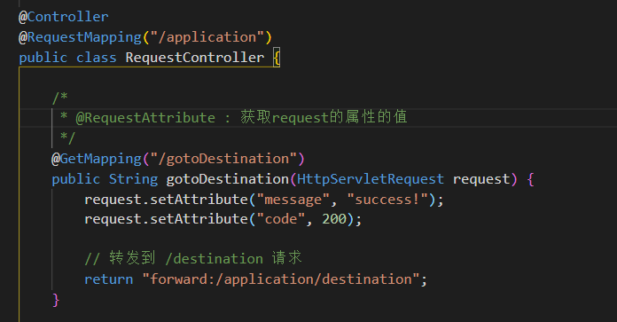
    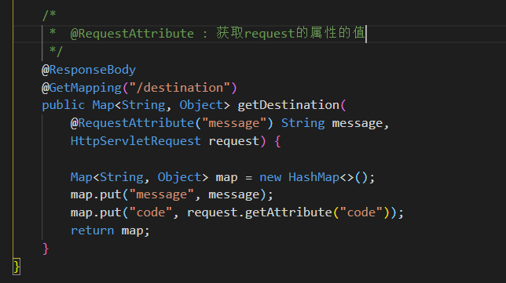
    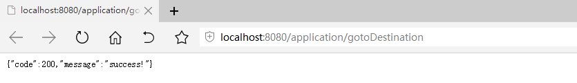

- @MatrixVariable : 获取矩阵变量的值

    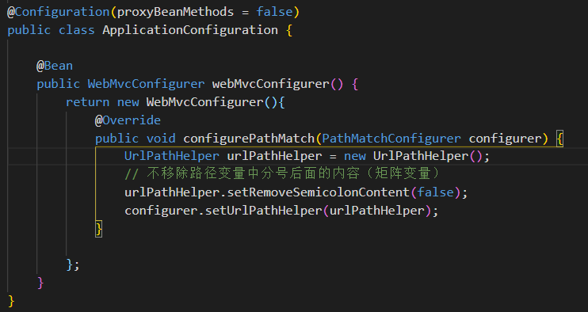
    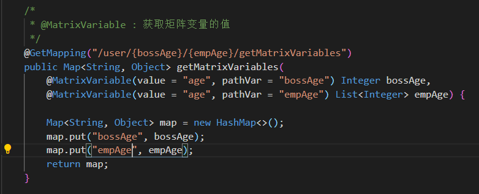
    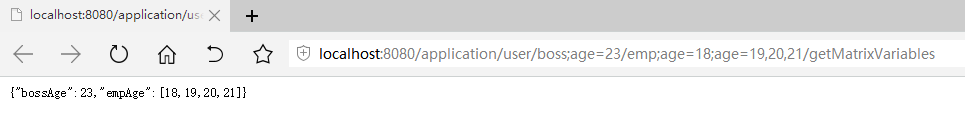

## Thymeleaf

1. 标签中变量写法：${qrCodeImage}
2. 标签中路径写法：@{/qrCode/generator}
3. 标签中路径有变量的写法：@{/downloads/{qrCodeImage}(qrCodeImage=${qrCodeImage})}，

{qrCodeImage}相当于占位符，qrCodeImage从括号里面取值，${qrCodeImage}表示取后台传过来的值

1. js中变量写法：[[${qrCodeImage}]]

2. js中路径写法：[[@{/qrCode/generator}]]

## Maven

### 安装Maven

- `MAVEN_HOME\conf\settings.xml` 配置文件
  
```xml
<!-- 设置本地仓库路径 -->
<localRepository>../repository</localRepository>
  
<mirrors>
    <!-- 设置下载jar包的镜像地址 -->
    <mirror>
        <id>alimaven</id>
        <mirrorOf>central</mirrorOf>
        <name>aliyun maven</name>
        <url>http://maven.aliyun.com/nexus/content/repositories/central</url>
    </mirror>
</mirrors>  
  
<profiles>
    <!-- 设置默认jdk -->
    <profile>
        <id>jdk-11</id>
        <activation>
            <jdk>11</jdk>
            <activeByDefault>true</activeByDefault>
        </activation>
        <properties>
            <maven.compiler.source>11</maven.compiler.source>
            <maven.compiler.target>11</maven.compiler.target>
            <maven.compiler.compilerVersion>11</maven.compiler.compilerVersion>
            <encoding>UTF-8</encoding>
        </properties>
    </profile>
</profiles>
```

### 安装远程仓库（私服）

- 解压安装包 `nexus-3.33.0-01-win64.zip`

- 添加环境变量 `..\nexus-3.33.0-01-win64\nexus-3.33.0-01\bin`

- 配置地址、端口、上下文路径 `..\nexus-3.33.0-01-win64\nexus-3.33.0-01\etc\nexus-default.properties`

- 以系统管理员身份打开`cmd`

- 安装 `nexus /install`

- 启动

- 后台启动 ，看不到实时日志`nexus /start`

- 实时启动，可以看到日志，不能关闭cmd窗口 `nexus /run`

- 输入 `http://localhost:8001` 访问，如果默认端口已经改了以新的端口为准

- 查看初始密码 `..\nexus-3.33.0-01-win64\sonatype-work\nexus3\admin.password`

- 输入账号 `admin` 及上面文档的密码登录

- 修改密码

- 设置jar包保存路径
  
    

- 设置`maven`配置文档`..\apache-maven-3.6.3\conf\settings.xml` server的id和repository的id要一致

- 设置maven登录私服的账号密码
  
  ```xml
  <server>
      <id>releases</id>
      <username>admin</username>
      <password>Nexus**..</password>
  </server>
  <server>
      <id>snapshots</id>
      <username>admin</username>
      <password>Nexus**..</password>
  </server>
  <server>
      <id>nexus</id>
      <username>admin</username>
      <password>Nexus**..</password>
  </server>
  ```

- 设置私服镜像，镜像id要和server标签的id一致
  
  ```xml
  <mirrors>
      <mirror>
          <id>nexus</id>
          <url>http://localhost:8001/repository/maven-public/</url>
          <mirrorOf>*</mirrorOf>
      </mirror>
  </mirrors>  
  ```

- 设置pom.xml上传jar包到私服的配置，repository的id要和server的id一致

```xml
<distributionManagement>
    <repository>
        <id>releases</id>
        <url>
            http://localhost:8001/repository/maven-releases/
        </url>
    </repository>
    <snapshotRepository>
        <id>snapshots</id>
        <url>
            http://localhost:8001/repository/maven-snapshots/
        </url>
    </snapshotRepository>
</distributionManagement>
```

- 设置`..\apache-maven-3.6.3\conf\settings.xml` 从私服下载jar包的配置

```xml
<profiles>
    <profile>
        <id>nexus</id>
        <repositories>
            <repository>
                <id>central</id>
                <url>http://localhost:8001/repository/maven-public/</url>
                <releases>
                    <enabled>true</enabled>
                </releases>
                <snapshots>
                    <enabled>true</enabled>
                </snapshots>
            </repository>
        </repositories>
        <pluginRepositories>
            <pluginRepository>
                <id>central</id>
                <name>nexus repositories</name>
                <url>http://localhost:8001/repository/maven-public/</url>
            </pluginRepository>
        </pluginRepositories>
    </profile>
</profiles>

<!-- 激活 profile -->
<activeProfiles>
    <!-- nexus 为上面定义的 profile id -->
    <activeProfile>nexus</activeProfile>
</activeProfiles>
```

- 卸载 `nexus /uninstall`

- maven 安装本地 jar 到 本地 repository

```cmd
mvn install:install -file -Dfile=d:\sqljdbc-4.1.5605.jar -Dpackaging=jar -DgroupId=com.microsoft.sqlserver -DartifactId=sqljdbc -Dversion=4.1.5605
```

### pom.xml 文档设置

- 设置基本信息
  
  ```xml
  <properties>
      <maven.compiler.source>11</maven.compiler.source>
      <maven.compiler.target>11</maven.compiler.target>
      <maven.compiler.compilerVersion>11</maven.compiler.compilerVersion>
      <maven.compiler.encoding>UTF-8</maven.compiler.encoding>
      <project.build.sourceEncoding>UTF-8</project.build.sourceEncoding>
      <project.reporting.outputEncoding>UTF-8</project.reporting.outputEncoding>
  </properties>
  ```

- 设置打包时生成source.jar
  
  ```xml
  <plugin>
      <groupId>org.apache.maven.plugins</groupId>
      <artifactId>maven-source-plugin</artifactId>
      <version>3.2.1</version>
      <!-- 指定插件的 goal -->
      <executions>
          <execution>
              <id>attach-sources</id>
              <goals>
                  <goal>jar</goal>
              </goals>
              <!-- 将 goal 和 maven 生命周期的 package 阶段绑定 -->
              <phase>package</phase>
          </execution>
      </executions>
  </plugin>
  ```

- 设置打包时生成javadoc.jar
  
  ```xml
  <plugin>
      <groupId>org.apache.maven.plugins</groupId>
      <artifactId>maven-javadoc-plugin</artifactId>
      <version>3.3.0</version>
      <!-- 指定插件的 goal -->
      <executions>
          <execution>
              <id>attach-javadocs</id>
              <goals>
                  <goal>jar</goal>
              </goals>
              <!-- 将 goal 和 maven 生命周期的 package 阶段绑定 -->
              <phase>package</phase>
              <!-- configuration 标签用来设置插件的参数 -->
              <configuration>
                  <!-- Specifies the encoding name of the source files. -->
                  <!-- If not specificed, the encoding value will be the value of the file.encoding system property. -->
                  <encoding>UTF-8</encoding>
  
                  <!-- Specifies the encoding of the generated HTML files-->
                  <!--  If not specificed, the docencoding value will be UTF-8. -->
                  <docencoding>UTF-8</docencoding>
                  <!-- Specifies the HTML character set for this document. -->
                  <!-- If not specificed, the charset value will be the value of the docencoding parameter. -->
                  <charset>UTF-8</charset>
  
                  <tags>
                      <!-- define @date tag -->
                      <tag>
                          <name>date</name>
                          <!-- define @date tag for all places -->
                          <placement>a</placement>
                          <head>created time:</head>
                      </tag>
                  </tags>
              </configuration>
          </execution>
      </executions>
  </plugin>
  ```

### 打包时跳过测试

```xml
<build>
    <plugins>
        <!-- maven 打包时跳过测试 -->
        <plugin>
            <groupId>org.apache.maven.plugins</groupId>
            <artifactId>maven-surefire-plugin</artifactId>
            <version>${maven.surefire.plugin.version}</version>
            <configuration>
                <skip>true</skip>
            </configuration>
        </plugin>
    </plugins>
</build>
```

### 创建聚合maven工程

- 创建一个maven作为父工程，只留下pom文件

```xml
<?xml version="1.0" encoding="UTF-8"?>
<project xmlns="http://maven.apache.org/POM/4.0.0"
         xmlns:xsi="http://www.w3.org/2001/XMLSchema-instance"
         xsi:schemaLocation="http://maven.apache.org/POM/4.0.0 https://maven.apache.org/xsd/maven-4.0.0.xsd">
    <modelVersion>4.0.0</modelVersion>

    <groupId>com.lsh</groupId>
    <artifactId>app</artifactId>
    <version>1.0-SNAPSHOT</version>

    <packaging>pom</packaging>

    <modules>
        <module>子模块名称1</module>
        <module>子模块名称2</module>
    </modules>
</project>
```

- 创建模块

```xml
<?xml version="1.0" encoding="UTF-8"?>
<project xmlns="http://maven.apache.org/POM/4.0.0" 
         xmlns:xsi="http://www.w3.org/2001/XMLSchema-instance" 
         xsi:schemaLocation="http://maven.apache.org/POM/4.0.0 https://maven.apache.org/xsd/maven-4.0.0.xsd">
    <modelVersion>4.0.0</modelVersion>

    <!-- 引入父工程坐标 -->
    <parent>
        <groupId>com.lsh</groupId>
        <artifactId>app</artifactId>
        <version>1.0-SNAPSHOT</version>
    </parent>

    <artifactId>子模块名称</artifactId>
</project>
```

### maven坐标

```xml
<dependency>
    <groupId>com.handle</groupId>
    <artifactId>commons</artifactId>
    <version>1.0.0</version>
</dependency>
```

一个Maven工程由groupId，artifactId和version作为唯一标识

- groupId类似于Java的包名，通常是公司或组织名称
- artifactId类似于Java的类名，通常是项目名称
- version，jar包版本，如1.0.0

### maven 常见问题及解决方案

#### 1. maven 控制台日志乱码

- 查看 maven 默认编码：`mvn -v`

- 设置maven默认编码：`-Dfile.encoding=GBK`
  
    

## gradle

- 新建gradle项目
  
  ```bat
  gradle init
  ```

## git

### 安装

```sh
# 查看git配置
git config --global --list

# 生成ssh key
 ssh-keygen -t rsa -C "这里填你的邮箱"

# 安装完成后，还需要最后一步设置，因为Git是分布式版本控制系统，所以，每个机器都必须自报家门：你的名字和Email地址
# global参数，表示你这台机器上所有的Git仓库都会使用这个配置，当然也可以对某个仓库指定不同的用户名和Email地址
git config --global user.name "Your Name"
git config --global user.email "email@example.com"
```

### 创建版本库

- 创建一个空目录并进入这个空目录

```sh
mkdir -p 目录名
cd 目录名
```

- 通过git init命令把这个目录变成Git可以管理的仓库

```sh
git init
```

### 把文件添加到版本库

- 新建文件放到本地仓目录下
- 新建文件添加到仓库

```sh
# Git命令必须在Git仓库目录内执行。添加某个文件时，该文件必须在当前目录下存在
git add 新建文件名1 新建文件名2
```

- 把文件提交到仓库

```sh
git commit -m "自定义提交说明"
```

- 查看仓库当前状态

```sh
git status
```

- 查看文件修改了什么内容

```sh
git diff 文件名
```

- 知道文件修改了什么内容后，可以放心提交到仓库

```sh
git add 文件名
# commit之前可以再看看当前仓库状态，更放心提交
git commit -m "自定义提交说明"
```

- 从暂存区域移除，然后提交

```sh
git rm filename
```

- 文件重命名

```sh
# 这个命令相当于mv 旧文件名 新文件名、git rm 旧文件名、git add 新文件名 
git mv 旧文件名 新文件名
```

- 从一个服务器克隆一个现有的 Git 仓库并自定义本地仓库的名字

```sh
git clone url directoryname
```

```sh
# 查看提交历史
git log

# 按行展示log
git log --pretty=oneline

# 查看某个人的提交记录
git log --author=somebody

# 查看git历史执行过的命令
git reflog
```

- 撤销操作

```sh
# 尝试重新提交
git commit --amend

# 取消暂存的文件
git reset filename

# 撤消对文件的修改
git checkout --filename

# 丢弃本地的所有改动与提交，获取服务器上最新的版本历史，并将本地主分支指向它
git fetch origin

# 回退到上一个版本
git reset --hard HEAD^

# 回退到指定分支
git reset --hard origin/dev

# 回退到指定提交id
git reset --hard commitId
```

### 分支操作

```sh
# 创建一个名字叫做 dev 的分支
git branch dev

# 切换当前分支为dev
git checkout dev

# 直接创建分支并切换过去
git checkout -b dev

# 合并分支
git merge dev

# 把新建的分支删掉
git branch -d dev

# 将分支推送到远端仓库
git push origin
```

### git常见问题

- Please commit your changes or stash them before you merge.

解决方法：通过git stash将工作区恢复到上次提交的内容，同时备份本地所做的修改，之后就可以正常git pull了，git pull完成后，执行git stash pop将之前本地做的修改应用到当前工作区。

```cmd
git stash
git pull
git stash pop
```

git stash: 备份当前的工作区的内容，从最近的一次提交中读取相关内容，让工作区保证和上次提交的内容一致。同时，将当前的工作区内容保存到Git栈中。

git stash pop: 从Git栈中读取最近一次保存的内容，恢复工作区的相关内容。由于可能存在多个Stash的内容，所以用栈来管理，pop会从最近的一个stash中读取内容并恢复。

## 数据库篇

### PostgreSQL

#### 安装docker版本PostgreSQL

```sh
docker pull postgres：14.7
```

#### pg控制台命令

|快捷键|功能|
|:-|:-|
|\password|设置密码|
|\h [sql命令]|查看sql命令的解释|
|\?|查看pgsql命令列表|
|\l|列出所有数据库|
|\c [database_name]|连接其它数据库|
|\d|列出当前数据库的所有表格|
|\d [tablename]|列出指定表的结构|
|\du|列出所有用户|
|q|退出|

#### 备份

可以选择的备份格式：*.bak、*.sql、*.tar

- 单个数据库

```sh
# 备份数据库到bak文件
pg_dump dbname > dbname.bak

# 从bak文件恢复数据到指定数据库，数据库不存在时需要先创建数据库
psql dbname < dbname.bak
```

- 全部数据库

```sh
# 备份所有数据库到bak文件
pg_dumpall > pg.bak

# 从bak文件恢复所有数据库数据
psql -f pg.bak [-U] postgres
```

#### 用户操作

```sql
# 创建用户并设置密码
create user 'username' with password 'password';

# 修改用户密码
alter user 'username' with password 'password';

# 指定数据库的所有权限赋予指定用户
grant all privileges on database 'dbname' to 'username';

# 赋予数据库的所有权限后，还要指定表的所有权限赋予指定用户，才可以读写表
grant all privileges on all tables in schema 'schema' to 'username';

# 移除指定用户对于指定数据库的所有权限
revoke all privileges on database 'dbname' from 'username';

# 删除用户
drop user 'username;
```

#### 角色管理

pg没有区分用户和角色的概念，唯一区别就是创建用户和创建角色

```sql
# 默认不具有登录属性
create role 'rolename';

alter role 'rolename' with login;

# 默认具有登录属性
create user 'username';

# 查询角色信息
select * from pg_roles;

# 查询用户信息
select * from pg_user;
```

### MySQL

#### windows安装（压缩包版）

以下安装步骤均在管理员身份的dos窗口中执行。

1. 初始化数据库生成空的登录密码：

   ```cmd
   mysqld --initialize -insecure –user=mysql
   ```

2. 安装 mysql（服务）：

   ```cmd
       mysqld --install mysql
   ```

3. 启动 mysql 服务：

   ```cmd
   net start mysql
   ```

4. 登录 mysql 服务器，初始化没有生成密码，提示输入密码直接按回车登录：

   ```cmd
   mysql -u root -P 端口 -p
   ```

5. 修改 root 账户密码：

   ```cmd
   ALTER USER 'root'@'localhost' IDENTIFIED WITH mysql_native_password BY 'mysql123';
   ```

6. 关闭服务：

   ```cmd
   net stop mysql
   ```

7. 移除 mysql（服务）：

   ```cmd
   mysqld --remove mysql
   ```

#### linux安装

```sh
# 查看是否安装了mysql相关的组件
rpm -qa | grep mariadb

# 卸载mysql相关组件
rpm -e --nodeps mariadb-libs
```

#### mysql-docker

```sh
# 安装
docker pull mysql:8.0.29

# 启动
docker run -p 3306:3306 --name mysql01 -e MYSQL_ROOT_PASSWORD=mysql123 -d mysql:8.0.29 --character-set-server=utf8mb4 --collation-server=utf8mb4_unicode_ci
```

#### CRUD 操作

##### 用户和权限操作

```sql
# 显示当前用户
select user();

# mysql数据库有一个名为user的表，它包含所有用户账号
use mysql;

# user表的user列存储用户登录名
select user from user;

# 创建用户账号 
# identified by指定的口令为纯文本，MySQL将在保存到user表之前对其进行加密
create user dbadmin identified by 'dbadmin123!!';

# 更改口令,新口令必须传递到Password()函数进行加密
#set password for dbadmin = Password('dbadmin123');

# 在不指定用户名时，SET PASSWORD更新当前登录用户的口令
set password = Password('dbadmin123');


# 为重命名一个用户账号
rename user dbadmin to dbsadmin;

# 查看赋予用户账号的权限
# USAGE表示根本没有权限
# 用户定义为user@host MySQL的权限用用户名和主机名结合定义。
# 如果不指定主机名，则使用默认的主机名%（授予用户访问权限而不管主机名）。
show grants for dbadmin;

# 设置访问权限
# GRANT和REVOKE可在几个层次上控制访问权限：
# 整个服务器，使用GRANT ALL和REVOKE ALL；
# 整个数据库，使用ON database.*；
# 特定的表，使用ON database.table；
# 特定的列；
# 特定的存储过程。
# 常用权限：
# alter 使用ALTER TABLE
# create 使用CREATE TABLE
# delete 使用DELETE
# drop 使用DROP TABLE
# insert 使用INSERT
# select 使用SELECT
# update 使用UPDATE

# GRANT要求你至少给出以下信息：要授予的权限；被授予访问权限的数据库或表；用户名。
grant select,create,alter,insert,update,delete,drop on hr.* to dbadmin;

# GRANT的反操作为REVOKE，用它来撤销特定的权限
# 被撤销的访问权限必须存在，否则会出错
revoke select on hr.* from dbadmin;

# 删除用户账号和所有相关的账号权限
drop user dbadmin;
```

##### 数据库操作

```sql
# 创建数据库
create database if not exists `study` default character set utf8mb4 collate utf8mb4_unicode_ci;

# 修改数据库
alter database 数据库名 [character set charset_name] [collate collation_name]

# 删除数据库，同时删除该数据库相关的目录及其目录内容
drop database[if exists] 数据库名

# 显示可用的数据库列表
show databases [like 'stu%'];

# 查看当前（选择的）数据库
select database();

# 显示创建数据库的sql语句
show create database 数据库名称;

# 选择（打开）数据库
use 数据库名称;
```

##### 表操作

```sql
# 显示当前选择的数据库内可用表的列表
show tables;

# 心事创建表的sql语句
show create table payment;

# 显示表的字段信息
show columns from account;
describe account;

# 显示广泛的服务器状态信息
show status;

# 显示创建表的sql语句
show create table account;

# 显示服务器错误消息
show errors;

# 显示服务器警告消息
show warnings;

# 模糊查询
select * from account where name like "%" 'ku' "%";

# 限制结果
# 分页时一定要配合 order by 使用
# limit 偏移量，返回行数 （limit只有一个参数时表示的是返回行数，此时偏移量默认为零）
select * from employee order by id asc limit 0, 20;

# MySQL 5支持 limit 的另一种替代语法：limit size offset rowindex
select * from employee order by id asc limit 20 offset 0;

# 正则表达式
# MySQL中的正则表达式匹配（自版本3.23.4后）大写和小写都匹配
# 可添加 binary 关键字区分大小写

# 检索列name包含文本'R'的所有行
select * from account where name regexp binary 'R';

# '.' 表示匹配任意一个字符
select * from account where password regexp '.13';

# '|' 表示or匹配
select * from account where id regexp '[1|2]';

# '[]' 表示匹配几个字符之一，'-' 定义一个范围
select * from account where password regexp '[0-9]';

# 为了匹配特殊字符，必须用'\\特殊字符'

# 拼接字段,列值为id(name)
select concat(id,'(',name,')') as aaa from account order by id;

# 连接表
# 内部联结（等值联结），inner join， on 为连接条件（同where）
select account.*, employee.sex, employee.age from account inner join employee on account.id = employee.id;

# 自联结
# 自联结通常作为外部语句用来替代从相同表中检索数据时使用的子查询语句。
# 应该试一下自联结和子查询两种方法，以确定哪一种的性能更好。
# 子查询 select * from employee where sex = (select sex from employee where sex='1' limit 0, 1);
select e1.* from employee as e1, employee as e2 where e1.id = e2.id and e2.sex='1';

# 自然联结，自然联结排除多次出现的列，使每个列只返回一次。
# 一般是通过对某张表使用通配符（SELECT *），对所有其他表的列使用明确的子集来完成的。
# 内部联结基本都是自然联结
select account.*, employee.sex, employee.age from account,employee where account.id = employee.id;

# 外部联结,包含了那些在相关表中没有关联行的行。
# 在使用 outer join 时，必须使用 right 或 left 关键字指定包括其所有行的表
# right 指出的是包括 outer join 右边的表所有行，left 指出的是包括 outer join 左边的表所有行。
select account.*, employee.sex, employee.age from account left outer join employee on account.id = employee.id;

# group by 分组数据
# 分组允许把数据分为多个逻辑组，以便能对每个组进行聚集计算。
# group by 子句必须出现在 where 子句之后，order by 子句之前
select sex, count(*) as number from employee group by sex;

# coalesce(a, b, ...)：如果a!=null则返回a，如果a==null则返回b，...，如果都为null则返回null
select coalesce(2, 'b') as someColumnName; 

# with rollup 可以得到每个分组以及每个分组汇总后的值
select coalesce(sex, 'sum') as category, sex, count(*) from employee group by sex with rollup;

# having 过滤分组，（用法与where类似，区别是 having 过滤分组，where 过滤行，where 在数据分组前进行过滤，having 在数据分组后进行过滤。）
select sex, count(*) as number from employee group by sex having number >= 2;

# coalesce，where，group by，with rollup，having，order by 一起使用
select coalesce(sex, 'sum') as category, count(*) as number from employee where age>=18 group by sex  with rollup having number >= 3 order by sex asc;

# 测试
select 3*2;
select rtrim(' abc ') as rtrim;
select ltrim(' abc ');
select trim(' abc ');
# 返回当前日期时间
select now();
select upper('abc');
select lower('ABC');
select length('abc');
select curdate();
select curtime();
select year(curdate());
select month(curdate());
select abs(-3);
select pi();

# 聚集函数(汇总数据)
# COUNT(*)对表中行的数目进行计数，不管表列中包含的是空值（NULL）还是非空值
select count(*) from account;
select sum(age) from employee;
select distinct id from account;

# 普通查询
select * from account;

# DELETE语句从表中删除行，甚至是删除表中所有行
delete from account;

# TRUNCATE实际是删除原来的表并重新创建一个表，而不是逐行删除表中的数据
truncate account;

# 重命名表
rename table acc to account;

# 如果使用的是mysql命令行实用进程,需要临时更改命令行实用进程的语句分隔符
# 除\符号外，任何字符都可以用作语句分隔符
delimiter //
# 创建存储过程
create procedure find()
begin
    select * from  employee;
end //
# 恢复默认的语句分隔符
delimiter ;
# 使用存储过程
call find();
# 删除存储过程
drop procedure if exists find;

create table if not exists `user` (
    id bigint not null auto_increment comment 'id',
    name varchar(32) not null comment 'name',
    password nvarchar(16) not null,
    primary key(id)
)
engine = innodb
default character set = utf8mb4
collate = utf8mb4_unicode_ci
comment ='用户表';

# 如果表存在则删除
drop table if exists payment;

# 修改字段
# id自增到 int unsigned 最大值后不再允许插入
alter table account change column id id int unsigned auto_increment;

insert into account (name, password)  values ('gen', 'voterga');

# 返回最后一个AUTO_INCREMENT值
select last_insert_id();


select * from account;


delimiter //
# 存储过程将保存结果的3个变量名,所有MySQL变量都必须以@开始
# IN（传递给存储过程）、OUT（从存储过程传出
create procedure finduser(
    in userId int unsigned,
    out userName  varchar(8),
    out password varchar(16)
)
begin
    select name into userName from account where id= userId; 
    select account.password into password from account where id= userId; 
end //
delimiter ;

drop procedure if exists finduser;

call finduser(2,@name,@password);

select @name,@password;


# 事务处理
# 当 commit 或 rollback 语句执行后，事务会自动关闭（MySQL 将来的更改会隐含提交）。

select * from account;
# 开始事务
# 事务处理用来管理INSERT、UPDATE和DELETE语句,不能回退CREATE或DROP操作
start transaction;
delete from account;
select * from account;
# rollback 命令用来回退（撤销）MySQL语句
rollback;
select * from account;

# 使用COMMITaccount
# 在事务处理块中，提交不会隐含地进行。为进行明确的提交，使用 COMMIT 语句
select * from account;
start transaction;
delete from account where id=4294967295 ;
select * from account;
commit;
select * from account;

# 使用保留点
# 每个保留点都取标识它的唯一名字，以便在回退时，MySQL知道要回退到何处
# 保留点在事务处理完成（执行一条ROLLBACK或COMMIT）后自动释放
# 也可以用RELEASESAVEPOINT明确地释放保留点
savepoint point1;

# 回退到保留点
rollback to point1;

# 释放保留点
release savepoint point1 ;

# 更改默认的提交行为
# autocommit标志是针对每个连接而不是服务器的。
# 设置autocommit为0（假）指示MySQL不自动提交更改
set autocommit = 0;
start transaction;
select * from account;
insert into account (name,password) values('raidon','kien');
insert into account (name,password) values('nintendo','nn134');
rollback;

# 刷新表，清除缓存，同时防止备份时候有新数据写入
flush tables with read lock;
unlock tables;

-- 查看数据库端口
show global variables like 'port';


# 远程访问数据库
# 修改host字段的值为需要远程连接数据库的主机ip地址或者直接修改成%
# host的值为'%'表示所有主机可以通过该用户访问数据库
update user set host='%' where user='dbadmin';
flush privileges;

create table user(
 id int unsigned auto_increment primary key,

    # gmt 表示格林威治时间，北京是GMT+8
    # gmt_create表示主动式创建
    gmt_create datetime not null,
    
    # gmt_modified 过去分词表示被动式更新
    gmt_modified datetime not null default now(),
    
    name varchar(16) not null,
    
    # tinyint unsigned范围：0-255
    # 括号中的数字，不表示存储长度（范围），表示的是显示宽度
    # tinyint(1)  和 tinyint(3) 没什么区别，占用字节都是一位，
    # 对存储的值123来说，tinyint(1) 只显示一位数字，tinyint(3) 显示三位数字
    # tinyint(3) zerofill ，当插入的数据少于3位的时候，如存储值为1，则显示001
    # tinyint() 显示长度设置后期版本会舍弃
    is_male tinyint unsigned  not null,
    age tinyint unsigned  not null,
    
    # 强制小数类型为 decimal
    # decimal(n, m)表示数值中共有n位数，其中整数n-m位，小数m位
    # decimal(n, m) unsigned 无符号设置后期版本会舍弃
    height decimal(5, 2)  not null,
    weight decimal(5, 2)  not null,

    # 余额
    balance decimal(12, 2)  not null
    
    # auto_increment=1 设置自增初始值
)auto_increment=1,CHARACTER SET = utf8mb4, COLLATE = utf8mb4_general_ci, ENGINE=MyISAM;

select * from user;
```

Mysql

建库：字符集utf8mb4 ，排序规则utf8mb4_general_ci,InnoDB引擎，增加事务处理，MyISAM引擎，高效处理插入和查询

```sql
create table account (
    id int unsigned not null auto_increment,
    name nvarchar(16) not null unique,
    password char(32) not null,
    salt char(128) not null,
    latestLoginCity nvarchar(32) not null default '',
    latestLoginIp char(16) not null default '',
    latestLoginTime datetime not null default now(),
    latestLogOutTime datetime not null default now(),
    primary key (id)
    # auto_increment=1 设置自增初始值
)auto_increment=1,CHARACTER SET = utf8mb4, COLLATE = utf8mb4_general_ci, ENGINE=MyISAM;
```

- 备份数据库：
  
  1. 逻辑备份：备份的是SQL语句，效率较低，用于中小型企业。

     - 备份：备份到sql文档,表名为空则复制整个数据库

       ```cmd
       mysqldump -u root -p -P 8020 handle account employee spidata --single-transaction > d:/handle_backup.sql
       ```

     - 恢复：从sql文档恢复

       ```cmd
         mysql -u root -p -P 8020 handle < d:/handle_backup.sql
       ```

数据类型

char: 定长，非常适合存储密码的MD5值
varchar: 字符串列的最大长度比平均长度大很多，列的更新很少时使用。

```sql
--登录，标识密码的p要小写
mysql -u root -p

--指定ip和端口号登录，标识密码的p要小写，指定端口号的P要大写

mysql -u root -p -h 127.0.0.1 -P 3306
mysql -u dbadmin -p -h 127.0.0.1 -P 8020

# 远程访问数据库

# 修改host字段的值为需要远程连接数据库的主机ip地址或者直接修改成%
# host的值为'%'表示所有主机可以通过该用户访问数据库
update user set host='%' where user='dbadmin';
flush privileges;

-- 查看数据库端口
show global variables like 'port';

--显示可用数据库列表
show databases;

--选择数据库
use 数据库名;

--显示数据库的表
show tables;

--显示表的字段
show columns from account;
describe account;

# 拼接字段
select concat(id,'(',name,')') from account order by id;
```

##### 其他操作

```sql
# 显示数据库版本
select version();

# 显示当前时间
select now();

# 显示数据库支持的字符集
show charset;

# 显示数据库支持的存储引擎
show engines;

# 查看 MySQL 当前默认的存储引擎
show variables like '%storage_engine%';

# 查看数据库中某个表使用的存储引擎
show table status from study where name='account';

# 查看mysql默认隔离级别
select @@transaction_isolation;

# 共享锁
select ... lock in share mode;

# 排他锁
select ... for update;

# 添加主键索引
alter table `table_name` add primary key (`column`)

# 添加唯一索引
alter table `table_name` add unique (`column`)

# 添加普通索引
alter table `table_name` add index index_name (`column`)

# 添加多列索引
alter table `table_name` add index index_name ( `column1`, `column2`, `column3` )

# 添加全文索引
alter table `table_name` add fulltext (`column`)
```

### SQL Server

```sql
-- 指定数据库
use HR;

-- 查询表所有信息
select * from person;

-- 创建新表
create table person(
    id nvarchar(20) primary key,
    name nvarchar(4),
)

-- 加载指定数据库
exec sp_attach_db 'db1','D:\backup\db2.mdf','D:\backup\db2_log.ldf'

-- 备份数据库后缀.bak
backup database handle to disk='D:\handle.bak'

-- 恢复数据库
use master

restore database handle from disk ='D:\handle.bak' with replace,norecovery

restore log handle from disk ='D:\handle_log.bak' with recovery,stopat='2020-03-30 07:00:43'

restore database handle with recovery

-- 删除表
drop  table employee

-- 修改表，添加字段，带默认值
alter table person add  birthday datetime not null default '2019-8-8' 

-- 修改表，修改字段
alter table person alter column name nvarchar(4) not null 

-- 修改表，删除字段
alter table person drop column birthday 

-- 修改表，设置主键
alter table person add constraint pk_主键 primary key (id) 

-- 修改表，添加约束
alter table person add constraint ck_性别 check (性别='男' or 性别='女') 

-- 修改表，禁用约束
alter table person nocheck constraint ck_性别 

-- 修改表，删除约束
alter table person drop ck_性别 

-- 查询表的所有字段名
select name from syscolumns Where ID=OBJECT_ID('person') 

-- distinct 去重查询
select distinct 性别 from person 

-- union 合并结果集，上下
select * from person where 姓名='李白' union select * from person where 姓名='杜甫' 

-- in 关键字，in 中数据量不能超过1k条
select * from person where 姓名 in('杜甫','杜牧')  

-- like 关键字
select * from person where 姓名 like '%李%' 

-- 结果添加到新表temp
select * into person from person where 姓名='李白' union select * from person where 姓名='杜福' 

-- 创建空表，结构跟person一样，除了约束和标识等
select * into person from person where 0=1 

-- 多字段排序
select * from person order by age desc,name desc 

--查询重复记录
select * from person where id in (
    select id from person group by id having count(id)>1
)

-- 插入记录
insert into person select * from table2 

-- 删除记录
delete from person where age=60

-- 删除 person 中，id 在 other_tb.id中的记录
delete from person where exists(
    select id from other_tb where other_tb.id=person.id
)

-- 删除other_tb中，id不在person.id中的记录
delete from other_tb where id not in (
    select id from person
)

-- 表格记录全部删除
delete person 

-- update语句
update person set sex='男' where name='李白'
update person set person.phone_number= boss.phone_number from person,boss where person.sex='' and person.id=boss.id

-- 本地临时表：命名以#开头的表，创建它的用户可以使用，用户断开连接后SQL Server自动删除，C# connection打开然后关闭后就会自动删除
-- 全局临时表：命名以##开头的表，任何连接用户使用，所有使用该表的用户都断开连接后SQL Server自动删除

select * into #person from person

-- 使用函数
select min(出生日期),max(出生日期) from person  

select * from person where 出生日期 between '1994/1/1' and '1995/12/12' --日期类查询

select * from person where 产品处 is null --查询空值


select b.name,c.name from sysobjects a,syscolumns b,systypes c where
a.id=b.id and a.name='person' and a.xtype='u' and b.xtype=c.xtype  --字段及类型

-- 数字加单引号
select 工号 as '1' from person 

--批量数据（如id)从数据库中捞匹配数据：
--批量数据放入一个临时表，然后join：
select person.* from person join person on person. id=person.id

-- 创建新表
create table person(
    id nvarchar(20) primary key
)

-- 查询字段内容最大值长度
select max(len(name)) from person
select name from person where len(name)=4
```

varchar(4) ：可以存放2个汉字或四个英文字符
nvarchar(4) ：可以存4个汉字或4个其它字符

ldf 文档太大处理方法（先备份数据库）：
1.分离数据库文档为.mdf和.ldf
2.数据库名右键-tasks-detach-drop connection
3.删除数据库的.ldf文档或将其改名
4.databases右键-attached-添加.mdf文档，然后删除not found 的ldf，确定
5.右键数据库，属性，文档，重新设置ldf大小限制

数据库导数据OLEDB.12.0未注册解决方法：安装AccessDatabaseEngine2007

### Oracle

#### 函数

- upper('value')

将参数值转成大写后返回

- lower('VALUE')

将参数值转成小写后返回

- to_char(create_time,'yyyy-MM-dd HH24:mi:ss')

将字段值转为指定格式字符串

- to_date('2022-02-02 13:14:20','yyyy-MM-dd HH24:mi:ss')

将参数值转为指定格式的日期

- nvl(表达式1，表达式2)

把一个空值（null）转换成一个实际的值。如果表达式1为空值，返回表达式2的值，否则返回表达式1的值。表达式1和表达式2的数据类型必须为同一个类型。

- nvl2(表达式1，表达式2，表达式3)

如果表达式1为空，返回值为表达式3的值。如果表达式1不为空，返回值为表达式2的值

- round(number, 小数位数)

四舍五入

- replace(source, 被替换的字符, 替换成什么字符)

#### 分页查询

```sql
select * from (
    select rownum rowNumber, total.* from (
        select ... order by ...
    ) total
    where rownum < pageNumber * pageSize
)
where rowNumber > (pageNumber - 1) * pageSize
```

#### sql

```sql
--查询当前用户下是否有某个表，表名要大写
select table_name from user_tables where table_name=upper('temp_tb')

--复制表结构及数据，不创建索引
create table temp_tb as select * from person

--替换字段中的字符值
update TEMP_G6011119_20191205 set id=replace(id,'G6',' ')
update temp_G6011119_20191224 set BIRTH_DATE = to_date(replace(to_char(BIRTH_DATE,'yyyy/MM/dd'),'20','11'),'yyyy/MM/dd') where to_char(BIRTH_DATE,'yyyy/MM/dd') like '%1994%'

--修改字段
alter table temp_G6011119_20191204 modify(BIRTH_DATE NVARCHAR2(16))  

--日期类型查询与修改

-- dual是存在于oracle实实在在的表,常用于select中没有目标表的查询
-- trunc(sysdate) 当前日期0时0分0秒
select trunc(sysdate) from dual;
select sysdate from dual;
select to_date(sysdate,'yyyy-MM-dd HH24:mi:ss') from dual;
select to_char(sysdate,'yyyy-MM-dd HH24:mi:ss') from dual;

--当前时间N秒前的数据
select * from cpesmt.jt_reflow_data where work_time between sysdate+3/(24*60*60) and sysdate order by work_time asc

select * from  temp_G6011119_20191204 where to_char(BIRTH_DATE,'yyyy/MM/dd') like '%1994%'

update  temp_G6011119_20191204 set BIRTH_DATE=to_date('2000/10/10','yyyy/MM/dd') where to_char(BIRTH_DATE,'yyyy/MM/dd') like '%1994%'


--创建表注释或者为表重新注释
comment on table temptb is '临时表，会自动删除，请管理员不要手动删除'

--查询表注释
select table_name,comments from user_tab_comments where table_name=upper('temptb')

--删除表
drop table temp_tb

--查询字段及字段类型
select column_name,data_type  from all_tab_cols  where table_name=upper('temp_tb')
--查询表的所有字段名，表名要大写
select column_name from user_tab_columns where table_name=upper('temp_tb')

--查询字段值长度最长的记录的长度
select max(length(CONTROL_TYPE_NAME)) from  EMP_INFO

--创建会话级临时表,当用户退出会话结束时（connection打开后关闭算会话结束），Oracle自动清除临时表中数据，但保留表结构
create global temporary table temp_tb on commit preserve rows as select * from person

-- 声明方法
declare
    i number(2) := 10;
    s varchar2(8) := '张三';
    uname Account.userName%type;
    urow Account%rowtype;
begin
    dbms_output.put_line(i);
    dbms_output.put_line(s);
    select userName into uname from Account where uid = 1;
    dbms_output.put_line(uname);
    select * into urow from Account where uid = 1;
    dbms_output.put_line(urow.uid || urow.userName);
end;

-- if判断
declare
    i number(2) := &i;
begin
    if i > 0 then
        dbms_output.put_line('正数');
    elsif i = 0 then
        dbms_output.put_line('0')
    else
        dbms_output.put_line('负数')
    end if;
end;
```

### Redis

ACID：（Atomicity）原子性、（Consistency）一致性、（Isolation）独立性、（Durability）持久性
CAP：（Consistency）强一致性、（Availability）可用性、（Partition tolerance）分区容错性
CA：传统Oracle数据库
AP：大多数网站架构的选择
CP：Redis、Mongodb
BASE：基本可用（Basically Available）、软状态（Soft state）、最终一致（Eventually consistent）

#### Redis安装

##### 离线安装

- 解压tar.gz文件
- 进入redis根目录
- make命令安装redis
- make install

- 查看redis有没有启动

```sh
ps -ef|grep redis
```

- 进入redis安装目录

```sh
cd /usr/local/bin
```

- 指定配置文件启动redis服务器

```sh
redis-server /application/redis.conf
```

- 指定端口启动redis客户端

```sh
redis-cli -p 6379
```

- 测试redis数据库是否启动成功

```sh
ping
```

- 关闭redis服务器

```sh
# 在redis客户端中端中关闭服务器
shutdown nosave
```

- 退出redis客户端

```sh
exit
```

##### 安装docker镜像的redis

- 1.下载redis镜像

```sh
docker pull redis:6.2.7
```

- 2.新建目录和配置文件

```sh
# 创建存放redis数据文件的目录
mkdir -p /data/redis/data

# 创建存放redis配置文件的目录
mkdir -p /data/redis/conf

# 新建空的redis.conf配置文件
touch /data/redis/conf/redis.conf
```

- 3.启动redis

```sh
# 冒号左边：/data/redis/data 和 /data/redis/conf/redis.conf 为linux主机目录
# 冒号右边：/data 和 /usr/local/etc/redis/redis.conf 为docker容器目录
# 使用指定的redis.conf文件启动docker
docker run -p 6379:6379 --name redis01 \
-v /data/redis/data:/data \
-v /data/redis/conf/redis.conf:/usr/local/etc/redis/redis.conf \
-d redis:6.2.7 redis-server /usr/local/etc/redis/redis.conf
```

- 4.连接redis客户端

```sh
docker exec -it redis01 redis-cli
```

- 5.测试redis

```sh
set k1 hello
get k1
```

#### `redis.conf`配置

```conf
# 绑定可以连redis数据库的ip，多个ip用空格隔开
bind 127.0.0.1 192.168.31.8


# daemonize:yes:redis采用的是单进程多线程的模式。当redis.conf中选项daemonize设置成yes时，代表开启守护进程模式。在该模式下，redis会在后台运行，并将进程pid号写入至redis.conf选项pidfile设置的文件中，此时redis将一直运行，除非手动kill该进程。
# daemonize:no: 当daemonize选项设置成no时，当前界面将进入redis的命令行界面，exit强制退出或者关闭连接工具(putty,xshell等)都会导致redis进程退出。
daemonize yes

# daemonize设置为yes时，redis将进程id写入到pidfile指定的文件中
pidfile /var/run/redis_6379.pid

# 指定redis监听接收连接请求的端口
port 6379

# 客户端空闲了没有给redis发送消息命令也不断开连接
timeout 0

# 60秒检查一次客户端是否存活
tcp-keepalive 60

# 日志级别
loglevel notice

# 日志文件
logfile "/var/redis.log"

# 是否把日志输出到系统日志
#syslog-enabled no

# 指定redis在系统日志里面的日志标志
#syslog-ident redis

# 指定系统日志设备，值必须为 USER 或 LOCAL0-LOCAL7之一
# syslog-facility local0

# redis默认有16个数据库
databases 16

save 3600 1
save 300 100
save 60 10000

dbfilename dump.rdb

appendonly yes
appendfilename "appendonly.aof"
appendfsync everysec
```

#### 数据库操作命令

```sh
# 选择数据库，默认16个数据库，数据库id为0-15
select 0

# 查看当前数据库的key数量
dbsize

# 列出当前数据库的所有key
keys *

# 把k1从当前库移到指定数据库1
move k1 1

# 清空当前数据库
flushdb

# 清空所有数据库
flushall
```

#### 通用操作命令

```sh
# k1是否存在，1存在，0不存在
exists k1

# 删除k1
del k1

# 设置k1的过期时间为5秒
expire k1 5

# 查看k1剩余多少秒过期，-1永不过期，-2已过期
ttl k1

# 获取k1的类型
type k1
```

#### `String`操作命令

```sh
# 设置k1的值为v1
set k1 v1

# 当且仅k1不存在时设置k1的值为v1
setnx k1 v1

# 获取k1的值
get k1

# 设置一个或多个key的值
mset k1 v1 k2 v2

# 获取一个或多个key的值
mget k1 k2

# 获取k1的值的（字符串）长度
strlen k1

# k1的（数字）值增1
incr k1

# k1的（数字）值减1
decr k1
```

#### `List`操作命令

- List的头部为左边，List的尾部在右边
- 可以通过`rpush/lpop`或者`lpush/rpop`实现队列
- 可以通过`rpush/rpop`或者`lpush/lpop`实现栈

```sh
# 在k1的尾部（右边）添加一个或多个元素
rpush k1 1 2 3

# 在k1的头部（左边）添加一个或多个元素
lpush k1 1 2 3

# 将k1索引0的元素值设置为dong，索引越界会报错
lset k1 0 dong

# 获取k1的元素个数
llen k1

# 获取k1 0-2之间的元素，闭区间，如果是取出所有值可以用lrange k1 0 -1
lrange k1 0 2

# 移除并返回k1最左边的元素
lpop k1

# 移除并返回k1最右边的元素
rpop k1
```

#### `Hash`操作命令

```sh
# 设置一个或多个键值对到k1，相当于k1.put("f1", "v1");k1.put("f2", "v2");
hset k1 f1 v1 f2 v2

# 当且仅当k1中不存在字段f1时设置f1的值为v1
hsetnx k1 f1 v1

# 同时设置多个键值对到k1，相当于k1.put("f1", "v1");k1.put("f2", "v2");
hmset k1 f1 v1 f2 v2

# 获取k1中字段f1的值，相当于k1.get("f1")
hget k1 f1

# 从k1中获取多个字段的值
hmget k1 f1 f2

# 获取k1的所有键值对
hgetall k1

# 判断k1中是否存在字段f1，1存在，0不存在
hexists k1 f1

# 删除k1中一个或多个字段
hdel k1 f1 f2

# 获取k1的字段个数
hlen k1

# 获取k1所有字段
hkeys k1

# 获取k1所有字段的值
hvals k1

# k1的字段f1的值加-1
hincrby k1 f1 -1
```

#### `Set`操作命令

```sh
# 向k1添加一个或多个元素
sadd k1 v1 v2

# 获取k1的所有元素
smembers k1

# 获取k1的元素个数
scard k1

# 判断v1是否在k1中，存在1，不存在0
sismember k1 v1

# 获取k1和k2的交集
sinter k1 k2

# k1和k2的交集保存在k3中
sinterstore k3 k1 k2

# 获取k1和k2的并集
sunion k1 k2

# k1和k2的并集保存在k3中
sunionstore k3 k1 k2

# 获取k1和k2的差集（k1中去掉k1和k2的交集）
sdiff k1 k2

# k1和k2的差集保存在k3中
sdiffstore k3 k1 k2

# 随机获取k1中的两个元素，可以用于允许重复中奖的抽奖场景
srandmember k1 2

# 随机获取并移除k1中的两个元素，可以用于不允许重复中奖的抽奖场景
spop k1 2
```

#### `Sorted Set`操作命令

```sh
# 向k1中添加元素并指定排序
zadd k1 1 v1 3 v3 2 v2

# 获取k1的元素个数
zcard k

# 获取k1中v2的排序值
zscore k1 v2

# 获取k1索引的0到2的元素（按score从低到高排序），zrange k1 0 -1获取所有
zrange k1 0 2

# 获取k1索引的0到2的元素（按score从高到低排序），zrange k1 0 -1获取所有
zrevrange k1

# 获取k1中v1的排名（按score从低到高排序）
zrank k1 v1

# 获取k1中v1的排名（按score从高到低排序）
zrevrank k1 v1
```

- 使用aof持久化

```conf
appendonly yes
```

- 修复aof文件

```sh
redis-check-aof --fix appendonly.aof
```

- 修复rdb文件

```sh
redis-check-rdb --fix dump.rdb
```

- redis事务

```sh
# 监测某个key的改动，一般用在开启事务（multi）之前
watch key

# 取消对所有key的监测，一般用在事务执行exec失败（因为事务期间某个key被其他模块加塞更改了）之后
# 然后再 watch key 重新开始事务，直到执行成功
unwatch

# 标记一个事务块的开始
multi

# 执行事务块内的命令
exec

# 取消执行事务块内的命令
discard
```

#### 主从复制

- 查看数据库信息

```sh
info replication
```

- 给当前数据库设置主数据库

```sh
# 假设主数据库为127.0.0.1 6379
slaveof 127.0.0.1 6379
```

- 使当前数据库停止与其他数据库的同步，自己成为主数据库

```sh
slaveof no one
```

- 启动哨兵

```sh
redis-sentinel sentinel.conf 
```

#### 在 `java` 中使用 `jedis`

命令行中操作redis的指令在jedis中都有对应的方法实现

- maven依赖

```xml
<dependency>
    <groupId>redis.clients</groupId>
    <artifactId>jedis</artifactId>
    <version>4.2.2</jedis.version>
</dependency>
```

- jedis连接与基本使用

```java
@Test
public void testJedis() {
    Jedis jedis = new Jedis("www.laodeli.top", 6379);

    Assertions.assertEquals("PONG", jedis.ping());

    jedis.set("test", "success");
    Assertions.assertEquals("success", jedis.get("test"));

    jedis.close();
}
```

- 事务提交/取消

```java
 @Test
public void testTransaction() {
    Jedis jedis = new Jedis("www.laodeli.top", 6379);

    // 开始事务
    Transaction transaction = jedis.multi();
    transaction.set("k1", "v1");
    transaction.set("k2", "v2");
    // 取消事务
    transaction.discard();

    Assertions.assertEquals(null, jedis.get("k1"));
    Assertions.assertEquals(null, jedis.get("k2"));

    // 开始事务
    transaction = jedis.multi();
    transaction.set("k3", "v3");
    transaction.set("k4", "v4");
    // 提交事务
    transaction.exec();

    Assertions.assertEquals("v3", jedis.get("k3"));
    Assertions.assertEquals("v4", jedis.get("k4"));

    jedis.close();
}
```

#### 分布式锁

缓存击穿解决方案：加锁限制访问

- 1.青铜方案
setnx加锁，获取到锁的微服务才能查数据库

```sh
# 当且仅当k1不存在时，将k的值设置为v1
setnx k1 v1
```

缺陷：setnx 占锁成功，业务代码出现异常或者服务器宕机，没有执行删除锁的逻辑，就造成了死锁。

- 2.白银方案
setnx加锁同时设置过期时间
缺陷：因为占锁和设置过期时间是分两步执行的，所以如果在这两步之间发生了异常，则锁的过期时间根本就没有设置成功。

- 3.黄金方案
setnx加锁同时设置过期时间作为原子操作执行

```sh
# 设置某个 key 的值并设置多少毫秒或秒 过期

set <key> <value> PX <多少毫秒> NX
或
set <key> <value> EX <多少秒> NX
```

缺陷：用户A处理业务时间长导致时间到自动开锁了，用户B获取到锁后和用户A操作冲突，用户B操作完把A的锁解开了

- 4.铂金方案
给锁设置编号，只能开编号对应的锁
缺陷：获取锁的值和删除锁不是原子操作

- 5.钻石方案
查询锁和删除锁这两步作为原子指令操作
缺陷：Lua 脚本，非专业

- 6.王者方案
使用Redisson

```java
// 1.设置分布式锁
RLock lock = redisson.getLock("lock");
// 2.占用锁
lock.lock();
// 3.执行业务
...
// 4.释放锁
lock.unlock();
```

## IDE

### Eclipse

|快捷键|功能|
|:-|:-|
|Tab|向右缩进|
|Shift + Tab|向左缩进|
|Ctrl + /|注释/取消注释|
|Ctrl + Shift + C|全局注释/取消注释|

### IDEA

|快捷键|功能|
|:-|:-|
|Tab|向右缩进|
|Shift + Tab|向左缩进|
|Ctrl + /|注释/取消注释|
|按两下Shift|类搜索|
|Ctrl + Shift + F|全局搜索|
|Ctrl + Shift + R|全局替换|
|Ctrl + Shift + U|大小写转换|
|Ctrl + Shift + O|优化导入语句|
|Ctrl + Shift + L|代码格式化|
|Ctrl + Alt + M|提取代码为作为方法|
|Ctrl + Alt + C|修改变量作用域|

### 常见问题及处理方法

## VirtualBox

### 网络

需要根据电脑当前实际使用的网络进行选择，当前是用网线的就选网线网络对应的网卡；当前是用WIFI的就选WIFI网络对应的网卡


## Linux篇

### Linux目录结构

- / 根目录，在此目录下创建其它目录

- /bin (usr/bin usr/local/bin) binary的缩写，存放着最经常使用的命令

- /sbin (usr/sbin usr/local/sbin) 存放着系统管理员使用的系统管理程序

- /home 存放着普通用户的主目录，在Linux中每个用户都有一个自己的目录，一般该目录名是用户的账号

- /root 系统管理员的用户主目录

- /lib 系统开机所需要最基本的动态链接共享库，类似Windows的dll文件，几乎所有的应用程序都需要用到这些共享库

- /lost+found 这个目录一般情况下是空的，系统非法关机后，这里就存放了一些文件

- /etc 所有的系统管理所需要的配置文件和目录，比如mysql的my.conf

- /usr 用户的很多应用程序和文件都放在这个目录下，类似Windows的program files目录

- /boot 存放启动Linux时使用的一些核心文件，包括一些连接文件以及镜像文件

- /proc 不能动，这个目录是一个虚拟的目录，它是系统内存的映射，访问这个目录来获取系统信息

- /srv 不能动，service的缩写，该目录存放一些服务启动之后需要提取的数据

- /sys 不能动，这是linux2.6内核的一个很大的变化，该目录下安装了2.6内核中新出现的一个文件系统sysfs

- /tmp 用来存放一些临时文件

- /dev device的缩写，类似Windows的设备管理器，把所有的硬件用文件的形式存储

- /media linux系统会自动识别一些设备，例如U盘、光驱等，当识别后，Linux会把识别的设备挂载到这个目录下

- /mnt 系统提供该目录是为了让用户临时挂载别的文件系统，我们可以将外部的存储挂载在/mnt上，然后进入该目录就可以查看里面的内容了

- /opt 给主机额外安装软件存放的目录，如mysql、jdk等的安装文件

- /usr/local 也是安装软件所安装的目录，一般是通过编译源码方式安装的程序，存放的是可执行程序

- /var 存放着在不断扩充的东西，习惯将经常被修改的目录放在这里，包括各种日志文件

- /selinux security-enhanced linux，是一种安全子系统，它能控制程序只能访问特定文件，有三种工作模式，可以自行设置

### 安装Linux系统

手动设置三个分区

#### `boot`分区

- 分区大小：`1g`
- 设备类型：`标准分区`
- 文件系统：`ext4`

#### `swap`分区

- 分区大小：`内存多大就设置多大`
- 设备类型：`标准分区`
- 文件系统：`swap`

#### `/`分区

- 分区大小：`总空间 - boot分区大小 - swap分区大小`
- 设备类型：`标准分区`
- 文件系统：`ext4`

- 生产环境还需设置开启kdump

### Linux软件安装

#### 安装`*.src.rpm`形式的源代码软件包

安装

```sh
# 将源代码编译并在/usr/src/dist/RPMS下生成二进制的rpm包
rpm -rebuild *.src.rpm
```

cd /usr/src/dist/RPMS
rpm -ivh*.rpm

卸载：rpm -e packgename
说明：rpm --rebuild*.src.rpm命令将源代码编译并在/usr/src/dist/RPMS下生成二进制的rpm包，然后再安装该二进制包即可。packgename如前所述，两种方法如下：

法1：
rpm -i your-package.src.rpm
cd /usr/src/redhat/SPECS
rpmbuild -bp your-package.specs           #一个和你的软件包同名的specs文件
cd /usr/src/redhat/BUILD/your-package/    #一个和你的软件包同名的目录
./configure                    #这一步和编译普通的源码软件一样，可以加上参数
make
make instal
法2：
rpm -i you-package.src.rpm cd /usr/src/redhat/SPECS  #前两步和方法一相同
rpmbuild -bb your-package.specs   #一个和你的软件包同名的specs文件
这时在/usr/src/redhat/RPM/i386/（根据具体包的不同，也可能是i686,noarch等等）在这个目录下，有一个新的rpm包，这个是编译好的二进制文件。
rpm -i new-package.rpm即可安装完成。

#### 安装`*.tar.gz/*.tgz`或`*.bz2`形式的源代码软件包

- 解压文件

```sh
# 解压文件
tar -zxvf *.tar.gz
# 先解压然后进入解压后的目录
tar -jxvf *.tar.gz
```

- 配置安装路径

```sh
./configure --prefix=安装目标路径
```

- 编译

```sh
make
```

- 安装

```sh
make install
```

- 卸载

```sh
make uninstall
```

- 彻底删除安装路径

```sh
rm -rf 安装目标路径
```

### Linux常用命令

#### Linux帮助命令

```sh
# 获得命令/配置文件的帮助信息
man 命令/配置文件

# 获得shell内置命令的帮助信息
help 命令
```

#### 重启和关机

- 立即重启，`shutdown -r now` 或 `reboot` 或 `systemctl reboot`

- 立即关机，`shutdown -h now` 或 `halt` 或 `systemctl poweroff`

- 一分钟后关机，`shutdown` 或 `shutdown -h 1`

- 把内存数据同步到磁盘，`sync`

注意：虽然shutdown/reboot/halt等命令已经在关机前进行了`sync`，我们在重启或关机前最好还是执行一次`sync`

#### 登录和注销

登录时尽量少用root账号登录，避免操作失误；当权限不够时，可以通过切换用户命令切换为管理员身份

- 切换用户

```sh
# 从权限高的用户切换到权限低的用户，不需要输入密码，反之需要输入密码
# 切换用户后返回到原来用户，使用 exit/logout
su - 用户名
```

- 注销，`logout`

注意：`logout`在运行级别3以下有效，在图形运行级别无效

#### 用户管理

- 添加用户

```sh
# 创建用户成功后，会自动创建和用户名相同的家目录: /home/用户名
useradd 用户名

# 创建新用户并指定家目录
useradd -d 指定目录 用户名
```

- 指定/修改用户密码

```sh
passwd 用户名
```

- 删除用户

```sh
# 删除用户，但是保留用户的家目录
userdel 用户名

# 删除用户及用户的家目录，谨慎使用
userdel -r 用户名
```

- 查询用户信息

```sh
id 用户名
```

- 查看当前用户信息（是登录用户，非切换后的用户）

```sh
whoami/who am i
```

#### 用户组

用户组类似于角色，系统通过用户组对有共性（权限）的用户进行统一管理

- 新增用户组

```sh
groupadd 用户组名称
```

- 删除用户组

```sh
groupdel 用户组名称
```

- 添加用户时指定用户组，如果不指定则系统默认创建一个和用户同名的组，并将用户添加到组中

```sh
useradd -g 用户组名称 用户名
```

- 修改用户所属的用户组

```sh
usermod -g 用户组名称 用户名
```

#### 用户和组相关文件

- /etc/passwd文件 用户的配置文件，记录用户的各种信息

每行的含义：用户名:口令(x):用户标识号(uid):组标识号(gid):注释性描述:主目录(家目录):登录Shell(一般是Bash shell)

- /etc/shadow文件 口令的配置文件

每行的含义：登录名:加密口令:最后一次修改时间:最小时间间隔:最大时间间隔:警告时间:不活动时间:失效时间:标志

- /etc/group文件 用户组的配置文件，记录Linux包含的组的信息

每行的含义：组名:口令(x):组标识号(uid):组内用户列表

#### 运行级别

运行级别说明：

- 0：关机

- 1：单用户【找回丢失密码】

- 2：多用户状态无网络服务

- 3：多用户状态有网络服务

- 4：系统未使用，保留给用户的运行级别

- 5：图形界面

- 6：系统重启

- 常用运行级别是3和5，可以指定默认运行级别

- 切换运行级别

```sh
init 运行级别
```

- CentOS 7 在/etc/inittab文件中进行了简化

multi-user.target:analogou to runlevel 3
graphical.target.target:analogou to runlevel 5

```sh
# 获取当前机器默认运行级别
systemctl get-default

# 设置当前机器默认运行级别
systemctl set-default multi-user.target
```

#### 找回root密码

- 重启系统，在开机界面按“e”进入编辑界面


- 在编辑界面光标往下移动，定位到“linux16”开头最在行的末尾，输入`init=/bin/sh`，完成后按“Ctrl + X”进入单用户模式


- 在光标闪烁的位置输入`mount -o remount,rw /`，完成后按`回车`

- 在新的一行输入`passwd`，完成后按`回车`

- 然后输入新密码，完成后按`回车`；然后再次输入新密码，完成后按`回车`；显示passwd...的样式，说明密码修改成功

- 在光标闪烁的位置输入`touch /.autorelabel`，完成后按`回车`

- 在光标闪烁的位置输入`exec /sbin/init`，完成后按`回车`，等待系统自动修改密码，过程可能有点长，完成后系统会自动重启，就可以输入密码登录了


#### 文件目录命令

- 常用目录

```sh
# 当前目录
./

# 当前目录的上一级目录
..

# 家目录
~
```

- 显示当前所在目录的绝对路径

```sh
pwd
```

- 展示当前目录下的文件和目录

```sh
# -a，展示当前目录下所有的文件和目录，包括隐藏的
# -l，以列表的方式显示信息
ls [-a|-l] 文件/目录
```

- 切换到指定目录

```sh
cd 目录

# 切换到当前目录上一级目录
cd ..
# 切换到上上级目录
cd ../..
# 切换到家目录
cd ~
```

- 创建空文件

```sh
touch 文件名称
```

- 新建目录

```sh
# mkdir默认创建一级目录，通过指定选项 -p 创建多级目录
mkdir [-p] 目录名称
```

- 删除空目录

```sh
rmdir [可选项] 目录名称
```

- 删除非空目录（谨慎操作）

```sh
# -r：递归，-f：强制
rm [可选项] 目录/文件

# 删除文件hello.txt
rm /code/hello.txt

# 强制删除整个hello目录不提示
rm -rf /hello
```

- 复制目录/文件到指定目录

```sh
# \ 强制覆盖不提示 -r 递归整个目录
[\]cp [-r] 源目录/文件 目的目录

# 复制文件hello.txt到file目录下
cp /code/hello.txt /file

# 复制整个code目录到file目录下
cp -r /code /file
```

- 移动/重命名目录/文件

```sh
# 当旧目录与新目录一样时，就是重命名
mv 旧文件名 新文件名

# 当源目录/文件与目的目录/文件名称不一样时，就是移动并重命名
mv 源目录/文件 目的目录/文件
```

- cat查看文件内容

```sh
# -n 显示行号，cat只能浏览不能修改，一般带上管道命令 "| more"，将cat命令的处理结果交给more命令处理
cat [可选项] 文件名称

cat -n /etc/profile | more
```

#### more命令

more命令时基于vi编辑器的文本过滤器，它以全屏幕的方式按页显示文本文件的内容

```sh
more 文件名称
```

|快捷键|功能|
|:-|:-|
|空格|下一页|
|回车|下一行|
|ctrl + f|下一屏|
|ctrl + b|上一屏|
|=|当前行号|
|:f|文件名和当前行号|
|q|退出more|

#### less命令

```sh
less  文件名称
```

less命令用来分屏查看文件内容，功能比more强大。less根据显示需要加载内容，对于大型文件具有更高的效率。

|快捷键|功能|
|:-|:-|
|空格|下一页|
|pagedown|下一页|
|pageup|上一页|
|/字符串|向下查找字符串，n向下查找；N向上查找|
|?字符串|向上查找字符串，n向下查找；N向上查找|
|q|退出less|

#### head命令

head用于显示文件的开头部分内容，默认前10行

```sh
# 查看文件前[任意行]内容
head [-n 任意正整数]  文件名称
```

#### tail命令

用于显示文件的末尾部分内容，默认末尾10行

```sh
# 查看末尾[任意行]内容
tail [-n 任意正整数]  文件名称

# 实时追踪该文档的所有更新
tail -f 文件名称
```

#### eccho命令

用于输出内容到控制台

```sh
echo [可选项] 输出内容

# 输出环境变量（要大写）
echo $PATH

# 输出字符串
echo "hello world"
```

#### >命令

输出重定向（覆盖）

```sh
# 将输出到控制台的字符串重定向（覆盖写）到hello.txt（文件不存在会自动创建）
echo "hello world" > hello.txt
```

#### >>命令

追加

```sh
# 将输出到控制台的字符串追加写到hello.txt
echo "hello world" >> hello.txt
```

#### ln命令

软链接（符号链接），类似于windows里的快捷方式，存放了链接到其它文件的路径

```sh
# 给目录/文件创建一个软链接
ln -s 目录/文件 软链接名称

# 删除链接
rm 链接名称
```

#### history命令

查看执行过的历史命令

```sh
# 显示最近执行过的任意条命令
history [任意正整数]

# 执行对应历史编号的命令
!历史命令编号
```

#### 网络命令

- 网卡配置

```sh
# 查看ip地址信息1
ip addr

# 查看ip地址信息2
ifconfig

# 进入对应网卡文件进行修改
vi /etc/sysconfig/network-scripts/ifcfg-enp0s3

# 重启网络
service network restart
```

#### 系统命令

```sh
# 显示操作系统的发行版号
uname -r

# 显示系统名、节点名称、操作系统的发行版号、内核版本等信息
uname -a

# 查看linux系统版本，适用于Redhat的Linux
cat /etc/redhat-release

# 升级软件包及内核
sudo yum update
```

#### 日志命令

```sh
# 查看关于nginx的系统日志
cat /var/log/messages | grep nginx
```

- 解压文件

```sh
# tar.gz文件解压到当前目录
tar -zxvf tar.gz文件名

# tar.gz文件解压到目标路径
tar -zxvf tar.gz文件名 -C 目标路径
```

- 查看端口有没有被某个进程占用

```sh
lsof -i:6379
```

#### 防火墙命令

```sh
# 关闭防火墙1
service firewalld stop

# 关闭防火墙2
systemctl stop firewalld

# 禁止防火墙开机启动
systemctl disable firewalld

# 重启防火墙
firewall -cmd --reload

# 查看防火墙状态1
service firewalld status

# 查看防火墙状态2
systemctl status firewalld 

# 放行端口
firewall -cmd --zone=public --add -port=80/tcp --permanent

```

### 其它命令

```sh
# 查询可用jdk
yum search java|grep jdk

# 从查询结果中选择jdk安装
yum install java-1.8.0-openjdk-devel.x86_64

# 当前日历信息
cal
```

### vi/vim编辑器

vim就是vi的增强版

- 打开文件`vi 文件名`或`vim 文件名`

- 从一般模式进入编辑模式，`i`

- 从一般模式进入命令模式，`:`或`/`

- 从编辑/命令模式进入一般模式`esc`

- 保存退出，`:wq`

- 退出，`:q`

- 强制退出，不保存，`:q!`

- 复制当前行`yy`，复制当前光标所在行及其向下的共n行，`nyy`

- 粘贴，`p`

- 删除当前行`dd`，复制当前光标所在行及其向下的共n行，`ndd`

- 撤销，`u`

- 跳到文档开始行，`gg`

- 跳到文档末尾行，`G`

- 跳转到第n行，`n shift g`

- 显示行号，`:set nu`

- 隐藏行号，`:set nonu`

- 查找，`/关键字`，按回车开始查找，按`n`查找下一个

## nginx

- 官网：<http://nginx.org/>

### 安装nginx

```sh
# 解压
tar zxvf nginx-1.21.6.tar.gz

# 进入解压后的目录
cd nginx-1.21.6

# 设置安装路径
./configure --prefix=/usr/local/bin/nginx
# 如果提示C编译器没有安装，则安装gcc
yum install -y gcc

# 如果提示pcre模块没安装，则安装pcre
yum install -y pcre pcre-devel

# 如果提示安装zlib则安装zlib
yum install -y zlib zlib-devel

# make
make

# make install
make install
```

### 启动nginx

```sh
# 进入nginx的sbin目录
cd /usr/local/bin/nginx/sbin
# 启动nginx
./nginx

# 快速停止
./nginx -s stop

# 优雅关闭，nginx在退出前完成已经接收的连接请求
./nginx -s quit

# 重新加载配置
./nginx -s reload
```

### 创建脚本启动nginx服务

```sh
# 创建脚本，脚本内容
vim /usr/lib/systemd/system/nginx.service

# 重新加载系统服务
systemctl daemon-reload

# 启动nginx服务
systemctl start nginx.service

# 查看nginx服务启动状态
systemctl status nginx.service

# 设置nginx服务为开机启动
systemctl enable nginx.service

# 取消nginx服务开机启动
systemctl disable nginx.service
```

- 脚本内容

```service
[Unit]
Description=nginx - web server
After=network.target remote-fs.target nss-lookup.target

[Service]
Type=forking
PIDFile=/usr/local/bin/nginx/logs/nginx.pid
ExecStartPre=/usr/local/bin/nginx/sbin/nginx -t -c
/usr/local/bin/nginx/conf/nginx.conf
ExecStart=/usr/local/bin/nginx/sbin/nginx -c /usr/local/bin/nginx/conf/nginx.conf
ExecReload=/usr/local/bin/nginx/sbin/nginx -s reload
ExecStop=/usr/local/bin/nginx/sbin/nginx -s stop
ExecQuit=/usr/local/bin/nginx/sbin/nginx -s quit
PrivateTmp=true

[Install]
WantedBy=multi-user.target
```

## markdown

```md
# 图片语法

```

## 算法篇

### 全局唯一id生成

- snowflake算法
- 百度开源的分布式唯一id生成器UidGenerator
- Leaf--美团点评分布式id生成系统

## 面试篇

### 异常问题

#### catch捕获了异常，try中的return还会返回吗？

答：不返回！

例：

```java
@Slf4j
public class ExceptionTest {
    @Test
    public void test() {
        // 返回2
        log.info("result of fun: {}", fun());
    }

    private int fun() {
        try {
            int a = 1 / 0;
            return 1;
        } catch (Exception e) {
            log.error("", e);
        }
        return 2;
    }
}
```

## Windows的host文件

- hosts文件里可建立许多常用域名与其对应IP的映射。当用户在浏览器中输入一个想要浏览的网址时，系统会首先在hosts文件里面查找有没有对应的IP，若有的话，则会立即打开对应的网页；若是没有，则会请求DNS服务器进行解析

- hosts文件目录为在`C:\Windows\System32\drivers\etc\`

- hosts语法格式 1个IP对应1个主机名或域名，构成一组对应关系。一组对应关系占一行。IP在前，主机名或网址在后；IP与主机名间至少有1个空格。加注释就在前面加上#，如果这一行开头有个#，则这一行全为注释内容。

```hosts
127.0.0.1 www.baidu.com
```

- 当我们在文件中写入“127.0.0.1+空格+你想屏蔽的网址”，或者是“0.0.0.0+空格+你想屏蔽的网址”就可以实现该网站的屏蔽
  
- cmd 输入 `ipconfig /flushdns` 让host文件生效
