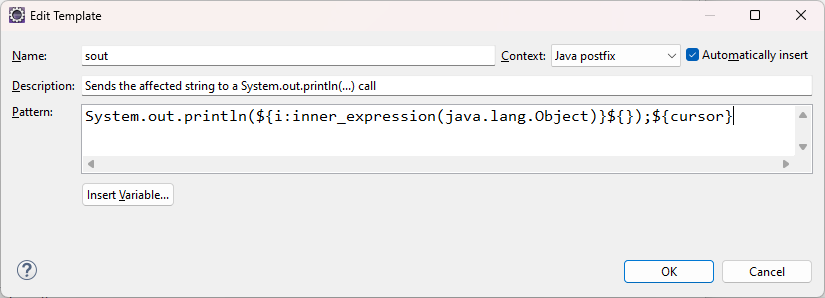
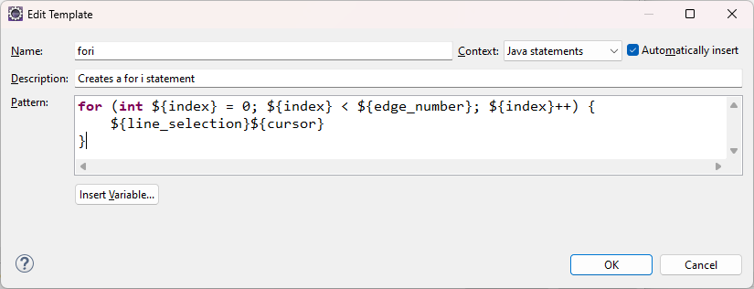

# Note

## Java基础

- 文件夹名称一律用小驼峰，并且单个单词的文件夹名称一律用单数形式
- 变量命名：变量名+变量类型，这样可以快速知道变量属于什么类型，并且不用输入那么多字母就弹出来代码补全了，省的都是时间啊
- 用来存储对象的变量称为引用变量。
- 方法名有final修饰，表示此方法是终结方法，不能被子类重写。
- 可变长参数在一个方法中最多只能有一个，并且必须放在最后。
- Java编译器自动引入java.lang。
- 内存回收：调用`System.gc()`，一般不会手动调用此方法；
- `方法的签名`（signature）: 要完整地描述一个方法，需要指出`方法名`以及`参数类型`
    - 返回类型不是方法签名的一部分。也就是说， 不能有两个名字相同、参数顺序和类型也相同，但是返回不同类型值的方法。
- VO（View Object）：视图对象，前端和控制层之间的数据传输对象。
- DTO（Data Transfer Object）：数据传输对象，控制层与服务层之间的数据传输对象。
- DO（Domain Object）：领域对象，就是从现实世界中抽象出来的有形或无形的业务实体。
- PO（Persistent Object）：持久化对象，它跟持久层（通常是关系型数据库）的数据结构形成一一对应的映射关系
    - 如果持久层是关系型数据库，那么，数据表中的每个字段（或若干个）就对应PO的一个（或若干个）属性。
- 不用public、protected、private修饰的字段和方法就是包作用域。位于同一个包的类，可以访问包作用域的字段和方法。

### JDK

- `JRE` 是 Java 运行时环境
    - 它是运行已编译 Java 程序所需的所有内容的集合，包括 Java 虚拟机（JVM），Java 类库，java 命令和其他的一些基础构件。
    - 但是，它不能用于创建新程序。
- `JDK` 是 Java Development Kit 缩写，它是功能齐全的 Java SDK。
    - 它拥有 JRE 所拥有的一切
    - 还有编译器（javac）和工具（如 javadoc 和 jdb）。
    - 它能够创建和编译程序。

#### 1.windows安装jdk

- 1.下载jdk压缩包xxx.zip，解压到指定目录（解压后bin文件夹所在目录为jdk根目录，假设为`D:\jdk\xxx`）
- 2.新增环境变量`JAVA_HOME：D:\jdk\xxx`
- 3.`Path`中添加：`%JAVA_HOME%\bin`

#### 2.linux安装jdk

- 1.下载jdk压缩包xxx.tar.gz，解压到指定目录

```sh
# 新建目录
mkdir -p 指定目录

tar -zxvf xxx.tar.gz -C 指定目录
```

- 2.设置环境变量（解压后bin文件夹所在目录为jdk根目录，假设为`/usr/local/jdk/xxx`）

```sh
# 1.先备份profile文件
cp /etc/profile /etc/profile.bk

# 2.编辑profile文件
vi /etc/profile

# 3.在profile文件末尾添加
export JAVA_HOME=/usr/local/jdk/xxx
export PATH=$PATH:${JAVA_HOME}/bin
```

- 3.重新加载配置文件

```sh
source /etc/profile
```

- 4.测试

```sh
java -version
```

### Java源文件

- 若将多个类的声明放在一个文档中，只能有一个类声明为公有类。

```java
public class A {}

class B {}
```

- Java源文件名必须与文档中公有类名一致（区分大小写）

```java
// 文件名必须为 A.java
public class A {}

class B {}
```

### 二进制知识

#### 原码、反码、补码

- 原码：正数，它的绝对值转换成的二进制数；负数，它的绝对值转换成的二进制数，然后最高位置1

- 反码：正数的反码与原码相同；负数的反码为其原码`除符号位`外`按位取反`

- 补码：正数的补码与原码相同；负数的补码为其反码加1

- 正数的二进制数为其原码，负数的二进制数为其补码

```java
// 原码 10000000 00000000 00000000 00000010
// 反码 11111111 11111111 11111111 11111101
// 补码 11111111 11111111 11111111 11111110
String b = Integer.toBinaryString(-2); 
```

#### 进制转换

- 8位二进制为一个字节，范围值从0B00000000～0B11111111，程序中用十六进制表示的时候就是从0X00到0XFF

- 二进制4位一组，遵循8,4,2,1的规律比如 1111，那么从最高位开始算，数字大小是`8 * 1 + 4 * 1 + 2 * 1 + 1 * 1` = 15，那么十进制就是15，十六进制就是0XF。

- 二进制转十六进制的时候，十六进制一位刚好是和二进制4位相互对应的。8位二进制为一个字节，对应十六进制2位。

- Java中，byte、short、int、long分别占1、2、4、8个字节，char占2个字节

#### 十进制转其它进制

```java
int a = 10;
// 二进制   1010
System.out.println(Integer.toBinaryString(a)); 
// 八进制   12
System.out.println(Integer.toOctalString(a));  
// 十六进制 a
System.out.println(Integer.toHexString(a));    
```

#### byte[] 和十六进制字符串互转

- Java 8及以前版本，String用char数组存储，每个char元素2字节，转换的实质为一个1字节的byte元素，转换为一个2字节的char元素
- Java 9之后，String用byte数组存储，转换的实质为一个1字节的byte元素，转换为一个1字节的byte元素

##### 用Java自带方法转换

```java
byte[] datas = {15, 15};
// 00001111 00001111，（0x0f0f) 结果为f0f（byte数组首个元素高4位为0，被去掉了) 
String hexString = new BigInteger(1, datas).toString(16);
```

##### 引入第三方库转换

```xml
<dependency>
    <groupId>commons-codec</groupId>
    <artifactId>commons-codec</artifactId>
    <version>1.14</version>
</dependency>
```

```java
byte[] datas = {15, 15};
// byte[] 转 16进制字符串
// 0f0f，当byte数组首个元素高4位为0时也会保留
String hexString = Hex.encodeHexString(datas);

// 16进制字符串 转 byte[]
byte[] datas = Hex.decodeHex(hexString);
```

- Hex.encodeHexString 底层代码剖析

```java
public String encodeHexString(final byte[] data) {
    char[] DIGITS_UPPER = {'0', '1', '2', '3', '4', '5', '6', '7', '8', '9', 'A', 'B', 'C', 'D', 'E', 'F'};
    final int outlength = data.length;
    // 一个字节用两位16进制表示，out长度为data长度乘以2
    final char[] out = new char[outlength << 1];
    for (int i = 0, j = 0; i < outlength; i++) {
    // 取高4位，无符号右移四位，得到16进制高位
    // 0x41 = 0100 0001
    // 0xF0 = 1111 0000
    // 0x40 = 0100 0000
    // 0x04 = 0000 0100
    // 相当于 out[j++] = DIGITS_UPPER[data[i] / 16];
    out[j++] = DIGITS_UPPER[(0xF0 & data[i]) >>> 4];
    // 直接取低4位，得到16进制低位
    // 0x41 = 0100 0001
    // 0x0F = 0000 1111
    // 0x01 = 0000 0001 = 1
    // 相当于 out[j++] = DIGITS_UPPER[data[i] % 16];
    out[j++] = DIGITS_UPPER[0x0F & data[i]];
    }
    return new String(out);
}
```

#### 移位运算

对byte和short类型进行移位时，会首先转换为int再进行位移

- 左移`<<`，最低位补0，十进制数m左移n位相当于m乘以2的n次方

```java
int m = 1;       // 00000000 00000000 00000000 00000001 = 1
int r = m << 1;  // 00000000 00000000 00000000 00000010 = 2
```

- 右移`>>`，最高位补0，十进制数m右移n位相当于m除以2的n次方

```java
int m = 2;       // 00000000 00000000 00000000 00000010 = 2
int r = m >> 1;  // 00000000 00000000 00000000 00000001 = 1
```

- 无符号右移`>>>`，高位总是补0，注意，`没有无符号左移`！

```java
int m = -2;        // 11111111 11111111 11111111 11111110 = -2
int r = m >>> 1;   // 01111111 11111111 11111111 11111111 = 2147483647
```

#### 位运算

位运算是按位进行与（&）、或（|）、非（!）和异或（~，异或运算的规则是，如果两个数不同，结果为1，否则为0）的运算

### 运算优先级

在Java的计算表达式中，运算优先级从高到低依次是：

- `()`
- `! ~ ++ --`
- `* / %`
- `+ -`
- `<< >> >>>`
- `&`
- `|`
- `+= -= *= /=`

### `==`比较运算符

- 基本数据类型，`==`比较的是`值`

```java
Assertions.assertTrue(3 == 3);
```

- 复合数据类型，`==`比较的是`地址`

```java
String a = new String("handle");
String b = new String("handle");
Assertions.assertFalse(a == b);
```

- 复合数据类型，`equals`在没有覆写的情况下，比较的也是`地址`

```java
@Getter
@Setter
@ToString
@AllArgsConstructor
public class User {
  private String name;
}

User a = new User("handle");
User b = new User("handle");
Assertions.assertFalse(a == b);
```

### 继承

- 继承写法：子类名 extends 父类名；子类名 implements 父接口名；子接口名 extends 父接口名。

- 子类自动获得父类的所有字段，严禁定义与父类重名的字段

- 子类不能继承父类的静态属性，但可以对父类静态属性操作

- 子类能不能访问父类字段要看父类字段的访问修饰符

- 任何class的构造方法，第一行语句必须是调用父类的构造方法。如果没有明确地调用父类的构造方法，编译器会帮我们自动加一句super();

- 从Java 15开始，允许使用sealed修饰class，并通过permits明确写出能够从该class继承的子类名称

- 如果一个父类的方法本身不需要实现任何功能，仅仅是为了定义方法签名，目的是让子类去覆写它，那么，可以把父类的方法声明为抽象方法；
    - 因为这个抽象方法本身是无法执行的，所以，父类也无法被实例化，因而这个父类也必须申明为抽象类

- 如果一个抽象类没有字段，所有方法全部都是抽象方法，就可以把该抽象类改写为接口

#### 继承关系判断

```java
// 判断实例是否为某个类型：（子）实例 instanceof （父）类型
Assertions.assertTrue("handle" instanceof Object);

  // 判断能子类型能否向上转型：父类型类实例.isAssignableFrom(子类型类实例);
Assertions.assertTrue(Object.class.isAssignableFrom(Integer.class));
```

- 从Java 14开始，判断instanceof后，可以直接转型为指定变量，避免再次强制转型。

```java
 Object object = "hello";
if (object instanceof String s) {
    // 可以直接使用变量s:
    System.out.println(s.toUpperCase());
}
```

### 定义常量

```java
public class C() {
    // 定义类常量
    private final double PI =3.14;

    // 定义局部常量
    public void fun() {
        final double PI =3.14;
    }
}
```

### 静态方法中获取所在类实例

```java
Class clazz = MethodHandles.lookup().lookupClass();
```

### 打印对象内存地址

```java
Object object = new Object();
// 方法1，推荐
String hexAddress1 = Integer.toHexString(System.identityHashCode(object));

// 方法2，前提是没有重写toString()
String hexAddress2 = object.toString().substring(object.toString().indexOf("@") + 1);
```

### 文件复制

```java
try (InputStream inputStream = Application.class.getClassLoader().getResourceAsStream(fileName);
    BufferedInputStream in = new BufferedInputStream(inputStream);
    BufferedOutputStream out = new BufferedOutputStream(new FileOutputStream(outputFileName));) {
    int length = 0;
    byte[] buffer = new byte[1024];
    while (-1 != (length = in.read(buffer))) {
        out.write(buffer, 0, length);
    }
}
```

### Java数据类型

#### BigDecimal

- 防止精度丢失，更推荐使用`new BigDecimal(String val)`构造方法来创建对象；
- `BigDecimal.valueOf(double val)`静态方法创建对象，当数值有效位数很多的时候，会有科学计数的精度问题。
- 等值比较应该用compareTo()方法，而不是equals()方法；因为equals()方法会比较值和精度，而compareTo()方法比较的时候会忽略精度

- RoundingMode.HALF_UP，四舍五入，在大量运算时，结果偏向大数，使得误差产生积累进而产生系统误差

- RoundingMode.HALF_EVEN，四舍六入五成双，在大量运算时，它使舍入后的结果误差的均值趋于零
    - 小于等于4时舍去（1.1->1，-1.1->-1）
    - 大于等于6时进1（1.6->2，-1.6->-2）
    - 等于5时
        - 如果5后面还有数
            - 并且为0，舍去（2.50->2，-2.50->-2）
            - 并且不为0，进1（2.51->3，-2.51->-3）
        - 如果5后面没有数
            - 5前面为奇数，进1（5.5->6，-5.5->-6）
            - 5前面为偶数，舍去（2.5->2，-2.5->-2）

- 除法计算要指定结果精度

```java
BigDecimal b1 = new BigDecimal("2.0");
BigDecimal b2 = new BigDecimal("0.3");
// 结果四舍五入，保留3位小数
BigDecimal result = b1.divide(b2, 3, RoundingMode.HALF_UP);
Assertions.assertEquals("6.667", result.toString());
```

#### 枚举

- 枚举:所有的枚举类型都是`Enum`类的子类。在比较两个枚举类型的值时， 永远不需要调用equals, 而直接使用`==`。
- 如果需要的话， 可以在枚举类型中添加一些构造器、方法和域
- 构造器默认是`private`，只在构造枚举常量的时候被调用

```java
@Getter
public enum ColorEnum {
    RED("red"), GREEN("green"), BLUE("blue");

    private String value;

    private ColorEnum(String value) {
        this.value = value;
    }
}
```

#### 泛型

##### 定义和使用泛型

```java
public class ClassName<T> {
    private T field;

    public T getField() {
        return field;
    }
}
```

- 定义泛型方法
  
```java
public class ClassName {
    public <T> T function(T t) {
        return t;
    }
}
```

- 定义泛型类的对象
  
```java
泛型类名<具体类型> object = new 泛型类名<具体类型>();
```

##### 通配符类型(wildcard type)

- 在Java库中， 使用变量E表示集合的元素类型
- K和V分别表示表的关键字与值的类型
- T(需要时还可以用临近的字母U和S)表示“任意类型”

##### 类型变量的限定（子类型限定）

- `<T extends SupperType>`，表示T应该是绑定类型的子类型，T和绑定类型可以是类，也可以是接口

- 一个类型变量或通配符可以有多个限定，限定类型用`&`分隔，而逗号用来分隔类型变量。例如：`T extends Comparable & Serializable`

- 在Java的继承中，可以根据需要拥有多个接口超类型，但限定中至多有一个类
- 如果用一个类作为限定，它必须是限定列表中的第一个
- 为了提高效率，应该将标签接口（即没有方法的接口）放在边界列表的末尾

##### 通配符的超类型限定

- `<? super BoundingType>`，表示这个通配符限制为绑定类型的所有超类型。

- 直观地讲，带有超类型限定的通配符可以向泛型对象写入，带有子类型限定的通配符可以从泛型对象读取。

##### 无限定通配符<?>

#### 数组

##### Arrays.toString()

- 不用for循环快速打印一维数组

```java
Integer[] array = new Integer[]{1, 2, 3};
// [1, 2, 3]
System.out.println(Arrays.toString(array));
```

##### Arrays.deepToString()

- 不用for循环快速打印多维数组

```java
Integer[][] array = new Integer[][]{{1, 2, 3}, {4, 5, 6}};
System.out.println(Arrays.deepToString(array));
```

##### Arrays.sort()

- 数组排序

```java
Integer[] array = new Integer[]{1, 3, 2};
Arrays.sort(array);
// [1, 2, 3]
System.out.println(Arrays.toString(array));
```

#### List

- 定义集合类型的变量时，应该尽可能地使用接口类型，而不要使用具体的实现类型。

```java
List<Integer> list = ArrayList<Integer>;
```

- 以集合作为参数的任何方法，参数应该尽可能地使用接口类型，而不要使用具体的实现类型。

```java
// 推荐
public void function(List<Integer> list) {}

// 不推荐
public void function(ArrayList<Integer> list) {}
```

- 生成List

```java
// List.of生成
List<Integer> list = List.of(1, 2, 3);

// Stream.of生成
List<Integer> list = Stream.of(1, 2, 3).toList();

// IntStream.rangeClosed生成
List<Integer> list = IntStream.rangeClosed(1, 3).boxed().toList();

// Stream.iterate：依次生成一系列值
List<Integer> list = Stream.iterate(0, n -> n + 1)
    .limit(3)
    .collect(Collectors.toList());
```

#### 队列

- 队列的方法

|操作|throw Exception|返回false或null|
|:-|:-|:-|
|添加元素到队尾| add(E e)| boolean offer(E e)|
|取队首元素并删除| E remove()| E poll()|
|取队首元素但不删除| E element()| E peek()|

注意：不要把null添加到队列中，否则poll()方法返回null时，很难确定是取到了null元素还是队列为空

- LinkedList

LinkedList即实现了List接口，又实现了Queue接口，但是，在使用的时候，如果我们把它当作List，就获取List的引用，如果我们把它当作Queue，就获取Queue的引用

```java
// 这是一个List:
List<String> list = new LinkedList<>();
// 这是一个Queue:
Queue<String> queue = new LinkedList<>();
```

#### 双端队列

|操作|Queue|Deque|
|:-|:-|:-|
|添加元素到队尾| add(E e) / offer(E e) |addLast(E e) / offerLast(E e)|
|取队首元素并删除| E remove() / E poll() |E removeFirst() / E pollFirst()|
|取队首元素但不删除| E element() / E peek() |E getFirst() / E peekFirst()|
|添加元素到队首| 无 |addFirst(E e) / offerFirst(E e)|
|取队尾元素并删除| 无 |E removeLast() / E pollLast()|
|取队尾元素但不删除| 无 |E getLast() / E peekLast()|

注意：Deque接口实际上扩展自Queue，因此，Queue提供的add()/offer()方法在Deque中也可以使用，但是，使用Deque，推荐总是明确调用offerLast()/offerFirst()或者pollFirst()/pollLast()方法，这样更加顾名思义。

Deque是一个接口，它的实现类有ArrayDeque和LinkedList。

```java
// 推荐用ArrayDeque
Deque<Integer> deque = new ArrayDeque<>();
Deque<String> deque = new LinkedList<>();
```

#### 栈

用Deque可以实现栈的功能，注意只调用push()/pop()/peek()方法，避免调用Deque的其他方法

|操作|Deque|
|:-|:-|
|入栈|push(E)/addFirst(E)|
|出栈|pop()/removeFirst()|
|取栈顶元素但不弹出|peek()/peekFirst()|

#### Map

Stream的Collectors.toMap当value为null时会抛异常，解决办法：使用collect，直接调用map中的put()方法

```java
List<String> list = Arrays.asList("张三", "李四", "王五", null);
Map<String, String> hashMap = list.stream().collect(HashMap::new, (map, item) -> map.put(item, item), HashMap::putAll);
// {null=null, 李四=李四, 张三=张三, 王五=王五}
System.out.println(hashMap);
```

#### TreeMap

TreeMap以Key的顺序来进行排序，TreeMap的Key必须实现Comparable接口，如果作为Key的class没有实现Comparable接口，那么，必须在创建TreeMap时同时指定一个自定义排序算法

```java
Map<Integer, String> map = new TreeMap<>();
map.put(6, "赵六");
map.put(3, "张三");
map.put(5, "王五");
map.put(4, "李四");
List<String> sortNames = new ArrayList<>(map.values());
// [张三, 李四, 王五, 赵六]
System.out.println(sortNames);
```

#### Concurrent 集合

| interface | non-thread-safe         | thread-safe                              |
|:--------- |:----------------------- |:---------------------------------------- |
| List      | ArrayList               | CopyOnWriteArrayList                     |
| Map       | HashMap                 | ConcurrentHashMap                        |
| Set       | HashSet / TreeSet       | CopyOnWriteArraySet                      |
| Queue     | ArrayDeque / LinkedList | ArrayBlockingQueue / LinkedBlockingQueue |
| Deque     | ArrayDeque / LinkedList | LinkedBlockingDeque                      |

使用这些并发集合与使用非线程安全的集合类完全相同。以`ConcurrentHashMap`为例：

```java
Map<String, String> map = new ConcurrentHashMap<>();
// 在不同的线程读写:
map.put("A", "1");
map.put("B", "2");
String a = map.get("A");
```

`java.util.Collections`工具类还提供了一个旧的线程安全集合转换器，可以这么用：

```java
Map unsafeMap = new HashMap();
Map safeMap = Collections.synchronizedMap(unsafeMap);
```

但是它实际上是用一个包装类包装了非线程安全的`Map`，然后对所有读写方法都用`synchronized`加锁，这样获得的线程安全集合的性能比`java.util.concurrent`集合要低很多，所以不推荐使用。

#### 日期/时间

##### Timestamp

- 创建Timestamp

```java
Timestamp timestamp = Timestamp.from(Instant.now());
```

##### OffsetDateTime

- 某一时刻的值，具有不变性，用来做持久化和网络传输

- 简单理解为OffsetDateTime = LocalDateTime + ZoneOffset

- ZoneOffset可以看作偏移量，正负18

- 创建OffsetDateTime

```java
OffsetDateTime offsetDateTime = OffsetDateTime.now();

OffsetDateTime offsetDateTime = ZonedDateTime.now().toOffsetDateTime();
```

##### ZonedDateTime

- 用来做显示

- 简单理解为ZonedDateTime = LocalDateTime + ZoneId

- ZoneId确定了偏移量如何改变的规则（比如由于夏令时的存在，同一个地点（ZoneOffset），同一个时间，在不同日期的显示的结果是不一样的，用OffsetDateTime来显示是不对的）

- 创建ZonedDateTime

```java
ZonedDateTime zonedDateTime = ZonedDateTime.now();

ZonedDateTime zonedDateTime = OffsetDateTime.now().toZonedDateTime();

// 显示为中国北京时间
zonedDateTime = zonedDateTime.withZoneSameInstant(ZoneId.of("Asia/Shanghai"));
```

### 多线程

#### CountDownLatch

一个同步辅助类，在完成一组正在其它线程中执行的操作之前，它允许一个或多个线程一直等待

```java
/**
 * 模拟场景：所有学生离开教室后，班长才能锁门
 */
@Test
public void test() {
    int counter = 5;

    // 1.创建CountDownLatch，设置计数值
    CountDownLatch countDownLatch = new CountDownLatch(counter);

    for (int i = 0; i < counter; i++) {
        new Thread(() -> {
            System.out.println(Thread.currentThread().getName() + " 号学生离开教室");
            // 2.CountDownLatch计数值减一
            countDownLatch.countDown();
        }, String.valueOf(i)).start();
    }

    try {
        // 3.等待直到CountDownLatch计数值为0
        countDownLatch.await();
    } catch (InterruptedException e) {
        e.printStackTrace();
    }
    System.out.println(Thread.currentThread().getName() + " 所有学生离开教室，班长锁门");
}
```

#### CyclicBarrier

一个同步辅助类，它允许一组线程互相等待，直到到达某个公共屏障点

```java
/**
 * 模拟场景：收集七颗龙珠才能召唤神龙
 */
@Test
public void test() {
    int counter = 7;
    // 创建CyclicBarrier，指定目标障碍数，并且指定目标障碍数达到后做什么
    CyclicBarrier cyclicBarrier = new CyclicBarrier(counter, () -> {
        System.out.println("集齐七颗龙珠，召唤神龙");
    });

    for (int i = 0; i < counter; i++) {
        new Thread(() -> {
            System.out.println(Thread.currentThread().getName() + " 星龙珠已收集");
            try {
                // 等待
                cyclicBarrier.await();
            } catch (InterruptedException | BrokenBarrierException e) {
                e.printStackTrace();
            }
        }, String.valueOf(i)).start();
    }
}
```

#### Semaphore

一个计数信号量。

```java
/**
 * 模拟场景：6辆车，停3个车位
 */
@Test
public void test() {
    int counter = 3;
    // 1.创建Semaphore，指定许可数
    Semaphore semaphore = new Semaphore(counter);

    for (int i = 0; i < 6; i++) {
        new Thread(() -> {
            try {
                // 2.获取许可（抢占车位）
                semaphore.acquire();
                System.out.println(Thread.currentThread().getName() + " 车抢到车位");
                
                // 设置随机停车时间
                TimeUnit.MILLISECONDS.sleep((long) Math.random()* 100);
                
                System.out.println(Thread.currentThread().getName() + " --车离开车位--");
            } catch (InterruptedException e) {
                e.printStackTrace();
            } finally {
                // 3.释放许可
                semaphore.release();
            }
        }, String.valueOf(i)).start();
    }
}
```

#### FutureTask

```java
// Thread构造方法只能传Runnable，Runnable的run()方法无返回值
// 因为FutureTask实现了RunnableFuture（RunnableFuture扩展了Runnable）
// 并且FutureTask的构造方法可以传Callable，Callable的call()方法有返回值
// 因此可以用Thread的构造方法传FutureTask，FutureTask的构造方法传Callable，调用FutureTask的get()方法实现结果返回
FutureTask<String> futureTask = new FutureTask<String>(() -> "hello world");
new Thread(futureTask).start();
try {
    System.out.println(futureTask.get());
} catch (InterruptedException | ExecutionException e) {
    e.printStackTrace();
}
```

#### CompletableFuture

- `xxx()`：表示该方法将继续在已有的线程中执行；
- `xxxAsync()`：表示将异步在线程池中执行。
- `xxx()`有对应的异步方法`xxxAsync()`
- 通常而言，名称中不带Async 的方法和它的前一个任务一样，在同一个线程中运行
- CompletableFuture的静态工厂方法

- CompletableFuture的静态方法

| 方法名                                                    | 描述                                            |
|:------------------------------------------------------ |:--------------------------------------------- |
| runAsync(Runnable runnable)                            | 使用ForkJoinPool.commonPool()作为它的线程池执行异步代码，无返回值 |
| runAsync(Runnable runnable, Executor executor)         | 使用指定的thread pool执行异步代码，无返回值                   |
| supplyAsync(`Supplier<U>` supplier)                    | 使用ForkJoinPool.commonPool()作为它的线程池执行异步代码，有返回值 |
| supplyAsync(`Supplier<U>` supplier, Executor executor) | 使用指定的thread pool执行异步代码，有返回值                   |

- CompletableFuture的实例方法

| 方法名                                 | 描述                                                                        |
|:----------------------------------- |:------------------------------------------------------------------------- |
| exceptionally                       | 执行异步代码发生异常时执行                                                             |
| whenComplete                        | future完成或异常时执行                                                            |
| handle                              | 如果在链式调用的时候抛出异常，则可以在最后使用handle来接收                                          |
| thenRun                             | 无返回值的future执行成功后执行                                                        |
| thenAccept                          | 有返回值的future执行成功后执行                                                        |
| runAfterBoth                        | 等待两个无返回值的future完成，然后执行                                                    |
| thenAcceptBoth                      | 等待两个有返回值的future完成，然后执行                                                    |
| thenCompose                         | step1.thenCompose() 将 step1 的结果作为输入，对两个异步操作进行流水线，返回新的CompletableFuture，阻塞 |
| thenApply                           | step1.thenApply() 将 step1 的结果作为输入，同一个CompletableFuture，不阻塞                |
| thenCombine                         | 两个有返回值的future完成，然后合并其结果                                                   |
| join                                | 获取future返回结果，阻塞                                                           |
| acceptEither                        | 两个future任意一个执行完毕，无返回值                                                     |
| applyToEither                       | 两个future任意一个执行完毕，有返回值                                                     |
| runAfterEither                      | 两个future任意一个执行完毕，无返回值                                                     |
| allOf                               | 等待所有future都执行完毕，无返回值                                                      |
| anyOf                               | 任意个future只要一个成功，返回值类型为Object                                              |
| complete(T t)                       | 完成异步执行，并返回future的结果                                                       |
| completeExceptionally(Throwable ex) | 抛出future执行异常                                                              |

#### ForkJoin

```java
class AaccumulateTask extends RecursiveTask<Integer> {
    // 设置拆分阈值，只要大于阈值，就继续拆分
    private static final int THRESHOLD = 10;

    // 拆分开始值
    private int beginValue;

    // 拆分结束值
    private int endValue;

    // 计算结果
    private int result;

    public AaccumulateTask(int beginValue, int endValue) {
        this.beginValue = beginValue;
        this.endValue = endValue;
    }

    @Override
    protected Integer compute() {
        if ((endValue - beginValue) <= THRESHOLD) {
            for (int i = beginValue; i <= endValue; i++) {
            result += i;
            }
        } else {
            int middleValue = (beginValue + endValue) / 2;
            // 拆分左边
            AaccumulateTask leftTask = new AaccumulateTask(beginValue, middleValue);
            // 拆分右边
            AaccumulateTask rightTask = new AaccumulateTask(middleValue + 1, endValue);

            leftTask.fork();
            rightTask.fork();

            // 合并结果
            result = leftTask.join() + rightTask.join();
        }
        return result;
    }
 
}
public class ForiJoinDemoTest {
    /**
     * 计算从0加到100的和 
     */
    @Test
    public void test() {
        try(ForkJoinPool forkJoinPool = new ForkJoinPool()) {
            ForkJoinTask<Integer> forkJoinTask = forkJoinPool.submit(new AaccumulateTask(0, 100));;
            Integer result = forkJoinTask.get();
            System.out.println(result);
        } catch (InterruptedException | ExecutionException e) {
            e.printStackTrace();
        }
    }
}
```

#### 线程池

- 处理器核的数目：cpuNumbers = Runtime.getRuntime().availableProcessors();
- CPU利用率：cpuUsage = (0, 1]
- 等待时间：waitTime
- 计算时间：computeTime
- 建议线程池大小：`threadSize = cpuNumbers * cpuUsage * (1 + waitTime / computeTime)`
- 建议设置线程大小上限：maxThreadSize = 100

##### 自定义线程池

```java
// 1.常驻线程数量
int corePoolSize = Runtime.getRuntime().availableProcessors();
// 2.最大线程数量
int maximumPoolSize = 100;
// 3.非常驻线程空闲时存活时间
long keepAliveTime = 15;
// 4.时间单位
TimeUnit unit = TimeUnit.SECONDS;
// 5.阻塞队列
// 常驻线程都在执行任务了，这时候再添加的任务，就会放到阻塞队列等待执行；
// 如果阻塞队列也满了，这时候再添加的任务，就会创建新的线程去处理任务；
// 如果这时候达到了最大线程数，就会走拒绝策略了
BlockingQueue<Runnable> workQueue = new ArrayBlockingQueue<>(corePoolSize);
// 6.线程工厂,一般用默认即可
ThreadFactory threadFactory = Executors.defaultThreadFactory();
// 7.拒绝策略，正在执行的线程数量达到了最大线程数，并且阻塞队列也满了，这时候再添加任务，就会走拒绝策略了
// 四种拒绝策略：AbortPolicy 抛异常拒绝处理新任务（默认策略）；CallerRunsPolicy哪个线程提交的任务由哪个线程处理，如果该线程已经结束则丢弃该任务；
// DiscardPolicy 不做处理，丢弃新任务；DiscardOldestPolicy丢弃阻塞队列里面等待时间最长的任务
RejectedExecutionHandler handler = new ThreadPoolExecutor.AbortPolicy();

try (
// 创建自定义线程池
ThreadPoolExecutor executorService = 
    new ThreadPoolExecutor(corePoolSize, maximumPoolSize, keepAliveTime, unit, workQueue, threadFactory, handler)) {
    
for (int i = 0; i < 20; i++) {
    int count = i;
    // 任务提交到线程池执行
    executorService.submit(() -> {
        System.out.println(Thread.currentThread().getName() + " 执行了任务" + count);
    });
    }
}
```

##### 优雅关闭线程池

```java
void shutdownAndAwaitTermination(ExecutorService pool) {
    // Disable new tasks from being submitted
    pool.shutdown();
    try {
        // Wait a while for existing tasks to terminate
        if (!pool.awaitTermination(60, TimeUnit.SECONDS)) {
            // Cancel currently executing tasks
            pool.shutdownNow();
            // Wait a while for tasks to respond to being cancelled
            if (!pool.awaitTermination(60, TimeUnit.SECONDS)) {
                log.warn("Pool did not terminate");
            }
        }
    } catch (InterruptedException ex) {
        // (Re-)Cancel if current thread also interrupted
        pool.shutdownNow();
        // Preserve interrupt status
        Thread.currentThread().interrupt();
    }
}
```

##### 线程池处理异常

- executorService.execute默认不会吞掉异常

- executorService.submit默认会吞掉异常，如果发生了异常，调用future.get时会抛出异常

- 因此可以在创建线程池的时候重写afterExecute方法，手动调用future.get来达到executorService无论调用哪个方法执行线程，都默认抛出异常的效果

```java
ThreadPoolExecutor executorService =
    new ThreadPoolExecutor(12, 24, 30, TimeUnit.SECONDS, new ArrayBlockingQueue<>(12), Executors.defaultThreadFactory(),
    new ThreadPoolExecutor.AbortPolicy()) {
    // 这个方法只对executor.submit和executor.execute方法的异常处理有效
    // 如果是用CompletableFuture执行，还是需要定义它的exceptionally或whenComplete打印异常日志
    // 不然如果不调用future.get()异常还是会丢失
    @Override
    public void afterExecute(Runnable runnable, Throwable throwable) {
        super.afterExecute(runnable, throwable);
        if (Objects.isNull(throwable) && runnable instanceof Future<?> future && future.isDone()) {
            try {
                // 如果发生了异常，调用future.get时会抛出异常
                future.get();
            } catch (CancellationException cancellationException) {
                throwable = cancellationException;
            } catch (ExecutionException executionException) {
                throwable = executionException.getCause();
            } catch (InterruptedException interruptedException) {
                Thread.currentThread().interrupt();
            }
        }
        if (throwable != null) {
            log.error(Thread.currentThread().getName() + " execute error", throwable);
        }
    }
};
```

##### 虚拟线程池

```java
@Test
public void test() {
    ExecutorService executor = Executors.newVirtualThreadPerTaskExecutor();
    executor.execute(() -> System.out.println("hello virtual thread"));
    executor.execute(() -> System.out.println(Thread.currentThread().isVirtual()));
    executor.close();
}
```

##### Spring的线程池

- 自带优雅关闭线程池的骚操作

###### ThreadPoolTaskExecutor

- 自定义线程池配置

```yaml
thread:
    pool:
        task:
            executor:
                corePoolSize: 6
                maxPoolSize: 12
                queueCapacity: 18
```

- 读取配置并注入ThreadPoolTaskExecutor

```java
@Slf4j
@Setter
@ConfigurationProperties("thread.pool.task.executor")
@Configuration
public class ThreadPoolConfiguration {
    private int corePoolSize;

    private int maxPoolSize;

    private int queueCapacity;

    @Bean
    public ThreadPoolTaskExecutor threadPoolTaskExecutor() {
        ThreadPoolTaskExecutor threadPoolTaskExecutor = new ThreadPoolTaskExecutor() {
            // 这个方法只对executor.submit和executor.execute方法的异常处理有效
            // 如果是用CompletableFuture执行，还是需要定义它的exceptionally或whenComplete打印异常日志
            // 不然如果不调用future.get()异常还是会丢失
            @Override
            public void afterExecute(Runnable runnable, Throwable throwable) {
                super.afterExecute(runnable, throwable);
                if (Objects.isNull(throwable) && runnable instanceof Future<?> future && future.isDone()) {
                    try {
                        // 如果发生了异常，调用future.get时会抛出异常
                        future.get();
                    } catch (CancellationException cancellationException) {
                        throwable = cancellationException;
                    } catch (ExecutionException executionException) {
                        throwable = executionException.getCause();
                    } catch (InterruptedException interruptedException) {
                        Thread.currentThread().interrupt();
                    }
                }
                if (throwable != null) {
                    log.error(Thread.currentThread().getName() + " execute error", throwable);
                }
            }
        };
        threadPoolTaskExecutor.setCorePoolSize(corePoolSize);
        threadPoolTaskExecutor.setMaxPoolSize(maxPoolSize);
        threadPoolTaskExecutor.setQueueCapacity(queueCapacity);
        return threadPoolTaskExecutor;
    }
}
```

- 使用demo

```java
@Slf4j
@SpringBootTest
public class ApplicationTest {
    @Resource
    private ThreadPoolTaskExecutor executor;

    @Test
    public void test() {
        // 需要定义exceptionally或whenComplete打印异常日志，不然如果不调用future.get()异常还是会丢失
        CompletableFuture<String> future = CompletableFuture.supplyAsync(() -> {
            System.out.println(Thread.currentThread().getName() + " 线程执行了");
            int a = 1/0;
            return "hello ThreadPoolTaskExecutor";
        }, executor);
        // future.exceptionally((exception) -> {
        //     log.error("error", exception);
        //     // 经测试如果不抛异常而是设置一个返回值，future.get()也会抛出异常
        //     // throw new RuntimeException(exception);
        //     return "333";
        // });
        future.whenComplete((result, exception) -> {
            if (Objects.nonNull(exception)) {
                log.error("error", exception);
            }
        });
        // future.get();

        executor.submit(() -> {
            int i = 1/0;
        });
        executor.execute(() -> {
            int i = 1/0;
        });
    }
}
```

###### SimpleAsyncTaskExecutor  

- 创建虚拟线程池

```java
@Bean
public SimpleAsyncTaskExecutor simpleAsyncTaskExecutor() {
    SimpleAsyncTaskExecutor simpleAsyncTaskExecutor = new SimpleAsyncTaskExecutor();
    simpleAsyncTaskExecutor.setVirtualThreads(true);
    return simpleAsyncTaskExecutor;
}

@Resource
private SimpleAsyncTaskExecutor simpleAsyncTaskExecutor;

@Test
public void test() {
    simpleAsyncTaskExecutor.execute(() -> System.out.println("hello virtual thread"));
    simpleAsyncTaskExecutor.execute(() -> System.out.println(Thread.currentThread().isVirtual()));
}
```

#### ThreadLocal

- ThreadLocal在本线程中定义、更新、删除，缺点：数据不共享

```java
ThreadLocal<Integer> threadLocal = ThreadLocal.withInitial(() -> 0);
try {
    // 业务逻辑
    threadLocal.set(threadLocal.get() + 1);
} finally {
    threadLocal.remove();
}
```

- InheritableThreadLocal，在父线程中定义，子线程可以获取到，缺点：使用线程池会有问题，父线程更新值后，子线程获取不到更新值

```java
InheritableThreadLocal<Integer> inheritableThreadLocal = new InheritableThreadLocal<>();
// threadLocal.set(1);

// 创建线程池
ExecutorService threadPool = Executors.newSingleThreadExecutor();

// 使用
// 第一次设置inheritableThreadLocal
inheritableThreadLocal.set(1);

threadPool.execute(() -> {
    System.out.println("第一次获取inheritableThreadLocal：" + inheritableThreadLocal.get());
});

TimeUnit.SECONDS.sleep(1);

// 第二次设置inheritableThreadLocal
inheritableThreadLocal.set(inheritableThreadLocal.get() + 1);

threadPool.execute(() -> {
    System.out.println("第二次获取inheritableThreadLocal：" + inheritableThreadLocal.get());
});
```

- TransmittableThreadLocal，InheritableThreadLocal的增强版，使用线程池：父线程更新值后，子线程也可以获取到更新值

- TransmittableThreadLocal需要添加依赖

```xml
<dependency>
    <groupId>com.alibaba</groupId>
    <artifactId>transmittable-thread-local</artifactId>
    <version>2.14.5</version>
</dependency>
```

- 使用

```Java
@Test
public void testTransmittableThreadLocal() throws InterruptedException {
    // 创建TransmittableThreadLocal
    TransmittableThreadLocal<String> transmittableThreadLocal = new TransmittableThreadLocal<>();
    // 创建线程池
    ExecutorService threadPool = Executors.newSingleThreadExecutor();
    // 线程池用TtlExecutors.getTtlExecutorService包装一下
    threadPool = TtlExecutors.getTtlExecutorService(threadPool);

    // 使用
    // 第一次设置transmittableThreadLocal
    transmittableThreadLocal.set(Thread.currentThread().getName() + " first");

    threadPool.execute(() -> {
        System.out.println("第一次获取transmittableThreadLocal：" + transmittableThreadLocal.get());
    });

    TimeUnit.SECONDS.sleep(1);

    // 第二次设置transmittableThreadLocal
    transmittableThreadLocal.set(Thread.currentThread().getName() + " second");

    threadPool.execute(() -> {
        System.out.println("第二次获取transmittableThreadLocal：" + transmittableThreadLocal.get());
    });
}
```

### 动态代理

从JVM角度来说，动态代理是在运行时动态生成类字节码，并加载到JVM中。

#### JDK原生动态代理

缺点：只能代理实现了接口的类。
<br/>
核心：InvocationHandler接口和Proxy类。

- 1.定义一个接口及其实现类

```java
public interface UserService {
    void save(String name);
}

public class UserServiceImpl implements UserService {
    @Override
    public void save(String name) {
        System.out.println("save user: " + name);
    }
}
```

- 2.实现InvocationHandler接口并重写invoke方法，在invoke方法中我们会调用被代理对象的方法并自定义一些处理逻辑；

```java
public class UserInvocationHandler implements InvocationHandler {
    // 被代理对象
    private final Object target;

    public UserInvocationHandler(Object target) {
        this.target = target;
    }

    @Override
    public Object invoke(Object proxy, Method method, Object[] args) throws Throwable {
        // 调用方法前添加自己的操作
        System.out.println("before method " + method.getName());
        // 调用被代理对象的方法
        Object result = method.invoke(target, args);
        // 调用方法后添加自己的操作
        System.out.println("after method " + method.getName());
        return result;
    }
}
```

- 3.通过`Proxy.newProxyInstance(ClassLoader loader,Class<?>[] interfaces,InvocationHandler h)`方法创建代理对象

```java
// 被代理对象
UserService userService = new UserServiceImpl();
// 代理对象
UserService proxyInstance = (UserService) Proxy.newProxyInstance(
    userService.getClass().getClassLoader(),
    userService.getClass().getInterfaces(), 
    new UserInvocationHandler(userService)
);
// 代理对象调用方法
proxyInstance.save("Tom");
```

#### CGLIB动态代理

Maven依赖

```xml
<dependency>
    <groupId>cglib</groupId>
    <artifactId>cglib</artifactId>
    <version>${cglib.version}</version>
</dependency>
```

CGLIB是一个基于ASM的字节码生成库，它允许我们在运行时对字节码进行修改和动态生成。<br/>
缺点：CGLIB通过继承方式实现代理，因此不能代理终结类和终结方法
<br/>
核心：MethodInterceptor接口和Enhancer类

- 1.定义一个类

```java
public class UserServiceImpl {
    public void save(String name) {
        System.out.println("save user: " + name);
    }
}
```

- 2.实现MethodInterceptor接口并重写intercept方法，intercept用于拦截增强被代理类的方法

```java
public class UserMethodInterceptor implements MethodInterceptor {
    @Override
    public Object intercept(Object obj, Method method, Object[] args, MethodProxy proxy) throws Throwable {
        // 调用方法前添加自己的操作
        System.out.println("before method " + method.getName());
        // 调用被代理对象的方法
        Object result = proxy.invokeSuper(obj, args);
        // 调用方法后添加自己的操作
        System.out.println("after method " + method.getName());
        return result;
    }
}
```

- 3.通过Enhancer类的create()创建代理类

```java
// 创建被代理对象
UserServiceImpl userService = new UserServiceImpl();
  
Enhancer enhancer = new Enhancer();
enhancer.setClassLoader(userService.getClass().getClassLoader());
enhancer.setSuperclass(userService.getClass());
enhancer.setCallback(new UserMethodInterceptor());
// 创建代理对象
UserServiceImpl proxyInstance = (UserServiceImpl) enhancer.create();

// 代理对象调用方法
proxyInstance.save("Tom");
```

- 4.Java 17及以上版本，运行需要添加如下jvm参数

```jvm
--add-opens java.base/java.lang=ALL-UNNAMED
--add-opens java.base/sun.net.util=ALL-UNNAMED
```

### jdbc

#### jdbc连接数据库

```java
final String url="jdbc:oracle:thin:@//127.0.0.1/handle";
final String userName="root";
final String password="root";
Connection connection=null;
Statement statement=null;
try {
    // 1.装载驱动器
    Class.forName("oracle.jdbc.OracleDriver");
} catch(ClassNotFoundException e) {
    log.error("", e);
}
try {
    // 2.创建连接
    connection=DriverManager.getConnection(url,userName,password);
    // 3.创建Statement对象用来操作数据库
    statement=connection.createStatement();
    // 4.执行sql语句
    ResultSet resultSet=statement.executeQuery("select * from user");
    // 5.处理执行结果
    while(resultSet.next()) { 

    }
    resultSet.close();
} catch(SQLException e) {
    log.error("", e);
}
try {
    // 6.关闭资源
    if (statement!=null) { 
        statement.close();
    }
    if(connection!=null) {
        connection.close();
    }
} catch(SQLException e) {
    log.error("", e);
}
```

#### ResultSet获取行列数

- 获取列数

```java
ResultSet resultSet=statement.executeQuery("select count(*) from user");
int columnNumbers = resultSet.getMetaData().getColumnCount();
```

- 获取行数

```java
ResultSet resultSet=statement.executeQuery("select count(*) from user");
int rowNumbers = resultSet.getInt(1);
```

### 判null和判空语句

- 判断对象是否为null

```java
if (null == object) {}
if (null != object) {}
if (Objects.isNull(object)) {}
if (Objects.nonNull(object)) {}
```

- 判断字符串对象s是否为空串

```java
if (Objects.isNull(s) || "".equals(s)) {}
if (Objects.isNull(s) || s.isEmpty()) {}
if (Objects.nonNull(s) && !"".equals(s)) {}
if (Objects.nonNull(s) && !s.isEmpty()) {}
```

- 集合判空

```java
if (Objects.isNull(list) || list.isEmpty()) {}
if (Objects.nonNull(list) && !list.isEmpty()) {}
```

### excel转pdf

```java
public void  els2pdf(String els,String pdf) throws Throwable{ 
    File dFile = new File(pdf);
    if (dFile.exists()) {
        dFile.delete();
    }
    ComThread.InitSTA();
    ActiveXComponent excelApp = new ActiveXComponent("Excel.Application"); //构建ActiveX组件实例
    try { 
    excelApp.setProperty("Visible",false);//设置excelApp不可见
    Dispatch workbooks = excelApp.getProperty("Workbooks").toDispatch();

    Dispatch workbook = Dispatch.invoke(
    workbooks,//要执行操作的对象
    "Open", //要执行的操作名称
    Dispatch.Method,//Dispatch.Method、Dispatch.Put、Dispatch.Get三种，指定让此方法可以执行put、set、call操作
    new Object[]{//对象数组，Method时为三个参数，Get时没有参数，Put时为两个参数
    els,
    new Variant(false),
    new Variant(false)
    },
    new int[3]//一般为new int[1]
    ).toDispatch(); 
    Dispatch.invoke(workbook, "SaveAs", Dispatch.Method, new Object[] { 
        pdf, 
        new Variant(57), 
        new Variant(false), 
        new Variant(57), 
        new Variant(57), 
        new Variant(false),
        new Variant(true), 
        new Variant(57),
        new Variant(true),
        new Variant(true), 
        new Variant(true)
        },
        new int[1]); 
        Dispatch.call(workbook, "Close",new Variant(false));
     } 
   catch (Exception e) 
   {
       System.out.println("========Error:Operation fail:" + e.getMessage()); 
   } finally {
       if (excelApp != null) {
           excelApp.invoke("Quit", new Variant[] {});
       }
   }
   ComThread.Release(); 
} 
```

### 类型转换

#### List与数组互转

- List转数组

```java
List<Integer> list = List.of(1, 2, 3);

// 如果传入的数组不够大，那么List内部会创建一个新的刚好够大的数组，填充后返回；如果传入的数组比List元素还要多，那么填充完元素后，剩下的数组元素一律填充null
Integer[] array = list.toArray(new Integer[list.size()]);

// 更简洁的写法
Integer[] array = list.toArray(Integer[]::new);
```

- 数组转List

```java
Integer[] array = {1, 2, 3};

// 数组元素不支持增删
List<Integer> list1 = Arrays.asList(array);

// 数组元素支持增删，数据量不大时适用
List<Integer> list2 = new ArrayList<>(Arrays.asList(array));

// 数组元素支持增删，数据量大时推荐使用
List<Integer> list3 = new ArrayList<>(array.length);
Collections.addAll(list3, array);
```

#### String与byte[]互转

- String 转 byte[]

```java
byte[] input ="handle".getBytes(StandardCharsets.UTF_8);
```

- byte[] 转 String

```java
byte[] input = { -24, -128, -127, -27, -123, -83 };
String s = new String(input, StandardCharsets.UTF_8);
```

### foreach遍历顺序

1. 对于数组，foreach按顺序从数组的第一个元素遍历到最后一个元素；
2. 对于Iterable容器，则依照迭代器的遍历顺序

### 默认域初始化

- 如果在构造器中没有显式地给域赋予初值，那么就会被自动地赋为默认值： 数值为0、布尔值为false、对象引用为null。

- 如果在编写一个类时没有编写构造器，那么系统就会提供一个无参数构造器。这个构造器将所有的实例域设置为默认值。

- 仅当类没有提供任何构造器的时候，系统才会提供一个默认的构造器。如果类中提供了至少一个构造器，但是没有提供无参数的构造器，则在构造对象时如果没有提供参数就会被视为不合法。

- 如果希望所有域被赋予默认值，可以采用下列格式

```java
public ClassName () {}
```

- 在执行构造器之前，先执行赋值操作。当一个类的所有构造器都希望把相同的值赋予某个特定的实例域时，这种方式特别有用。可以在类定义中， 直接将一个值赋给任何域。

```java
class Person {
    private String name = "";
}
```

- 初始值不是常量值，可以调用方法对域进行初始化：

```java
class Person {
    private static int nextId;
    private int id = assignId();

    private static int assignId() {
        return nextId++;
    }
}
```

- 在一个类的声明中，可以包含多个代码块。只要构造类的对象，这些块就会被执行。在这个示例中，无论使用哪个构造器构造对象，id域都在对象初始化块中被初始化。首先运行初始化块，然后才运行构造器的主体部分。

```java
class Person {
    private static int nextId;
    private int id;

    // 初始化块
    {
        id = nextId++;
    }
}
```

### 匿名类

匿名类和你熟悉的Java局部类（块中定义的类）差不多，但匿名类没有名字。它允许你同时
声明并实例化一个类。换句话说，它允许你随用随建。

```java
Thread t = new Thread(new Runnable() {
    public void run(){
        System.out.println("Hello world");
    }
});
```

### Lambda表达式

- `Lambda`的基本语法

```java
// 单表达式（单语句）
(parameters) -> expression

// 多语句
(parameters) -> { 
    statement1; 
    statement2; 
    statementn; 
}
```

- 无参，单表达式（单语句）

```java
// 隐式返回
() -> "Handle"

// 显式返回
() -> {return "Handle";}
```

- 有参，单表达式（单语句）

```java
// 声明参数类型
(String s) -> s.length()

// 不声明参数类型
(s) -> s.length()

// 不声明参数类型，仅单个参数可以这么写
s -> s.length()
```

- 如果一个Lambda的主体是一个语句表达式，它就和一个参数列表类型、顺序一样，且返回void的函数描述符兼容

```java
// 尽管list.add(s)返回boolean，但是这个写法也是合法的
Consumer<String> c = s -> list.add(s);
```

- Lambda中使用局部变量

```java
// port必须隐式为final或显式声明为final
int port = 8888;
Runnable r = () -> System.out.println(port);
```

- Lambda方法引用

```java
List<Integer> list = IntStream.rangeClosed(1, 3).boxed().collect(Collectors.toList());
list.forEach(System.out::println);
```

- 构造函数引用

```java
Supplier<String> integer = String::new;
```

- 比较器

```java
Comparator.nullsFirst(Integer::compareTo);
Comparator.comparing(String::valueOf, Comparator.nullsFirst(Integer::compareTo));
```

- 复合Lambda

```java
// 比较器复合
students.sort(Comparator.comparing(Student::getClassName)
    .reversed()
    .thenComparing(Student::getAge));

// 谓词复合
predicate = predicate.negate().and(...).or(...)

// 函数复合
Function<Integer, Integer> f = x -> x + 1;
Function<Integer, Integer> g = x -> x * 2;

// g(f(x))
Function<Integer, Integer> h = f.andThen(g);
// f(g(x))
Function<Integer, Integer> h2 = f.compose(g);
```

#### 函数式接口

- 函数式接口就是只定义一个抽象方法的接口

- 函数式接口可以有默认方法

- 函数式接口不允许抛出受检异常

- `@FunctionalInterface` 注解表明此接口是函数式接口

- Java 8中的常用函数式接口

| 函数式接口 | 函数描述符 | 原始类型特化 |
|:--------- | --------- | ----------- |
| `Predicate<T>` | T -> boolean | IntPredicate, LongPredicate, DoublePredicate |
| `Consumer<T>`       | T -> void        | IntConsumer, LongConsumer, DoubleConsumer |
| `Function<T,R>`     | T -> R           | `IntFunction<R>`, `LongFunction<R>`, `DoubleFunction<R>`,`ToIntFunction<T>`, `ToLongFunction<T>` `ToDoubleFunction<T>`, IntToLongFunction, IntToDoubleFunction, LongToIntFunction, LongToDoubleFunction |
| `Supplier<T>`       | () -> T          | BooleanSupplier, IntSupplier, LongSupplier, DoubleSupplier |
| `UnaryOperator<T>`  | T -> T           | IntUnaryOperator, LongUnaryOperator, DoubleUnaryOperator|
| `BinaryOperator<T>` | (T,T) -> T       | IntBinaryOperator, LongBinaryOperator, DoubleBinaryOperator |
| `BiPredicate<L,R>`  | (L,R) -> boolean ||
| `BiConsumer<T,U>`   | (T,U) -> void    | `ObjIntConsumer<T>`, `ObjLongConsumer<T>`, `ObjDoubleConsumer<T>` |
| `BiFunction<T,U,R>` | (T, U) -> R      | `ToIntBiFunction<T, U>`, `ToLongBiFunction<T, U>`, `ToDoubleBiFunction<T, U>` |

### Stream

- 中间操作：中间操作会返回另一个流

- 终端操作：终端操作会从流的流水线生成结果。其结果是任何不是流的值。

#### 构建流

```java
// 空流
Stream<String> emptyStream = Stream.empty();

// 由值创建流
Stream<String> stream = Stream.of("a", "b", "c");

// 由数组创建流
int[] numbers = {1, 2, 3};
IntStream stream = Arrays.stream(numbers);

// 由文件生成流
Stream<String> lines = Files.lines(Paths.get("data.txt"), Charset.defaultCharset());

// 由函数生成流
List<Integer> list = Stream.iterate(1, n -> n + 1).limit(3).collect(Collectors.toList());
List<Double> list = Stream.generate(Math::random).limit(3).collect(Collectors.toList());
```

#### 规约

```java
// 统计流中元素个数
long count = numbers.stream().count();

// 使用收集器统计流中元素个数
long count = numbers.stream().collect(Collectors.counting());

// 对流中所有的元素求和，初始值为0
int sum = numbers.stream().reduce(0, (a, b) -> a + b);

// 使用方法引用
int sum = numbers.stream().reduce(0, Integer::sum);

int totalCalories = menu.stream().collect(Collectors.reducing(0, Dish::getCalories, (i, j) -> i + j));

// 考虑流中没有任何元素的情况。reduce操作无法返回其和，因为它没有初始值
Optional<Integer> sum = numbers.stream().reduce((a, b) -> (a + b)); 

// IntStream、DoubleStream和LongStream，分别将流中的元素特化为int、long和double，从而避免了暗含的装箱成本。
// 每个接口都包含常用数值归约的新方法，比如对数值流求和的sum，max、min、average等
int sum = IntStream.rangeClosed(1, 3).sum();

// 使用收集器汇总
int totalCalories = menu.stream().collect(Collectors.summingInt(Dish::getCalories));

OptionalInt max = IntStream.rangeClosed(1, 3).max();

OptionalInt min = IntStream.rangeClosed(1, 3).min();

OptionalDouble average = IntStream.rangeClosed(1, 3).average();

// 使用收集器计算平均值
double avgCalories = menu.stream().collect(Collectors.averagingInt(Dish::getCalories));

// 最大值
Optional<Integer> max = numbers.stream().reduce(Integer::max);

// 最小值
Optional<Integer> min = numbers.stream().reduce(Integer::min);

// 使用收集器计算最大值
Comparator<Dish> dishCaloriesComparator = Comparator.comparingInt(Dish::getCalories); 
Optional<Dish> mostCalorieDish = menu.stream().collect(Collectors.maxBy(dishCaloriesComparator));

// 使用收集器一次获取个数、和、最大最小、平均值
IntSummaryStatistics menuStatistics = menu.stream().collect(Collectors.summarizingInt(Dish::getCalories));

// 使用收集器连接字符串
String shortMenu = menu.stream().map(Dish::getName).collect(Collectors.joining());
```

#### 分组 Collectors.groupingBy

```java
Map<Dish.Type, List<Dish>> dishesByType = menu.stream().collect(Collectors.groupingBy(Dish::getType));
```

```java
public enum CaloricLevel { DIET, NORMAL, FAT }
Map<CaloricLevel, List<Dish>> dishesByCaloricLevel = menu.stream().collect(
    Collectors.groupingBy(dish -> {
        if (dish.getCalories() <= 400) {
            return CaloricLevel.DIET;
        }
        else if (dish.getCalories() <= 700) {
            return CaloricLevel.NORMAL;
        }
        else {
            return CaloricLevel.FAT;
        }
})); 
```

- 多级分组
  
  ```java
  Map<Dish.Type, Map<CaloricLevel, List<Dish>>> dishesByTypeCaloricLevel = menu.stream().collect(
      Collectors.groupingBy(Dish::getType, Collectors.groupingBy(dish -> {
          if (dish.getCalories() <= 400) {
            return CaloricLevel.DIET;
          }
          else if (dish.getCalories() <= 700) {
            return CaloricLevel.NORMAL;
          }
          else {
            return CaloricLevel.FAT;
          }
  })));
  ```

- 按子组收集数据
  
  ```java
  // 每类菜有多少个
  Map<Dish.Type, Long> typesCount = menu.stream().collect(
      Collectors.groupingBy(Dish::getType, counting()));
  
  // 查找每个子组中热量最高的Dish
  Map<Dish.Type, Optional<Dish>> mostCaloricByType = menu.stream().collect(
      Collectors.groupingBy(Dish::getType, maxBy(comparingInt(Dish::getCalories))));
  
  // 查找每个子组中热量最高的Dish, 把收集器的结果转换为另一种类型
  Map<Dish.Type, Dish> mostCaloricByType = menu.stream().collect(
      Collectors.groupingBy(Dish::getType, collectingAndThen(maxBy(comparingInt(Dish::getCalories)), Optional::get)));
  
  // 每类菜肴热量总和 
  Map<Dish.Type, Integer> totalCaloriesByType = menu.stream().collect(
      Collectors.groupingBy(Dish::getType, summingInt(Dish::getCalories))); 
  
  // 每种类型的Dish，菜单中都有哪些CaloricLevel
  Map<Dish.Type, Set<CaloricLevel>> caloricLevelsByType = menu.stream().collect(
      Collectors.groupingBy(Dish::getType, mapping(dish -> { 
          if (dish.getCalories() <= 400) {
            return CaloricLevel.DIET;
          }
          else if (dish.getCalories() <= 700) {
            return CaloricLevel.NORMAL;
          }
          else {
            return CaloricLevel.FAT;
            }
        },toSet())));
  
  // 每种类型的Dish，菜单中都有哪些CaloricLevel 指定set类型为HashSet
  Map<Dish.Type, Set<CaloricLevel>> caloricLevelsByType = menu.stream().collect(
      Collectors.groupingBy(Dish::getType, mapping(dish -> { 
          if (dish.getCalories() <= 400) {
            return CaloricLevel.DIET;
          }
          else if (dish.getCalories() <= 700) {
            return CaloricLevel.NORMAL;
          }
          else {
            return CaloricLevel.FAT;}
        },toCollection(HashSet::new) ))); 
  ```

#### 分区 partitioningBy

分区是分组的特殊情况:最多可以分为两组——true是一组，false是一组。

```java
// 用分区找出所有的素食菜肴
Map<Boolean, List<Dish>> partitionedMenu = menu.stream().collect(partitioningBy(Dish::isVegetarian)); 
List<Dish> vegetarianDishes = partitionedMenu.get(true);

// 或者用筛选找出所有的素食菜肴
List<Dish> vegetarianDishes = menu.stream().filter(Dish::isVegetarian).collect(toList()); 

// 二级分区
Map<Boolean, Map<Dish.Type, List<Dish>>> vegetarianDishesByType =menu.stream().collect(
    partitioningBy(Dish::isVegetarian,groupingBy(Dish::getType)));

// 二级分区
Map<Boolean, Dish> mostCaloricPartitionedByVegetarian = menu.stream().collect(
    partitioningBy(Dish::isVegetariancollectingAndThen(
        maxBy(comparingInt(Dish::getCalories)),Optional::get))); 
```

### 正则表达式

- 要注意正则表达式在Java代码中是一个字符串，`\&`对应的字符串是`"\\&"`
- 精确匹配实际上用处不大，用`String.equals()`就可以做到。大多数情况下，我们想要的匹配规则更多的是模糊匹配
- 使用括号把一个子规则括起来，如`learn\\s(java|php|go)`，匹配字符串`learn java`、`learn php`或`learn go`

#### 特殊字符

- 如果正则表达式有特殊字符，那就需要用`\`转义，如`\&`用来匹配字符`&`;

- 在java字符串中，用`\\`表示`\`，如`\\&`用来匹配字符`&`

|正则特殊字符|原义|正则转义写法|正则转义Java写法|转义说明|
|:-|:-|:-|:-|:-|
|`?`|0个或1个字符|`\?`|`\\?`|匹配字符`?`|
|`.`|任意1个字符|`\.`|`\\.`|匹配字符`.`|
|`+`|至少1个字符|`\+`|`\\+`|匹配字符`+`|
|`*`|任意个字符|`\*`|`\\*`|匹配字符`*`|
|`^`|字符串开头|`\^`|`\\^`|匹配字符`^`|
|`$`|字符串结束|`\$`|`\\$`|匹配字符`$`|
|`-`|至，如A-Z|`\-`|`\\-`|匹配字符`-`|
|`\|`|或|`\\|`|`\\\|`|匹配字符`\|`|
|`(`|分组匹配开始，组成正则(...)|`\(`|`\\(`|匹配字符`(`|
|`)`|分组匹配结束，组成正则(...)|`\)`|`\\)`|匹配字符`)`|
|`[`|匹配范围内的字符开始，组成正则[...]|`\[`|`\\[`|匹配字符`[`|
|`]`|匹配范围内的字符结束，组成正则[...]|`\]`|`\\]`|匹配字符`]`|
|`{`|修饰符，组成正则`{n,m}`或`{n}`或`{n,}`,其中n,m都包括|`\{`|`\\{`|匹配字符`{`|
|`}`|修饰符，组成正则`{n,m}`或`{n}`或`{n,}`,其中n,m都包括|`\}`|`\\}`|匹配字符`}`|

#### 单个字符的匹配规则

| 正则表达式    | 规则           | 可以匹配                          |
|:-------- |:------------ |:----------------------------- |
| `A`      | 指定字符         | `A`                           |
| `\u548c` | 指定Unicode字符  | `和`                           |
| `.`      | 任意字符         | `a`，`b`，`&`，`0`               |
| `\d`     | 数字0~9        | `0`~`9`                       |
| `\D`     | 非数字          | `a`，`A`，`&`，`_`，……            |
| `\w`     | 大小写字母，数字和下划线 | `a`~ `z`，`A`~ `Z`，`0`~`9`，`_` |
| `\W`     | 非`\w`        | `&`，`@`，`中`，……                |
| `\s`     | 空格、Tab键      | 空格，Tab                        |
| `\S`     | 非`\s`        | `a`，`A`，`&`，`_`，……            |

#### 多个字符的匹配规则

| 正则表达式     | 规则      | 可以匹配                 |
|:--------- |:------- |:-------------------- |
| `A*`      | 任意个字符   | 空，`A`，`AA`，`AAA`，……  |
| `A+`      | 至少1个字符  | `A`，`AA`，`AAA`，……    |
| `A?`      | 0个或1个字符 | 空，`A`                |
| `A{n}`    | n个字符    | `AAA`                |
| `A{m, n}` | m-n个字符  | `AA`，`AAA`           |
| `A{n, }`  | 至少n个字符  | `AA`，`AAA`，`AAAA`，…… |
| `A{0, n}` | 最多n个字符  | 空，`A`，`AA`，`AAA`     |

#### 复杂匹配规则

| 正则表达式      | 规则         | 可以匹配                          |
|:---------- |:---------- |:----------------------------- |
| ^          | 开头         | 字符串开头                         |
| $          | 结尾         | 字符串结束                         |
| [ABC]      | […]内任意字符   | A，B，C                         |
| [A-F0-9xy] | 指定范围的字符    | `A`，……，`F`，`0`，……，`9`，`x`，`y` |
| [^A-F]     | 指定范围外的任意字符 | 非`A`~`F`                      |
| AB\|CD\|EF | AB或CD或EF   | `AB`，`CD`，`EF`                |

### 类路径


### 异常

- 当某个方法抛出了异常时，如果当前方法没有捕获异常，异常就会被抛到上层调用方法，直到遇到某个try {...} catch {...} finally {}被捕获为止

#### 捕获异常

- 捕获异常使用try {...} catch {...} finally {} 语句，把可能发生异常的代码放到try中，然后使用catch捕获对应的Exception及其子类

- 多个catch语句只有一个能被执行

- 存在多个catch的时候，子类异常的catch必须写在前面

- 如果某些异常的处理逻辑相同，但是异常本身不存在继承关系，可以用`|`合并到一起

```java
try {
    // do something
} catch (UnsupportedEncodingException e) {
    // do something else
} catch (IOException | NumberFormatException e) {
    // do something other
} finally {
    // do something must be done
}
```

#### 抛出异常

- 用 `throw new 异常名` 抛出异常

- 为了能追踪到完整的异常栈，在构造异常的时候，把原始的Exception实例传进去，新的Exception就可以持有原始Exception信息
  
  ```java
  try {
  // do something
  } catch (NullPointerException e) {
      throw new IllegalArgumentException(e);
  }
  ```

- 如果在try或者catch语句块中抛出异常，JVM会先执行finally，然后抛出异常

- 如果在执行finally语句时抛出异常，在catch中准备抛出的异常就被屏蔽不会再被抛出了，这时候可以先用origin变量保存原始异常，然后调用Throwable.addSuppressed()，把原始异常添加进来，最后在finally抛出。绝大多数情况下，在finally中不要抛出异常

```java
Exception origin = null;
try {
    // do something
} catch (Exception e) {
    origin = e;
    throw e;
} finally {
    Exception e = new IllegalArgumentException();
    if (origin != null) {
        e.addSuppressed(origin);
    }
    throw e;
}
```

#### 自定义异常

在一个大型项目中，可以自定义新的异常类型，但是，保持一个合理的异常继承体系是非常重要的。

一个常见的做法是自定义一个BaseException作为“根异常”，然后，派生出各种业务类型的异常。

BaseException需要从一个适合的Exception派生，通常建议从RuntimeException派生

```java
public class BaseException extends RuntimeException {
    public BaseException() {
        super();
    }

    public BaseException(String message) {
        super(message);
    }

    public BaseException(String message, Throwable cause) {
        super(message, cause);
    }

    public BaseException(Throwable cause) {
        super(cause);
    }
}
```

#### try-with-resources

- 适用于实现 java.lang.AutoCloseable或者 java.io.Closeable 的对象
- catch 或 finally 块在声明的资源关闭后运行

### 加密

```java
package com.handle.demo.common;

import java.nio.charset.StandardCharsets;
import java.security.InvalidKeyException;
import java.security.NoSuchAlgorithmException;

import javax.crypto.KeyGenerator;
import javax.crypto.Mac;
import javax.crypto.SecretKey;
import javax.crypto.spec.SecretKeySpec;

import org.apache.commons.codec.DecoderException;
import org.apache.commons.codec.binary.Hex;
import org.apache.commons.codec.digest.HmacAlgorithms;

import lombok.AccessLevel;
import lombok.NoArgsConstructor;

/**
 * HmacUtils
 *
 * @author handle
 * @date 2023-03-22 16:00:37
 */
@NoArgsConstructor(access = AccessLevel.PRIVATE)
public final class HmacUtils {
    public static final String HMAC_MD5 = HmacAlgorithms.HMAC_MD5.getName();

    /**
     * 生成随机盐
     * 
     * @return
     * @throws NoSuchAlgorithmException
     */
    public static byte[] getRandomSalt() throws NoSuchAlgorithmException {
        return getRandomSalt(HMAC_MD5);
    }

    /**
     * 生成随机盐
     * 
     * @param algorithm
     * @return
     * @throws NoSuchAlgorithmException
     */
    public static byte[] getRandomSalt(String algorithm) throws NoSuchAlgorithmException {
        // 1.获取HmacMD5的KeyGenerator实例
        KeyGenerator keyGenerator = KeyGenerator.getInstance(algorithm);

        // 2.通过KeyGenerator创建SecretKey实例
        SecretKey secretKey = keyGenerator.generateKey();

        // 3.生成随机的key字节数组，得到salt
        return secretKey.getEncoded();
    }

    /**
     * 获取HmacMD5加盐哈希值
     * 
     * @param salt
     * @param input
     * @return
     * @throws NoSuchAlgorithmException
     * @throws InvalidKeyException
     * @throws DecoderException
     */
    public static String getHmac(String salt, String input) throws NoSuchAlgorithmException, InvalidKeyException, DecoderException {
        return getHmac(salt, input, HMAC_MD5);
    }

    /**
     * 获取加盐哈希值
     * 
     * @param salt
     * @param input
     * @param algorithm
     * @return
     * @throws NoSuchAlgorithmException
     * @throws InvalidKeyException
     * @throws DecoderException
     */
    public static String getHmac(String salt, String input, String algorithm) throws NoSuchAlgorithmException, InvalidKeyException, DecoderException {
        // 16进制salt字符串 转 byte[]
        byte[] salts = Hex.decodeHex(salt);
        return getHmac(salts, input, algorithm);
    }

    /**
     * 获取HmacMD5加盐哈希值
     * 
     * @param salts
     * @param input
     * @return
     * @throws NoSuchAlgorithmException
     * @throws InvalidKeyException
     * @throws DecoderException
     */
    public static String getHmac(byte[] salts, String input) throws NoSuchAlgorithmException, InvalidKeyException, DecoderException {
        return getHmac(salts, input, HMAC_MD5);
    }

    /**
     * 获取加盐哈希值
     * 
     * @param salts
     * @param input
     * @param algorithm
     * @return
     * @throws NoSuchAlgorithmException
     * @throws InvalidKeyException
     * @throws DecoderException
     */
    public static String getHmac(byte[] salts, String input, String algorithm)
            throws NoSuchAlgorithmException, InvalidKeyException, DecoderException {
        // 恢复成SecretKey
        SecretKey secretKey = new SecretKeySpec(salts, algorithm);

        // 通过HmacMD5 获取Mac 实例
        Mac mac = Mac.getInstance(algorithm);

        // 用SecretKey 实例初始化Mac 实例
        mac.init(secretKey);

        // 对Mac实例反复调用update(byte[])输入数据
        mac.update(input.getBytes(StandardCharsets.UTF_8));

        // 调用Mac实例的doFinal()获取最终的哈希值
        byte[] password = mac.doFinal();

        // byte[] 转为16进制字符串
        return Hex.encodeHexString(password);
    }
}

```

### 日志

#### self4j

自定义生成的log文件路径

1. 定义LOG_HOME

```java
/**
 * 指定log文件路径为项目根路径
 */
public class LogHomeConfiguration extends PropertyDefinerBase {
    private static final String LOG_HOME = ApplicationUtils.getApplicationHome(LogHomeConfiguration.class);

    @Override
    public String getPropertyValue() {
        return LOG_HOME;
    }
}
```

2.logback.xml定义LOG_HOME

```xml
<define name="LOG_HOME" class="com.handle.application.configuration.LogHomeConfiguration"/>
```

#### Logback

```xml
<?xml version="1.0" encoding="UTF-8"?>
<configuration>
    <!-- 定义变量 -->
    <define name="LOG_HOME" class="com.handle.config.configuration.LogHomeConfiguration" />

    <!-- output to console -->
    <appender name="console" class="ch.qos.logback.core.ConsoleAppender">
        <encoder>
            <!--时间 日志级别 线程 全限定类名.方法名 消息 换行-->
            <pattern>%d{yyyy-MM-dd HH:mm:ss} %5level [%thread] %logger.%M -- %msg%n</pattern>
            <!--日志编码，不分大小写-->
            <charset>utf-8</charset>
        </encoder>
    </appender>

    <!-- output to file -->
    <appender name="FILE" class="ch.qos.logback.core.rolling.RollingFileAppender">
        <encoder>
            <pattern>%d{yyyy-MM-dd HH:mm:ss} %-5level [%thread] %logger{50}.%M -- %msg%n</pattern>
            <charset>UTF-8</charset>
        </encoder>
        <file>${LOG_HOME}/log/output.log</file>
        <!-- If true, events are appended at the end of an existing file. -->
        <append>true</append>
        <rollingPolicy class="ch.qos.logback.core.rolling.FixedWindowRollingPolicy">
            <fileNamePattern>${LOG_HOME}/log/output%d{yyyy-MM-dd}-%i.log</fileNamePattern>
        </rollingPolicy>
        <triggeringPolicy class="ch.qos.logback.core.rolling.SizeBasedTriggeringPolicy">
            <maxFileSize>50MB</maxFileSize>
        </triggeringPolicy>
    </appender>

    <!-- 日志级别，默认info：trace < debug < info < warn < error，不分大小写 -->
    <root level="INFO">
        <!-- 指定打印日志的appender -->
        <appender-ref ref="console" />
        <appender-ref ref="FILE" />
    </root>

    <!-- 根据特殊需求指定局部日志级别，可以是包名或全限定类名，日志级别不分大小写 -->
    <logger name="com.handle.application.mapper" level="debug"/>
</configuration>
```

### GUI

#### JFrame

```java
public class MainFrame extends JFrame {

    private final float scale = 1.5F;

    public MainFrame() {

        // 设置标题栏的文本
        this.setTitle("Home");

        // 设置框架的图标
        URL url = this.getClass().getClassLoader().getResource("static/icons/favicon.png");
        Image img = new ImageIcon(url).getImage();
        this.setIconImage(img);

        // 设置框架的位置居中和大小
        Dimension dimension = this.getSystemResolution();
        this.setBounds((int) (dimension.width * (1 - 1 / scale) / 2), (int) (dimension.height* (1 - 1 / scale) / 2), (int) (dimension.width / scale), (int) (dimension.height / scale));

        // 框架的大小是否允许用户改变
        this.setResizable(false);

        // 设置框架大小
        // this.setSize(DEFAULT_WIDTH, DEFAULT_HEIGHT);

        // 将框架设置为最大
        // this.setExtendedState(Frame.MAXIMIZED_BOTH);

        // 让窗口系统控制窗口的位置
        // this.setLocationByPlatform(true);

        // 设置框架的位置
        // this.setLocation(400, 200);

        // 关闭所有框架装饰（按钮、标题栏、图标）,设置后， 框架显示中将没有标题栏或关闭按钮这样的装饰。
        // this.setUndecorated(false);

    }

    public Dimension getSystemResolution() {
        return Toolkit.getDefaultToolkit().getScreenSize();
    }
}
```

#### 设置框架图标

```java
// 方法1
try(InputStream inputStream = this.getClass().getClassLoader().getResourceAsStream("static/icons/favicon.png")) {
    Image image = ImageIO.read(inputStream);
    this.setIconImage(image);
} catch (IOException e) {
    e.printStackTrace();
}

// 方法2
URL url = this.getClass().getClassLoader().getResource("static/icons/favicon.png");
try {
    Image image = ImageIO.read(url.openStream());
    this.setIconImage(image);
} catch (IOException e) {
    e.printStackTrace();
}

// 方法3 推荐
URL url = this.getClass().getClassLoader().getResource("static/icons/favicon.png");
Image img = new ImageIcon(url).getImage();
this.setIconImage(img);
```

#### 添加组件到容器

```java
// 方法1
// 将组件添加到内容窗格中,自动调用contentPane.add(component)
frame.add(component);

// 方法2
// 获取内容窗格
Container contentPane = frame.getContentPane();
// 将组件添加到内容窗格中
contentPane.add(component);
```

### 序列化/反序列化

- JSON和XML这种属于文本类序列化方式（比如后端返回前端的json），这样的实体类可以不实现可序列化接口
- 如果实体对象需要转为字节（通常是二进制字节流）的形式传输（数据存储/网络传输），就必须实现可序列化接口
- 当实体类的所有属性都已经实现了可序列化接口时，实体类可以不实现序列化接口
- serialVersionUID 起版本控制的作用。
    - 反序列化时，会检查 serialVersionUID 是否和当前类的 serialVersionUID 一致
    - 如果 serialVersionUID 不一致则会抛出 InvalidClassException 异常

```java
public class ClassName implements Serializable {
    // 推荐手动指定，生成一个64位的哈希字段
    private static final long serialVersionUID = -6898003192839424203L;

    // 如果不手动指定，编译器会生成默认的 serialVersionUID = 1L
    private static final long serialVersionUID = 1L;
}
```

- 对于不想进行序列化的变量，可以使用`transient`关键字修饰
- `transient`只能修饰变量，不能修饰类和方法。
- `transient`修饰的变量，在反序列化后变量值将会被置成类型的默认值。
- `static`变量因为不属于任何对象，无论有没有`transient`关键字修饰，均不会被序列化

### XML

XML是可扩展标记语言（eXtensible Markup Language）的缩写，它是是一种数据表示格式，可以描述非常复杂的数据结构，常用于传输和存储数据。

XML有几个特点：一是纯文本，默认使用UTF-8编码，二是可嵌套，适合表示结构化数据。如果把XML内容存为文档，那幺它就是一个XML文档，例如`book.xml`。此外，XML内容经常通过网络作为消息传输。

#### XML的结构

1. 首行必定是`<?xml version="1.0"?>`，可以加上可选的编码。如 `<?xml version="1.0" encoding="UTF-8"?>`

2. 紧接着，是文档定义类型（DTD：Document Type Definition），DTD是可选的。如`<!DOCTYPE note SYSTEM "book.dtd">`

3. 接下来是XML的文档内容，一个XML文档有且仅有一个根元素，根元素可以包含任意个子元素，元素可以包含属性，例如，`<isbn lang="CN">1234567</isbn>`包含一个属性`lang="CN"`，且元素必须正确嵌套。如果是空元素，可以用`<tag/>`表示。

4. 如果使用了`<`、`>`以及引号等标识符，如果内容出现了特殊符号，需要使用`&???;`表示转义。

常见的特殊字符如下：

| 字符  | 表示       |
|:--- |:-------- |
| <   | `&lt;`   |
| >   | `&gt;`   |
| &   | `&amp;`  |
| "   | `&quot;` |
| '   | `&apos;` |

格式正确的XML（Well Formed）是指XML的格式是正确的，可以被解析器正常读取。而合法的XML是指，不但XML格式正确，而且它的数据结构可以被DTD或者XSD验证。

DTD文档可以指定一系列规则，例如：

- 根元素必须是`book`
- `book`元素必须包含`name`，`author`等指定元素
- `isbn`元素必须包含属性`lang`
- ...

如何验证XML文档的正确性呢？最简单的方式是通过浏览器验证。可以直接把XML文档拖拽到浏览器窗口，如果格式错误，浏览器会报错。

和结构类似的HTML不同，浏览器对HTML有一定的“容错性”，缺少关闭标签也可以被解析，但XML要求严格的格式，任何没有正确嵌套的标签都会导致错误。

XML是一个技术体系，除了我们经常用到的XML文档本身外，XML还支持：

- DTD和XSD：验证XML结构和数据是否有效；
- Namespace：XML节点和属性的名字空间；
- XSLT：把XML转化为另一种文本；
- XPath：一种XML节点查询语言；
- ...

实际上，XML的这些相关技术实现起来非常复杂，在实际应用中很少用到，通常了解一下就可以了。

### JSON

JSON作为数据传输的格式，有几个显着的优点：

- JSON只允许使用UTF-8编码，不存在编码问题；
- JSON只允许使用双引号作为key，特殊字符用`\`转义，格式简单；
- 浏览器内置JSON支持，如果把数据用JSON发送给浏览器，可以用JavaScript直接处理。

因此，JSON适合表示层次结构，因为它格式简单，仅支持以下几种数据类型：

- 键值对：`{"key": value}`
- 数组：`[1, 2, 3]`
- 字符串：`"abc"`
- 数值（整数和浮点数）：`12.34`
- 布尔值：`true`或`false`
- 空值：`null`

### Servlet

#### 1. Servlet 组件

#### 2. Filter 组件

JavaEE的Servlet规范还提供了一种Filter组件，即过滤器，它的作用是，在HTTP请求到达Servlet之前，可以被一个或多个Filter预处理，类似打印日志、登录检查等逻辑，完全可以放到Filter中。

编写Filter时，必须实现`Filter`接口，在`doFilter()`方法内部，要继续处理请求，必须调用`chain.doFilter()`。最后，用`@WebFilter`注解标注该Filter需要过滤的URL。这里的`/*`表示所有路径。

多个Filter会组成一个链，每个请求都被链上的Filter依次处理。如果一定要给每个Filter指定顺序，就必须在`web.xml`文档中对这些Filter再配置一遍。

```java
// 过滤所有url
@WebFilter(urlPatterns = "/*")
public class EncodingFilter implements Filter {

    @Override
    public void doFilter(ServletRequest request, ServletResponse response, FilterChain chain)
            throws IOException, ServletException {

        request.setCharacterEncoding("UTF-8");
        response.setCharacterEncoding("UTF-8");
        // 如果还要继续处理请求，必须调用chain.doFilter()
        chain.doFilter(request, response);
    }

}
```

#### 3. Listener 组件

1. **ServletContextListener**：一个Web服务器可以运行一个或多个WebApp，对于每个WebApp，Web服务器都会为其创建一个全局唯一的`ServletContext`实例，`ServletContext`实例最大的作用就是设置和共享全局信息；此外，`ServletContext`还提供了动态添加Servlet、Filter、Listener等功能，它允许应用进程在运行期间动态添加一个组件，虽然这个功能不是很常用；
2. `HttpSessionListener`：监听HttpSession的创建和销毁事件；
3. `ServletRequestListener`：监听ServletRequest请求的创建和销毁事件；
4. `ServletRequestAttributeListener`：监听ServletRequest请求的属性变化事件（即调用`ServletRequest.setAttribute()`方法）；
5. `ServletContextAttributeListener`：监听ServletContext的属性变化事件（即调用`ServletContext.setAttribute()`方法）；

- 任何标注为`@WebListener`，且实现了特定接口的类会被Web服务器自动初始化。
- 可以把初始化数据库连接池等工作放到`contextInitialized()`回调方法中，把清理资源的工作放到`contextDestroyed()`回调方法中，因为Web服务器保证在`contextInitialized()`执行后，才会接受用户的HTTP请求

```java
@WebListener
public class Applistener implements ServletContextListener {

    private final Logger LOGGER = LoggerFactory.getLogger(getClass());

    // 在此初始化WebApp,例如打开数据库连接池等
    @Override
    public void contextInitialized(ServletContextEvent sce) {
        LOGGER.info("WebApp Initialized....");
    }

    // 在此清理WebApp,例如关闭数据库连接池等
    @Override
    public void contextDestroyed(ServletContextEvent sce) {
        LOGGER.info("WebApp Destroyed!");
    }

}
```

### Tomcat

1) 下载tomcat压缩包.zip，解压到任意目录，不用配置环境变量
2) 启动Tomcat：找到并运行tomcat根目录/bin/startup.bat，出现Server startup in...时表示启动成功，可以最小化Tomcat小黑窗但不要关闭，有且只能有一个Tomcat运行
3) 编写.jsp文档mainWeb.jsp，保存到WebPage目录下，PS：在Tomcat开启的状态下也可以网目录中放.jsp文档
4) .jsp文档放到Tomcat 的JSP 默认目录：tomcat根目录/webapps/ROOT
5) .jsp文档放到自定新的JSP的Web服务目录：打开tomcat根目录/conf/server.xml文档，在</Host>的前面加入

```xml
<Context path="/web" docBase="E:/Code/Java/workspace/LWeb/WebContent/WebPage" debug="0" reloadable="true"></Context>
```

其中"/web"为虚拟目录，对应的为服务目录为"E:/Code/Java/workspace/LWeb/WebContent/WebPage"，可自行定义，修改server.xml后要重启Tomcat
6) 访问：
    1. 默认目录访问：`http://localhost:8080`
    2. 自定目录访问：`http://localhost:8080/web/mainWeb.jsp`
    必要时将localhost:8080替换成服务器的ip地址
7) 关闭Tomcat：找到并运行tomcat根目录/bin/shutdown.bat

### jvm

- 类加载器子系统
    - 加载阶段
        - 引导类加载器
        - 扩展类加载器
        - 系统类加载器
    - 链接阶段
        - 验证
        - 准备
        - 解析
    - 初始化阶段
- 运行时数据区
    - 堆（1:2），线程共享，线程之间通过TLAB隔离
        - 新生代（8:1:1），MinorGC
            - Eden
            - S0
            - S1
        - 老年代Tenured/Old generation，MajorGC
    - 方法区
        - 元空间(永久代)
            - 类型信息
            - 域信息
            - 方法信息
            - 运行时常量池
                - string constants
                - numberic constants
                - class references
                - field references
                - method references
                - name and type
                - invoke dynamic
    - 虚拟机栈，线程私有
        - 栈帧
            - 局部变量表
            - 操作数栈
            - 动态链接
            - 方法返回地址
            - 一些附加信息
    - 本地方法栈，线程私有
    - 程序计数器，线程私有
- 执行引擎
    - 解释器
    - jit编译器
        - 中间代码生成器
        - 代码优化器
        - 目标代码生成器
    - 垃圾回收器
- 本地方法接口
- 本地方法库

#### jvm参数

##### 指定新生代的大小

```properties
# 方法1
-XX:NewSize=512m
-XX:MaxNewSize=1024m

# 方法2（NewSize，MaxNewSize设置为一致）
-Xmn512m

# 方法3，设置老年代/新生代内存的比值，在Xms=Xmx并且设置了Xmn的情况下，该参数不需要进行设置
-XX:NewRatio=4

# 表示eden/两个survivor
-XX:SurvivorRatio=8
```

##### 指定元空间的大小

```properties
# 元空间的初始大小，若未指定，则元空间将根据运行时的应用程序需求动态地重新调整大小
-XX:MetaspaceSize=1024m

# 元空间的最大大小，默认值为unlimited，只受系统内存的限制
-XX:MaxMetaspaceSize=2048m
```

##### 指定垃圾收集器

```properties
# 串行垃圾收集器
-XX:+UseSerialGC

# 并行垃圾收集器
-XX:+UseParallelGC

# CMS垃圾收集器
-XX:+UseParNewGC

# G1垃圾收集器
-XX:+UseG1GC
```

##### 记录GC活动

```properties
-XX:+UseGCLogFileRotation 
-XX:NumberOfGCLogFiles=50 
-XX:GCLogFileSize=100m
-Xloggc:/.../gc.log
```

##### 在OOM时，打印输出

```properties
-XX:+HeapDumpOnOutOfMemoryError -XX:HeapDumpPath=你要输出的日志路径
```

##### 其它jvm设置

```properties
# 对象晋升到老年代的年龄阈值
-XX:MaxTenuringThreshold

# 指定最小堆内存(单位：g、m、k)
-Xms4g

# 指定最大堆内存(单位：g、m、k)
-Xmx8g

# 字符串常量池大小
-XX:StringTableSize
```

#### jdk命令行工具

如果我们要执行一个jar包的class，就可以把jar包放到classpath中，这样JVM会自动在xxx.jar文件里去搜索某个类

- 通过指定classpath和主类运行某个路径下的class文件

```sh
# .表示当前路径，假设class文件路径为：./com/handle/HelloWorld.class
java -classpath . com.handle.HelloWorld
```

- 通过指定classpath和主类运行jar包中的class文件

```sh
# ./HelloWorld.jar 表示当前目录下的HelloWorld.jar文件，里面包含com.handle.HelloWorld.class文件
# com.handle.HelloWorld表示入口类
java -classpath ./HelloWorld.jar com.handle.HelloWorld
```

### 部署

#### 手动生成jre

```sh
# 1.打开cmd（权限不够时用管理员身份打开cmd）
# 2.进入某个目录，生成的jre会在这个目录下
cd 指定目录

# 3.生成jre
jlink.exe --module-path jmods --add-modules java.base --output jre
```

#### 普通springboot发布

- 1.复制jre、可执行jar文档、run.bat（springboot项目看需求创建config文档夹，里面放application.properties配置文档），到同一目录下即可
- 2.运行run.bat快速启动可执行jar文档

#### 生成可执行文件graalvm

`关闭360`

```sh
mvn -Pnative native:compile

# 如果报Execution of ..\jdk-xxx\bin\native-image.cmd @target\tmp\native-image-xxxxxxxxxx.args returned non-zero result
native-image @target\tmp\native-image-xxxxxxx.args
```

## Maven

### 安装Maven

- 1.添加环境变量：MAVEN_HOME=`maven根目录`

- 2.环境变量Path追加：`%MAVEN_HOME%\bin`

- 3.修改`MAVEN_HOME\conf\settings.xml` 配置文件
  
```xml
<!-- 1.设置本地仓库路径 -->
<localRepository>...\repository</localRepository>
  
<mirrors>
    <!-- 2.设置下载jar包的镜像地址 -->
    <mirror>
        <id>alimaven</id>
        <mirrorOf>central</mirrorOf>
        <name>aliyun maven</name>
        <url>http://maven.aliyun.com/nexus/content/repositories/central</url>
    </mirror>
</mirrors>  
  
<profiles>
    <!-- 3.设置默认jdk -->
    <profile>
        <id>jdk-21</id>
        <activation>
            <jdk>21</jdk>
            <activeByDefault>true</activeByDefault>
        </activation>
        <properties>
            <maven.compiler.source>21</maven.compiler.source>
            <maven.compiler.target>21</maven.compiler.target>
            <encoding>UTF-8</encoding>
        </properties>
    </profile>
</profiles>
```

### Idea配置Maven

- File->Settings->Build,Execution,Deployment->Build Tools->Maven
    - Maven home path，指定Maven家目录
    - User settings file，勾上Override，选择Maven的settings.xml配置文件路径
    - Use settings from .mvn/maven.config，取消勾选
    - 点击Runner子选项，勾上Skip Tests

### scope

| 依赖范围 | 编译有效 | 测试有效 | 运行有效 | 打包有效 | 例子 |
|:- |:- |:- |:- |:- |:- |
| compile | true | true | true | true | spring-core |
| test | false | true | false | false | junit |
| provided | true | true | false | false | lombok |
| runtime | false | true | true | true | 数据库驱动 |
| system | true | true | false | false | 本地maven仓库之外的类库，基本用不到 |

### 依赖的传递性

- maven依赖默认是有传递性的

- maven依赖的optional属性说明
    -Flagging the dependency as optional prevents it from being transitively applied to other modules that use your project

```xml
<dependencies>
    <dependency>
        <groupId>some-groupId</groupId>
        <artifactId>some-artifactId</artifactId>
        <!-- 防止传递依赖 -->
        <optional>true</optional>
    </dependency>
</dependencies>
```

### Maven的profile

Maven配置文件允许我们配置不同环境的构建设置，例如开发、测试和生产

- 在pom.xml文件中定义配置文件

```xml
<profiles>
    <profile>
        <id>development</id>
        <activation>
            <activeByDefault>true</activeByDefault>
        </activation>
        <properties>
            <environment>dev</environment>
        </properties>
    </profile>
    <profile>
        <id>production</id>
        <properties>
            <environment>prod</environment>
        </properties>
    </profile>
</profiles>
```

- 使用命令行参数激活构建设置

```sh
mvn clean install -P production
```

### maven生命周期

maven的声明周期有三类：clean、default、site，它们相互独立

每类生命周期都包含了多个阶段，并且这些阶段是有序的，也就是说，后面的阶段依赖于前面的阶段。当执行某个阶段的时候，会先执行它前面的阶段

```sh
# 执行 Maven 生命周期的命令格式
mvn 阶段 [阶段2...阶段n]
mvn clean install
```

#### clean生命周期

共包含3个阶段：

- pre-clean
- clean
- post-clean

#### default生命周期（也成为构建生命周期）

default生命周期是在没有任何关联插件的情况下定义的，是Maven的主要生命周期，用于构建应用程序，共包含23个阶段，下面列出常见的几个阶段：

- validate，验证项目是否正确，并且所有必要的信息可用于完成构建过程
- compile，编译项目的源代码
- test，使用合适的单元测试框架（Junit 就是其中之一）运行测试
- package，获取已编译的代码并将其打包成可分发的格式，例如 JAR、WAR 或 EAR 文件
- verify，运行任何检查以验证打的包是否有效并符合质量标准
- install，将package安装到maven的本地仓库
- deploy，将package上传到远程仓库中

#### site生命周期

site 生命周期的目的是建立和发布项目站点，共包含 4 个阶段：

- pre-site，执行一些需要在生成站点文档之前完成的工作
- site，生成项目文档和站点信息
- post-site，执行一些需要在生成站点文档之后完成的工作，并且为部署做准备
- site-deploy，将生成的站点文档部署到特定的服务器上

### maven插件

- Maven本质上是⼀个插件框架，它的核⼼并不执⾏任何具体的构建任务，所有这些任务都交给插件来完成

- 可以将Maven插件理解为一组任务的集合

- 每个插件会有⼀个或者多个⽬标，每个任务对应了⼀个插件⽬标（goal）

- 用户可以通过命令行直接运行指定插件的目标，也可以将插件目标挂载到构建生命周期，随着生命周期运行

#### 调⽤Maven插件⽬标

- 将插件⽬标与⽣命周期阶段（lifecycle phase）绑定

```xml
<plugin>
    <groupId>org.springframework.boot</groupId>
    <artifactId>spring-boot-maven-plugin</artifactId>
    <executions>
        <execution>
            <goals>
                <goal>repackage</goal>
            </goals>
        </execution>
    </executions>
</plugin>
```

- 直接在命令⾏指定要执⾏的插件⽬标

```sh
mvn spring-boot:repackage
```

### 创建Maven继承/聚合工程

继承：在父工程中统一声明版本信息，是一种依赖管理的版本简化
<br/>
聚合：通过父工程统一构建子工程，它会优化构建顺序，是一种构建管理的简化

- 创建一个maven项目作为父工程，只留下pom文件

```xml
<?xml version="1.0" encoding="UTF-8"?>
<project xmlns="http://maven.apache.org/POM/4.0.0"
         xmlns:xsi="http://www.w3.org/2001/XMLSchema-instance"
         xsi:schemaLocation="http://maven.apache.org/POM/4.0.0 https://maven.apache.org/xsd/maven-4.0.0.xsd">
    <modelVersion>4.0.0</modelVersion>

    <!-- 1.填写父工程坐标 -->
    <groupId>com.handle</groupId>
    <artifactId>application</artifactId>
    <version>1.0-SNAPSHOT</version>

    <!-- 2.定义打包方式为pom -->
    <packaging>pom</packaging>

    <!-- 3.填写子工程名称（可选，如果子工程不想聚合给父工程统一管理则可以不写） -->
    <modules>
        <module>子工程名称1</module>
        <module>子工程名称n</module>
    </modules>

    <!-- 4.依赖声明，可以被子工程继承 -->
    <dependencyManagement>
        <dependencies>
            ...
        </dependencies>
    </dependencyManagement>

     <!-- 5.插件声明，可以被子工程继承 -->
    <pluginManagement>
        <plugins>
            ...
        </plugins>
    </pluginManagement>
</project>
```

- 创建一个maven项目作为子工程，修改pom文件，继承父工程

```xml
<?xml version="1.0" encoding="UTF-8"?>
<project xmlns="http://maven.apache.org/POM/4.0.0" 
         xmlns:xsi="http://www.w3.org/2001/XMLSchema-instance" 
         xsi:schemaLocation="http://maven.apache.org/POM/4.0.0 https://maven.apache.org/xsd/maven-4.0.0.xsd">
    <modelVersion>4.0.0</modelVersion>

    <!-- 1.填写父工程坐标以继承父工程 -->
    <parent>
        <groupId>com.handle</groupId>
        <artifactId>application</artifactId>
        <version>1.0-SNAPSHOT</version>
    </parent>

    <!-- 2.填写子工程名称 -->
    <artifactId>子工程名称</artifactId>

    <!-- 3.填写依赖，继承自父工程的依赖不用写version和scope -->
    <dependencies>
        <dependency>
            <groupId>...</groupId>
            <artifactId>...</artifactId>
        </dependency>
    </dependencies>
</project>
```

### 打包时跳过测试

- 1.命令方式

```sh
mvn clean package -Dmaven.test.skip=true
```

- 2.插件方式

```xml
<build>
    <plugins>
        <!-- maven 打包时跳过测试 -->
        <plugin>
            <groupId>org.apache.maven.plugins</groupId>
            <artifactId>maven-surefire-plugin</artifactId>
            <version>${maven.surefire.plugin.version}</version>
            <configuration>
                <skip>true</skip>
            </configuration>
        </plugin>
    </plugins>
</build>
```

### 安装远程仓库（私服）

- 解压安装包 `nexus-3.33.0-01-win64.zip`

- 添加环境变量 `..\nexus-3.33.0-01-win64\nexus-3.33.0-01\bin`

- 配置地址、端口、上下文路径 `..\nexus-3.33.0-01-win64\nexus-3.33.0-01\etc\nexus-default.properties`

- 以系统管理员身份打开`cmd`

- 安装 `nexus /install`

- 启动

- 后台启动 ，看不到实时日志`nexus /start`

- 实时启动，可以看到日志，不能关闭cmd窗口 `nexus /run`

- 输入 `http://localhost:8001` 访问，如果默认端口已经改了以新的端口为准

- 查看初始密码 `..\nexus-3.33.0-01-win64\sonatype-work\nexus3\admin.password`

- 输入账号 `admin` 及上面文档的密码登录

- 修改密码

- 设置jar包保存路径
  
    

- 设置`maven`配置文档`..\apache-maven-3.6.3\conf\settings.xml` server的id和repository的id要一致

- 设置maven登录私服的账号密码
  
  ```xml
  <server>
      <id>releases</id>
      <username>admin</username>
      <password>Nexus**..</password>
  </server>
  <server>
      <id>snapshots</id>
      <username>admin</username>
      <password>Nexus**..</password>
  </server>
  <server>
      <id>nexus</id>
      <username>admin</username>
      <password>Nexus**..</password>
  </server>
  ```

- 设置私服镜像，镜像id要和server标签的id一致
  
  ```xml
  <mirrors>
      <mirror>
          <id>nexus</id>
          <url>http://localhost:8001/repository/maven-public/</url>
          <mirrorOf>*</mirrorOf>
      </mirror>
  </mirrors>  
  ```

- 设置pom.xml上传jar包到私服的配置，repository的id要和server的id一致

```xml
<distributionManagement>
    <repository>
        <id>releases</id>
        <url>
            http://localhost:8001/repository/maven-releases/
        </url>
    </repository>
    <snapshotRepository>
        <id>snapshots</id>
        <url>
            http://localhost:8001/repository/maven-snapshots/
        </url>
    </snapshotRepository>
</distributionManagement>
```

- 设置`..\apache-maven-3.6.3\conf\settings.xml` 从私服下载jar包的配置

```xml
<profiles>
    <profile>
        <id>nexus</id>
        <repositories>
            <repository>
                <id>central</id>
                <url>http://localhost:8001/repository/maven-public/</url>
                <releases>
                    <enabled>true</enabled>
                </releases>
                <snapshots>
                    <enabled>true</enabled>
                </snapshots>
            </repository>
        </repositories>
        <pluginRepositories>
            <pluginRepository>
                <id>central</id>
                <name>nexus repositories</name>
                <url>http://localhost:8001/repository/maven-public/</url>
            </pluginRepository>
        </pluginRepositories>
    </profile>
</profiles>

<!-- 激活 profile -->
<activeProfiles>
    <!-- nexus 为上面定义的 profile id -->
    <activeProfile>nexus</activeProfile>
</activeProfiles>
```

- 卸载 `nexus /uninstall`

- maven 安装本地 jar 到 本地 repository

```cmd
mvn install:install -file -Dfile=d:\sqljdbc-4.1.5605.jar -Dpackaging=jar -DgroupId=com.microsoft.sqlserver -DartifactId=sqljdbc -Dversion=4.1.5605
```

### pom.xml 文档设置

- 设置基本信息
  
  ```xml
  <properties>
      <maven.compiler.source>21</maven.compiler.source>
      <maven.compiler.target>21</maven.compiler.target>
      <maven.compiler.encoding>UTF-8</maven.compiler.encoding>
      <project.build.sourceEncoding>UTF-8</project.build.sourceEncoding>
      <project.reporting.outputEncoding>UTF-8</project.reporting.outputEncoding>
  </properties>
  ```

- 设置打包时生成source.jar
  
  ```xml
  <plugin>
      <groupId>org.apache.maven.plugins</groupId>
      <artifactId>maven-source-plugin</artifactId>
      <version>3.2.1</version>
      <!-- 指定插件的 goal -->
      <executions>
          <execution>
              <id>attach-sources</id>
              <goals>
                  <goal>jar</goal>
              </goals>
              <!-- 将 goal 和 maven 生命周期的 package 阶段绑定 -->
              <phase>package</phase>
          </execution>
      </executions>
  </plugin>
  ```

- 设置打包时生成javadoc.jar
  
  ```xml
  <plugin>
      <groupId>org.apache.maven.plugins</groupId>
      <artifactId>maven-javadoc-plugin</artifactId>
      <version>3.3.0</version>
      <!-- 指定插件的 goal -->
      <executions>
          <execution>
              <id>attach-javadocs</id>
              <goals>
                  <goal>jar</goal>
              </goals>
              <!-- 将 goal 和 maven 生命周期的 package 阶段绑定 -->
              <phase>package</phase>
              <!-- configuration 标签用来设置插件的参数 -->
              <configuration>
                  <!-- Specifies the encoding name of the source files. -->
                  <!-- If not specificed, the encoding value will be the value of the file.encoding system property. -->
                  <encoding>UTF-8</encoding>
  
                  <!-- Specifies the encoding of the generated HTML files-->
                  <!--  If not specificed, the docencoding value will be UTF-8. -->
                  <docencoding>UTF-8</docencoding>
                  <!-- Specifies the HTML character set for this document. -->
                  <!-- If not specificed, the charset value will be the value of the docencoding parameter. -->
                  <charset>UTF-8</charset>
  
                  <tags>
                      <!-- define @date tag -->
                      <tag>
                          <name>date</name>
                          <!-- define @date tag for all places -->
                          <placement>a</placement>
                          <head>created time:</head>
                      </tag>
                  </tags>
              </configuration>
          </execution>
      </executions>
  </plugin>
  ```

### 依赖冲突解决

- 先定义先使用
- 路径最近原则（直接声明使用）
- 手动排除依赖

### maven 常见问题及解决方案

#### 1. maven 控制台日志乱码

- 查看 maven 默认编码：`mvn -v`

- 设置maven默认编码：`-Dfile.encoding=GBK`
  
    

## Maven Daemon

- 官网：<https://github.com/apache/maven-mvnd>

- 可以看作是maven的增强版，内嵌了maven，只需将maven的命令mvn改成mvnd即可

### 安装Maven Daemon

- 1.下载zip压缩包

- 2.添加环境变量：MVND_HOME=`Maven Daemon根目录`

- 3.环境变量Path追加：`%MVND_HOME%\bin`

- 4.修改`MVND_HOME\conf\mvnd.properties` 配置文件，设置maven的settings.xml文件位置为`MVND_HOME\mvn\conf\settings.xml`

- 5.修改`MVND_HOME\mvn\conf\settings.xml` 配置文件

- 6.测试`mvnd -v`

### Idea配置Maven Daemon

- IntelliJ IDEA 2024.3 (Community Edition)还没支持Maven Daemon，通过Maven Helper插件来使用

- 点击`File->Settings->Other Settings->Maven Helper`
    - 勾上`Use a Terminal to run goals, with a custom mvn command`
    - 并指定命令为`mvnd`，然后关闭再打开Idea，如果不行就直接指定命令的全路径为`MVND_HOME\bin\mvnd.cmd`

- 使用：右键项目名->Run Maven选择对应指令执行即可

## Gradle

- 官网：<https://gradle.org/>

### 安装Gradle

- 参考Spring Boot支持的Gradle版本

- 参考Idea支持的Gradle版本：`idea_home\plugins\gradle\lib`

- 参考Gradle支持的jdk版本，需要先安装jdk并配置好

- 下载完整版（包含了文档和源码）

- 修改maven下载源
    - 在`GRADLE_HOME/init.d`目录下创建init.gradle文件，内容如下

```groovy
allprojects {
    // 项目依赖的下载地址
    repositories {
        mavenLocal()
        maven {
            name "aliyun";
            url "https://maven.aliyun.com/repository/public"
        }
        mavenCentral()
    }
    // build.gradle构建脚本使用的依赖的下载地址，一般是各种插件的下载地址
    buildscript {
        repositories {
            mavenLocal()
            maven {
                name "aliyun";
                url "https://maven.aliyun.com/repository/public"
            }
            mavenCentral()
        }
    }
}
```

- 配置环境变量
    - `GRADLE_HOME`
    - `GRADLE_USER_HOME`，gradle的本地仓库路径和gradle wrapper的缓存路径，指定为maven的repository路径就行，但是下载的依赖会存放在`GRADLE_USER_HOME/caches/modules-2/files-2.1`目录下
    - `M2_HOME`，maven家目录，修改maven下载源的话才需要定义

- 配置Path：`GRADLE_HOME\bin`

- 测试：`gradle -v`

### Gradle项目目录结构

- Gradle项目默认目录结构和Maven项目的一致，都是基于约定大于配置

- gradlew、gradlew.bat执行的是gradle/wrapper里面指定版本的gradle指令，不是本地安装的gradle的指令

- 如果要执行的是本地安装的gardle的指令，gradle/wrapper，gradlew、gradlew.bat，这三个玩意是用不到的，是可以删了的

- project-root
    - build，存放编译后的字节码，打成的包、测试报告等，类似maven的target目录
    - gradle，封装包装器文件夹
        - wrapper
            - gradle-wrapper.jar
            - gradle-wrapper.properties
    - src
        - main
            - java
            - resources
            - webapp，war工厂才有这个目录
                - WEB-INF
                    - web.xml
                - index.jsp
        - test
            - java
            - resources
    - gradlew，包装器在非Windows系统的启动脚本
    - gradlew.bat，包装器在Windows系统的启动脚本
    - build.gradle，构建脚本，类似maven的pom.xml
    - settings.gradle，配置文件，定义项目和子项目名称信息，一个项目只能有一个此文件（子项目是没有这个文件的）

### Gradle依赖

#### Gradle依赖类型

- implementation不支持依赖传递，api支持依赖传递
- 除了模块间依赖引用其它情况优先使用implementation

|依赖类型|说明|用例|
|:-|:-|:-|
|compileOnly|for dependencies that are necessary to compile your production code but shouldn’t be part of the runtime classpath，Java插件提供，只在编译期需要|Lombok|
|runtimeOnly (supersedes runtime)|only used at runtime, not for compilation，Java插件提供，只在运行期需要|数据库驱动|
|implementation (supersedes compile)|used for compilation and runtime，Java插件提供，编译、运行都需要|spring-context|
|testCompileOnly|same as compileOnly except it’s for the tests，Java插件提供，只在测试类编译期需要||
|testRuntimeOnly|test equivalent of runtimeOnly，Java插件提供，只在测试类运行期需要||
|testImplementation|test equivalent of implementation，Java插件提供，测试类编译、运行都需要||
|providedCompile|war插件提供支持，编译、测试需要，运行时由容器提供支持，无需打入war包中|servlet-api、jsp-api|
|api|Java Library Plugin offers two additional configurations,for dependencies that are required for compiling both the module and any modules that depend on it，java-library插件提供，支持依赖传递，编译和运行期需要||
|compileOnlyApi|Java Library Plugin offers two additional configurations,for dependencies that are required for compiling both the module and any modules that depend on it，java-library插件提供，被依赖模块和依赖模块，编译期需要，运行期不需要||

#### Gradle依赖写法

- 直接依赖

```groovy
dependencies {
    // 简写
    implementation 'org.springframework.boot:spring-boot:3.3.5'

    // 遍历所有仓库用最新版本，属于动态版本声明，不建议使用
    implementation 'org.springframework.boot:spring-boot:+'

    // 全写
    implementation group: 'org.springframework.boot', name: 'spring-boot', version: '3.3.5'
}
```

- 项目依赖

```groovy
dependencies {
    // 这个项目要在setting.gradle中声明才可以
    implementation project(':subproject01')
}
```

- 本地依赖

```groovy
dependencies {
    // 假设项目根目录下有个lib文件夹存放了各种jar包
    implementation files('lib/xxx1.jar', 'lib/xxx2.jar')
    implementation fileTree('dir':'lib', includes:['*.jar'], excludes:['*.war'])
}
```

```groovy
// 实际上是dependencies({})的另一种写法
dependencies {
    
    // Use JUnit Jupiter for testing.
    testImplementation 'org.junit.jupiter:junit-jupiter:5.9.3'

    implementation 'org.springframework.boot:spring-boot:3.3.5'
}
```

### Gradle依赖冲突解决

- 默认采用最新版本（官方默认的方式就够了）

- exclude排除依赖

```groovy
dependencies {
    implementation('org.springframework.boot:spring-boot:3.3.5') {
        // 支持如下排除写法
        exclude group: 'org.slf4j'
        exclude module: 'slf4j-api'
        exclude group: 'org.slf4j',module: 'slf4j-api'
    }
    // 排除后手动引入
    implementation 'org.slf4j:slf4j-api:1.4.0'
}
```

- 不允许依赖传递，不建议使用

```groovy
dependencies {
    implementation('org.springframework.boot:spring-boot:3.3.5') {
        transitive(false)
    }
}
```

- 强制使用某个版本，官方推荐

```groovy
dependencies {
    // 加两个英文感叹号
    implementation 'org.slf4j:slf4j-api:1.4.0!!'

    // 或者这种写法
    implementation('org.slf4j:slf4j-api:1.4.0!!') {
        version {
            strictly("1.4.0")
        }
    }
}
```

- 配置遇到依赖冲突的时候，构建失败

```groovy
configuration.all() {
    Configuration configuration -> configuration.resolutionStrategy.failOnVersionConflict()
}
```

### Gradle插件

#### 脚本插件

- 本质是一个脚本文件，它是模块化的基础，可以通过它来做依赖的版本管控

- 自定义一个xxx.gradle文件，然后在build.gradle引入进来

```groovy
apply from: "xxx.gradle"
```

#### 内部插件

- 对象插件，就是实现了org.gradle.api.Plugin接口的插件，每个Java Gradle插件都有一个plugin id

```groovy
// dsl写法
plugins {
    id 'java'
}

// apply的map具名参数写法，value可以是插件id、插件的全限定类名、插件的类名（插件所在类的包已经被引入的情况）
apply plugin:'java'

// apply的闭包写法
apply {
    plugin 'java'
}
```

#### 第三方插件

```groovy
// 这种写法必须保证插件已经被托管了，否则要用传统方式
plugins {
    id 'org.springframe.boot' version '2.4.1'
}

// 传统方式，要求这个buildscript要在文件开头
buildscript {
    ext {
        // 定义版本
        v="3.2.0"
    }
    repositories {
        // 插件从哪里下载
    }
    dependencies {
        // 引入插件插件gav
        classpath("g:a:${v}")
    }
}

apply plugin: "io.spring.dependency-management"
```

#### 用户自定义插件

- 创建buildSrc目录，它是Gradle默认的插件目录
    - 新建gradle模块，模块名为buildSrc
    - 只保留里面的build文件夹、src目录和build.gradle文件
    - 项目根目录settings.gradle中对buildSrc的声明删了

```groovy
// 实现接口
class MyPlugin implements Plugin<Project> {
    void apply(Project project) {
        // todo
    }
}
// 应用插件
apply plugin: MyPlugin
```

### Gradle常用指令

- gradle指令要在含有build.gradle的目录执行

|指令|说明|
|:-|:-|
|gradle clean|删除build目录|
|gradle classes|编译业务代码和配置文件|
|gradle test|编译测试代码，生成测试报告|
|gradle build|构建项目，默认会执行gradle classes、gradle test，以及打包|
|gradle build -x test|跳过测试构建项目|

### 使用Gradle

#### 创建Gradle项目

- Idea新建项目选择Gradle进行创建

- 命令行创建

```sh
gradle init
```

#### settings.gradle

- Settings file to define build name and subprojects

```groovy
rootProject.name = 'hello-world'
```

#### build.gradle

- Build script of the project

```groovy
plugins {
    id 'java'
    //  This plugin provides useful defaults and Gradle tasks
    id 'org.springframework.boot' version '3.2.0'
}

// 提供版本管理支持，填写依赖的时候可以省略版本号
apply plugin: 'io.spring.dependency-management'

// 项目名称和版本，项目名在settings.gradle中定义了
group = 'com.handle'
version = '1.0-SNAPSHOT'

// 依赖
dependencies {
    implementation 'org.springframework.boot:spring-boot-starter-web'
}
```

### 发布Maven BOM

```groovy
plugins {
    // BOM插件
    id 'java-platform'
    // 发布插件
    id 'maven-publish'
}

group = 'com.handle'
version = '1.0-SNAPSHOT'

dependencies {
    constraints {
        // 这些依赖会生成到BOM的dependencyManagement里面
        api 'com.alibaba.cloud:spring-cloud-alibaba-dependencies:2023.0.0.0-RC1'
        api 'org.springframework.cloud:spring-cloud-dependencies:2023.0.0'
        api 'org.springframework.boot:spring-boot-dependencies:3.2.0'
    }
}

publishing {
    publications {
        // 自定义发布名称为bom
        bom(MavenPublication) {
            // 发布成BOM
            from components.javaPlatform
        }
    }
}
```

### 使用Maven BOM

```groovy
plugins {
    id 'java'
    id 'org.springframework.boot' version '3.2.0' apply false
}

apply plugin: 'io.spring.dependency-management'

group = 'com.handle'
version = '1.0-SNAPSHOT'

dependencyManagement {
    imports {
        // 引入自定义BOM
        mavenBom 'com.handle:java-one-dependencies:1.0-SNAPSHOT'
    }
}

dependencies {
    // 不用写版本号
    implementation 'org.projectlombok:lombok'
}
```

## Groovy

- 官网：<https://groovy-lang.org/>

- Groovy兼容Java语法

- 当Groovy的源文件定义了类的时候，这个类实际上实现了GroovyObject

- 当Groovy的源文件没有定义类的时候，这个源文件会被转换为扩展了Script的类
    - 这个类将作为脚本使用
    - 这个类使用源文件名作为类名
    - 源文件的内容被打包进run方法
    - 这个类会加入一个main方法使得可以外部执行该脚本

- 在Groovy的源文件中可以混合类的定义和脚本定义，此时不能定义一个和文件同名的类

- Groovy默认类、方法和字段是public修饰的

- Groovy使用def定义变量和方法，不建议使用具体的数据类型

- 无论变量、属性、方法、闭包的参数还是方法的返回值，类型都是可有可无的，都是在给变量赋值的时候才决定它们的类型

- Groovy基本类型也是对象，可以直接调用对象对应的方法

### Groovy属性

- 属性赋值
    - 对象.属性名=属性值
    - 对象的setter方法
    - 具名构造器
- 属性读取
    - 对象.属性名
    - 对象["属性名"]
    - 对象的getter方法
- 对类的属性的操作本质还是通过getter、setter方法完成的

### Groovy方法

- 方法声明
    - 参数类型、返回值类型可以省略
    - return关键字可以省略，默认使用方法最后一句的返回值作为方法的返回值
- 方法调用，在不导致二义性的时候，`()`可以省略

### Groovy字符串

- 单引号，作为字符串常量使用，没有运算能力

- 双引号，可通过`${}`引用变量，有运算能力

- 三引号，模板字符串，支持字符串换行

## 单元测试

### Junit5

- 依赖

```xml
<dependency>
    <groupId>org.junit.jupiter</groupId>
    <artifactId>junit-jupiter-api</artifactId>
    <version>${junit.version}</version>
    <scope>test</scope>
</dependency>
```

#### Junit5常用注解

##### @BeforeEach/@AfterEach

可简单理解为在每个测试方法执行前/后执行

```java
@BeforeEach
public void init() {
    // todo
}
```

##### @BeforeAll/@AfterAll

可简单理解为在所有测试方法执行前/后执行，对于一个测试类只执行一次，并且必须注解在静态方法上

```java
@BeforeAll
public static void initStatic() {
    // todo
}
```

#### Junit5执行顺序

- 1.@BeforeAll
- 2.循环以下步骤
    - 2.1 @BeforeEach
    - 2.2 @Test
    - 2.3 @AfterEach
- 3.@AfterAll

### Mock

- @Resource/@Autowired为真实调用

#### @MockBean

- 如果没有制定规则，返回默认值（基本数据类型为0，对象为null）
- 如果制定了规则，就按照规则走

```java
when(someService.someMethod(parameter...)).thenReturn(someValue);
```

#### SpyBean

如果制定了规则就按照规则走，没有制定规则就按照真实调用走

## Lombok

- maven依赖

```xml
<dependency>
    <groupId>org.projectlombok</groupId>
    <artifactId>lombok</artifactId>
    <version>${lombok.version}</version>
    <scope>provided</scope>
</dependency>
```

- 常用注解

```java
@Getter
@Setter
@ToString
@NoArgsConstructor(access = AccessLevel.PRIVATE)
@Slf4j
public class AccountPo {}
```

## EasyExcel

```java
// 同步读，headRowNumber(0)：标题行和数据行都读到列表中
List<Map<Integer, String>> listMap = EasyExcel.read(inputStream).sheet().headRowNumber(0).doReadSync();
```

## Mybatis

### 完全配置类整合

```java
@Configuration
public class MybatisConfiguration {
    // SqlSessionFactoryBean的getObject方法会创建sqlSessionFactory，将其加入到IOC容器
    @Bean
    public SqlSessionFactoryBean sqlSessionFactory(DataSource dataSource) {
        SqlSessionFactoryBean sqlSessionFactoryBean = new SqlSessionFactoryBean();

        // 设置连接池
        sqlSessionFactoryBean.setDataSource(dataSource);

        Configuration configuration = new Configuration();
        configuration.setMapUnderscoreToCamelCase(true);
        configuration.setLogImpl(Slf4jImpl.class);
        configuration.setAutoMappingBehavior(AutoMappingBehavior.FULL);
        // 设置settings
        sqlSessionFactoryBean.setConfiguration(configuration);

        // 设置别名
        sqlSessionFactoryBean.setTypeAliasesPackage("com.handle.pojo");

        PageInterceptor pageInterceptor = new PageInterceptor();
        Properties properties = new Properties();
        properties.setProperty("helperDialect", "postgresql");
        pageInterceptor.setProperties(properties);
        // 添加插件，如PageHelper
        sqlSessionFactoryBean.addPlugins(pageInterceptor);

        return sqlSessionFactoryBean;
    }
    
    // mapper代理对象加入到IOC容器
    @Bean
    public MapperScannerConfigurer mapperScannerConfigurer() {
        MapperScannerConfigurer mapperScannerConfigurer = new MapperScannerConfigurer();
        // 指定mapper.java和mapper.xml所在的共同包
        mapperScannerConfigurer.setBasePackage("com.handle.mapper");
        return mapperScannerConfigurer;
    }
}
```

### 配置mapper包扫描

- 1.mapper.xml的名称和mapper.java的名称必须相同

- 2.mapper.xml的文件夹结构和mapper.java的包名一致

```xml
<mappers>
    <package name="com.handle.application.dao" />
</mappers>
```

### 列名和属性映射

#### 1.开启驼峰式映射

```xml
<settings>
    <!-- account_id accountId 自动映射 -->
    <setting name="mapUnderscoreToCamelCase" value="true" />
</settings>
```

#### 2.定义别名

```sql
select account_id as accountId from Account
```

#### 3.resultMap自定义映射

```xml
<!-- 1.定义 -->
<resultMap id="AccountMap" type="com.handle.Application.po.Account">
    <!-- 1.1定义主键映射关系 -->
    <id column="account_id" property="accountId" />
    <!-- 1.2定义普通列映射关系 -->
    <result column="account_name" property="accountName"/>
</resultMap>

<!-- 2.使用 -->
<select id="queryAccountById" resultMap="AccountMap">
    select account_id from Account
</select>
```

### 表映射

```xml
<settings>
    <!-- 设置对于resultMap标签，无论有没有嵌套（association/collection）都自动映射result标签的列名和属性 -->
    <setting name="autoMappingBehavior" value="FULL" />
</settings>
```

#### 一对一

从表实体包含主表实体的对象引用，一个账号对应一个用户

- 用户实体

```java
@Getter
@Setter
public class User {
    private Long userId;

    private String userName;
}
```

- 账户实体

```java
@Getter
@Setter
public class Account {
    private Long accountId;

    private Long userId;

    private BigDecimal money;

    // 一对一，属性中包含对方对象
    private User user;
}
```

```xml
<resultMap id="accountUserMap" type="com.handle.application.Account">
    <id column="account_id" property="accountId" />
    <result column="user_id" property="userId" />
    <result column="money" property="money" />
    <association column="user_id" property="user" javaType="com.handle.application.User">
        <id column="user_id" property="userId" />
        <result column="user_name" property="userName" />
    </association>
</resultMap>
```

#### 一对多

主表实体包含从表实体的集合引用，一个用户有多个账户

- 用户实体

```java
@Getter
@Setter
public class User {
    private Long userId;

    private String userName;

    // 一对多，属性中包含对方对象集合
    private List<Account> accounts;
}
```

- 账户实体

```java
@Getter
@Setter
public class Account {
    private Long accountId;

    private Long userId;

    private BigDecimal money;
}
```

```xml
<resultMap id="userAccountMap" type="com.handle.application.User">
    <id column="user_id" property="userId" />
    <result column="user_name" property="userName" />
    <collection property="accounts" ofType="com.handle.application.Account">
        <id column="account_id" property="accountId" />
        <result column="user_id" property="userId" />
        <result column="money" property="money" />
    </collection>
</resultMap>
```

#### 多对多

一个角色可以赋予给多个用户，一个用户可以拥有多个角色，这里只展示前者（跟一对多一样）

- 用户实体

```java
@Getter
@Setter
public class User {
    private Long userId;

    private String userName;
}
```

- 角色实体

```java
@Getter
@Setter
public class Role {
    private Long roleId;

    private String roleName;

    private List<User> users;
}
```

```xml
<resultMap id="someName" type="com.handle.application.Role">
    <id column="role_id" property="roleId" />
    <result column="role_name" property="roleName" />
    <collection property="users" ofType="com.handle.application.User">
        <id column="user_id" property="userId" />
        <result column="user_name" property="userName" />
    </collection>
</resultMap>
```

### 主键

#### 获取插入数据的主键

- 自增长主键

```xml
<insert id="insertAccount" useGeneratedKeys="true" keyColumn="account_id" keyProperty="accountId">
    <!-- insert sql -->
</insert>
```

- 非自增长主键

```xml
<insert id="insertAccount">
    <selectKey order="BEFORE" resultType="java.lang.Integer" keyProperty="accountId">
        <!-- 查询下一个主键序列号的sql -->
    </selectKey>
    <!-- insert sql -->
</insert>
```

### 需要转义的符号

也可以用`<![CDATA[特殊符号]]>`，无需进行转义

| 符号 | 原符号| 替换符号 |
| ---  | ---- | ------- |
| 小于 | < | `&lt;` |
| 小于等于 | <= | `&lt;=` |
| 大于 | > | `&gt;` |
| 大于等于 | >= | `&gt;=` |
| 不等于 | <> | `&lt;&gt;` |
| 与 | & | `&amp;` |
| 单引号 | ' | `&apos;` |
| 双引号 | " | `&quot;` |

### 动态SQL

#### `if`标签

- 字符串判空

```xml
<if test="id != null and id != ''">
    and id = #{id}
</if>
```

- 字符串判等

```xml
<if test="name != null and name == 'handle'.toString()">
    and id = #{id}
</if>
```

- 集合判空

```xml
<if test="ids != null and ids.size() > 0">
    and id in
    <foreach collection="ids" item="item" open="(" separator="," close=")">
        #{item}
    </foreach>
</if>
<if test="ids != null and !ids.isEmpty()">
    and id in
    <foreach collection="ids" item="item" open="(" separator="," close=")">
        #{item}
    </foreach>
</if>
```

- 布尔值判断

```xml
<if test="true == deleteFlag">
</if>
```

#### `foreach`标签

- collection，方法为单个List类型的参数时，如果不指定别名，则foreach的collection属性可填list或collection

- item，用来获取集合的每个元素

- open，遍历之前要添加的字符串

- separator，两次遍历之间添加的分隔符

- close，遍历之后要添加的字符串

```xml
<foreach collection="集合变量名称" item="item" index="index" open="(" separator="," close=")">
    #{item}
</foreach>
```

##### 批量插入写法

```xml
insert into account (account_name, gender) values
    <foreach collection="accounts" item="item" separator=",">
        (#{item.accountName}, #{item.gender})
    </foreach>
```

##### 批量更新写法

- 1.jdbcUrl设置允许执行多语句

```properties
jdbc.jdbcUrl=jdbc:postgresql://localhost:5432/handle?allowMultiQueries=true
```

- 2.编写sql

```xml
<foreach collection="accounts" item="item">
    update account 
    set account_name=#{item.accountName},gender=#{item.gender}
    where account_id = #{item.accountId};
</foreach>
```

#### `where`标签

- 只有在一个以上的`if`条件满足的情况下才去插入`where`子句

- 自动去掉开头、末尾多余的`and`和`or`

```xml
<select id="findActiveBlogLike" resultType="Blog">
    select * from blog
    <where>
        <if test="state != null">
            state = #{state}
        </if>
        <if test="author != null and author.name != null">
            and author_name like #{author.name}
        </if>
    </where>
</select>
```

#### `set`标签

- 用于动态包含需要更新的列
- 会动态前置`set`关键字
- 消除无关的逗号

```xml
<update id="updateAccount" parameterType="java.lang.String">
    update account
    <set>
        <if test="username != null">username=#{username},</if>
        <if test="password != null">password=#{password}</if>
    </set>
    where id=#{id}
</update>
```

#### choose标签

```xml
<choose>  
    <when test="username != null and username != ''">  
        user_name=#{username} 
    </when >  
    <otherwise>
        user_name is null
    </otherwise>  
</choose>  

```

#### sql标签

- 提取重复的sql片段

```xml
<!-- 1.定义 -->
<sql id="baseSql">
    select * from account
</sql>

<select id="queryAccountById">
    <!-- 2.引用 -->
    <include refid="baseSql" />
    where account_id=#{id}
</select>
```

#### in 条件大于1000

- 待验证

```xml
(
    id in
    <foreach collection="ids" item="item" index="index" open="(" separator="," close=")">
        <if test="index % 999 == 998">) or id in (</if>
        #{item}
    </foreach>
)
```

- 更直观

```xml
(1, id) in
<foreach collection="ids" item="item" index="index" open="(" separator=',' close=")">
    (1, #{item})
</foreach>
```

### Mybatis中的延迟加载

一个用户对应多个账户，多个账号对应一个用户，一个账号对应一个用户

- 在查询用户时，用户下的账户信息什么时候使用才什么时候查询
- 在查询账户时，账户所属的用户信息应该随着账户查询时一起查询出来
- 延迟加载（懒加载）：在真正使用数据是才发起查询，不用的时候不查询（一对多、多对多表关系）
- 立即加载：不管用不用，只要一调用方法，马上发起查询（多对一、一对一表关系）

#### 开启延迟加载

- SqlMapConfig.xml

```xml
<settings>
    <setting name="lazyLoadingEnabled" value="true"/>
    <setting name="aggressiveLazyLoading" value="false"/>
</settings>
```

- 一对一表关系开启延迟加载

- IUserDAO.xml

```xml
<mapper namespace="com.handle.dao.IUserDAO">
    <select id="queryUserById" resultType="com.handle.entity.User">
        select user_id as userId, user_name as userName from user where user_id=#{userId}
    </select>
</mapper>
```

- IAccountDAO.xml

`association`元素添加select标签

```xml
<mapper namespace="com.handle.dao.IAccountDAO">
    <resultMap id="accountUserMap" type="com.handle.entity.Account">
        <id property="accountId" column="account_id"/>
        <result property="userId" column="user_id"/>
        <result property="money" column="money"/>
        <association property="user" column="user_id" javaType="com.handle.entity.User" select="com.handle.dao.IAccountDao.queryUserById">
            <id property="userId" column="user_id"/>
            <result property="userName" column="user_name"/>
        </association>
    </resultMap>
</mapper>
```

- 一对多表关系开启延迟加载

- IAccountDAO.xml

```xml
<mapper namespace="com.handle.dao.IAccountDAO">
    <select id="queryAccountByUserId" resultType="com.handle.entity.Account">
        select account_id as accountId, user_id as userId, money from account where account_id=#{accountId}
    </select>
</mapper>
```

- IUserDAO.xml

`collection`元素添加select标签

```xml
<mapper namespace="com.handle.application.IUserDAO">
    <resultMap id="userAccountMap" type="com.handle.entity.User">
        <id property="userId" column="user_id"/>
        <result property="userName" column="user_name"/>
        <collection property="accounts" javaType="com.handle.entity.Account" select="com.handle.dao.IAccountDAO.queryAccountByUserId">
            <id property="accountId" column="account_id"/>
            <result property="userId" column="user_id"/>
            <result property="money" column="money"/>
        </collection>
    </resultMap>
</mapper>
```

### mybatis中的一级缓存和二级缓存

#### 一级缓存

指的是SqlSession对象的缓存。当我们执行查询后，查询的结果会存入到SqlSession为我们提供的一块区域中。该区域是一个Map。当我们再次查询同样的数据，mybatis会先去SqlSession中查询是否有，有的话直接拿出来用。

- 一级缓存默认是开启的
- 当调用SqlSession的添加、修改、删除，提交，关闭等方法是，会清空一级缓存
- 也可以通过SqlSession的clearCache方法清空缓存。
- 当SqlSession对象消失时，一级缓存也不存在了。

#### 二级缓存

指的是SqlSessionFactory对象的缓存。同一个SqlSessionFactory对象创建的SqlSession共享其缓存。二级缓存存放的是数据，不是（同一个结果集）对象

- 配置文件配置支持二级缓存，SqlMapConfig.xml

```xml
<settings>
    <setting name="cacheEnabled" value="true">
</settings>
```

- 配置当前映射文件支持二级缓存，mapper.xml

```xml
<mapper namespace="com.handle.application.IUserDAO">
    <cache/>
</mapper>
```

- 配置当前操作支持二级缓存

```xml
<mapper namespace="com.handle.application.IUserDAO">
    <select id="queryUserById" resultType="com.handle.entity.User" useCache="true>
        select user_id as userId, user_name as userName from user where user_id=#{userId}
    </select>
</mapper>
```

### `mybatis`注解开发

#### 常规开发

```java
public interface IUserDAO {
    // 传统用as做字段-属性映射
    @Select("select user_id as userId, user_name as userName from user where user_id=#{userId}")
    User queryUserById(Long userId);

    @Select("select * from user where user_id=#{userId}")
    // mybatis支持@Results做字段-属性映射。如果Results里面的映射还想应用到别的方法，可以指定Results的id属性，然后在对应的方法上使用注解@ResultMap(value={"userMap"})
    @Results(id="userMap", value={
        @Result(id=true, property="userId", column="user_id"),
        @Result(id=false, property="userName", column="user_name")
    })
    User queryUserById(Long userId);

    @Select("select * from user limit 10")
    @ResultMap(value={"userMap"})
    List<User> queryUsers();

    @Insert("insert into user (user_id,user_name) values (#{userId}, #{userName})")
    int addUser(User user);

    @Update("update user set user_name = #{userName} where user_id=#{userId}")
    int updateUser(User user);

    @Delete("delete from user where user_id=#{userId}")
    int deleteUser(Long userId);
}
```

#### 一对一表关系注解开发

- IUserDAO.java

```java
public interface IUserDAO {
    @Select("select user_id as userId, user_name as userName from user where user_id=#{userId}")
    User queryUserById(Long userId);
}
```

- IAccountDAO.java

```java
public interface IAccountDAO {
    @Select("select * from account")
    @Results(id = "accountMap", value = {
        @Result(id = true,  property = "accountId", column = "account_id"),
        @Result(id = false,  property = "userId", column = "user_id"),
        @Result(id = false,  property = "money", column = "money"),
        @Result(id = false,  property = "user", column = "user_id", one = @One(select = "com.handle.dao.IUserDAO.queryUserById"), fetchType = FetchType.EAGER)
    })
    List<Account> queryAll();
}

```

#### 一对多表关系注解开发

- IAccountDAO.java

```java
public interface IAccountDAO {
    @Select("select account_id as accountId, user_id as userId, money from account where user_id=#{userId}")
    List<Account> queryAccountByUserId(Long userId);
}
```

- IUserDAO.java

```java
public interface IUserDAO {
    @Select("select * from user")
    @Results(id = "userAccountMap", value = {
        @Result(id = true,  property = "userId", column = "user_id"),
        @Result(id = false,  property = "userName", column = "user_name"),
        // 在支持延迟加载的情况下fetchType = FetchType.LAZY可以延迟加载
        @Result(id = false,  property = "accounts", column = "user_id", many = @Many(select = "com.handle.dao.IAccountDAO.queryAccountByUserId"), fetchType = FetchType.EAGER)
    })
    List<Account> queryAll();
}

```

#### mybatis注解开启二级缓存

- 配置文件配置支持二级缓存，SqlMapConfig.xml

```xml
<settings>
    <setting name="cacheEnabled" value="true">
</settings>
```

- DAO添加`@CacheNamespace(blacking = true)`

```java
@CacheNamespace(blacking = true)
public interface IAccountDAO {
    @Select("select account_id as accountId, user_id as userId, money from account where user_id=#{userId}")
    List<Account> queryAccountByUserId(Long userId);
}
```

### `#{参数名}` 和 `${参数名}` 的区别

1) #{参数名}：结果等于参数值加‘’号，即‘参数值’，功能为PreparedStatement的参数占位符，防sql注入

2) ${参数名}：结果等于参数值，功能为Statement对象的字符串拼接SQL，不防sql注入

### 模糊查询

```xml
<select id="queryUserByName" parameterType="java.lang.String" resultType="User">
    select id, name from user where name like "%" #{name} "%"
</select>
```

### 插入数据后返回id

```xml
<!-- keyProperty为实体类属性名称，keyColumn为数据库字段名称，resultType为返回值类型，AFTER表示执行插入语句后，再执行获取id的操作 -->
<select id="addUser" parameterType="com.handle.application.domain.UserDO">
    <selectKey keyProperty="id" keyColumn="id" resultType="java.lang.Integer" order="AFTER">
        select last_insert_id()
    </selectKey>
    insert into user (id, name) values (null, #{name})
</select>
```

### DAO接口返回值

当DAO接口返回单个对象数据时，如果sql的结果为空，则返回值为null

```java
// 当没有用户id为userId的记录时，user为null
UserDO user = userDAO.queryUser(userId);
```

当DAO接口返回集合对象数据时，如果sql的结果为空，则返回长度为0的空集合

```java
// 当没有用户年龄为userAge的记录时，users不为null，其长度为0
List<UserDO> users = userDAO.queryUsers(userAge);
```

## PageHelper

官网<https://github.com/pagehelper/Mybatis-PageHelper>

### pom

```xml
<dependency>
    <groupId>com.github.pagehelper</groupId>
    <artifactId>pagehelper-spring-boot-starter</artifactId>
    <!-- 23年最高版本，已经好久没更新，推荐使用mybatis-plus分页 -->
    <version>2.1.0</version>
</dependency>
```

### 配置

```properties
# 配置使用默认就行
pagehelper.propertyName=propertyValue
pagehelper.reasonable=false
pagehelper.defaultCount=true
```

### 使用

```java
PageHelper.startPage(pageNumber, pageSize);
// PageHelper.startPage后面必须紧接查询语句
List<UserDO> users = userDAO.queryUsers(userAge);

// 获取总数
long total = new PageInfo<>(users).getTotal();
```

## Mybatis-Plus

可以快速进行单表的CRUD

- 依赖，需要参考mybatis-spring-boot-starter的版本，避免版本冲突

```xml
<dependency>
    <groupId>com.baomidou</groupId>
    <artifactId>mybatis-plus-spring-boot3-starter</artifactId>
    <version>3.5.5</version>
</dependency>
```

- 配置文件

```conf
# mybatis-plus配置
mybatis-plus.configuration.log-impl=org.apache.ibatis.logging.slf4j.Slf4jImpl
```

- service写法，service层提供了批量数据的操作

```java
// IService提供了一半的方法
public interface AccountService extends IService<AccountPo> {}

// ServiceImpl提供了另一半的方法
public class AccountServiceImpl extends ServiceImpl<AccountDao, AccountPo> implements AccountService {}
```

- mapper写法，mapper层提供了单个数据的操作

```java
// BaseMapper指定的实体名要跟表名一样，否则实体的类上要加注解@TableName指定表名
public interface AccountDao extends BaseMapper<AccountPo> {}
```

### 分页

- 1.配置分页插件

```java
@Bean
public MybatisPlusInterceptor mybatisPlusInterceptor() {
    MybatisPlusInterceptor interceptor = new MybatisPlusInterceptor();
    // 如果配置多个插件, 切记分页最后添加
    // 如果有多数据源可以不配具体类型, 否则都建议配上具体的 DbType
    interceptor.addInnerInterceptor(new PaginationInnerInterceptor(DbType.POSTGRE_SQL));
    return interceptor;
}
```

- 2.使用mybatis-plus自带的查询方法分页

```java
// 2.1
Page<AccountPo> page = new Page<>(1, 5);
List<AccountPo> accounts = accountDao.selectList(page, null);
long total = page.getTotal();

// 2.1使用自定义的查询方法分页
// 这种分页方式的page参数可以为null
List<AccountPo> selectByGender(IPage<?> page, @Param("gender") boolean gender);

IPage<AccountPo> page = new Page<>(1, 5);
List<AccountPo> accounts = accountDao.selectByGender(page, false);
long total = page.getTotal();
```

- 3.使用自定义的查询方法分页

```java
// 这种返回类型为list的分页方式的page参数可以为null
List<AccountPo> selectByGender(IPage<?> page, @Param("gender") boolean gender);

IPage<AccountPo> page = new Page<>(1, 5);
List<AccountPo> accounts = accountDao.selectByGender(page, false);
long total = page.getTotal();
```

### 注解

- @TableName，指定实体类关联的表名，不加此注解的时候实体类名作为表名（忽略大小写）

- @TableId，当实体类的属性名和表的主键名不一样时，添加此注解进行关联，并且可以指定插入数据时的id分配算法（默认雪花算法，可以在配置文件统一设置id分配算法）

- @TableField，当实体类的属性名和表的列名不一样时，添加此注解进行关联
    - exist，当表没有这个字段时，必须设置为false

```java
@TableName("account")
public class AccountPo {
    @TableId("id")
    private Long id;

    @TableField("name")
    private String name;
}
```

### 逻辑删除

```properties
# 逻辑删除配置
mybatis-plus.global-config.db-config.logic-delete-field=deleted
mybatis-plus.global-config.db-config.logic-delete-value=true
mybatis-plus.global-config.db-config.logic-not-delete-value=false
```

### 乐观锁

- 1.配置拦截器

```java
@Bean
public MybatisPlusInterceptor mybatisPlusInterceptor() {
    MybatisPlusInterceptor interceptor = new MybatisPlusInterceptor();
    interceptor.addInnerInterceptor(new OptimisticLockerInnerInterceptor());
    return interceptor;
}
```

- 2.配置注解

```java
public class AccountPo {
    @Version
    private Integer version;
}
```

### 拦截器

```java
@Bean
public MybatisPlusInterceptor mybatisPlusInterceptor() {
    MybatisPlusInterceptor interceptor = new MybatisPlusInterceptor();
    // 乐观锁插件，在更新的时候比较版本字段，并且做版本自增
    interceptor.addInnerInterceptor(new OptimisticLockerInnerInterceptor());
    // 防止全表删除和更新的拦截器
    interceptor.addInnerInterceptor(new BlockAttackInnerInterceptor());
    // 如果配置多个插件, 切记分页最后添加
        // 如果有多数据源可以不配具体类型, 否则都建议配上具体的 DbType
    interceptor.addInnerInterceptor(new PaginationInnerInterceptor(DbType.POSTGRE_SQL));
    return interceptor;
}
```

### 代码生成器

- 依赖

```xml
<dependency>
    <groupId>org.postgresql</groupId>
    <artifactId>postgresql</artifactId>
</dependency>
<dependency>
    <groupId>com.baomidou</groupId>
    <artifactId>mybatis-plus</artifactId>
    <version>3.5.8</version>
    <scope>compile</scope>
</dependency>
<dependency>
    <groupId>org.freemarker</groupId>
    <artifactId>freemarker</artifactId>
</dependency>
<dependency>
    <groupId>com.baomidou</groupId>
    <artifactId>mybatis-plus-generator</artifactId>
    <version>3.5.8</version>
</dependency>
<dependency>
    <groupId>ch.qos.logback</groupId>
    <artifactId>logback-classic</artifactId>
</dependency>
```

- 生成代码

```java
String projectPath = "..\\mybatis-plus-generator";

FastAutoGenerator.create("jdbc:postgresql://localhost:5432/databaseName", "username", "password")
    // 全局配置
    .globalConfig(builder -> {
    // 设置作者
    builder.author("handle")
    // 指定java文件输出目录
    .outputDir(projectPath + "/src/main/java")
    .disableOpenDir()
    ;
    })
    // 包配置
    .packageConfig(builder ->
    // 设置父包名
    builder.parent("com.handle.mybatisPlusGenerator")
    // 设置实体类包名
    .entity("pojo.po")
    // 设置Service接口包名
    .service("service")
    // 设置Service实现类包名
    .serviceImpl("service.impl")
    // 设置Mapper接口包名
    .mapper("dao")
    // xml文件输出目录
    .pathInfo(Collections.singletonMap(OutputFile.xml, projectPath + "/src/main/resources/mapper/com/handle/mybatisPlusGenerator/dao")) 
    )
    // 策略配置
    .strategyConfig(builder ->
    // 设置需要生成的表名，多张表用英文逗号隔开
    builder.addInclude("tableName")
        .entityBuilder()
        .disableSerialVersionUID()
        // 启用Lombok
        .enableLombok()
        // 启用字段注解
        .enableTableFieldAnnotation()
        .convertFileName(entityName -> entityName + "Po")
        .controllerBuilder()
        .disable()
        .serviceBuilder()
        .convertServiceFileName(entityName -> entityName + "Service")
        .mapperBuilder()
        .convertMapperFileName(entityName -> entityName + "Dao")
        .convertXmlFileName(entityName -> entityName + "Dao")
    )
    // 使用Freemarker引擎模板，默认的是Velocity引擎模板
    .templateEngine(new FreemarkerTemplateEngine())
    // 执行生成
    .execute();
```

## Spring

### IOC

读取配置文件声明的组件（Bean）信息，转成BeanDefinition对象，然后根据BeanDefinition对象反射创建Bean对象，并管理Bean对象的生命周期
<br/>
作用：削减计算机程序的耦合（降低代码之间的依赖关系）

#### IOC容器

- `BeanFactory`：它在构建核心容器时，创建对象采用`延迟加载`的方式，什么时候根据id获取对象，什么时候才真正创建对象。`多例对象适用`。
- `ApplicationContext`：它在构建核心容器时，创建对象采用`立即加载`的方式，只要一读取完配置文件就马上创建配置文件中配置的对象。`单例对象适用`。

##### ApplicationContext的三个常用实现类

- `AnnotationConfigApplicationContext`，读取注解创建容器
- `ClassPathXmlApplicationContext`，加载类路径下的配置文件
- `FileSystemXmlApplicationContext`，加载磁盘任意路径下的配置文件（必须有访问权限）

#### IOC注解

##### 自定义类使用的注解

- @Component，当不方便区分是哪一层时使用
- @Controller
- @Service
- @Repository
<br/>

注：当注解的value属性不写时，默认为当前类类名首字母小写；

##### 第三方类使用的注解

###### @Bean

- 在配置类的方法上添加此注解，把当前方法的返回值存入spring的ioc容器中

- 当注解的方法有参数时，spring框架会去容器中查找是否有可用的bean对象，查找的方式和@AutoWired一样

```java
@Configuration
public class ApplicationContextConfiguration {
    // name属性用于指定bean的id，不指定时默认是当前方法名
    @Bean(name = "dataSource")
    public DruidDataSource druidDataSource() {
        return new DruidDataSource();
    }
}
```

##### 引用其它Bean

```java
@Configuration
public class ApplicationContextConfiguration {
    @Bean(name = "dataSource")
    public DruidDataSource druidDataSource() {
        return new DruidDataSource();
    }    
    
    @Bean
    public JdbcTemplate jdbcTemplate() {
        JdbcTemplate jdbcTemplate = new JdbcTemplate();
        // 使用场景1，由于dataSource是用@Bean创建的，所以这里可以直接调用
        jdbcTemplate.setDataSource(dataSource);
        return jdbcTemplate;
    }
    
    // 使用场景2，通过声明形参调用，IOC容器必须要有对应类型的组件，否则会报错
    // 当有多个实例的时候，形参名要和对应的Bean的id一致；或者指定@Qualifier属性和对应的Bean的id一致
    // 2.1形参名要和对应的Bean的id一致
    @Bean
    public JdbcTemplate jdbcTemplate(DataSource dataSource) {
        JdbcTemplate jdbcTemplate = new JdbcTemplate();
        jdbcTemplate.setDataSource(dataSource);
        return jdbcTemplate;
    }
    
    // 2.2@Qualifier属性和对应的Bean的id一致
    @Bean
    public JdbcTemplate jdbcTemplate(@Qualifier("dataSource") DataSource dataSource) {
        JdbcTemplate jdbcTemplate = new JdbcTemplate();
        jdbcTemplate.setDataSource(dataSource);
        return jdbcTemplate;
    }
}
```

#### 配置类注解

##### @Configuration

- 表示所注解的类是一个配置类，可替代Spring的bean.xml配置文件
- 类似配置包扫描、读取配置文件、定义Bean等功能，bean.xml中可以做，配置类中一样也可以做

```java
@Configuration
// 1.配置包扫描
@ComponentScan(basePackages = {"com.handle.application"})
// 2.读取配置文件
@PropertySource(value = {"classpath:jdbc.properties"})
public class ApplicationConfiguration {
    /**
     * 3.定义Bean
     */
    @Bean
    public DruidDataSource dataSource() {
        return new DruidDataSource();
    }
}
```

##### @Import

- 用于导入其他的配置类

- 注解所在类是父配置类

- 其value属性指定类的都是子配置类，子配置类不用写@Configuration

```java
@Configuration
@Import(SubConfiguration.class)
public class MainConfiguration {}

public class SubConfiguration {}
```

##### 加载配置类的方式

- 1.配置类作为创建AnnotationConfigApplicationContext对象的参数加载，如果有多个配置类其关系为并列关系，这些配置类可不写@Configuration

```java
public class SubConfiguration1 {}

public class SubConfiguration2 {}

public class ApplicationTest {
    @Test
    public void test() {
        ApplicationContext context = new AnnotationConfigApplicationContext(SubConfiguration1.class, SubConfiguration2.class);
    }
}
```

- 2.其它的配置类作为子配置类，在主配置类用@Import注解导入，然后把主配置类作为创建AnnotationConfigApplicationContext对象的参数加载

```java
@Import(value = {SubConfiguration1.class, SubConfiguration2.class})
public class MainConfiguration {}

public class SubConfiguration1 {}

public class SubConfiguration2 {}

public class ApplicationTest {
    @Test
    public void test() {
        ApplicationContext context = new AnnotationConfigApplicationContext(MainConfiguration.class);
    }
}
```

#### 配置包扫描的注解

- @ComponentScan

- 指定spring创建容器时要扫描的包，相当于在bean.xml配置了：<context:component-scan base-package="package1,package2,..." />

- 该注解指定的包中含有配置类，也会扫描这些配置类，这时不用写@Import(会被扫描的配置类名.class)

```java
// DataSourceConfiguration会被扫描到，不用写@Import(DataSourceConfiguration.class)
@Configuration
@ComponentScan(basePackages = {"com.handle.application"})
public class ApplicationConfiguration {}


package com.handle.application.configuration;

@Configuration
public class DataSourceConfiguration {}
```

#### 配置文件注解

##### @PropertySource

- encoding，指定配置文件编码格式，如果是`.properties`文件并且文件内容有中文需要指定编码格式

- 用于加载指定的配置文件

- person.yml

```yml
user01:
    name: 张三
```

- 将配置文件中person.name的值封装到Person对象

```java
@Component
@PropertySource(value = "classpath:person.yml")
@ConfigurationProperties(prefix = "user01")
public class Person {
    private String name;
}
```

##### @ImportResource
  
- 作用：导入Spring配置文件(springConfig.xml)
  
- 用法：@Configuration + @ImportResource("classpath:xxx.xml") 一起用

例子：读取spring.xml文件中的Pet

1. 定义宠物类

```java
@Getter
@Setter
@ToString
public class Pet {
    private String name;

    private int age;
}
```

2.设置spring.xml配置Pet

```xml
<?xml version="1.0" encoding="UTF-8"?>
<beans xmlns="http://www.springframework.org/schema/beans"
xmlns:xsi="http://www.w3.org/2001/XMLSchema-instance"
xsi:schemaLocation="http://www.springframework.org/schema/beans
https://www.springframework.org/schema/beans/spring-beans.xsd">

    <bean id="pet" class="com.handle.entities.Pet">
        <property name="name" value="cat"></property>
        <property name="age" value="2"></property>
    </bean>
</beans>
```

3.定义.定义配置类

```java
@Configuration
@ImportResource("classpath:spring.xml")
public class MainConfiguration {

}
```

#### DI注解

##### @AutoWired

- 其required属性默认为true，这时如果匹配失败，则会报错；改为false，这时如果匹配失败，则注入的值为null，会造成其所注解的成员变量为null导致的空指针异常

- 工作流程：根据类型查找Spring容器中的Bean
    - 找不到类型匹配的Bean，报错
    - 找到唯一类型匹配的Bean，注入
    - 找到多个类型匹配的Bean
    - 有@Qualifier注解，根据@Qualifier指定的名称作为Bean的id进行匹配
        - 找到，注入
        - 找不到，报错
    - 无@Qualifier注解，根据@AutoWired所注解的成员变量名作为Bean的id进行匹配
        - 找到，注入
        - 找不到，报错

```java
@Controller
public class XxxController {
    // 使用场景1，在成员变量上
    @AutoWired
    private XxxService xxxService;
}

@Controller
public class XxxController {
    private XxxService xxxService;

    // 使用场景2，在构造方法上
    @AutoWired
    public XxxController(XxxService xxxService) {
        this.xxxService = xxxService;
    }
}

@Controller
public class XxxController {
    private XxxService xxxService;

    // 使用场景3，在set方法上
    @AutoWired
    public void setXxxService(XxxService xxxService) {
        this.xxxService = xxxService;
    }
}
```

##### @Qualifier

- 在按照类型注入的基础上（有多个匹配的实例），再按照名称注入

- 在给类成员注入时需要和`@Autowired`一起使用

- 在给方法参数注入时可以单独使用，用于该参数类型有多个实例的情况

```java
@Configuration
public class ApplicationConfiguration {
    @Bean(name = "queryRunner")
    public QueryRunner queryRunner(@Qualifier("dataSource2") DataSource dataSource) {
        return new QueryRunner(dataSource);
    }
}
```

##### @Resource

- jdk11以上或jdk8以下版本需要导入依赖

```xml
<dependency>
    <groupId>jakarta.annotation</groupId>
    <artifactId>jakarta.annotation-api</artifactId>
    <version>3.0.0</version>
</dependency>
```

- 根据名称进行匹配
- 如果没有指定name属性，先根据所注解的成员变量名查找Spring容器中的Bean
    - 没有对应的Bean，会再根据类型进行查找

```java
@Controller
public class XxxController {
    @Resource(name = "xxxService")
    private XxxService xxxService;
}
```

##### @Value

- 此注解所在的类必须是一个组件

- @AutoWired、@Qualifier和@Resource都只能注入其他bean类型的数据，而@Value用来注入基本类型和String类型的数据

- 作用在字段上，可以使用Spring的spel表达式，也可以用来注入配置文件中的属性值

- 只能读取单个值，不能读取集合

- 假设配置文件application.yml存在配置

```yml
user01:
    name: 张三
```

- 则应该这样注入

```java
@Component
public class UserDO {
    // 使用场景1
    @Value("${user01.name:默认值")
    private String name;
}

@Configuration
@PropertySource(value = "classpath:person.yml")
public class ApplicationConfiguration {
    // 使用场景2
    @Bean
    public Person person(@Value("${user01.name:默认值") private String name) {
        Person person = new Person();
        person.setName(name);
        return person
    }
}
```

#### 周期方法注解

周期方法必须为公有方法，无参、无返回：`public void xxx()`

- @PostConstruct，指定初始化方法

```java
@PostConstruct
public void init() {}
```

- @PreDestroy，指定销毁方法

```java
@PreDestroy
public void destroy() {}
```

- 也可以通过Bean注解的属性指定初始化方法和销毁方法

```java
@Configuration
public class ApplicationContextConfiguration {
    @Bean(name = "druidDataSource", initMethod = "init", destroyMethod = "destroy")
    public DruidDataSource dataSource() {
        return new DruidDataSource();
    }
}
```

#### 作用域注解

- @Scope，指定bean的作用域，值SCOPE_SINGLETON、SCOPE_PROTOTYPE，默认单例

```java
// 使用场景1
@Scope(scopeName = ConfigurableBeanFactory.SCOPE_SINGLETON)
@Component
public void xxxClass() {}

// 使用场景2
@Configuration
public class ApplicationConfiguration {
    @Bean(name = "queryRunner")
    @Scope(ConfigurableBeanFactory.SCOPE_SINGLETON)
    public QueryRunner queryRunner(DataSource dataSource) {
        return new QueryRunner(dataSource);
    }
}
```

#### xml方式配置Bean(了解)

- Account.java

```java
@Getter
@Setter
@ToString
public class Account {
    private Integer id;

    private String name;
}
```

- spring.xml

```xml
<?xml version="1.0" encoding="UTF-8"?>
<beans xmlns="http://www.springframework.org/schema/beans"
xmlns:xsi="http://www.w3.org/2001/XMLSchema-instance"
xsi:schemaLocation="http://www.springframework.org/schema/beans
https://www.springframework.org/schema/beans/spring-beans.xsd">

    <bean id="account" class="com.handle.application.entity.Account">
        <property name="id" value="001"></property>
        <property name="name" value="handle"></property>
    </bean>

    <!-- 定义bean的别名 -->
    <alias name="account" alias="account1" />
</beans>
```

- test

```java
@Test
public void test() {
    ApplicationContext context = new ClassPathXmlApplicationContext("spring.xml");
    ApplicationContext context2 = new FileSystemXmlApplicationContext("...\\spring.xml");
    ApplicationContext context3 = new AnnotationConfigApplicationContext(ApplicationConfiguration.class);
    Account a = context.getBean("account1", Account.class);
    log.info(a.toString());
}
```

##### spring对bean的管理

- 创建 bean 的三种方式

```xml
    <!-- 1）使用默认构造函数创建：bean标签里面只有id 和 class 属性，如果类没有默认构造函数，则无法创建对象 -->
    <bean id="accountService" class="com.handle.learn.service.AccountServiceImpl"></bean>

    <!-- 2）使用某个类（普通工厂）中的方法创建对象，并存入spring容器 -->
    <bean id="instanceFactory" class="com.handle.learn.factory.InstanceFactory"></bean>
    <bean id="accountService2" factory-bean="instanceFactory" factory-method="getAccountService"></bean>

    <!-- 3）使用某个类（普通工厂）中的静态方法创建对象，并存入spring容器 -->
    <bean id="accountService3" class="com.handle.learn.factory.StaticFactory" factory-method="getAccountService"></bean>
```

- bean 对象的作用范围

```xml
<!-- bean标签的 scope 属性指定 bean 的作用范围，取值有：
    1）singleton：单例（默认）
    2）prototype：多例
    3）request：作用于web应用的请求范围
    4）session：作用于web应用的会话范围
    5）global-session：作用于集群环境的会话范围（全局会话范围），当不是集群环境是，相当于session
-->
<bean id="accountService4" class="com.handle.learn.service.AccountServiceImpl" scope="singleton"></bean>
```

- bean 对象的生命周期

```xml
<!--
    1）单例对象
        出生：当容器创建时出生
        活着：只要容器还在，对象一直存活
        死亡：容器销毁，对象死亡
        总结：单例对象的生命周期和容器相同
    2）多例对象
        出生：使用对象时spring框架才开始创建
        活着：对象只要是在使用过程中就一直活着
        死亡：当对象长时间不用，且没有别的对象引用是，由java的垃圾回收器回收
-->
<bean id="accountService5" class="com.handle.learn.service.AccountServiceImpl" scope="singleton" init-method="init" destroy-method="destroy"></bean>
```

- spring 的依赖注入（Dependency Injection）

```xml
<?xml version="1.0" encoding="UTF-8"?>
<beans xmlns="http://www.springframework.org/schema/beans"
        xmlns:xsi="http://www.w3.org/2001/XMLSchema-instance"
        xsi:schemaLocation="http://www.springframework.org/schema/beans
        https://www.springframework.org/schema/beans/spring-beans.xsd">
    
    <!-- IOC 的作用：降低程序间的耦合（依赖关系）
            依赖关系的管理：交给 Spring 来维护
            当前类需要用到其他类的对象，由 Spring 提供，我们只需在配置文件中说明
            依赖关系的维护：
                就称之为依赖注入
            能注入的数据有三类：
                1）基本数据类型和String
                2）其他bean类型（在配置文件中或者注解配置过的bean）
                3）复杂类型/集合类型
            注入的方式有三种：
                1）使用构造函数注入
                2）使用set方法注入（常用）
                3）使用注解注入
    -->

    <!-- 1）使用构造函数注入 
            使用标签：constructor-arg，标签在bean标签内部
            标签constructor-arg的属性：
                1）type：指定数据类型，该类型是构造函数中某个或某些参数的类型
                2）index：指定给构造函数中指定索引位置的参数赋值，索引从0开始
                3）name：指定给构造函数中指定名称的参数赋值（最常用）
                以上三个属性用于给指定构造函数中的指定参数赋值
                4）value：指定基本数据类型和String类型的数据
                5）ref：指定其他bean类型数据（在spring的ioc核心容器中出现过的bean对象）
            优点：在获取bean对象时，注入数据是必须的操作，否则对象无法创建
            缺点：改变了bean对象的实例化方式，使得在创建对象时，如果用不到这些数据也必须提供
    -->
    <bean id="accountService6" class="com.handle.learn.service.AccountServiceImpl">
        <constructor-arg name="parameterName1" value="123456"></constructor-arg>
        <constructor-arg name="parameterName2" ref="now"></constructor-arg>
    </bean>
    <bean id="now" class="java.util.Date"></bean>

    <!-- 2）使用set方法注入 
            涉及的标签：property，标签在bean标签内部
            标签property的属性：
                1）name：指定注入时调用的set方法名称（不是类属性名称）
                2）value：指定基本数据类型和String类型的数据
                3）ref：指定其他bean类型数据（在spring的ioc核心容器中出现过的bean对象）
            优点：创建对象没有明确限制，可以直接使用默认构造函数
            缺点：如果有某个成员必须有值，则获取对象时有可能set方法没有执行
    -->
    <bean id="accountService6" class="com.handle.learn.service.AccountServiceImpl">
        <property name="parameterName1" value="123456"></property>
        <property name="parameterName2" ref="now"></property>
    </bean>
    <bean id="now" class="java.util.Date"></bean>

    <!-- 用于给list结构集合注入的标签有：list、array、set，这些标签可以互换 -->
    <!-- array的注入 -->
    <bean id="accountService" class="com.handle.application.service.AccountServiceImpl">
        <property name="myArray">
            <array>
                <value>a</value>
                <value>b</value>
            </array>
        </property>
    </bean>

    <!-- list的注入 -->
    <bean id="accountService" class="com.handle.application.service.AccountServiceImpl">
        <property name="myList">
            <list>
                <value>a</value>
                <value>b</value>
            </list>
        </property>
    </bean>

    <!-- set的注入 -->
    <bean id="accountService" class="com.handle.application.service.AccountServiceImpl">
        <property name="mySet">
            <set>
                <value>a</value>
                <value>b</value>
            </set>
        </property>
    </bean>

    <!-- 用于给map结构集合注入的标签有：map、props，这些标签可以互换 -->
    <!-- map的注入 -->
    <bean id="accountService" class="com.handle.application.service.AccountServiceImpl">
        <property name="myMap">
            <map>
                <entry key="dog" value="1"></entry>
                <entry key="cat">
                    <value>2</value>
                </entry>
            </set>
        </property>
    </bean>

    <!-- property的注入 -->
    <bean id="accountService" class="com.handle.application.service.AccountServiceImpl">
        <property name="myPropertys">
            <props>
                <prop key="username">tomcat</prop>
            </props>
        </property>
    </bean>
</beans>

```

### AOP

- 依赖：spring-aop、spring-aspects、aspectjweaver

```xml
<!-- 使用spring的功能一般都会导入spring-context，里面包含了spring-aop，一般不单独导入spring-aop -->
<dependency>
    <groupId>org.springframework</groupId>
    <artifactId>spring-context</artifactId>
    <version>${spring.version}</version>
</dependency>
<!-- spring-aspects，里面包含了aspectjweaver -->
<dependency>
    <groupId>org.springframework</groupId>
    <artifactId>spring-aspects</artifactId>
    <version>${spring.version}</version>
</dependency>
```

#### AOP相关术语

- JoinPoint连接点：被拦截的点（方法）

- PointCut切入点：被增强的点（方法），没被增强的只算连接点，不算切入点

- Advice通知/增强：拦截到连接点之后要做的事情，分为前置通知，后置通知，异常通知，最终通知，环绕通知

- Aspect切面：切入点和通知（引介）的结合

- Weaving织入：把通知应用到被代理对象从而创建新的代理对象的过程

- Introduction引介：一种特殊的通知，在不修改类代码的前提下，引介可以在运行期为类动态地添加一些方法或属性

- Target目标对象：被代理对象

- Proxy代理：一个类被AOP织入后，就产生一个代理类

#### 切入点表达式写法

- execution(访问修饰符 返回类型 包名.类名.方法名(参数列表))

- 访问修饰符：public/private

- 返回类型：基本数据类型/引用类型/void

- 只有同时不考虑访问修饰符和返回类型，二者才可一起写成`*`

- 包名可以使用通配符
    - 单层模糊，一级写一个`*`：`*.handle.*.service.*`
    - 多层模糊：`com..impl`，
    - `..`不能在开头，错误写法：`..impl`；正确写法`*..impl`

- 类名和方法名也可以使用*来实现通配：`*Impl`

- 参数列表
    - 具体参数，基本数据类型直接写类型名，引用类型写全限定类名，如：int，java.lang.String
    - 模糊参数，参数列表还可以使用通配符表示任意类型，但是只匹配有参数的方法
    - 任意参数：`..`，但是无参数还是建议用具体写法`()`

- 全通配写法：`* *..*.*(..)`，实际开发不会这么写

- 实际开发中通常切入到业务层实现了下的所有方法：`* com.handle.application.service.impl.*.*(..)`

#### 注解方式配置AOP

##### 切点表达式复用

###### 当前类复用

```java
// 1.定义一个public void的无参切点表达式方法
// 2.@Pointcut指定切点表达式
@Pointcut("execution(* com.handle.springAopDemo.service.impl.*.*(..))")
public void pointcut() {}

// 3.增强注解中引用：切点表达式方法名（必须加括号）
@Before("pointcut()")
public void before() {}
```

###### 全局复用

```java
public class ApplicationPointcut {
    // 1.定义一个public void的无参切点表达式方法
    // 2.@Pointcut指定切点表达式
    @Pointcut("execution(* com.handle.springAopDemo.service.impl.*.*(..))")
    public void pointcut() {}
}

public class LogAspect {
    // 3.增强注解中引用：全限定类名.切点表达式方法名（必须加括号）
    @Before("com.handle.springAopDemo.pointcut.ApplicationPointcut.pointcut()")
    public void before() {}
}
```

- 所有的增强方法，都可以根据需要添加参数JoinPoint，获取目标方法的信息

```java
@Before("pointcut()")
public void before(JoinPoint joinPoint) {
    String targetMethodName = joinPoint.getSignature().getName();
    System.out.println(targetMethodName);
}
```

- @AfterReturning的方法还可以获取目标方法的返回值

```java
// returning指定接收返回值的形参名
@AfterReturning(pointcut = "pointcut()", returning = "result")
public void afterReturning(JoinPoint joinPoint , Object result) {}
```

- @AfterThrowing的方法还可以获取目标方法的异常信息

```java
// throwing指定接收异常信息的形参名
@AfterThrowing(pointcut = "pointcut()", throwing = "t")
public void afterThrowing(Throwable t) {}
```

##### 配置切面类

```java
@Slf4j
// 表示当前类是一个切面类，里面可以定义各种通知
@Aspect
@Component
public class LogAspect {
    @Before("com.handle.springAopDemo.pointcut.ApplicationPointcut.pointcut()")
    public void before(JoinPoint joinPoint) {
        log.info("2.执行before");
    }

    // returning指定接收返回值的形参名
    @AfterReturning(pointcut = "com.handle.springAopDemo.pointcut.ApplicationPointcut.pointcut()", returning = "result")
    public void afterReturning(Object result) {
        log.info("3.执行afterReturning");
    }

    // throwing指定接收异常信息的形参名
    @AfterThrowing(pointcut = "com.handle.springAopDemo.pointcut.ApplicationPointcut.pointcut()", throwing = "t")
    public void afterThrowing(Throwable t) {
        log.info("3.执行afterThrowing");
    }

    @After("com.handle.springAopDemo.pointcut.ApplicationPointcut.pointcut()")
    public void after() {
        log.info("4.执行after");
    }

    /**
     * Spring框架提供了一个接口ProceedingJointPoint，该接口有一个proceed()方法，调用此方法相当于调用了切入点方法。
     * 该接口可以作为环绕通知的方法参数，在程序执行时，Spring框架会提供该接口的实现类以供使用。
     * Spring中的环绕通知，是Spring框架提供的一种可以在代码中手动控制增强方法何时执行的方式。
     */
    @Around("com.handle.springAopDemo.pointcut.ApplicationPointcut.pointcut()")
    public Object around(ProceedingJoinPoint joinPoint) {
        Object result = null;
        try {
            // 此处可以写前置通知代码
            log.info("1.执行aroundBefore");
            // 得到切入点方法执行所需参数
            Object[] args = joinPoint.getArgs();
            // 调用切入点方法
            result = joinPoint.proceed(args);
            // 此处可以写后置通知代码
            log.info("5.执行aroundAfterReturning");
        } catch (Throwable t) {
            // 此处可以写异常通知代码
            log.error("5.执行aroundThrowing");
            throw new RuntimeException(t);
        } finally {
            // 此处可以写最终通知代码
            log.info("6.执行aroundFinally");
        }
        return result;
    }
}
```

##### 支持注解配置（@Aspect声明的组件）

```java
// 跟xml配置方式的<aop:aspectj-autoproxy />一样
@EnableAspectJAutoProxy
public class ApplicationConfiguration {}
```

#### xml方式配置AOP（了解）

- xml方式配置

```xml
<!-- 1.配置包含切入点（方法）的Service对象 -->
<bean id="accountService" class="com.handle.application.service.impl.AccountServiceImpl" />

<!-- 2.配置通知类Logger的对象 -->
<bean id="logger" class="com.handle.application.logger.Logger" />

<!-- 3.配置AOP -->
<aop:config>
    <!-- 7.aop:pointcut写在aop:config标签内，并且在所有aop:pointcut标签前，则变成所有切面使用-->
    <aop:pointcut id="pointcut02" expression="execution(public void com.handle.application.service.impl.AccountServiceImpl.saveAccount())" />

    <!-- 4.配置切面，id为切面的唯一标识，ref为第二部配置的bean的id -->
    <aop:ascept id="logAdvice" ref="logger">
        <!-- 5.配置通知的类型为前置通知，并且建立通知方法和切入点（方法）的关联 -->
        <aop:before method="printLog" pointcut="execution(public void com.handle.application.service.impl.AccountServiceImpl.saveAccount())" />

        <!-- 6.第二种方法配置切入点表达式 -->
        <aop:before method="printLog" pointcut-ref="pointcut01" />

        <!-- aop:pointcut写在aop:ascept标签内只能是该切面使用-->
        <aop:pointcut id="pointcut01" expression="execution(public void com.handle.application.service.impl.AccountServiceImpl.saveAccount())" />
    </aop:ascept>
</aop:config>
```

#### Spring 5/Spring 6切面执行顺序

- 1.@Around环绕前
    - 2.@Before
        - 3.切入点
        - 4.@AfterReturning/（异常时，执行@AfterThrowing）
    - 5.@After
- 6.@Around环绕后/（异常时，执行@Around方法的catch代码，然后执行@Around方法的finally代码）

#### 切面优先级

```java
// 值越小，优先级越高，可以简单地把值当成执行顺序理解
@Order(1)
@Aspect
@Component
public class LogAspect {
}
```

### TX

- 不可重复读：一个事务读到另一个事务已经提交的update的数据，导致一个事务中多次查询结果不一致
- 幻读：一个事务读到另一个事务已经提交的insert的数据，导致一个事务中多次查询结果不一致

#### 注解配置事务管理器

```java
// 1.开启事务注解的支持
@EnableTransactionManagement
@Configuration
public class TransactionManagerConfiguration {
    @Bean
    public TransactionManager transactionManager(DataSource dataSource) {
        // 2.定义基于连接池的事务管理器实现（内部进行事务的操作）
        return new DataSourceTransactionManager(dataSource);
    }
}

// 3.添加事务用@Transactional，注解在类上时，给该类的所有方法添加事务；注解在方法上时，给该方法添加事务，并且覆盖类上的注解定义。
@Transactional
@Service
public class AccountService {
    @Autowired
    private AccountDao accountDao;
 
    // 4.也可以定义在方法上
    // @Transactional
    public void updateAccount(Long id, String name, boolean gender) {
        accountDao.updateNameById(name, id);
        accountDao.updateGenderById(gender, id);
    }
}
```

#### @Transactional的属性（事务的属性）

- readOnly，只读，默认false，当在类上添加事务注解时，如果该类有纯查询方法，可以在该查询方法上再次添加事务注解，设置为只读模式，提高效率

- timeout，事务超时时间（秒），默认-1（永不超时），超过时间会回滚事务和抛出异常

- rollbackFor，指定遇到什么异常才回滚，开发项目必须设置，一般设置为`Exception.class`，所有异常都回滚

- noRollbackFor，指定遇到什么异常不回滚（在回滚异常范围内，控制某个异常不回滚）

- isolation，事务隔离级别，根据使用场景设置，一般`Isolation.READ_COMMITTED`

- propagation，事务的传播行为（事务之间调用，如何影响子事务，事务的传播行为是设置到子事务的。如当一个事务里面包含另一个事务时）。
    - 增删改操作一般用默认的`Propagation.REQUIRED`，查询操作一般用`Propagation.SUPPORTS`
    - `Propagation.SUPPORTS`，如果父方法存在事务，则加入，否则自己以非事务方式执行
    - `Propagation.REQUIRED`，默认值，如果父方法有事务，加入；如果没有，就新建事务自己独立
    - `Propagation.REQUIRES_NEW`，无论父方法是否有事务，都新建事务自己独立
    - 在同一个类中，对注解@Transactional的方法调用，事务传播行为不会生效。因为Spring框架是使用代理模式实现事务机制的，但是同一个类中的方法调用不经过代理，而是通过对象方法的调用，不会被代理捕获，也就不产生事务传播行为的效果。

#### xml配置事务管理器

```xml
<bean id="txManager" class="...TransactionManager">

<aop:config>
    <!-- 配置通用切入点表达式 -->
    <aop:pointcut id="pointcut01" expression="execution(* com.handle.service.impl.*.*(..))" />
    <aop:aspect id="txAdvice" ref="txManager">
        <!-- 配置前置通知：开启事务 -->
        <aop:before method="beginTransaction", pointcut-ref="pointcut01" />
        <!-- 配置后置通知：提交事务 -->
        <aop:after-returning method="commitTransaction", pointcut-ref="pointcut01" />
        <!-- 配置异常通知：回滚事务 -->
        <aop:before method="rollbackTransaction", pointcut-ref="pointcut01" />
        <!-- 配置最终通知：释放连接 -->
        <aop:before method="releaseTransaction", pointcut-ref="pointcut01" />
    </aop:aspect>
</aop:config>
```

#### JdbcTemplate

- jdbcTemplate的增删改都是用update方法，不同的只有执行的sql

### Test

- 依赖

```xml
<dependency>
    <groupId>org.springframework</groupId>
    <artifactId>spring-test</artifactId>
    <version>${spring.test.version}</version>
</dependency>
<dependency>
    <groupId>org.junit.jupiter</groupId>
    <artifactId>junit-jupiter-api</artifactId>
    <version>${junit.jupiter.version}</version>
</dependency>
```

- 使用

```java
// 1.spring-test的注解，指定配置类，这个配置类可以不用写@Configuration
@SpringJUnitConfig(value = ApplicationConfiguration.class)
public class ApplicationTest {
    // 2.注入组件
    @Autowired
    private CalculatorService calculatorService;

    @Test
    public void test() {
        // 3.使用组件
        BigDecimal result = calculatorService.divide(new BigDecimal("2.2"), new BigDecimal("0.2"));
        System.out.println(result);
    }
}
```

## Spring MVC

### 组件

- 1.DispatcherServlet，所有请求都经过其处理分发，通过web.xml配置使其生效

- 2.HandlerMapping，内部缓存handler（controller方法）和handler访问路径数据，被DispatcherServlet调用，用于查找路径对应的handler，需要加入到IOC容器

- 3.HandlerAdapter，处理转换请求参数和响应数据，DispatcherServlet通过HandlerAdapter间接调用handler，HandlerAdapter是DispatcherServlet和handler之间的适配器，需要加入到IOC容器

- handler，是Controller的方法，用来接收请求参数，调用业务，最终返回响应

- ViewResolver，通过配置前缀和后缀，简化模板视图页面查找，对于前后端分离项目，后端只返回json数据，不返回页面，因此它不是必须的

### 初始化

#### 核心配置类

```java
@Configuration
@ComponentScan("com.handle.application")
public class SpringMvcConfiguration {
    @Bean
    public RequestMappingHandlerMapping handlerMapping() {
        return new RequestMappingHandlerMapping();
    }
    
    @Bean
    public RequestMappingHandlerAdapter handlerAdapter() {
        return new RequestMappingHandlerAdapter();
    }
}
```

#### @EnableWebMvc

- 等同与xml配置中的<mvc:annotation-driven>

- 相当于添加了HandlerMapping、HandlerAdapter和json转换器

- 最终走MvcNamespaceHandler中的AnnotationDrivenBeanDefinitionParser的parse方法
    - 自动添加HandlerMapping
    - 自动添加HandlerAdapter
        - 在addRequestBodyAdvice方法中添加json处理器JsonViewRequestBodyAdvice
        - 在addResponseBodyAdvice方法中添加json处理器JsonViewResponseBodyAdvice

```java
@EnableWebMvc
@Configuration
@ComponentScan("com.handle.application")
public class SpringMvcConfiguration {}
```

#### WebMvcConfigurer

Spring MVC标准化配置类

- 除了handlerMapping、handlerAdapter、json转换器可以用@EnableWebMvc注解添加外，如果想要设置其它的mvc组件（如视图解析器），不用一个个写@Bean来添加，可以实现WebMvcConfigurer，里面提供了很多组件的默认实现方法，根据需要覆写相应方法即可添加

```java
@EnableWebMvc
@Configuration
@ComponentScan("com.handle.application")
public class SpringMvcConfiguration implements WebMvcConfigurer{
    @Override
    public void configureViewResolvers(ViewResolverRegistry registry) {
        registry.jsp("/WEB-INF/views/", ".jsp");
    }
}
```

#### 初始化类

- 初始化两个容器（所以至少两个配置类）
    - root容器是父容器，放service、mapper、mybatis等组件
    - web容器是子容器，放controller、web相关组件，web容器在FrameworkServlet中的createWebApplicationContext方法创建，通过setParent方法维护容器的父子关系
- 每当web项目启动，就会自动调用WebApplicationInitializer接口的onStartup方法，因此可以在这个方法里面定义一些初始化工作，如初始化IOC容器、DispatcherServlet

- AbstractAnnotationConfigDispatcherServletInitializer间接实现了WebApplicationInitializer

- 因此可以定义一个初始化类，继承AbstractAnnotationConfigDispatcherServletInitializer，做一些初始化工作

```java
public class SpringMvcInitializer extends AbstractAnnotationConfigDispatcherServletInitializer {
    // 指定Root IOC容器配置类，设置service层、mapper层的IOC容器的配置
    @Override
    protected Class<?>[] getRootConfigClasses() {
        return new Class[0];
    }

    // 指定Web IOC容器配置类，设置springmvc相关的如HandlerMapping、HandlerAdapter、Controller层的IOC容器的配置
    @Override
    protected Class<?>[] getServletConfigClasses() {
        return new Class[] {SpringMvcConfiguration.class};
    }
    
    // 配置SpringMVC内部自带servlet的访问地址，处理所有请求
    @Override
    protected String[] getServletMappings() {
        return new String[] {"/"};
    }
}
```

### 路径设置

#### @RequestMapping

- 将路径注册到HandlerMapping，最终建立请求url和处理请求的方法之间的对应关系

- method，请求方式，常用RequMethod.GET/RequMethod.POST，请求方式不对报405异常

```java
// 一级请求路径
@RequestMapping("/application")
public class ApplicationController { 
    // 二级请求路径
    @RequestMapping("/hello")
    public String hello() {
        return "hello world";
    }
}
```

#### @GetMapping

只能用在方法上，同@RequestMapping("/application", method=RequMethod.GET)

#### @PostMapping

只能用在方法上，同@RequestMapping("/application", method=RequMethod.POST)

#### @CrossOrigin

同源策略：比较访问方和被访问方的域名（协议、IP、端口）是否一样，不一样的话浏览器会阻止访问，除非被访问方设置了允许跨域访问

```java
// 允许其它源访问这个controller，浏览器不拦截，也可加在handler上
@CrossOrigin
@RequestMapping("/application")
@RestController
public class ApplicationController { 
}
```

### 参数接收

#### 直接接收

- 形参列表参数名设置为和请求参数名一样

- 使用实体对象接收时，定义一个和请求参数名称对应属性的实体类，并且定义get/set方法即可

- 一个请求参数名包含多个值时，必须用集合接收，并且加注解@RequestParam

- 前端不传值也不会报错

```java
@GetMapping("/getAccount")
@ResponseBody
// url：localhost:8080/application/getAccount?name=Jack&age=18
public String getAccount(String name, int age) {
    return "name = " + name + ", age = " + age;
}
```

#### @RequestParam

获取请求参数，把请求中指定名称的参数的值赋给控制器方法中的形参

- name/value，设置为和请求参数名一样，如果形参名和请求参数名一样，可以不写此属性

- required，前端是否必须传递此参数，为true时不传值报400异常

- defaultValue，可指定默认值

- 一个请求参数名包含多个值时，用集合接收即可

```java
 @GetMapping("/user/getRequestParams")
 public Map<String, Object> getRequestParams(
    @RequestParam("age") Integer age,
    @RequestParam("interest") List<String> interests,
    @RequestParam Map<String, String> allRequestParams) {
        Map<String, Object> map = new HashMap<>();
        map.put("age", age);
        map.put("interest", interests);
        map.put("allRequestParams", allRequestParams);
        return map;
    }
```

请求url：`localhost:8080/application/getRequestParams?age=18&interest=basketball&interest=movie`

方法返回：`{"interest": ["basketball","movie"],"allRequestParams": {"age": "18", "interest": "basketball"},"age": 18}`

#### @PathVariable

获取路径变量

```java
 @GetMapping("/user/{id}/{name}/getPathVariables")
 public Map<String, Object> getPathVariables(
    @PathVariable("id") Integer id,
    @PathVariable("name") String name,
    @PathVariable Map<String, String> allPathVariables) {
        Map<String, Object> map = new HashMap<>();
        map.put("id", id);
        map.put("name", name);
        map.put("allPathVariables", allPathVariables);
        return map;
    }
```

#### @RequestBody

获取请求体

- 由于java原生api只支持路径参数和param参数（request.getParameter("key")），不支持json，所以用@RequestBody接收json数据时，需要导入json处理的依赖，并且在HandlerAdapter配置json转换器

```java
// json数据处理，必须用此注解，它会加入json处理器
// 相当于它给HandlerAdapter配置了json转换器
@EnableWebMvc
@Configuration
@ComponentScan("com.handle.application")
public class SpringMvcConfiguration {}

@PostMapping("/user/getRequestBody")
public Map<String, Object> getRequestBody(@RequestBody String content) {
     Map<String, Object> map = new HashMap<>();
     map.put("content", content);
     return map;
}
```

#### @RequestHeader

获取请求头

```java
@PostMapping("/user/getHeaders")
public Map<String, Object> getHeaders(
    @RequestHeader("Host") String host,
    @RequestHeader Map<String, String> allHeaders) {
     Map<String, Object> map = new HashMap<>();
     map.put("host", host);
     map.put("allHeaders", allHeaders);
     return map;
}
```

#### @CookieValue

获取 cookie 值

```java
// 1.获取cookie
@PostMapping("/user/getCookies")
public Map<String, Object> getCookies(
    @CookieValue("id") id,
    @CookieValue Cookie cookies) {
    Cookie cookie = new Cookie("userName", "handle");
    Map<String, Object> map = new HashMap<>();
    map.put("id", id);
    map.put("cookies", cookies);
    return map;
}


// 2.设置cookie
@PostMapping("/user/setCookies")
public String setCookies(HttpServletResponse response) {
    Cookie cookie = new Cookie("userName", "handle");
     response.addCookie(cookie);
     return "set cookie success";
}
```

#### @RequestAttribute

- 获取 request 的属性的值

```java
@Controller
@RequestMapping("/application")
public class ApplicationController {
    @GetMapping("/gotoDestination")
    public String gotoDestination(HttpServletRequest request) {
        // 设置request属性值
        request.setAttribute("code", "200");
        request.setAttribute("message", "success");

        // 转发到/destination
        return "forward:/application/destination";
    }

    @ResponseBody
    @GetMapping("/destination")
    public Map<String, Object> getDestination(
        @RequestAttribute("message") String message, HttpServletRequest request) {
        Map<String, Object> map = new HashMap<>();
        map.put("code", request.getAttribute("code"));
        map.put("message", message);

        // {"code":"200", "message":"success"}
        return map;
    }
}
```

#### @MatrixVariable

- 获取矩阵变量的值

```java
/**
 * 路径变量配置
 */
@Configuration(proxyBeanMethods = false)
public class ApplicationConfiguration {
    @Bean
    public WebMvcConfigurer webMvcConfigurer() {
        return new WebMvcConfigurer() {
            @Override
            public void configurePathMath(PathMatchConfigurer configurer) {
                UrlPathHelper urlPathHelper = new UrlPathHelper();
                // 不移除路径变量中分号后面的内容（矩阵变量）
                urlPathHelper.setRemoveSemicolonContent(false);

                configurer.setUrlPathHelper(urlPathHelper);
            }
        };
    }
}
```

```java
/**
 *  获取矩阵变量的值
 */
@GetMapping("/user/{bossAge}/{empAge}/getMatrixVariables")
public Map<String, Object> getMatrixVariables(
    @MatrixVariable(value = "age", pathVar = "bossAge") Integer bossAge,
    @MatrixVariable(value = "age", pathVar = "empAge") List<Integer> empAge
) {
    Map<String, Object> map = new HashMap<>();
    map.put("bossAge", bossAge);
    map.put("empAge", empAge);
    return map;
}
```

请求：localhost:8080/application/user/boss;age=23/emp;age=18;age=19,20,21/getMatrixVariables
响应：

```json
{
    "bossAge":23,
    "empAge":[18,19,20,21]
}
```

#### Spring MVC 原生对象获取

- 只要在对应的控制器方法添加形参即可获取到

```java
@RequestMapping("/hello")
public String hello(HttpServletRequest request, 
                    HttpServletResponse response,
                    HttpSession session,
                    InputStream inputStream,
                    OutputStream outputStream,
                    Reader reader,
                    Writer writer
                    ) {
    return "hello world";
}
```

- ServletContext获取

ServletContext时最大的配置文件，全局最大共享域，核心api getRealPath

```java
// 1.DI获取
@Autowired
private ServletContext servletContext;

// 2.request和session获取
@RequestMapping("/hello")
public String hello(HttpServletRequest request, 
                    HttpSession session
                    ) {
    ServletContext servletContext = request.getServletContext();
    ServletContext servletContext2 = session.getServletContext();                      
    return "hello world";
}
```

#### 共享域对象操作

- 原生共享域：request、session、servletContext

- springmvc提供的request级别的共享域：model、modelMap、map、modelAndView

```java
@Autowired
private ServletContext servletContext;

@RequestMapping("/hello")
public ModelAndView hello(HttpServletRequest request, 
                    HttpSession session,
                    Model model, 
                    ModelMap modelMap,
                    Map<String, Object> map
                    ) {
    request.setAttribute("key", "value");
    model.addAttribute("key", "value");
    modelMap.addAttribute("key", "value");
    map.put("key", "value");

    ModelAndView modelAndView = new ModelAndView();
    modelAndView.addObject("key", "value");
    modelAndView.setViewName("视图（页面）名称");
    return modelAndView;
}
```

### 结果响应

#### @ResponseBody

- 结果（json数据）放入响应体直接返回，不走视图解析器，转发和重定向都失效

- 在类上注解

```Java
@ResponseBody
public class ApplicationController {}
```

- 在方法上加注解

```java
public class ApplicationController {
    @GetMapping("/hello")
    @ResponseBody
    public String hello() {
        return "hello world";
    }
}
```

#### @RestController

@RestController = @Controller + @ResponseBody

#### 转发和重定向

- 转发只能转发到项目下的资源

- 重定向可以重定向到项目下的资源，也可以重定向到项目外的资源

```java
@Controller
@RequestMapping("/application")
public class ApplicationController {
    @ResponseBody
    @GetMapping("/destination")
    public String destination() {
        return "destination";
    }

    @GetMapping("/forward")
    public String forward() {
        // 转发到/destination
        return "forward:/application/destination";
    }

    @GetMapping("/redirect")
    public String redirect() {
        // 重定向到/destination，项目内资源
        return "redirect:/application/destination";
        // 重定向到百度，项目外资源
        return "redirect:http://www.baidu.com";
    }
}
```

#### 静态资源

- MvcNamespaceHandler解析default-servlet-handler，由DefaultServletHandlerBeanDefinitionParser的parse方法处理
    - 往IOC容器添加了DefaultServletHttpRequestHandler（可以把它当成另一个专门处理静态资源的HandlerMapping）
        - handleRequest方法中，当没有找到handler时，对请求进行了转发，去找静态资源

```java
@EnableWebMvc
@Configuration
@ComponentScan("com.handle.application")
public class SpringMvcConfiguration implements WebMvcConfigurer{
    /**
     * 开启静态资源查找，同<mvc:default-servlet-handler />
     * dispatcherServlet根据请求路径调用handlerMapping查找有没有对应的handler，如果没有，再找静态资源
     */
    @Override
    public void configureDefaultServletHandling(DefaultServletHandlerConfigurer configurer) {
        configurer.enable();
    }
}
```

### 全局异常处理

- @ControllerAdvice，异常处理器，全局异常发生，会走此类的handler逻辑，可以返回视图、转发和重定向

- @RestControllerAdvice = @ControllerAdvice + @ResponseBody，返回json

```java
// 1.声明全局异常处理类
@RestControllerAdvice
public class GlobalExceptionHandler {
    // 2.声明异常处理方法
    @ExceptionHandler(RuntimeException.class)
    public ResultVo<String> runtimeExceptionHandler(RuntimeException exception) {
        String errorMessage = exception.getLocalizedMessage();
        if (StringUtils.isBlank(errorMessage)) {
            errorMessage = getErrorMessage(exception);
        }
        return ResultVo.failure(ResultCodeEnum.FAILURE.getCode(), errorMessage);
    }
 
    @ExceptionHandler(Exception.class)
    public ResultVo<String> runtimeExceptionHandler(Exception exception) {
        String errorMessage = exception.getLocalizedMessage();
        if (StringUtils.isBlank(errorMessage)) {
            errorMessage = getErrorMessage(exception);
        }
        return ResultVo.failure(ResultCodeEnum.BAD_REQUEST.getCode(), errorMessage);
    }
 
    public static String getErrorMessage(Exception exception){
        String errorMessage = exception.getLocalizedMessage();
        if (StringUtils.isBlank(errorMessage)) {
            StringWriter stringWriter = new StringWriter();
            PrintWriter printWriter = new PrintWriter(stringWriter);
            exception.printStackTrace(printWriter);
            errorMessage = stringWriter.toString();
            if (errorMessage.length() > 500) {
                errorMessage = errorMessage.substring(0, 500);
            }
        }
        return errorMessage;
    }
}
```

### Spring MVC拦截器

- DispatcherServlet的doDispatch方法内
    - getHandler，获取handlerMapping
    - getHandlerAdapter，获取handlerAdapter
    - applyPreHandle，执行拦截器的preHandle
        - 正序遍历拦截器集合，依次调用preHandle
    - handle，调用handler
    - applyPostHandle，执行拦截器的postHandle
        - 倒序遍历拦截器集合，依次调用postHandle
    - processDispatchResult
        - triggerAfterCompletion，执行拦截器的afterCompletion
            - 倒序遍历拦截器集合，依次调用afterCompletion
- 1.定义拦截器

```java
public class LoginInterceptor implements HandlerInterceptor {
    // 在执行控制器的handler方法前执行
    // 形参中的handler就是控制器的handler方法
    // 可用来编码格式设置，登录保护，权限处理
    @Override
    public boolean preHandle(HttpServletRequest request, HttpServletResponse response, Object handler) throws Exception {
        // 返回true，放行，返回false，不放行
        return true;
    }
    
    // 在控制器的handler方法执行完毕后执行
    // preHandle返回false或handler报错不执行
    // 可用来处理结果，敏感词检查
    @Override
    public void postHandle(HttpServletRequest request, HttpServletResponse response, Object handler, ModelAndView modelAndView) {
        // todo
    }
    
    // 整体处理完毕后执行
    // 可用来做响应计数
    @Override
    public void afterCompletion(HttpServletRequest request, HttpServletResponse response, Object handler, Exception e) {
        // todo
    }
}
```

- 2.将拦截器加入spring mvc的IOC容器

```java
@EnableWebMvc
@Configuration
@ComponentScan("com.handle.application")
public class SpringMvcConfiguration implements WebMvcConfigurer{
    @Override
    public void addInterceptors(InterceptorRegistry registry) {
        registry.addInterceptor(new LoginInterceptor())
                // 可设置只拦截指定地址，用通配符*表示任意一层，**表示任意多层
                .addPathPatterns("/account/**")
                // 可设置排除拦截地址，排除拦截地址应该在拦截地址范围内
                .excludePathPatterns("/account/getAccountById");
        // 可添加多个拦截器，先添加的优先级高
        registry.addInterceptor(new LogInterceptor());
    }
}
```

### 参数校验

```xml
<dependency>
    <groupId>org.hibernate.validator</groupId>
    <artifactId>hibernate-validator</artifactId>
    <version>8.0.1.Final</version>
</dependency>
<dependency>
    <groupId>org.hibernate.validator</groupId>
    <artifactId>hibernate-validator-annotation-processor</artifactId>
    <version>8.0.1.Final</version>
</dependency>
```

- JSR-303是Java提供，hibernate实现的，springmvc支持这套实现

#### 定义实体类

```java
```java
@Getter
@Setter
@ToString
public class User {
    private Long id;

    @NotBlank
    private String name;

    @Length(min = 6, max = 16)
    private String password;

    @Min(1)
    private int age;

    @Email
    private String email;

    @Past
    private LocateDate birthday;
}
```

#### 定义控制器

```java
@RequestMapping("/user")
@RestController
public class UserController {
    // 还可以捕捉校验错误信息，BindingResult必须紧挨着校验对象
    @PostMapping("/updateUser")
    public void updateUser(@Validated @RequestBody User user, BindingResult result) {
        if (result.hasErrors()) {
            // todo
        }
    }
}
```

## Spring Boot

- 依赖

```xml
<!-- 适用于聚合项目 -->
<dependencyManagement>
    <dependencies>
        <dependency>
            <groupId>org.springframework.boot</groupId>
            <artifactId>spring-boot-dependencies</artifactId>
            <version>${spring.boot.version}</version>
            <type>pom</type>
            <scope>import</scope>
        </dependency>
    </dependencies>
</dependencyManagement>

<!-- 适用于单体项目 -->
<parent>
    <groupId>org.springframework.boot</groupId>
    <artifactId>spring-boot-starter-parent</artifactId>
    <version>${spring.boot.version}</version>
</parent>
```

### 启动类

```java
@SpringBootApplication
public class Application {
    public static void main(String[] args) {
        // 加载配置，创建IOC容器，启动内置web服务器
        SpringApplication.run(Application.class, args);
    }
}
```

### 根据需要修改主启动类主函数

```java
/**
 * 启动项目后会生成存放 pid 的 application.pid 文档
 * pid存放到指定目录：在application.properties(yml)配置文档中添加spring.pid.file=/var/log/app.pid
 */
public static void main(String[] args) {
    SpringApplication app = new SpringApplication(Application.class);
    // 生成进程pid文档
    app.addListeners(new ApplicationPidFileWriter());

    // 关闭banner
    app.setBannerMode(Banner.Mode.OFF);
    app.run(args);
}
```

### 常用注解

#### @SpringBootApplication

- @SpringBootApplication = @SpringBootConfiguration + @EnableAutoConfiguration + @ComponentScan

- @SpringBootConfiguration = @Configuration

- @EnableAutoConfiguration 自动加载其它的配置类

- @ComponentScan，默认扫描当前类所在包及其子包

#### `@ConfigurationProperties`

- 作用：配置绑定，将类中所有属性和配置文件中的相关配置进行绑定，默认从application.properties(.yml)文件中获取值，不用写@Value
  
- 属性：prefix：取前缀为xxx的属性

- 此注解所在的类必须是一个组件，在类上注解

- 可以给集合类型赋值

- 如果是properties文件，并且内容有中文时需要用@PropertySource指定编码格式，并且文件名不能是application.properties

假设配置文件application.yml存在配置

```yml
user01:
    name: 张三
```

##### ConfigurationProperties用法1

- @Component + @ConfigurationProperties

```java
@Component
@ConfigurationProperties(prefix = "user01")
@Setter
public class UserDO {
    private String name;
}
```

##### ConfigurationProperties用法2

- @Configuration + @ConfigurationProperties

```java
@Configuration
@ConfigurationProperties(prefix = "user01")
@Setter
public class UserDO {
    private String name;
}
```

##### ConfigurationProperties用法3

- @Configuration + @ConfigurationProperties

```java
@Configuration
public class ApplicationConfiguration {
    // 会自动将配置文件中对应的属性设置到UserDO，然后加入到IOC容器
    @ConfigurationProperties(prefix = "user01")
    @Bean
    public UserDO userDO() {
        return new UserDO();
    }
}
```

##### ConfigurationProperties用法4

- @Configuration + @EnableConfigurationProperties + @ConfigurationProperties

```java
@Setter
@ConfigurationProperties(prefix = "user01")
public class UserDO {
    private String name;
}

@Configuration
@EnableConfigurationProperties(UserDO.class)
public class MainConfiguration {}
```

#### `@ImportResource`

- 导入spring的xml配置文件，让其生效
- 可以标注在主启动类上

#### `@Mapper`

- 在DAO接口上注解

```java
@Mapper
public interface UserDAO {
 List<User> findAll();
}
```

#### `@MapperScan`

如果嫌每个DAO接口都加@Mapper注解太麻烦，可以在主启动类上面加上注解@MapperScan，就会自动扫描指定的包下的DAO

```java
@MapperScan("com.handle.application.dao")
@SpringBootApplication
public class Application {
    public static void main(String[] args) {
        SpringApplication.run(Application.class, args);
    }
}
```

#### `@InitBinder`

为当前控制器注册一个属性编辑器，只对当前Controller有效，参数webDataBinder是用于表单到方法的数据绑定的

#### 自定义数据库连接属性并配置

- /config/jdbc.properties

```properties
jdbc.mysql.driver = com.mysql.cj.jdbc.Driver
jdbc.mysql.url = jdbc:mysql://localhost:3306/hr?serverTimezone=GMT%2B8
jdbc.mysql.username = root
jdbc.mysql.password = mysql123
```

- 从jdbc.properties文件获取属性

```java

// @PropertySource：加载指定配置文件,第二個路徑為另一個jdbc.properties在磁盤上（jar包外）的路徑

// @ConstructorBinding 构造函数注入只能提取application.properties(.yml)文件中的值
// 想要提取别的配置文件中的值，需要通过@Component，同时必须设置getter和setter
@Getter
@ConstructorBinding
@PropertySource(value = {"classpath:config/jdbc.properties", "file:${spring.profiles.path}/jdbc.properties"}, ignoreResourceNotFound = true)
@ConfigurationProperties(prefix = "jdbc.mysql")
public class JdbcProperties {
    private String driver;

    private String url;

    private String username;

    private String password;

    public JdbcProperties(String driver, String url, String username, String password) {
        this.driver = driver;
        this.url = url;
        this.username = username;
        this.password = password;
    }
}
```

- 从properties类的对象获取属性来配置连接池

```java
@Configuration
@EnableConfigurationProperties(JdbcProperties.class)
public class JdbcConfig {
    // @Bean 将方法的返回值添加到容器之中,并且容器中这个组件的id就是方法名
    // 此处作为参数的JdbcProperties jdbcProperties 直接从容器中捞到值
    @Bean
    public DruidDataSource dataSource(JdbcProperties properties) {
        DruidDataSource druidDataSource = new DruidDataSource();
        druidDataSource.setDriverClassName(properties.getDriver());
        druidDataSource.setUrl(properties.getUrl());
        druidDataSource.setUsername(properties.getUsername());
        druidDataSource.setPassword(properties.getPassword());
        return druidDataSource;
    }

}
```

### 测试

- maven依赖

```xml
<dependency>
    <groupId>org.springframework.boot</groupId>
    <artifactId>spring-boot-starter-test</artifactId>
    <scope>test</scope>
</dependency>
```

- 测试类

```java
@SpringBootTest
public class ApplicationTest {
    @Autowired
    private User user;
 
    @Test
    public void test() {
    System.out.println(user);
    }
}

```

### 整合AOP

- 导入如下依赖就可以用@Aspect注解声明切面了

```xml
<dependency>
    <groupId>org.springframework.boot</groupId>
    <artifactId>spring-boot-starter-aop</artifactId>
</dependency>
```

### 整合声明式事务

- 导入如下依赖就可以用@Transactional注解声明事务了

```xml
<dependency>
    <groupId>org.springframework.boot</groupId>
    <artifactId>spring-boot-starter-jdbc</artifactId>
</dependency>
```

### 整合Spring MVC

- 导入如下依赖就可以了，Spring MVC组件、全局异常和拦截器和以前一样使用

```xml
<dependency>
    <groupId>org.springframework.boot</groupId>
    <artifactId>spring-boot-starter-web</artifactId>
</dependency>
```

### 整合Mybatis

- 依赖

```xml
<dependency>
    <groupId>org.postgresql</groupId>
    <artifactId>postgresql</artifactId>
</dependency>
<!-- 其包含了spring-boot-starter-jdbc -->
<dependency>
    <groupId>org.mybatis.spring.boot</groupId>
    <artifactId>mybatis-spring-boot-starter</artifactId>
</dependency>
```

- 启动类

```java
// mapper.java所在包
@MapperScan("com.handle.application.dao")
@SpringBootApplication
public class Application {
    public static void main(String[] args) {
        SpringApplication.run(Application.class, args);
    }
}
```

- 配置文件

```conf
# 数据库设置，千万不要设置到hikari目录下
spring.datasource.type=com.zaxxer.hikari.HikariDataSource
spring.datasource.driver-class-name=org.postgresql.Driver
spring.datasource.url=jdbc:postgresql://localhost:5432/handle
spring.datasource.username=postgres
spring.datasource.password=postgres123

# 指定mapper.xml文件位置
mybatis.mapper-locations=classpath:mapper/**/*.xml
# 设置实体别名的包位置
mybatis.type-aliases-package=com.handle.application.pojo
# 设置表字段名-实体属性自动映射：account_id accountId 自动映射
mybatis.configuration.map-underscore-to-camel-case=true
# 设置对于resultMap标签，无论有没有嵌套（association/collection）都自动映射result标签的列名和属性
mybatis.configuration.auto-mapping-behavior=full
# 设置日志输出实现
mybatis.configuration.log-impl=org.apache.ibatis.logging.slf4j.Slf4jImpl
```

### 打包

- spring boot原文：
    - The spring-boot-starter-parent POM includes <executions> configuration to bind the repackage goal.
    - If you do not use the parent POM, you need to declare this configuration yourself.

- 依赖

```xml
<build>
    <!-- 声明插件版本，供子模块使用（不用写version），从而实现版本锁定 -->
    <pluginManagement>
            <plugins>
                <plugin>
                    <groupId>org.springframework.boot</groupId>
                    <artifactId>spring-boot-maven-plugin</artifactId>
                    <version>${spring.boot.version}</version>
                    <!-- 子项目只需添加groupId、artifactId，executions对所有子项目生效 -->
                    <executions>
                        <execution>
                            <goals>
                                <goal>repackage</goal>
                            </goals>
                        </execution>
                    </executions>
                </plugin>
            </plugins>
    </pluginManagement>
</build>
```

### 命令启动

```sh
java -jar [选项] [参数] <jar文件名>
```

- 指定系统属性-D<属性名>=<属性值>，可以通过System.getProperty()在应用程序获取该属性值
    - 指定服务器端口：`-Dserver.port=80`
    - 指定要激活的配置文件：`-Dspring.profiles.active=<dev/test/prod>`

- 指定JVM参数`-X`
    - 设置最大堆内存：`-Xmx1024m`
    - 设置最小堆内存：`-Xms512m`

## Spring Security

- 依赖

```xml
<dependency>
    <groupId>org.springframework.boot</groupId>
    <artifactId>spring-boot-starter-security</artifactId>
</dependency>
```

- 配置文件

```properties
# 自定义登录用户和密码
spring.security.user.name=admin
spring.security.user.password=123
```

- 自定义配置类

```java
// 开启SpringSecurity的自定义配置（在SpringBoot项目中可以省略此注解）
//@EnableWebSecurity
@Configuration
public class WebSecurityConfiguration {
    // 用这种方式创建的用户将会覆盖配置文件设置的用户信息
    @Bean
    public UserDetailsService userDetailsService() {
        // 创建基于内存的用户信息管理器
        InMemoryUserDetailsManager manager = new InMemoryUserDetailsManager();
        // 创建UserDetails对象，用于管理用户名、用户密码、用户角色、用户权限等内容
        manager.createUser(User.withDefaultPasswordEncoder().username("user").password("123").roles("USER").build());
        return manager;
    }
}
```

### 基于数据库的认证

- 1.实现UserDetailsService并添加到IOC容器

```java
@Component
public class DatabaseUserDetailsManager implements UserDetailsService {
    @Resource
    private AccountDao accountDao;

    @Override
    public UserDetails loadUserByUsername(String username) throws UsernameNotFoundException {
        LambdaQueryWrapper<AccountPo> queryWrapper = new LambdaQueryWrapper<>();
        queryWrapper.eq(AccountPo::getName, username);
        AccountPo accountPo = accountDao.selectOne(queryWrapper);
        if (Objects.isNull(accountPo)) {
        throw new UsernameNotFoundException(username);
        }
        return new User(accountPo.getName(), accountPo.getPassword(), accountPo.getEnabled(), true,
        true, true, new ArrayList<GrantedAuthority>());
    }
}

```

### 自定义配置

```java
@Configuration
public class WebSecurityConfiguration {
    @Bean
    public SecurityFilterChain securityFilterChain(HttpSecurity httpSecurity) throws Exception {
        // 开启授权保护
        httpSecurity.authorizeHttpRequests(authorize -> 
        // 对所有请求开启授权保护
        authorize.anyRequest()
        // 已认证的请求会自动授权
        .authenticated());

        // 使用表单授权方式
        httpSecurity.formLogin(form -> 
        form.loginPage("/login")
        // 无需授权即可访问
        .permitAll()
        // 自定义登录页面表单的用户名参数名、密码参数名（默认是username、password）
        .usernameParameter("username")
        .passwordParameter("password")
        // 校验失败时跳转的地址
        .failureUrl("login?failure")
        // 认证成功时的处理
        .successHandler(new LoginAuthenticationSuccessHandler())
        // 认证失败时的处理
        .failureHandler(new LoginAuthenticationFailureHandler())
        );
        // 登出成功时的处理
        httpSecurity.logout(logout -> logout.logoutSuccessHandler(new MyLogoutSuccessHandler()));
        // 请求未认证时的处理
        httpSecurity.exceptionHandling(exception -> exception.authenticationEntryPoint(new MyAuthenticationEntryPoint()));

        // 设置一个账号最多允许同时登录的上限，并自定义超时退出
        httpSecurity.sessionManagement(session -> session.maximumSessions(1).expiredSessionStrategy(new MySessionInformationExpiredStrategy()));
        //  httpSecurity.cors()
        return httpSecurity.build();
    }
}
```

#### 在handler中获取用户信息

```java
@GetMapping("/userInfo")
@ResponseBody
public void userInfo() {
    SecurityContext context = SecurityContextHolder.getContext();
    Authentication authentication = context.getAuthentication();
    String username = authentication.getName();
    Object principal = authentication.getPrincipal();
    Object credentials = authentication.getCredentials();
    Collection<? extends GrantedAuthority> authorities = authentication.getAuthorities();
}
```

## Spring Cloud

### Spring Cloud 组件

- 1.服务注册与发现，Etcd、Consul、Nacos

- 2.服务调用，LoadBalancer、OpenFeign

- 3.分布式事务，LCN、Hmily、Seata

- 4.服务熔断和降级，resilience4j、sentinel

- 5.服务链路追踪，Micrometer Tracing

- 6.服务网关：Gateway

- 7.服务配置：Consul、Nacos

### CAP

- C，一致性
- A，高可用
- P，分区容错性

### Eureka

#### Eureka服务器

- maven dependency

```xml
<dependency>
    <groupId>org.springframework.cloud</groupId>
    <artifactId>spring-cloud-starter-netflix-eureka-server</artifactId>
</dependency>
```

- 应用配置

```properties
server.port=7001

# eureka服务器的实例名称
eureka.instance.hostname=eureka7001.com

# 是否注册到eureka注册中心
eureka.client.register-with-eureka=false

# false表示自己就是注册中心，自己的职责就是维护服务实例，并不需要去检索服务
eureka.client.fetch-registry=false

# 与eureka服务器交互的地址查询服务和注册服务都需要依赖这个地址
# 单机版配置
# eureka.client.service-url.defaultZone=http://${eureka.instance.hostname}:${server.port}/eureka

eureka.client.service-url.defaultZone=http://eureka7002.com:7002/eureka,http://eureka7003.com:7003/eureka

# 关闭Eureka自我保护，使得不可用服务及时被剔除
eureka.server.enable-self-preservation=false

# 扫描失效服务的间隔时间（毫秒）
eureka.server.eviction-interval-timer-in-ms=3000
```

- 主启动类

```java
@SpringBootApplication
@EnableEurekaServer
public class Application {
    public static void main(String[] args) {
        SpringApplication.run(Application.class, args);
    }
}
```

#### Eureka客户端

- maven dependency

```xmln
<dependency>
    <groupId>org.springframework.cloud</groupId>
    <artifactId>spring-cloud-starter-netflix-eureka-client</artifactId>
</dependency>
```

- 应用配置

```properties
server.port=8001

# 作为注册进Eureka服务器的应用名称
spring.application.name=cloud-payment-service

# Eureka客户端配置

# 定义服务实例名称
eureka.instance.instance-id=payment8001

# 访问路径可以显示ip地址
eureka.instance.prefer-ip-address=true

# 是否注册到eureka服务器
eureka.client.register-with-eureka=true

# 是否从eureka服务器抓取已有的注册信息，集群必须设置为true才能配合ribbon使用负载均衡
eureka.client.fetch-registry=true

# Eureka服务器地址，即Eureka服务器的eureka.client.service-url.defaultZone

# eureka单机版
# eureka.client.service-url.defaultZone=http://localhost:7001/eureka

# eureka集群版
eureka.client.service-url.defaultZone=http://eureka7001.com:7001/eureka,http://eureka7002.com:7002/eureka

# Eureka客户端向服务器发送心跳的时间间隔（秒）
eureka.instance.lease-renewal-interval-in-seconds=1
# Eureka服务器在收到最后一次心跳后等待的时间上限（秒），超时剔除服务
eureka.instance.lease-expiration-duration-in-seconds=2
```

- 主启动类

```java
@SpringBootApplication
@EnableEurekaClient
public class Application {
    public static void main(String[] args) {
        SpringApplication.run(Application.class, args);
    }
}
```

#### 服务发现

对注册进Eureka注册中心的微服务，可以通过服务发现获取该微服务的信息

- 主启动类

```java
@SpringBootApplication
@EnableEurekaClient
@EnableDiscoveryClient
public class Application {
    public static void main(String[] args) {
        SpringApplication.run(Application.class, args);
    }
}
```

- 控制器类

```java
@Resource
private DiscoveryClient discoveryClient;

/**
* 通过discoveryClient获取注册到Eureka的微服务信息
*/
@GetMapping("/payment/discovery")
public Object discovery() {
    // 获取注册到Eureka的微服务名称列表
    List<String> services = discoveryClient.getServices();
    for (String service : services) {
        log.info("service: {}", service);
    }

    // 通过微服务名称获取微服务的实例
    List<ServiceInstance> instances = discoveryClient.getInstances("CLOUD-PAYMENT-SERVICE");
    for (ServiceInstance instance : instances) {
        log.info("{}", instance.toString());
    }
    return discoveryClient;
}
```

### OpenFeign

#### 接口项目

- 依赖

```xml
<dependency>
    <groupId>org.springframework.cloud</groupId>
    <artifactId>spring-cloud-starter-openfeign</artifactId>
</dependency>
```

- 接口

```java
@FeignClient(name = "account-service", contextId = "account-service1")
public interface AccountApi {
    // 不能在接口上写@RequestMapping了，请求路径要写全（本体handler类上@RequestMapping注解的路径要加上来）
    @GetMapping("/account/getAccount")
    ResultVo<AccountPo> getAccount(@RequestParam("userId") Long userId);
}
```

##### @FeignClient

- 用来定义OpenFeign接口

- name，填接口实现方在注册中心的服务名，如果需要网关路由，则填网关在注册中心的服务名

- contextId，当定义了多个name一样的OpenFeign接口时，用contextId为bean起别名

#### 消费项目

- 依赖

```xml
<dependency>
    <groupId>org.springframework.cloud</groupId>
    <artifactId>spring-cloud-starter-openfeign</artifactId>
</dependency>
<!-- loadbalancer不加启动会报错 -->
<dependency>
    <groupId>org.springframework.cloud</groupId>
    <artifactId>spring-cloud-starter-loadbalancer</artifactId>
</dependency>
<dependency>
    <groupId>com.alibaba.cloud</groupId>
    <artifactId>spring-cloud-starter-alibaba-nacos-discovery</artifactId>
</dependency>
```

- 配置

```properties
spring.application.name=openFeign-consumer-service
server.port=8080
spring.cloud.nacos.discovery.server-addr=localhost:8848
```

- 主启动类

```java
// 开启OpenFeign功能，并指定openFeign接口所在包
@EnableFeignClients(basePackages = "com.handle.open.feign.api")
@EnableDiscoveryClient
@SpringBootApplication
public class Application {
    public static void main(String[] args) {
        SpringApplication.run(Application.class, args);
    }
}
```

- 使用openFeign的接口

```java
@Service
public class AccountServiceImpl implements AccountService{
    @Resource
    private AccountApi accountApi;

    @Override
    public ResultVo<AccountPo> getAccount(Long userId) {
        return accountApi.getAccount(userId);
    }
}
```

#### 超时配置

- 全局配置

```properties

# 连接超时
spring.cloud.openfeign.client.config.default.connectTimeout=5000
# 处理超时
spring.cloud.openfeign.client.config.default.readTimeout=5000
```

- 指定配置（会覆盖全局配置）

```properties

# 连接超时
spring.cloud.openfeign.client.config.服务名.connectTimeout=5000
# 处理超时
spring.cloud.openfeign.client.config.服务名.readTimeout=5000
```

#### 重试配置

```java
@Configuration
public class OpenFeignConfiguration {
    @Bean
    public Retryer retryer() {
        // 默认Retryer.NEVER_RETRY，这里设置为1000ms后，每隔1s，最多请求3次
        return new Retryer.Default(1000, 1, 3);
    }
}
```

#### 使用 Apache HttpClient 5

- 添加依赖

```xml
<!-- 包含了httpclient5 -->
<dependency>
    <groupId>io.github.openfeign</groupId>
    <artifactId>feign-hc5</artifactId>
</dependency>
```

- 修改配置文件

```properties
spring.cloud.openfeign.httpclient.hc5.enabled=true
```

#### 请求/响应压缩

```properties
# 开启GZIP压缩
spring.cloud.openfeign.compression.request.enabled=true
spring.cloud.openfeign.compression.response.enabled=true

# 触发压缩的数据类型
spring.cloud.openfeign.compression.request.mime-types=text/xml,application/xml,application/json
# 触发压缩的最小值
spring.cloud.openfeign.compression.request.min-request-size=2048
```

#### 日志打印

- 配置方式（openfeign日志级别和接口日志级别都要设置）

```properties
# openfeign日志
spring.cloud.openfeign.client.config.default.logger-level=full
# 指定openfeign接口日志等级
logging.level.com.handle.base.api.GatewayAccountApi=debug
```

- IOC方式（还没测试过接口日志等级不写会不会打印）

```java
@Configuration
public class OpenFeignConfiguration {
    @Bean
    public Logger.Level openFeignLoggerLevel() {
        return new Logger.Level.BASIC;
    }
}
```

### BUS 消息总线

- maven dependency

```xml
<dependency>
    <groupId>org.springframework.cloud</groupId>
    <artifactId>spring-cloud-starter-bus-amqp</artifactId>
</dependency>
<dependency>
    <groupId>org.springframework.boot</groupId>
    <artifactId>spring-boot-starter-actuator</artifactId>
</dependency>
```

- 应用配置

```properties
# rebbitmq配置
rebbitmq.host=host
rebbitmq.port=5672
rebbitmq.username=guest
rebbitmq.password=guest

# 暴露bus刷新配置的端点
management.endpoints.web.exposure.include=bus-refresh
```

### 链路追踪

#### 收集用micrometer

- 依赖

```xml
<dependences>
    <dependency>
        <groupId>io.micrometer</groupId>
        <artifactId>micrometer-tracing</artifactId>
    </dependency>
    <dependency>
        <groupId>io.micrometer</groupId>
        <artifactId>micrometer-tracing-bridge-brave</artifactId>
    </dependency>
    <dependency>
        <groupId>io.micrometer</groupId>
        <artifactId>micrometer-observation</artifactId>
    </dependency>
    <dependency>
        <groupId>io.github.openfeign</groupId>
        <artifactId>feign-micrometer</artifactId>
    </dependency>
    <dependency>
        <groupId>io.zipkin.reporter2</groupId>
        <artifactId>zipkin-reporter-brave</artifactId>
    </dependency>
    <!-- 要依赖actuator的自动配置（配置文件里面management的配置） -->
    <dependency>
        <groupId>org.springframework.boot</groupId>
        <artifactId>spring-boot-starter-actuator</artifactId>
    </dependency>
</dependences>
```

- 配置

```properties
# 数据发给zipkin展示，指定其地址信息，http://不要漏掉
management.zipkin.tracing.endpoint=http://localhost:9411/api/v2/spans
# 采样频率，默认0.1（10次记录一次），值越大收集越及时
management.tracing.sampling.probability:1.0
```

#### 展示用zipkin

- 官网：<https://zipkin.io/>

- 安装运行后访问页面：<http://localhost:9411/>

- 需要手动点`RUN QUERY`，刷新页面不会更新数据

- 请求链路追踪：一条链路通过trace id唯一标识， span表示发起的请求信息，各span通过parent id 关联起来

### Gateway

#### 三大核心

- Route，路由，它由id，目标url，一系列断言和过滤器组成，断言为true则匹配该路由，解决找不找得到的问题

- Predicate，断言，匹配条件，用来匹配请求中的所有内容（如请求头、请求参数等），如果请求和断言匹配，则进行路由，解决找到后能不能访问的问题

- Filter，过滤器，GatewayFilter的实例，可在请求被路由前或者之后对请求进行增强

#### Route

##### id

```yaml
spring:
    cloud:
        gateway:
            routes:
                -   # 路由id，自定义key
                    id: gateway-test-service-route
```

##### uri

```yaml
spring:
    cloud:
        gateway:
            routes:
                - 
                    # 匹配后提供服务的路由
                    # 服务地址不要写死http://localhost:8080
                    # 要写成lb://服务在注册中心的名称，这样要是服务端口变化了就不用做改动，也可实现负载均衡
                    uri: lb://gateway-test-service
```

#### Predicate

##### 官方提供的断言

```yaml
spring:
    cloud:
        gateway:
            routes:
                - 
                    predicates:
                        # predicate格式：predicate名称=值
                        # 使用Path，与此路径相匹配的才进行路由
                        - Path=/gateway/getInfo/**
                        # 时间断言，指定一个Java ZonedDateTime，在这个时间点之前/后/之间才能访问，格式可通过ZonedDateTime.now(ZoneId.systemDefault()).toString()得到
                        - After=2024-10-14T16:42:09.008501600+08:00[Asia/Shanghai]
                        - Before=2099-10-14T16:42:09.008501600+08:00[Asia/Shanghai]
                        - Between=2024-10-14T16:50:09.008501600+08:00[Asia/Shanghai],2099-10-14T16:51:09.008501600+08:00[Asia/Shanghai]
                        # 指定请求头包含某个Cookie（key和value都要匹配）才能访问
                        - Cookie=username,handle
                        # 指定请求头要有某个属性，并且属性值符合某个正则表达式才能访问
                        - Header=X-Request-Id,\d+
                        # 指定请求头的Host值符合某个匹配规则才能访问
                        - Host=**.handle.org,**.handle.com
                        # 指定请求方式（例如GET），符合才能访问
                        - Method=GET
                        # 指定请求参数名，以及参数值符合某个正则表达式才能访问
                        - Query=userId,\d+
                        # IP地址表示方法（CIDR），24表示ip地址前缀的位数，最大不能超过32，约束其前缀必须为192.168.56，最后一个字节是0-255任意，其它IP不允许访问
                        - RemoteAddr=192.168.56.1/24
                        # - Weight=group1, 2
                        # - XForwardedRemoteAddr=192.168.1.1/24
```

##### 自定义断言

- 仿照官方的过滤器实现，命名必须为XxxRoutePredicateFactory

#### Filter

##### Global Filters

- 作用于所有路由

```yaml
spring:
    cloud:
        gateway:
            default-filters:
                - PrefixPath=/gateway
```

##### GatewayFilter

- 作用于单一路由，官方提供了大量的GatewayFilter

```yaml
spring:
    cloud:
        gateway:
            routes:
                -
                    id: add_request_header_route
                    uri: https://example.org
                    filters:
                        # 请求头过滤器
                        - AddRequestHeader=X-Request-Red, red
                        # 多个AddRequestHeader另写一行
                        - AddRequestHeader=X-Request-Green, green
                        - SetRequestHeader=X-Request-Green, GREEN
                        - RemoveRequestHeader=X-Request-Yellow

                        # 请求参数过滤器
                        # 如果请求参数里面有red=RED，会覆盖AddRequestParameter设置的red=red
                        - AddRequestParameter=red, red
                        # 前端传red为任何值，后端获取red的值，都为null
                        - RemoveRequestParameter=red

                        # 响应头过滤器
                        - AddResponseHeader=X-Response-Red, red
                        - SetResponseHeader=X-Response-Red, RED
                        - RemoveResponseHeader=X-Response-Yellow

                        # 路径过滤器
                        # 添加路径前缀，加了前缀的请求地址和断言配置的Path路径做比对
                        - PrefixPath=/gateway

                        # 假设断言配置的Path=/abc/{placeholder}，Path除了{placeholder}的内容，其它的内容会被SetPath取代
                        # 比如真实地址是：http:/localhost/gateway/getInfo
                        # 只配置了Path=/abc/{placeholder}和SetPath=/gateway/{placeholder}
                        # 然后请求地址变成：http:/localhost/abc/getInfo依然能够正确访问
                        - SetPath=/gateway/{placeholder}

                        # 符合断言Path配置的请求都跳转到百度
                        - RedirectTo=302, https://www.baidu.com
                        # 符合断言Path配置的请求都跳转到百度，并且带上原来的请求参数
                        - RedirectTo=302, https://acme.org, true

```

##### 自定义Filter

##### 自定义全局Filter

```java
// 加入IOC
@Component
public class ProcessTimeGlobalFilter implements GlobalFilter, Ordered {
    private static final String BEGIN_TIME = "BEGIN_TIME";

    @Override
    public Mono<Void> filter(ServerWebExchange exchange, GatewayFilterChain chain) {
        exchange.getAttributes().put(BEGIN_TIME, Instant.now().toEpochMilli());
        return chain.filter(exchange).then(Mono.fromRunnable(() -> {
            Long beginTime = exchange.getAttribute(BEGIN_TIME);
            if (Objects.nonNull(beginTime)) {
                String host = exchange.getRequest().getURI().getHost();
                int port = exchange.getRequest().getURI().getPort();
                String path = exchange.getRequest().getURI().getPath();
                String rawQuery = exchange.getRequest().getURI().getRawQuery();
                long processTime = Instant.now().toEpochMilli() - beginTime;
                System.out.println(host + ": " + port + path + "parameter" + rawQuery + " 接口调用时长：" + processTime);
            }
        }));
    }

    // 越小优先级越高
    @Override
    public int getOrder() {
        return 0;
    }
}
```

##### 自定义单一Filter

- 仿照官方的过滤器实现，类名必须是XxxGatewayFilterFactory

#### Gateway微服务

- 依赖

```xml
<dependency>
    <groupId>org.springframework.cloud</groupId>
    <artifactId>spring-cloud-starter-gateway</artifactId>
</dependency>
<!-- 需要入驻注册中心 -->
<dependency>
    <groupId>com.alibaba.cloud</groupId>
    <artifactId>spring-cloud-starter-alibaba-nacos-discovery</artifactId>
</dependency>
<!-- 填写uri:lb://gateway-test-service的时候需要依赖负载均衡 -->
<dependency>
    <groupId>org.springframework.cloud</groupId>
    <artifactId>spring-cloud-starter-loadbalancer</artifactId>
</dependency>
<!-- 不需要spring-boot-starter-web -->
<dependency>
    <groupId>org.springframework.boot</groupId>
    <artifactId>spring-boot-starter-actuator</artifactId>
</dependency>
```

- 配置

```yaml
server:
    port: 8000
spring:
    application:
        name: gateway-service
    cloud:
        nacos:
            discovery:
                server-addr: localhost:8848
                namespace: b70655ab-8c47-4dbb-b6b0-589f8eda9441
                username: nacos
                password: nacos
        gateway:
            routes:
                -
                    id: gateway-test-service-route
                    uri: lb://gateway-test-service
                    predicates:
                        - Path=/gateway/getInfo/**
```

- 主启动类

```java
@EnableDiscoveryClient
@SpringBootApplication
public class Application {
    public static void main(String[] args) {
        SpringApplication.run(Application.class, args);
    }
}
```

#### gateway + sentinel

- 依赖

```xml
<dependency>
    <groupId>com.alibaba.csp</groupId>
    <artifactId>sentinel-transport-simple-http</artifactId>
</dependency>
<dependency>
    <groupId>com.alibaba.csp</groupId>
    <artifactId>sentinel-spring-cloud-gateway-adapter</artifactId>
</dependency>
<dependency>
    <groupId>org.springframework.cloud</groupId>
    <artifactId>spring-cloud-starter-gateway</artifactId>
</dependency>
<dependency>
    <groupId>com.alibaba.cloud</groupId>
    <artifactId>spring-cloud-starter-alibaba-nacos-discovery</artifactId>
</dependency>
<dependency>
    <groupId>org.springframework.cloud</groupId>
    <artifactId>spring-cloud-starter-loadbalancer</artifactId>
</dependency>
<dependency>
    <groupId>org.springframework.boot</groupId>
    <artifactId>spring-boot-starter-actuator</artifactId>
</dependency>
```

- 配置

```yaml
server:
    port: 8000
spring:
    application:
        name: gateway-sentinel-service
    cloud:
        nacos:
            discovery:
                server-addr: localhost:8848
                namespace: b70655ab-8c47-4dbb-b6b0-589f8eda9441
                username: nacos
                password: nacos
        gateway:
            routes:
                -
                    id: gateway-test-service-route
                    uri: lb://gateway-test-service
                    predicates:
                        - Path=/gateway/getInfo/**
```

- 配置文件

```java
@Configuration
public class GatewayConfiguration {
    private final List<ViewResolver> viewResolvers;

    private final ServerCodecConfigurer serverCodecConfigurer;

    // 构造方法
    public GatewayConfiguration(ObjectProvider<List<ViewResolver>> viewResolversProvider,
            ServerCodecConfigurer serverCodecConfigurer) {
        this.viewResolvers = viewResolversProvider.getIfAvailable(Collections::emptyList);
        this.serverCodecConfigurer = serverCodecConfigurer;
    }

    // 注入SentinelGatewayBlockExceptionHandler
    @Bean
    @Order(Ordered.HIGHEST_PRECEDENCE)
    public SentinelGatewayBlockExceptionHandler sentinelGatewayBlockExceptionHandler() {
        // Register the block exception handler for Spring Cloud Gateway.
        return new SentinelGatewayBlockExceptionHandler(viewResolvers, serverCodecConfigurer);
    }

    // 注入SentinelGatewayFilter
    @Bean
    @Order(-1)
    public GlobalFilter sentinelGatewayFilter() {
        return new SentinelGatewayFilter();
    }


    // 官方代码里面这个注解还是javax.annotation-api的
    // 但是@PostConstruct已经是jakarta.annotation.PostConstruct的了，测试了没问题
    @PostConstruct
    public void init() {
        initGatewayRules();
    }

    // 初始化
    private void initGatewayRules() {
        Set<GatewayFlowRule> rules = new HashSet<>();
        // 定义限流规则，一秒钟QPS超过2个进行限流
        rules.add(new GatewayFlowRule("gateway-test-service-route").setCount(2)
                                                                   .setIntervalSec(1));
        GatewayRuleManager.loadRules(rules);

        // 定义触发限流返回的信息内容
        BlockRequestHandler blockHandler = (serverWebExchange, throwable) -> {
            HashMap<String, Object> map = new HashMap<>();
            map.put("code", HttpStatus.TOO_MANY_REQUESTS.value());
            map.put("message", "触发限流，请不要频繁请求");
            return ServerResponse.status(HttpStatus.TOO_MANY_REQUESTS)
                                 .contentType(MediaType.APPLICATION_JSON)
                                 .body(BodyInserters.fromValue(map));
        };
        GatewayCallbackManager.setBlockHandler(blockHandler);
    }
}
```

## Spring Cloud Alibaba

- maven dependency

```xml
<dependencyManagement>
    <dependencies>
        <dependency>
            <groupId>com.alibaba.cloud</groupId>
            <artifactId>spring-cloud-alibaba-dependencies</artifactId>
            <version>{project-version}</version>
            <type>pom</type>
            <scope>import</scope>
        </dependency>
    </dependencies>
</dependencyManagement>
```

### Nacos

- 官网：<https://nacos.io/zh-cn/index.html>

- github：<https://github.com/alibaba/nacos>

#### Nacos部署

##### 数据持久化

- 1.创建nacos数据库

```sql
create database if not exists `nacos` default character set utf8mb4 collate utf8mb4_unicode_ci;
```

- 2.执行[nacos-mysql.sql](/sql/nacos-mysql-schema.sql)脚本

- 3.修改conf/application.properties配置

```properties
spring.sql.init.platform=mysql
db.num=1
db.url.0=jdbc:mysql://localhost:3306/nacos?useUnicode=true&characterEncoding=utf8&connectTimeout=1000&socketTimeout=3000&autoReconnect=true&useSSL=false&serverTimezone=GMT%2B8
db.user.0=root
db.password.0=mysql123
```

- 4.运行nacos服务

```sh
# 单机启动
sh startup.sh -m standalone

# 集群启动
sh startup.sh
```

- 访问nacos页面：<http://localhost:8848/nacos>

##### nacos集群

- 1）nacos解压缩后复制成n份

- 2）修改cluster.conf文件配置

```properties
# 填 hostname -i 命令显示的ip，如果是同一ip端口不能连号！
192.168.31.149:3333
192.168.31.149:4444
192.168.31.149:5555
```

- 3）分别修改n个nacos的application.properties文件里面的端口号

- 4）分别启动n个nacos服务

#### nacos-docker

- compose.yaml

```yaml
nacos:
    container_name: nacos01
    image: nacos/nacos-server:v2.3.0
    ports:
        - "8848:8848"
        - "9848:9848"
    environment:
        - MODE=standalone
        - SPRING_DATASOURCE_PLATFORM=mysql
        - MYSQL_DATABASE_NUM=1
        - MYSQL_SERVICE_HOST=mysql01
        - MYSQL_SERVICE_PORT=3306
        - MYSQL_SERVICE_DB_NAME=nacos
        - MYSQL_SERVICE_USER=root
        - MYSQL_SERVICE_PASSWORD=mysql123
        # 在默认的连接参数后加上allowPublicKeyRetrieval=true，这样就不用手动连接一次mysql才能成功启动nacos
        - MYSQL_SERVICE_DB_PARAM=characterEncoding=utf8&connectTimeout=1000&socketTimeout=3000&autoReconnect=true&useSSL=false&allowPublicKeyRetrieval=true&serverTimezone=GMT%2B8
        # 登录配置
        - NACOS_AUTH_SYSTEM_TYPE=nacos
        - NACOS_AUTH_ENABLE=true
        - NACOS_AUTH_TOKEN=VGhpc0lzTXlDdXN0b21TZWNyZXRLZXkwMTIzNDU2Nzg=
        - NACOS_AUTH_IDENTITY_KEY=nacos
        - NACOS_AUTH_IDENTITY_VALUE=nacos
    volumes:
        - /handle/data/nacos/logs/:/home/nacos/logs
    networks: 
        - my-docker-net
    depends_on:
        - mysql
    restart: always
```

#### 注册中心

- 依赖

```xml
<dependency>
    <groupId>com.alibaba.cloud</groupId>
    <artifactId>spring-cloud-starter-alibaba-nacos-discovery</artifactId>
</dependency>
```

- 配置

```properties
spring.application.name=nacos-discovery-service
server.port=8080
spring.cloud.nacos.discovery.server-addr=localhost:8848
# nacos注册中心命名空间id
spring.cloud.nacos.discovery.namespace=6643e6b9-6ca9-4d8f-86bd-34fbb893a976
# nacos注册中心分组名称
spring.cloud.nacos.discovery.group=DEV_GROUP
# spring.cloud.nacos.discovery.username=nacos
# spring.cloud.nacos.discovery.password=nacos
```

- 主启动类

```java
@EnableDiscoveryClient
@SpringBootApplication
public class Application {
    public static void main(String[] args) {
        SpringApplication.run(Application.class, args);
    }
}
```

- 配置负载均衡

注册到Nacos的微服务消费者新建配置类

```java
@Configuration
public class ApplicationConfiguration {
    @LoadBalanced
    @Bean
    public RestTemplate getRestTemplate() {
        return new RestTemplate();
    }
}
```

- （对于虚拟机的NAT和docker版本的nacos）做好9848、9849端口的映射

#### 配置中心

- Data ID命名规则：${spring.application.name}-${spring.profiles.active}.${spring.cloud.nacos.config.file-extension}

- 依赖

```xml
<dependency>
    <groupId>org.springframework.cloud</groupId>
    <artifactId>spring-cloud-starter-bootstrap</artifactId>
</dependency>
<dependency>
    <groupId>com.alibaba.cloud</groupId>
    <artifactId>spring-cloud-starter-alibaba-nacos-config</artifactId>
</dependency>
<dependency>
    <groupId>com.alibaba.cloud</groupId>
    <artifactId>spring-cloud-starter-alibaba-nacos-discovery</artifactId>
</dependency>
```

- 新建文件bootstrap.properties作为全局配置

```properties
server.port=3377

spring.application.name=nacos-config-client

# nacos注册中心地址
spring.cloud.nacos.discovery.server-addr=www.laodeli.top:8848

# nacos注册中心命名空间id
spring.cloud.nacos.discovery.namespace=6643e6b9-6ca9-4d8f-86bd-34fbb893a976

# nacos注册中心分组名称
spring.cloud.nacos.discovery.group=DEV_GROUP

# nacos服务配置中心地址
spring.cloud.nacos.config.server-addr=www.laodeli.top:8848

# 设置配置中心命名空间id
spring.cloud.nacos.config.namespace=6643e6b9-6ca9-4d8f-86bd-34fbb893a976

# 设置配置中心分组名称
spring.cloud.nacos.config.group=DEV_GROUP

# 配置文件后缀
spring.cloud.nacos.config.file-extension=properties
```

- 新建文件application.properties作为应用配置

```properties
# 读配置中心${spring.application.name}-${spring.profiles.active}.${spring.cloud.nacos.config.file-extension}文件
# dev、test、pro
spring.profiles.active=dev
```

- 主启动类

```java
@EnableDiscoveryClient
@SpringBootApplication
public class Application {
    public static void main(String[] args) {
        SpringApplication.run(Application.class, args);
    }
}
```

- 控制器类

```java
@RestController
// 使当前类下的配置支持动态刷新
@RefreshScope
@RestController
@RequestMapping("/nacos/config")
public class ApplicationController {
    @Value("${application.info}")
    private String info;

    @GetMapping("/getInfo")
    public String getInfo() {
        return info;
    }
}
```

### Sentinel

github:<https://github.com/alibaba/Sentinel/>
<br/>
官网：<https://sentinelguard.io/zh-cn/>

#### 控制台

- 下载sentinel-dashboard-1.8.1.jar

- 启动sentinel-dashboard-1.8.1.jar

- 页面：<http://localhost:8080>

- 用户名/密码：sentinel

- 采用的时懒加载，要手动请求一次接口才会在控制台刷新接口信息

#### 流控规则

##### 阈值类型

- QPS，每秒请求数

- 并发线程数，涉及线程上下文切换和线程回收，精确度不如QPS

##### 流控模式

- 直接，当资源（接口）的访问达到阈值后，限流自己

- 关联，当与资源A关联的资源B访问达到阈值后，限流资源A

- 链路，来自不同链路的请求对某一个资源进行访问，实施不同的限流措施

##### 流控效果

- 快速失败，直接抛出异常

- Warm Up，预热，使得系统从空闲状态，经过预期时间后到达最大请求阈值，而不是流量突然增大

    - 访问量阈值从阈值除以冷却因子（默认3）的结果值开始，经过预热时长逐渐提升到设定的阈值

    - 主要用于启动需要额外开销的场景，如建立数据库连接等

- 排队等待，访问达到阈值时，过了间隔时间才允许通过下一个请求

    - 主要用于处理间隔性突发的流量：系统某一时刻突然要处理大量请求，接下来的几秒却处于空闲状态的场景

    - 匀速排队模式暂不支持QPS大于1000的场景

#### 熔断规则

- 熔断策略
    - 慢调用比例
        - 请求的响应时间>最大RT(最大响应时间)，则统计为慢调用
        - 当单位统计时长内请求数目大于设置的最小请求数，且慢调用比例大于阈值，则接下来的熔断时长内请求会被熔断
        - 经过熔断时长后熔断器会进入半开状态，若接下来的一个请求响应时间小于设置的最大RT则结束熔断，否则再次被熔断
    - 异常比例
        - 当单位统计时长内请求数目大于设置的最小请求数，且异常比例大于阈值，则接下来的熔断时长内请求会被熔断
        - 经过
    - 异常数
        - 当单位统计时长内请求数目大于设置的最小请求数，且异常数大于阈值，则接下来的熔断时长内请求会被熔断
        - 经过熔断时长后熔断器会进入半开状态，若接下来的一个请求正常完成则结束熔断，否则再次被熔断

#### 热点规则

- 对请求接口的入参进行监控限流
- 参数例外项，当参数是某一个值时，它的阈值可以达到设置的限流阈值才限流
    - 填写完后记得点击添加按钮

#### 授权规则

- 需要先在客户端代码里面实现RequestOriginParser接口

```java
@Component
public class SentinelRequestOriginParser implements RequestOriginParser {
    @Override
    public String parseOrigin(HttpServletRequest request) {
        return request.getParameter("serverName");
    }
}
```

- handler

```java
@GetMapping("/blackList")
public ResultVo<String> blackList() {
    return ResultVo.success("test blackList");
}
```

- 控制台设置授权规则


- 测试
    - url：<http://localhost:8080/sentinel/blackList?serverName=test>
    - 当请求参数serverName=test时，结果：Blocked by Sentinel (flow limiting)

#### 规则持久化

- 依赖

```xml
<dependency>
    <groupId>com.alibaba.csp</groupId>
    <artifactId>sentinel-datasource-nacos</artifactId>
</dependency>
```

- 配置

```properties
# 配置规则持久化到nacos的json配置文件，rule1为自定义key，可以当作规则名，可以定义多个，分别配置不同的限流类型
spring.cloud.sentinel.datasource.rule1.nacos.server-addr=localhost:8848
spring.cloud.sentinel.datasource.rule1.nacos.namespace=b70655ab-8c47-4dbb-b6b0-589f8eda9441
spring.cloud.sentinel.datasource.rule1.nacos.data-id=${spring.application.name}
spring.cloud.sentinel.datasource.rule1.nacos.group-id=DEFAULT_GROUP
# 定义规则配置文件为json格式
spring.cloud.sentinel.datasource.rule1.nacos.data-type=json
# 流控规则，参考com.alibaba.cloud.sentinel.datasource.RuleType设置
spring.cloud.sentinel.datasource.rule1.nacos.rule-type=flow

#spring.cloud.sentinel.datasource.rule2.nacos.server-addr=localhost:8848
#spring.cloud.sentinel.datasource.rule1.nacos.namespace=b70655ab-8c47-4dbb-b6b0-589f8eda9441
#spring.cloud.sentinel.datasource.rule2.nacos.data-id=${spring.application.name}
#spring.cloud.sentinel.datasource.rule2.nacos.group-id=DEFAULT_GROUP
#spring.cloud.sentinel.datasource.rule2.nacos.data-type=json
## 熔断规则，参考com.alibaba.cloud.sentinel.datasource.RuleType设置
#spring.cloud.sentinel.datasource.rule2.nacos.rule-type=degrade
```

- 在nacos中相应的位置新增规则配置文件并发布

```json
[
    {
        // 资源名称
        "resource": "getInfo",
        // 来源应用
        "limitApp": "default",
        // 阈值类型：0-线程数，1-QPS
        "grade": 1,
        // 单机阈值
        "count": 1,
        // 流控模式：0-直接，1-关联，2-链路
        "strategy": 0,
        // 流控效果：0-快速失败，1-Warm UP，2-排队等待
        "controlBehavior": 0,
        // 是否集群
        "clusterMode": false
    }
]
```

#### 客户端

- 依赖

```xml
<dependency>
    <groupId>com.alibaba.cloud</groupId>
    <artifactId>spring-cloud-starter-alibaba-sentinel</artifactId>
</dependency>
```

- 应用配置

```properties
# sentinel控制台地址
spring.cloud.sentinel.transport.dashboard=localhost:6060
# 默认8179，如果端口被占用会依次自增直到找到未被占有的端口
spring.cloud.sentinel.transport.port=8719
```

- 控制器类

```java
@RestController
@RequestMapping("/sentinel")
public class SentinelController {
    @SentinelResource(
    // 资源名称，对应sentinel控制台定义规则时的资源名，可以自定义或用请求路径
    value = "getInfo", 
    blockHandlerClass = SentinelBlockHandler.class, 
    // blockHandlerClass指定的类中的方法名称
    blockHandler = "getInfoBlockHandler",
    fallbackClass = SentinelFallback.class,
    // fallbackClass指定的类中的方法名称
    fallback = "getInfoFallback")
    @GetMapping("/getInfo")
    public ResultVo<String> getInfo() {
        return ResultVo.success("hello sentinel");
    }
}
```

- 自定义全局BlockHandler，负责sentinel配置的规则违规场景，自定义信息返回

```java
public class SentinelBlockHandler {
    // 必须为static，@SentinelResource注解的方法的形参怎么定义，此方法也怎么定义，最后再加上异常形参
    public static ResultVo<Object> getInfoBlockHandler(BlockException blockException) {
        return ResultVo.failure(ResultCodeEnum.FAILURE.getCode(), "自定义sentinel返回提示信息"); 
    }
}
```

- 自定义全局Fallback，负责业务异常，自定义异常信息返回

```java
public class SentinelFallback {
    // 必须为static，@SentinelResource注解的方法的形参怎么定义，此方法也怎么定义，最后再加上异常形参
    public static ResultVo<Object> getInfoFallback(Throwable throwable) {
        return ResultVo.failure(ResultCodeEnum.FAILURE.getCode(), "自定义异常返回提示信息"); 
    }
}
```

- fallback 和 blockHandler 都配置，则blockHandler处理

#### OpenFeign和Sentinel整合

目的：当接口对外提供服务时，可以将服务提供方的@SentinelResource的fallback放到FeignApi里面的fallback

##### 服务提供方

参考前面写的Sentinel客户端写法

##### FeignApi

- 接口，@FeignClient注解增加fallback属性

```java
@FeignClient(name = "account-service", fallback = AccountApiFallback.class)
public interface AccountApi {
    // 不能在接口上写@RequestMapping了，请求路径要写全（本体handler类上@RequestMapping注解的路径要加上来）
    @GetMapping("/account/getAccount")
    ResultVo<AccountOutputVo> getAccount(@RequestParam("userId") Long userId);
}
```

- fallback，实现接口并覆写方法，调用服务提供方异常时将会走此逻辑

```java
@Component
public class AccountApiFallback implements AccountApi {
    @Override
    public ResultVo<AccountOutputVo> getAccount(Long userId) {
        return ResultVo.failure(ResultCodeEnum.FAILURE.getCode(), "调用account-service失败");
    }
}
```

##### 服务调用方

- 依赖

```xml
<dependency>
    <groupId>com.alibaba.cloud</groupId>
    <artifactId>spring-cloud-starter-alibaba-sentinel</artifactId>
</dependency>
```

- 配置

```properties
# 如果有通过openFeign调用外部接口，需激活sentinel对feign的支持
feign.sentinel.enabled=true
```

- 主启动类

```java
// 指定openFeign接口所在包
@EnableFeignClients(basePackages = "com.handle.open.feign.api")
// 扫描fallback类所在包
@ComponentScan("com.handle.open.feign.api")
@EnableDiscoveryClient
@SpringBootApplication

public class Application {
    public static void main(String[] args) {
        SpringApplication.run(Application.class, args);
    }
}
```

### Seata

#### seata-server

- 创建seata数据库

- 建表：[postgresql.sql](/sql/seata-server-postgresql.sql)

- 解压seata，进入conf文件夹下，参考application.example.yml，修改application.yml

[application.yml](/yml/application.yml)

- 启动seata-server

```sh
bash seata-server.sh
```

- compose.yaml

```yaml
seata:
    container_name: seata01
    image: seataio/seata-server:2.0.0
    ports:
        - "7091:7091"
        - "8091:8091"
    environment:
        # 设置公网ip，seata客户端通过这个ip连接seata服务器
        - SEATA_IP=192.168.56.1
        - SEATA_PORT=8091
    volumes:
        - /handle/data/seata/application.yml:/seata-server/resources/application.yml
    networks: 
        - my-docker-net
    restart: always
    depends_on:
        - nacos
```

- 查看nacos服务列表中是否有seata，查看<http://localhost:7091/>是否能够正常访问

#### seata-client

- 与seata事务相关的数据库添加表（AT专用）：[postgresql.sql](/sql/seata-client-postgresql.sql)

- 创建测试用账户表[account.sql](/sql/account-postgresql.sql)

- 创建测试用订单表[order.sql](/sql/order-postgresql.sql)

- 创建测试用库存表[inventory.sql](/sql/inventory-postgresql.sql)

- maven dependency

```xml
<!-- seata 版本需要跟seata服务器版本一致 -->
<dependency>
    <groupId>io.seata</groupId>
    <artifactId>seata-spring-boot-starter</artifactId>
    <version>1.3.0</version>
</dependency>
<dependency>
    <groupId>com.alibaba.cloud</groupId>
    <artifactId>spring-cloud-starter-alibaba-seata</artifactId>
    <exclusions>
        <exclusion>
            <groupId>io.seata</groupId>
            <artifactId>seata-spring-boot-starter</artifactId>
        </exclusion>
    </exclusions>
</dependency>
```

- 应用配置

```properties
# seata 配置中心
seata.config.type=nacos
seata.config.nacos.server-addr=localhost:8848
seata.config.nacos.namespace=59ec6563-6292-4f6c-9e68-e2fb3b653823
seata.config.nacos.group=SEATA_GROUP
seata.config.nacos.username=nacos
seata.config.nacos.password=nacos
# seata注册中心
seata.registry.type=nacos
seata.registry.nacos.application=seata-server
seata.registry.nacos.server-addr=localhost:8848
seata.registry.nacos.namespace=59ec6563-6292-4f6c-9e68-e2fb3b653823
seata.registry.nacos.group=SEATA_GROUP
seata.registry.nacos.username=nacos
seata.registry.nacos.password=nacos

# 事务组名称，由它获得TC服务的集群名称
seata.tx-service-group=default_tx_group
# 事务组与TC服务集群的映射关系：事务组名称-TC服务集群名称
# seata.service.vgroup-mapping后面的事务组名称与seata.tx-service-group定义的事务组名称一致
seata.service.vgroup-mapping.default_tx_group=default
seata.data-source-proxy-mode=AT
```

- 在需要全局事务处理的控制器类、业务类实现方法上加@GlobalTransactional注解

## Jackson

### 常规使用

- 依赖

```kotlin
<dependency>
    <groupId>com.fasterxml.jackson.core</groupId>
    <artifactId>jackson-databind</artifactId>
    <version>2.18.0</version>
</dependency>
```

- 使用

```java
@Getter
@Setter
@ToString
public class User {
    private Long id;

    private String name;

    // 也可以不用@JsonSerialize和@JsonDeserialize注解，在创建ObjectMapper时，注册一个新的JavaTimeModule，
    // ObjectMapper mapper = new ObjectMapper().registerModule(new
    // JavaTimeModule());
    @JsonFormat(pattern = "yyyy-MM-dd", timezone = "GMT+8")
    // @JsonSerialize(using = LocalDateSerializer.class)
    // @JsonDeserialize(using = LocalDateDeserializer.class)
    private LocalDate birthday;
}

/**
 * 每个测试方法执行前执行一次
 */
@BeforeEach
public void init() {
    user = new User();
    user.setId(1L);
    user.setName("张三");
}

@Test
public void testJavaObjectToJson() throws JsonProcessingException {
    ObjectMapper objectMapper = new ObjectMapper().registerModule(new JavaTimeModule());
    // 反序列化时忽略不存在的JavaBean属性:
    objectMapper.configure(DeserializationFeature.FAIL_ON_UNKNOWN_PROPERTIES, false);

    // javabean转json
    String jsoString = objectMapper.writeValueAsString(user);
    System.out.println("user:" + jsoString);

    // json转javabean
    User user2 = objectMapper.readValue(jsoString, User.class);
    System.out.println("user2:" + user2.toString());

    List<User> list = new ArrayList<>();
    list.add(user);
    // java集合转json
    String jsonListString = objectMapper.writeValueAsString(list);
    System.out.println("list:" + jsonListString);

    // json转java集合
    List<User> list2 = objectMapper.readValue(jsonListString, new TypeReference<List<User>>() {});
    System.out.println("list2:" + list2.toString());
}
```

- 自定义JsonSerializer和JsonDeserializer来定制序列化和反序列化

```java
@Getter
@Setter
@ToString
public class User {
    // ...

    // 指定使用自定义的反序列化类
    @JsonDeserialize(using = UuidDeserializer.class)
    private String uuid;
}

public class UuidDeserializer extends JsonDeserializer<String> {
    @Override
    public String deserialize(JsonParser p, DeserializationContext ctxt) throws IOException, JacksonException {
        String property = p.getValueAsString();
        if (Objects.isNull(property)) {
            return null;
        }
        return property.replace("-", "");
    }
}
```

### Spring Boot中使用

- 只要导入了web启动器，不用导入Jackson依赖

- 配置文件

```properties
spring.jackson.time-zone=GMT+8
# 设置Date类型的日期格式
spring.jackson.date-format=yyyy-MM-dd HH:mm:ss
# 返回时间戳给前端，只对Date类型生效
spring.jackson.serialization.write-dates-as-timestamps=true
```

- 自定义Jackson配置类：[JacksonConfiguration](/java/JacksonConfiguration.java)

- ObjectMapper是线程安全的，因此可以定义一个Jackson工具类，避免每次注入Jackson

```java
// 1.定义工具类
public final class JacksonUtil {
    private static ObjectMapper objectMapper;

    public static String writeValueAsString(Object value) throws JsonProcessingException {
        return objectMapper.writeValueAsString(value);
    }

    public static <T> T readValue(String content, Class<T> valueType)
    throws JsonProcessingException, JsonMappingException {
        return objectMapper.readValue(content, valueType);
    }

    public <T> T readValue(String content, TypeReference<T> valueTypeRef)
            throws JsonProcessingException, JsonMappingException {
        return objectMapper.readValue(content, valueTypeRef);
    }
}

// 2.初始化工具类的objectMapper
@Component
public class JacksonUtilInitializer {
    @Autowired
    private ObjectMapper objectMapper;

    @PostConstruct
    public void init() throws NoSuchFieldException, SecurityException, IllegalArgumentException, IllegalAccessException {
        Field field = JacksonUtil.class.getDeclaredField("objectMapper");
        field.setAccessible(true);
        field.set(null, objectMapper);
    }
}

// 或者直接通过构造方法注入
@Component
public final class JacksonUtil {
    private static ObjectMapper objectMapper;

    private JacksonUtil(ObjectMapper objectMapper) {
        JacksonUtil.objectMapper = objectMapper;
    }

    public static String writeValueAsString(Object value) throws JsonProcessingException {
        return objectMapper.writeValueAsString(value);
    }

    public static <T> T readValue(String content, Class<T> valueType)
    throws JsonProcessingException, JsonMappingException {
        return objectMapper.readValue(content, valueType);
    }

    public <T> T readValue(String content, TypeReference<T> valueTypeRef)
            throws JsonProcessingException, JsonMappingException {
        return objectMapper.readValue(content, valueTypeRef);
    }
}
```

## swagger

- 依赖

```xml
<dependency>
    <groupId>org.springdoc</groupId>
    <artifactId>springdoc-openapi-starter-webmvc-ui</artifactId>
    <version>2.6.0</version>
</dependency>
```

- 配置文件

```java
@Configuration
public class SwaggerConfiguration {
    // 分组配置，请求路径是/pay/**都归为支付模块
    @Bean
    public GroupedOpenApi payApi() {
        return GroupedOpenApi.builder().group("支付模块").pathsToMatch("/pay/**").build();
    }

    @Bean
    public GroupedOpenApi otherApi() {
        return GroupedOpenApi.builder().group("其它模块").pathsToMatch("/other/**").build();
    }

    // 其它描述信息
    @Bean
    public OpenAPI openApi() {
        return new OpenAPI()
        .info(new Info().title("projectName")
            .description("projectName api")
            .version("1.0.0"))
        .externalDocs(new ExternalDocumentation()
            .description("handle studio")
            .url("https://www.handle.com"));
    }
}
```

- 实体类

```java
@Schema(title = "支付模块入参")
public class PayInputVo {
    @Schema(title = "支付流水号")
    private String payNumber;
}
```

- 控制器

```java
@Tag(name = "支付模块", description = "支付增删改查")
public class PayController {
    @Operation(summary = "新增", description = "新增支付记录") 
    @GetMapping("/add")
    public String add(@RequestBody PayInputVo payInputVo) {
    return "add success";
    }
}
```

- 访问页面：<http://ip:port/swagger-ui/index.html>

## Knife4j

集成了swagger功能，更加强大

- 依赖

```xml
<dependency>
    <groupId>com.github.xiaoymin</groupId>
    <artifactId>knife4j-openapi3-jakarta-spring-boot-starter</artifactId>
    <version>4.5.0</version>
</dependency>
```

- 文档地址：`http://ip:port/doc.html`

## Jmeter

### 线程组

- 10个线程，执行5秒，每次执行2个请求


### get请求

- 注意点：如果直接在Path输入框中输入：<http://localhost:8080/jackson/get2>，然后填写请求参数，那么请求参数是不会拼接到请求路径后面的


## 分布式id

### tinyid

- 官网：<https://github.com/didi/tinyid>

- 下载源码后用IDE打开

- 将tinyid/tinyid-server/db.sql改成postgresql数据库支持的sql，然后创建表

```sql
create table tiny_id_info (
    id bigserial not null,
    biz_type varchar(63) not null default '',
    begin_id bigint not null default '0',
    max_id bigint not null default '0',
    step integer default '0',
    delta integer not null default '1',
    remainder integer not null default '0',
    create_time timestamptz not null default '2024-01-01 00:00:00',
    update_time timestamptz not null default '2024-01-01 00:00:00',
    version bigint not null default '0',
    primary key (id),
    constraint uniq_biz_type unique (biz_type)
);

comment on table  tiny_id_info is '账号表'; 
comment on column tiny_id_info.id is '自增主键';
comment on column tiny_id_info.biz_type is '业务类型，唯一';
comment on column tiny_id_info.begin_id is '开始id，仅记录初始值，无其他含义。初始化时begin_id和max_id应相同';
comment on column tiny_id_info.max_id is '当前最大id';
comment on column tiny_id_info.step is '步长';
comment on column tiny_id_info.delta is '每次id增量';
comment on column tiny_id_info.remainder is '余数';
comment on column tiny_id_info.create_time is '创建时间';
comment on column tiny_id_info.update_time is '更新时间';
comment on column tiny_id_info.version is '版本号';

create table tiny_id_token (
    id bigserial not null,
    token varchar(255) not null default '',
    biz_type varchar(63) not null default '',
    remark varchar(255) not null default '',
    create_time timestamptz not null default '2024-01-01 00:00:00',
    update_time timestamptz not null default '2024-01-01 00:00:00',
    primary key (id)
);

comment on table  tiny_id_token is 'token信息表'; 
comment on column tiny_id_token.id is '自增主键';
comment on column tiny_id_token.token is 'token';
comment on column tiny_id_token.biz_type is '此token可访问的业务类型标识';
comment on column tiny_id_token.remark is '备注';
comment on column tiny_id_token.create_time is '创建时间';
comment on column tiny_id_token.update_time is '更新时间';

insert into tiny_id_info (id, biz_type, begin_id, max_id, step, delta, remainder, create_time, update_time, version)
values
 (1, 'test', 1, 1, 100000, 1, 0, '2024-09-30 14:30:06', '2024-09-30 14:30:06', 1);

insert into tiny_id_info (id, biz_type, begin_id, max_id, step, delta, remainder, create_time, update_time, version)
values
 (2, 'test_odd', 1, 1, 100000, 2, 1, '2024-09-30 14:30:06', '2024-09-30 14:30:06', 3);

insert into tiny_id_token (id, token, biz_type, remark, create_time, update_time)
values
 (1, '0f673adf80504e2eaa552f5d791b644c', 'test', '1', '2024-09-30 16:36:46', '2024-09-30 16:36:48');

insert into tiny_id_token (id, token, biz_type, remark, create_time, update_time)
values
 (2, '0f673adf80504e2eaa552f5d791b644c', 'test_odd', '1', '2024-09-30 16:36:46', '2024-09-30 16:36:48');
```

- 修改pom，添加postgresql驱动依赖（mysql的可以删了）

```xml
<dependency>
    <groupId>org.postgresql</groupId>
    <artifactId>postgresql</artifactId>
    <version>42.6.0</version>
</dependency>
```

- 修改配置文件，tinyid-server/src/main/resources/offline下的application.properties

```properties
datasource.tinyid.primary.driver-class-name=org.postgresql.Driver
datasource.tinyid.primary.url=jdbc:postgresql://localhost:5432/tinyid
datasource.tinyid.primary.username=postgres
datasource.tinyid.primary.password=postgres123
```

- 其它地方根据运行的Java环境和依赖版本做调整

### idgenerator

- 官网：<https://github.com/yitter/IdGenerator>

- 依赖

```xml
<dependency>
    <groupId>com.github.yitter</groupId>
    <artifactId>yitter-idgenerator</artifactId>
    <version>1.0.6</version>
</dependency>
```

- 使用

```java
public class ApplicationTest {
    @BeforeEach
    public void init() {
        // 创建 IdGeneratorOptions 对象，可在构造函数中输入 WorkerId：
        IdGeneratorOptions options = new IdGeneratorOptions((short)1);
        // options.WorkerIdBitLength = 10; // 默认值6，限定 WorkerId 最大值为2^6-1，即默认最多支持64个节点。
        // options.SeqBitLength = 6; // 默认值6，限制每毫秒生成的ID个数。若生成速度超过5万个/秒，建议加大 SeqBitLength 到 10。
        // options.BaseTime = Your_Base_Time; // 如果要兼容老系统的雪花算法，此处应设置为老系统的BaseTime。
        // ...... 其它参数参考 IdGeneratorOptions 定义。

        // 保存参数（务必调用，否则参数设置不生效）：
        YitIdHelper.setIdGenerator(options);

        // 以上过程只需全局一次，且应在生成ID之前完成。
    }
    @Test
    public void test() {
        // 初始化后，在任何需要生成ID的地方，调用以下方法：
        long newId = YitIdHelper.nextId();
        System.out.println(newId);
    }
}
```

## Zookeeper

### 安装Zookeeper单机版

- 修改zoo_sample.cfg为zoo.cfg

```sh
mv zoo_sample.cfg zoo.cfg
```

- 修改zoo.cfg配置

```conf
dataDir=/handle/data/zookeeper/data
```

- 启动zookeeper

```sh
# 启动zookeeper服务器
bin/zkServer.sh start

# 查看zookeeper状态
bin/zkServer.sh status

# 停止zookeeper
bin/zkServer.sh stop

# 启动zookeeper客户端
bin/zkCli.sh

# 退出客户端
quit
```

### 安装Zookeeper集群

- 在dataDir定义的目录下创建一个myid文件
    - 在文件中填写server编号（上下不要有空行，左右不要有空格）
- 修改配置

```conf
# server.id=serverip:port1:port2
# id是myid文件里面对应的编号
# serverip是服务器地址
# port1是fllower和leader交换信息的端口，如2888
# port2是选举端口，如3888
server.1=serverip1:port1:port2
server.2=serverip2:port1:port2
server.3=serverip3:port1:port2
```

## Docker

docker的基本组成：镜像、容器、仓库

### 安装docker

```sh
# 如果安装过docker，先卸载旧版本的docker
sudo yum remove docker \
    docker-client \
    docker-client-latest \
    docker-common \
    docker-latest \
    docker-latest-logrotate \
    docker-logrotate \
    docker-engine


# 安装yum-utils，其提供了yum-config-manager
sudo yum install -y yum-utils

# 配置yum-config-manager，添加仓库地址，这里需要配置成国内仓库，比如阿里云，不要用官网默认的
sudo yum-config-manager \
    --add-repo \
    http://mirrors.aliyun.com/docker-ce/linux/centos/docker-ce.repo

# 更新yum软件包索引（可选操作）
sudo yum makecache fast 

# 安装docker引擎，如果提示接受GPG密钥，请验证指纹是否匹配060A 61C5 1B55 8A7F 742B 77AA C52F EB6B 621E 9F35，如果是，则接受它
sudo yum install docker-ce docker-ce-cli containerd.io docker-buildx-plugin docker-compose-plugin

# 卸载docker引擎，但不会删除docker镜像、容器和配置文件，docker镜像、容器和配置文件需要手动删除
sudo yum remove docker-ce docker-ce-cli containerd.io docker-buildx-plugin docker-compose-plugin docker-ce-rootless-extras

# 删除docker镜像
sudo rm -rf /var/lib/docker

# 删除docker容器
sudo rm -rf /var/lib/containerd
```

#### 配置国内镜像源

- 1.配置文件`/etc/docker/daemon.json`中加入

```json
{
    "registry-mirrors": [
        "https://hub.docker.com"
    ]
}
```

- 2.重新启动docker

```sh
sudo systemctl daemon-reload

sudo systemctl restart docker
```

- 3.在命令行执行`docker info` ，如果从结果中看到了如下内容，说明配置成功:

```sh
Registry Mirrors:
    <https://docker.mirrors.ustc.edu.cn/>
```

#### 启动docker

```sh
# 启动docker
sudo systemctl start docker

# 重启docker
sudo systemctl restart docker

# 关闭docker
sudo systemctl stop docker

# 查看docker状态信息
sudo systemctl status docker

# 将docker服务设置为开机启动
sudo systemctl enable docker
```

### docker常用命令

#### 帮助命令

```sh
# docker版本
docker version

# docker概要信息
docker info

# docker总体帮助文档
docker help

# docker命令帮助文档
docker 具体命令 --help
```

#### 镜像命令

- 列出本地主机所有镜像

```sh
# -a 列出本地所有镜像（含历史映像层），-q 只显示镜像id
docker images [-aq]
```

- 查询镜像

```sh
# 最好是去docker hub查询指定版本的详细信息，如镜像标签，只列出25个镜像（默认）
docker search [--limit 25] 镜像关键字 

docker search --limit 25 tomcat
```

- 拉取镜像

```sh
# 不指定标签会拉取最新镜像，相当于docker pull 镜像名:latest
docker pull 镜像名[:标签]

docker pull mysql:8.0.29
```

- 查看镜像/容器/数据卷所占的空间

```sh
docker system df
```

- 删除镜像

```sh
# -f 强行删除
docker rmi [-f] 镜像id或镜像名:标签

# 删除单个镜像
docker rmi -f mysql:8.0.29

# 删除多个镜像
docker rmi -f 镜像名1:标签 镜像名2:标签

# 删除全部镜像
docker rmi -f $(docker images -aq)
```

#### 容器命令

- 新建容器并运行

```sh
# 需要考虑端口映射、配置映射、数据映射、环境变量、网络名等
# --name 自定义容器名
# -d 后台运行容器并返回容器id，也即启动守护式容器
# -i 以交互模式运行容器，通常与-t同时使用
# -t 为容器重新分配一个伪输入终端，通常与-i同时使用，-it即启动交互式容器（前台有伪终端，等待交互）
# -p 主机端口:容器端口
# -P 随机分配主机端口，很少用
docker run [选项] 镜像名:标签 [命令] [ARG...]

# 使用镜像centos:latest以交互模式新建一个容器并运行，在容器内执行/bin/bash命令
# 放在镜像名后的是命令，这里我们希望有个交互式shell，这里用的是/bin/bash
# 要退出终端，输入exit
docker run -it centos /bin/bash
```

- 设置容器开机/关闭自启动

```sh
docker update 容器id --restart always

docker update 容器id --restart no
```

- 启动容器(已停止运行的容器)

```sh
docker start 容器id/容器名
```

- 重启容器

```sh
docker restart 容器id/容器名
```

- 停止容器(正在运行的容器)

```sh
docker stop 容器id或容器名
```

- 强制停止容器

```sh
docker kill 容器id或容器名
```

- 展示容器列表（默认正在运行的容器）

```sh
# -a 列出所有的容器
# -l 显示最近创建的容器
# -n 任意正整数 显示任意个最近创建的容器
# -q 静默模式，只显示容器编号
docker ps [选项]
```

- 退出容器

```sh
# 在交互式伪终端，用exit退出，容器停止
exit

# 在交互式伪终端，按ctrl + p + q，容器不停止
ctrl + p + q
```

- 重新进入容器

```sh
# 推荐，在容器中打开新的命令终端，并且可以启动新的进程，用exit退出，不会导致容器停止，
docker exec -it 容器id /bin/bash

# 直接进入容器并启动命令终端，不会启动新的进程，用exit退出，会导致容器停止
docker attach 容器id
```

- 删除容器

```sh
# 单个删除已停止的容器，如果容器正在运行要加-f强制删除
docker rm [-f] 容器id

# 删除全部容器
docker rm -f $(docker ps -a -q)

# 删除全部容器
docker ps -a -q | xargs docker rm
```

- 查看容器日志

```sh
# -t显示时间
# -f 跟随最新的日志显示
# --tail 限制显示的日志行数
docker logs -t -f --tail 5 容器id
```

- 查看容器内运行的进程

```sh
docker top 容器id
```

- 查看容器内部细节

```sh
docker inspect 容器id
```

- 在容器内执行命令

```sh
# 在容器内执行命令 ls -l
docker exec -t 容器id [ls -l]
```

### docker的复制/加载

```sh
# 复制容器内的文件到linux主机
docker cp 容器id:容器内路径 主机路径

# 复制linux主机的文件到容器内
docker cp 主机路径 容器id:容器内路径

# 提交容器副本使之成为一个新的镜像
docker commit -m="描述信息" -a="作者" 容器id 要创建的目标镜像名:标签

# 容器备份为一个tar归档文件
docker export 容器id > 文件名.tar

# 将镜像备份出来
docker save my_tomcat:1.0 -o my-tomcat-1.0.tar

# 从容器备份文件创建一个新的文件系统再导入为镜像
cat 文件名.tar | docker import - 镜像用户/镜像名:标签

# 将.tar格式的镜像加载到Docker中
docker load -i my-tomcat-1.0.tar
```

### 搭建私服

- 拉取仓库镜像

```sh
docker pull registry:标签
```

- 运行仓库

```sh
# -v 主机目录:容器目录，默认仓库在容器/var/lib/registry目录下
docker run -d --name registry01 -p 5000:5000 --privileged=true -v /data/docker/registry:/tmp/registry  registry:标签
```

- 查看私服上的镜像

```sh
curl -XGET http://私服地址:端口/v2/_catalog
```

- 将镜像修改为符合私服规范的名称

```sh
docker tag 本地要推送的镜像名:标签 私服地址:端口/推送到私服后的镜像名:标签
```

- docker默认不允许通过http方式推送镜像，修改docker配置文件使之支持http，在文件原来的内容后面添加`,"insecure-registries": ["私服地址:端口"]`

```sh
vi /etc/docker/daemon.json
```

```json
{
    // daemon.json原来的内容后面加上这里表示为...，insecure-registries里面配置非https的hub的地址
    ...,
    "insecure-registries": ["私服地址:端口"]
}
```

- 然后重新启动docker

```sh
sudo systemctl daemon-reload

sudo systemctl restart docker
```

- 将镜像推送到私服

```sh
docker push 私服规范镜像名（私服地址:端口/镜像名:标签）
```

- 再次查看私服上的镜像

```sh
curl -XGET http://私服地址:端口/v2/_catalog
```

- 从私服上拉取镜像到本地

```sh
docker pull 私服规范镜像名（私服地址:端口/镜像名:标签）
```

### 容器数据卷

卷就是目录或文件，其设计目的就是数据的持久化，它独立于容器的生存周期，不会在容器删除时删除其挂载的数据卷。

docker挂载主机目录后加 `--privileged=true`，可以解决挂载目录没有权限的问题。该参数使得容器内的root拥有真正的root权限，否则，容器内的root只有普通用户权限

在用 docker run 命令的时候，使用 --mount 标记来将一个或多个数据卷挂载到容器里

还可以通过 --mount 标记将宿主机上的文件或目录挂载到容器中，这使得容器可以直接访问宿主机的文件系统

Docker 挂载主机目录的默认权限是读写，用户也可以通过增加 readonly 指定为只读

```sh
# 手动创建
docker volume create 卷名

# 自动创建，放在容器启动命令中
-v ngconf:/etc/nginx

# 删除卷
docker volume rm 卷名1 卷名2

# 查看所有的数据卷
docker volume ls

# 查看卷信息
docker volume inspect 卷名
```

- 对于容器卷，docker统一放在主机的`/var/lib/docker/volumes/卷名`目录下

```sh
# 目录映射目录映射带/
-v /data/docker/registry:/tmp/registry
# 卷映射，卷名前面不带/，卷映射对于配置文件不用提前复制一份到主机目录，目录映射要
-v ngconf:/etc/nginx
```

- 运行带有容器卷存储功能的容器实例

```sh
# ro read only，默认容器权限为读写，只限制容器的权限，宿主机不限制
docker run -it --privileged=true -v 主机目录:容器内目录[:rw/ro] --name 自定义容器名 镜像名:标签
```

- 查看数据卷是否挂载成功，查看返回的Mounts信息可以知道是否挂载成功

```sh
docker inspect 容器id
```

```json
{
    "Mounts": [
        {
            // ...
            "Source": "/data/docker/registry",
            "Destination": "/tmp/registry",
            // ...
        }
    ],
}
```

- 继承其它容器的卷规则

```sh
docker run -it --privileged=true --volumes-from 要继承的容器的id --name 自定义容器名 镜像名:标签
```

### docker网络

- 网络模式

|网络模式|简介|命令|
|:-|:-|:-|
|bridge|虚拟网桥，默认模式，为每一个容器分配、设置ip等，并将容器连接到一个docker0|`--network bridge`，默认使用docker0|
|host|容器将不会虚拟出自己的网卡，配置自己的ip等，而是使用宿主机的ip和端口|`-–network host`|
|none|容器有独立的network namespace，但并没有对其进行任何网络设置，如分配veth pair和网桥连接，ip等|`–-network none`|
|container|新创建的容器不会创建自己的网卡和配置自己的ip，而是和一个指定的容器共享ip、端口范围等|`-–network container:name或容器id`|

- docker0网络，docker为每个容器分配唯一ip，容器之间可以使用`容器ip+容器端口`相互访问，但是这个ip在容器删了重新启动或者迁移的时候会改变，一般都会通过域名进行访问而不用ip

- docker0默认不支持主机域名，需要创建自定义网络，容器名就是主机域名

```sh
# 创建自定义网络
docker network create mynet

# 指定网络名
docker -run -d -p 5050:80 --name app1 --network mynet dpage/pgadmin4

# 进入容器内
docker exec -it app1 bash

# 容器内访问app2，直接用主机域名
curl http://app2:80
```

- 常用命令

```sh
# docker网络命令帮助
docker network --help

# 查看网络
docker network ls

# 查看网络源数据
docker network inspect 网络名

# 添加网络
docker network create 网络名

# 删除网络
docker network rm 网络名

# 查看docker容器内网络信息
docker inspect 容器id/容器名称 | tail -n 20
```

### Docker Compose

#### 编写compose.yml

```yml
# 应用名
name: myserver
services: 
    # 服务名，要启动多少个就写多少个
    mysql:
        # 容器名，不指定则为：应用名-服务名-数字-（1-n)
        container_name: mysql
        # 镜像
        image: mysql:8.0
        # 端口 
        ports:
            - "3306:3306"
        # 环境变量
        environment:
            MYSQL_ROOT_PASSWORD: mysql123
        volumes:
            # 如果是卷名要在顶级元素volumes里面声明
            - mysql-data:/var/lib/mysql
            - /app/myconf:/etc/mysql/conf.d
        # 随系统启动
        restart: always
        # 网络，要在顶级元素networks里面声明，一个应用可以加入多个网络，
        networks: 
            - mynet
        # 依赖：比如要先启动redis才能启动mysql
        depends_on:
            - myredis
    myredis:
networks: 
    mynet: 
        # 不指定则为：应用名-newwork名
        name: mynetname
volumes: 
    mysql-data: 
        # 不指定则为：应用名-volume名
        name: myvolumename
configs: 
# 密钥
secrets: 
```

#### 使用compose.yml启动/下线

```sh
# 指定compose文件名批量新建容器并以后台方式启动
docker compose -f mycompose.yml up -d

# 批量移除容器并删除相关资源（如果不在参数中指定不会删除自定义挂载的目录/卷）
docker compose -f mycompose.yml down

# 批量启动
docker compose start container1 container2 container3

# 批量停止
docker compose stop container1 container2 container3

# container1启动三个实例
docker compose scale container1=3
```

### Dockerfile

Dockerfile时用来构建Docker镜像的文本文件，是由一条条构建镜像所需的指令和参数构成的脚本。

#### Dockerfile执行流程

- docker从基础镜像运行一个容器

- 执行一条指令并对容器作出修改

- 执行类似`docker commit`的操作提交一个新的镜像层

- docker再基于刚提交的镜像运行一个新容器

- 执行Dockerfile中的下一条指令直到所有指令都执行完成

#### Dockerfile基础

- `#`表示注释

- 每条保留字指令都必须为大写字母且后面要跟随至少一个参数

- 指令按从上到下的顺序执行

- 每条指令都会创建一个新的镜像层饼对镜像进行提交

#### 保留字指令

- FROM

```Dockerfile
# 当前镜像是基于哪个镜像的，指定一个一级存在的镜像作为模板，第一条必须是FROM
FROM 基础镜像（镜像名:标签）
```

- LABEL

LABEL key=value key2=value2 ...

- RUN

容器构建(docker build)时需要运行的命令

```Dockerfile
# shell格式，<命令行命令>等同于在终端操作的shell命令
RUN 命令行命令

# exec格式
RUN ["可执行文件", "参数1", "参数2"]

# 等价于 RUN ./test.php dev offline
RUN ["./test.php", "dev", "offline"]
```

- EXPOSE

当前容器对外暴露出的端口

```Dockerfile
EXPOSE 端口号
```

- WORKDIR

指定在创建容器后，终端默认登录进来的工作目录

```Dockerfile
WORKDIR /
```

- USER

指定该镜像以什么样的用户执行，如果不指定，默认是root

- ENV

用来在构建镜像过程中设置环境变量，这个环境变量可以在后续的任何RUN指令中使用，这就如同在命令前面指定了环境变量前缀一样；也可以在其它指令中直接使用这些环境变量

```Dockerfile
# 定义环境变量
ENV APP_HOME /usr/local/bin

# 使用环境变量
WORKDIR $APP_HOME
```

- VOLUME

容器数据卷，用于数据保存和持久化工作

- ADD

将宿主机目录下的文件拷贝进镜像且会自动处理URL和解压tar压缩包，功能上相当于`COPY+解压`

- COPY

拷贝文件/目录到镜像中，将从构建上下文目录中<源路径>的文件/目录复制到新的一层的镜像内的<目标路径>位置

```Dockerfile
# src为源文件或目录，dest为容器内的指定路径，该路径不用事先建好，不存在会自动创建
COPY src dest
COPY ["src", "dest"]
```

- CMD

指定容器启动（docker run）后要干的事情，Dockerfile中可以有多个CMD指令，但只有最后一个生效，CMD会被docker run之后的参数替换

```Dockerfile
# shell格式
CMD <命令>

# exec格式
CMD ["可执行文件", "参数1", "参数2"...]

# 参数列表格式，在指定了ENTRYPOINT指令后，用CMD指定具体的参数
CMD ["参数1", "参数2"...]
```

- ENTRYPOINT

也是用来指定容器启动（docker run）时要运行的命令，类似于CMD，但是不会被docker run后面的命令覆盖，而且这些命令行参数会被当做参数送给ENTRYPOINT指令指定的程序

```Dockerfile
ENTRYPOINT ["命令", "参数1", "参数2"...]

# 容器启动时执行.sh文件，并且不退出容器的写法
ENTRYPOINT ["bash", "-c", "/../*.sh && tail -f /dev/null"]
```

ENTRYPOINT可以和CMD一起使用，一般时变参才会使用CMD，这里的CMD等于是在给ENTRYPOINT传参。当指定了ENTRYPOINT后，CMD的含义旧发生了变化，不再是直接运行其命令而是将CMD的内容作为参数传递给ENTRYPOING指令，二者组合变成`<ENTRYPOINT> "<CMD>"`

假设Dockerfile：

```Dockerfile
ENTRYPOINT ["nginx", "-c"]
CMD ["/etc/nginx/nginx.conf"]
```

则docker命令和Dockerfile结合的实际命令如下表：

|docker命令|实际命令|
|:-|:-|
|docker run nginx:latest|nginx -c /etc/nginx/nginx.conf|
|docker run nginx:latest -c /etc/nginx/new.conf|nginx -c /etc/nginx/new.conf（docker run 后面带了参数变不会再根据Dockerfile改变）|

#### 构建镜像

```sh
# 标签后有个空格，有个点
docker build -t 新镜像名:标签 .
```

#### 构建带Java环境的Ubuntu镜像

```Dockerfile
FROM ubuntu:24.04
LABEL author=handle
# 设置环境变量，指定系统编码
ENV LANG C.UTF-8
ENV LC_ALL C.UTF-8
# 登进容器后进入/usr/local
WORKDIR /usr/local
RUN mkdir /usr/local/jdk
# 把jdk添加到容器中，并且指定解压到容器中的具体位置
ADD bellsoft-jre21.0.4+9-linux-amd64.tar.gz /usr/local/jdk/
# 配置JAVA环境变量
ENV JAVA_HOME /usr/local/jdk/jre-21.0.4
ENV PATH $JAVA_HOME/bin:$PATH
# 容器启动后打开bash
CMD /bin/bash
```

#### 构建微服务镜像

Dockerfile和jar包要在同一目录下

- 创建Dockerfile

```Dockerfile
FROM bellsoft/liberica-jre-ubuntu:21.0.4-9
# 作者信息
LABEL author=handle
# 在容器中创建目录
RUN mkdir -p /handle/book
# 把jar包添加到容器中的根目录下
COPY file-server-1.0.0-SNAPSHOT.jar /file-server.jar
# 容器启动时运行jar包
ENTRYPOINT ["java", "-jar", "-Dbook.absolutePath=/handle/book", "/file-server.jar"]
# 暴露端口
EXPOSE 2121
```

- 构建镜像

```sh
# 标签后有个空格，有个点（./），表示构建的整个上下文目录就是当前目录
docker build -f Dockerfile -t application:1.0 .
```

- 运行容器

```sh
# 后台运行
docker run -d -p 8080:8080 application:1.0
```

### 虚悬镜像

仓库名、标签都是`<none>`的镜像，虚悬镜像一级失去存在价值，可以删除

```sh
# 查看所有的虚悬镜像
docker image ls -f dangling=true

# 删除虚悬镜像
docker image prune
```

## 消息队列

### Pulsar

- github：<https://github.com/apache/pulsar>

#### 安装pulsar

- 下载压缩包运行

```sh
cd your-pulsar-home/bin

# 保留小黑窗不要动
./pulsar standalone
```

- 测试

```sh
# 1.打开两个虚拟机终端（如果是docker版，则是进入容器交互式终端），都进入your-pulsar-home/bin目录
# 2.在一个终端中执行消费者命令，消费者会监听，所以先执行
./pulsar-client consume topic-test -s 'sub-test'
# 3.在另一个终端中执行生产者命令
./pulsar-client produce topic-test --messages 'hello pulsar'
# 4.查看日志生产者是否成功产生消息，消费者是否成功接收消息
```

#### 安装pulsar-manager

##### 数据库配置（可选，数据量大时使用）

- 创建数据库和表：[postgresql-schema.sql](/file/pulsar-manager/postgresql-schema.sql)

- 修改配置文件:[application.properties](/file/pulsar-manager/application.properties)

```properties
# 默认内置数据库的连接串要注释掉，url直接写postgresql数据库容器名（不写端口也可以）
spring.datasource.driver-class-name=org.postgresql.Driver
spring.datasource.url=jdbc:postgresql://postgres01:5432/pulsar_manager
spring.datasource.username=postgres
spring.datasource.password=postgres123
```

##### compose.yaml

```yaml
pulsar-manager:
    container_name: pulsar-manager
    image: apachepulsar/pulsar-manager:v0.4.0
    ports:
        # 前端端口
        - "9527:9527"
        # 后端端口
        - "7750:7750"
    volumes:
        - /handle/data/pulsar-manager/application.properties:/pulsar-manager/pulsar-manager/application.properties
    environment:
        # 配置文件必须要指定
        - SPRING_CONFIGURATION_FILE=/pulsar-manager/pulsar-manager/application.properties
    # 通过容器服务名和pulsar通信，不写也可以
    # links:
    #     - pulsar
    networks: 
        - my-docker-net
    restart: always
```

##### 初始化登录的超级用户密码

```sh
# 第一步
CSRF_TOKEN=$(curl http://localhost:7750/pulsar-manager/csrf-token)
# 第二步
curl \
   -H 'X-XSRF-TOKEN: $CSRF_TOKEN' \
   -H 'Cookie: XSRF-TOKEN=$CSRF_TOKEN;' \
   -H "Content-Type: application/json" \
   -X PUT http://localhost:7750/pulsar-manager/users/superuser \
   -d '{"name": "pulsar", "password": "pulsar123", "description": "test", "email": "username@test.org"}'
```

#### Function

- 修改pulsar-home/conf/broker.conf

```conf
functionsWorkerEnabled=true
```

#### 进入管理页面

- 访问：<http://localhost:9527/>

- 新增环境：

#### java client

- 依赖

```xml
<dependency>
    <groupId>org.springframework.boot</groupId>
    <artifactId>spring-boot-starter-pulsar</artifactId>
</dependency>
```

- 发送和接收消息

```java
PulsarClient client = PulsarClient.builder()
                                    .serviceUrl("pulsar://localhost:6650")
                                    .build();
// 创建生产者并指定消息类型（默认字节数组）、主题
Producer<String> producer = client.newProducer(Schema.STRING)
                                    .topic("topic-test")
                                    .create();
producer.send("hello pulsar");
producer.close();

TimeUnit.SECONDS.sleep(2);

// 创建消息监听器
MessageListener messageListener = (consumer, message) -> {
    try {
        System.out.println("receive message: " + new String(message.getData()));

        // 消费确认
        consumer.acknowledge(message);
    } catch (Exception e) {
        // 消息处理失败，稍后重新发送
        consumer.negativeAcknowledge(message);
        throw new RuntimeException(e);
    }
};

// 创建消费者并指定主题、订阅
Consumer consumer = client.newConsumer()
                            .topic("topic-test")
                            .subscriptionName("subscription-test")
                            .messageListener(messageListener)
                            .subscribe();
TimeUnit.SECONDS.sleep(2);
consumer.close();
client.close();
```

- spring boot方式发送和接收消息

```java
@SpringBootApplication
public class Application {
    public static void main(String[] args) {
        SpringApplication.run(Application.class, args);
    }

    @Bean
    public ApplicationRunner runner(PulsarTemplate<String> pulsarTemplate) {
        return (args) -> pulsarTemplate.send("hello-pulsar-topic", "Hello Pulsar World!");
    }

    @PulsarListener(subscriptionName = "hello-pulsar-sub", topics = "hello-pulsar-topic")
    public void listen(String message) {
        System.out.println("Message Received: " + message);
    }
}
```

- jdk17以上版本，需要添加jvm参数

```sh
--add-opens java.base/java.lang=ALL-UNNAMED
--add-opens java.base/sun.net.util=ALL-UNNAMED
--add-opens java.base/sun.net=ALL-UNNAMED
```

#### 事务支持

- 修改broker.conf

```conf
# 开启事务支持
transactionCoordinatorEnabled=true
#开启批量确认
acknowledgmentAtBatchIndexLevelEnable=true
```

- 初始化事务协调器元数据，然后重启bookie和broker

```sh
bin/pulsar initialize-transaction-coordinator-metadata -cs addr1:port1,addr2:port2 -c pulsar-cluster
bin/pulsar-daemon stop broker
bin/pulsar-daemon start broker
bin/pulsar-daemon stop bookie
bin/pulsar-daemon start bookie
```

- 构建支持事务的客户端

```java
PulsarClient client = PulsarClient.builder()
                                    .serviceUrl("pulsar://localhost:6650")
                                    .enableTransaction(true)
                                    .build();

```

### RocketMQ

中文官网：<https://rocketmq.apache.org/zh/>

#### 启动

- 启动NameServer

```sh
### 启动namesrv
nohup sh bin/mqnamesrv &
 
### 验证namesrv是否启动成功
tail -f ~/logs/rocketmqlogs/namesrv.log
```

- 启动Broker+Proxy

NameServer成功启动后，我们启动Broker和Proxy，5.x 版本下我们建议使用 Local 模式部署，即 Broker 和 Proxy 同进程部署

```sh
### 先启动broker
nohup sh bin/mqbroker -n localhost:9876 --enable-proxy &

### 验证broker是否启动成功, 比如, broker的ip是192.168.1.2 然后名字是broker-a
tail -f ~/logs/rocketmqlogs/proxy.log 
```

#### 关闭

```sh
sh bin/mqshutdown broker

sh bin/mqshutdown namesrv
```

- 通过mqadmin创建 Topic

```sh
sh bin/mqadmin updatetopic -n localhost:9876 -t TestTopic -c DefaultCluster
```

#### 消息类型

Normal/FIFO/Delay/Transaction

系统默认的消息最大限制如下：

普通和顺序消息：4 MB

事务和定时或延时消息：64 KB

### RabbitMQ

#### 安装RabbitMQ

```sh
rabbitmq:
    container_name: rabbitmq01
    image: rabbitmq:4.0.2-management
    ports:
        # 前端端口
        - "15672:15672"
        # 后端端口
        - "5672:5672"
    environment:
        - RABBITMQ_DEFAULT_USER=rabbitmq
        - RABBITMQ_DEFAULT_PASS=rabbitmq123
    networks: 
        - my-docker-net
    restart: always
```

#### 登录rabbitmq管理页面

- 管理页面：主机地址:15672

#### spring boot发送/接收测试

- 依赖

```xml
<dependency>
    <groupId>org.springframework.boot</groupId>
    <artifactId>spring-boot-starter-amqp</artifactId>
</dependency>
```

- 配置

```yaml
spring:
    rabbitmq:
        host: localhost
        port: 5672
        username: rabbitmq
        password: rabbitmq123
        # 交换机确认
        publisher-confirm-type: CORRELATED
        # 队列确认
        publisher-returns: true
        listener:
            simple:
                # 消息确认模式设置为手动确认
                acknowledge-mode: manual
                # 每次从队列中取回消息的数量，用来做消费端限流
                prefetch: 1
```

- 监听并消费消息

```java
import com.rabbitmq.client.Channel;
import org.springframework.amqp.core.Message;

@Slf4j
@Component
public class RabbitmqMessageListener {
    private static final String EXCHANGE_DIRECT = "exchange.direct.order";

    private static final String ROUTING_KEY = "order";

    private static final String QUEUE_NAME = "queue.order";

    // 监听+创建交换机、队列和绑定路由键
    @RabbitListener(bindings = @QueueBinding(
            // 持久化设置为true
            value = @Queue(value = QUEUE_NAME, durable = "true"),
            exchange = @Exchange(value = EXCHANGE_DIRECT),
            key = {ROUTING_KEY}
    ))
    // 只监听（如果rabbitmq服务器已经有对应交换机和队列了）
    // @RabbitListener(queues = {QUEUE_NAME})
    public void processMessage(String content, Message message, Channel channel) {
        log.info("receive message: {}", content);
    }
}
```

- 发送消息

```java
@SpringBootTest
public class ApplicationTest {
    private static final String EXCHANGE_DIRECT = "exchange.direct.order";

    private static final String ROUTING_KEY = "order";

    @Autowired
    private RabbitTemplate rabbitTemplate;

    @Test
    public void test() {
        rabbitTemplate.convertAndSend(EXCHANGE_DIRECT, ROUTING_KEY, "hello rabbitmq");
    }
}
```

#### rabbitmq四种模式

- 1.direct，点对点，只发送到路由键完全匹配的队列
- 2.fanout，广播，不管路由键是什么都全部发送到绑定的队列
- 3.topic，根据路由键匹配规则匹配，*匹配一个，#匹配0个或多个，只发送到匹配的队列
- 4.headers，很少用

#### 定义默认消息转换器

```java
package com.handle.amqp.configuration;

import org.springframework.amqp.support.converter.Jackson2JsonMessageConverter;
import org.springframework.amqp.support.converter.MessageConverter;
import org.springframework.context.annotation.Bean;
import org.springframework.context.annotation.Configuration;

/**
 * 配置amqp默认的消息转换器，将对象转成json发送
 *
 * @author handle
 * @date 2022-05-06 22:24:30
 * @since jdk-1.8
 */
@Configuration
public class AmqpConfiguration {
    @Bean
    public MessageConverter messageConverter() {
        return new Jackson2JsonMessageConverter();
    }
}

```

#### 创建、绑定或删除交换器、队列

```java
@SpringBootTest
public class AmqpApplicationTests {
    @Autowired
    private AmqpAdmin amqpAdmin;

    @Test
    public void testAmqpAdmin() {
        // 创建交换器
        amqpAdmin.declareExchange(new DirectExchange("amqpAdmin.direct"));

        // 创建队列
        amqpAdmin.declareQueue(new Queue("amqpAdmin.queue"));

        // 绑定队列到交换器
        amqpAdmin.declareBinding(
            new Binding("amqpAdmin.queue", Binding.DestinationType.QUEUE, "amqpAdmin.direct", "amqpAdmin", null));
        // 删除队列
        amqpAdmin.deleteQueue("amqpAdmin.queue");
        // 删除交换器
        amqpAdmin.deleteExchange("amqpAdmin.direct");
    }
}
```

#### 消息可靠

##### 生产端

###### 消息确认方式1

- 最常用方式

```java
@Slf4j
@Configuration
public class RabbitmqConfiguration implements RabbitTemplate.ConfirmCallback, RabbitTemplate.ReturnsCallback {
    @Autowired
    private RabbitTemplate rabbitTemplate;

    @PostConstruct
    public void initRabbitTemplate() {
        rabbitTemplate.setConfirmCallback(this);
        rabbitTemplate.setReturnsCallback(this);
    }
    /**
     * 确认消息是否发送到交换机（成功/失败）
     * ack true，成功发送到交换机
     * cause 发送失败原因
     */
    @Override
    public void confirm(CorrelationData correlationData, boolean ack, String cause) {
        if (ack) {
            return;
        }
        log.error("消息发送到交换机失败，原因：{}", cause);
        // 补偿措施
    }

    /**
     * 确认消息是否发送到队列，失败时才调用
     */
    @Override
    public void returnedMessage(ReturnedMessage returnedMessage) {
        log.error("消息发送到队列失败");
        log.info("消息主体：{}", new String(returnedMessage.getMessage().getBody()));
        log.info("应答码：{}", returnedMessage.getReplyCode());
        log.info("应答描述：{}", returnedMessage.getReplyText());
        log.info("交换器：{}", returnedMessage.getExchange());
        log.info("路由键：{}", returnedMessage.getRoutingKey());
    }
}
```

###### 消息确认方式2

- 备份交换机，针对目标交换机故障的情况
    - 创建交换机，类型必须是fanout
    - 创建队列，和备份交换机绑定
    - 给目标交换机（Arguments）指定备份交换机

##### 服务器

- 消息持久化
    - 交换机持久化（默认）：durable true，autoDelete false
    - 队列持久化（默认）：durable true，autoDelete false

##### 消费端

- 消费消息成功，给服务器返回ack信息，然后消息队列删除该消息
- 消费消息失败，给服务器返回nack信息，然后消息队列把消息恢复为待消费状态，这样消费者可以再次取回消息重试（需要消费端支持幂等性）

#### 消息超时

- 可在队列创建的时候设置消息的过期时间（x-message-ttl），队列中的所有消息使用这个超时
时间
- 给具体的某个消息设置过期时间
- 如果这两个都做了设置，哪个时间短，哪个生效

```java
// 给具体的某个消息设置过期时间
MessagePostProcessor messagePostProcessor = message -> {
    message.getMessageProperties().setExpiration("5000");
    return message;
};
rabbitTemplate.convertAndSend(EXCHANGE_DIRECT, ROUTING_KEY, "hello rabbitmq", messagePostProcessor);
```

#### 死信和死信队列

- 当一个消息无法被消费，它就变成了死信
- 死信产生的原因有如下三种
    - 消费者拒接消息（basicNack/basicReject），并且requeue=false
    - 队列中消息数量达到限制（x-max-length），如果再来一条消息，根据先进先出原则，队列中最早的消息会变成死信
    - 消息超时未被消费
- 死信的处理方式
    - 丢弃：不重要的消息直接丢弃，不做处理
    - 入库：把死信写入数据库，日后处理
    - 监听：将消息放到死信队列，专门设置消费端监听死信队列，做后续处理（通常采用）
        - 创建队列时设置x-dead-letter-exchange、x-dead-letter-routing-key

#### 延迟队列

- 实现方案
    - 设置消息超时时间+死信队列
    - 安装插件，延迟极限最多两天

##### 安装延迟队列插件

官网：<https://github.com/rabbitmq/rabbitmq-delayed-message-exchange>

- 官网下载插件文件放到rabbitmq的指定目录（/plugins）
- 启用插件

```sh
rabbitmq-plugins enable 插件名
```

- 然后重启rabbitmq

- 创建交换机，指定type为x-delayed-message，再通过参数x-delayed-type指定交换机类型（direct/topic等)

- 创建延时消息

```java
MessagePostProcessor messagePostProcessor = message -> {
    // x-delay只有装了上面的延时插件才会生效
    message.getMessageProperties().setHeader("x-delay", "5000");
    return message;
};
rabbitTemplate.convertAndSend(EXCHANGE_DIRECT, ROUTING_KEY, "hello rabbitmq", messagePostProcessor);
```

- 需要注意的是，通过延时队列插件发送的消息无论成功/失败都会走returnedMessage方法

#### 事务消息

- 只对生产者端生效，控制缓存里面的消息要么全部发送到broker（业务逻辑都OK），要么全部都不发送（业务逻辑异常了）
- 不能解决生产端消息可靠性传递的问题

- 修改配置

```java
@Bean
public RabbitTransactionManager rabbitTransactionManager(CachingConnectionFactory factory) {
    return new RabbitTransactionManager(factory);
}

@Bean
public RabbitTemplate rabbitTemplate2(CachingConnectionFactory factory) {
    RabbitTemplate rabbitTemplate1 = new RabbitTemplate(factory);
    rabbitTemplate1.setChannelTransacted(true);
    return rabbitTemplate1;
}
```

- 创建事务，消息1和消息2要么全部发送要么都不发送

```java
@Transactional
@Test
// junit默认会回滚事务，这里为了测试效果所以要设置为false
@Rollback(value = false)
public void test2() {
    rabbitTemplate1.convertAndSend(EXCHANGE_DIRECT, ROUTING_KEY, "message1");
    int i = 1 /0 ;
    rabbitTemplate1.convertAndSend(EXCHANGE_DIRECT, ROUTING_KEY, "message2");
}
```

#### 惰性队列

- 前提是队列是持久化的
- 未设置惰性模式时队列只有在队列满了或者borker关闭的时候才做持久化操作
- 设置了惰性队列时（默认），服务器空闲就会持久化

#### 优先级队列

- 创建队列时指定参数x-max-priority，（1-5）就可以了，消息的优先级就不能高于这个设置的值

```java
MessagePostProcessor messagePostProcessor = message -> {
    // 不要超过x-max-priority，数值越高，优先级越高
    message.getMessageProperties().setPriority(3);
    return message;
};
rabbitTemplate.convertAndSend(EXCHANGE_DIRECT, ROUTING_KEY, "hello rabbitmq", messagePostProcessor);
```

#### rabbitmq集群

##### 搭建rabbitmq集群

- 思想：锚定某一个rabbitmq服务器作为基础节点，其它的rabbitmq服务器都加入到这个节点

- 所有节点的Cookie值要设置为一样的

```sh
# 查看cookie
cat /var/lib/rabbitmq/.erlang.cookie
# 设置cookie
vi /var/lib/rabbitmq/.erlang.cookie
```

-修改/etc/hosts，追加如下内容

```sh
具体ip node01
具体ip node02
具体ip node03
```

- 重置节点应用并加入集群

```sh
rabbitmqctl stop_app
rabbitmqctl reset
# 所有rabbitmq服务器节点都加入到node01
rabbitmqctl join_cluster rabbti@node01
rabbitmqctl start_app
```

- 最后可以在管理页面的nodes查看集群

##### rabbitmq负载均衡

- 安装haproxy

```sh
yum install -y haproxy
# 查看版本
haproxy -v
```

- 修改配置文件：/etc/haproxy/haproxy.cfg

```conf
# 前端功能
# 前端配置（自定义前端名称）
frontend rabbitmq_ui_frontend
# 以后浏览器通过访问这个地址进入管理页面
bind ip:port
mode http
# 后端配置
# 默认后端，引用后端名称
default_backend rabbitmq_ui_backend
# 后端名称（自定义后端名称）
backend rabbitmq_ui_backend
mode http
balance roundrobin
option httpchk GET /
# 服务器节点的地址
server rabbitmq_ui1 ip1:15672 check
server rabbitmq_ui2 ip2:15672 check
server rabbitmq_ui3 ip3:15672 check

# 核心功能（自定义前端名称）
frontend rabbitmq_frontend
# 以后后端通过访问这个地址进入和rabbitmq通信
bind ip:port
mode tcp
# 后端配置
# 默认后端，引用后端名称
default_backend rabbitmq_backend
# 后端名称（自定义后端名称）
backend rabbitmq_backend
mode tcp
balance roundrobin
# 服务器节点的地址
server rabbitmq_1 ip1:5672 check
server rabbitmq_2 ip2:5672 check
server rabbitmq_3 ip3:5672 check
```

- 设置SELinux策略，允许haproxy拥有权限连接任意接口

```sh
setsebool -P haproxy_connect_any=1
# 启动haproxy
systemctl start haproxy
# 开机启动
systemctl enable haproxy
```

##### 仲裁队列

- 在某一个节点上创建队列，会自动分散到各个节点上
- 创建队列时，type选择Quorum，node选择一个节点作为主节点

## elasticsearch

- 官网：<https://www.elastic.co/cn/elasticsearch>

### 安装elasticsearch

- 下载tar.gz文件并解压到指定目录
- 修改conf/elasticsearch.yml文件

```yaml
xpack.security.enabled: false
```

- elasticsearch不允许使用root启动，先创建elasticsearch用户

```sh
# 创建elasticsearch用户，然后根据提示指定密码
adduser elasticsearch
# 将elasticsearch的根目录权限赋给用户
chown -R elasticsearch yourpath/elasticsearch-8.15.3

# 切到elasticsearch用户
su elasticsearch
```

- 启动elasticsearch

```sh
# 先进入elasticsearch的bin目录
cd yourpath/elasticsearch-8.15.3/bin
# 启动elasticsearch
./elasticsearch
```

- 测试，访问：<http://localhost:9200/>

## git

### 安装

```sh
# 查看git配置
git config --global --list

# 生成ssh key
 ssh-keygen -t rsa -C "这里填你的邮箱"

# 安装完成后，还需要最后一步设置，因为Git是分布式版本控制系统，所以，每个机器都必须自报家门：你的名字和Email地址
# global参数，表示你这台机器上所有的Git仓库都会使用这个配置，当然也可以对某个仓库指定不同的用户名和Email地址
git config --global user.name "Your Name"
git config --global user.email "email@example.com"
```

### 创建版本库

- 创建一个空目录并进入这个空目录

```sh
mkdir -p 目录名
cd 目录名
```

- 通过git init命令把这个目录变成Git可以管理的仓库

```sh
git init
```

### 把文件添加到版本库

- 新建文件放到本地仓目录下
- 新建文件添加到仓库

```sh
# Git命令必须在Git仓库目录内执行。添加某个文件时，该文件必须在当前目录下存在
git add 新建文件名1 新建文件名2
```

- 把文件提交到仓库

```sh
git commit -m "自定义提交说明"
```

- 查看仓库当前状态

```sh
git status
```

- 查看文件修改了什么内容

```sh
git diff 文件名
```

- 知道文件修改了什么内容后，可以放心提交到仓库

```sh
git add 文件名
# commit之前可以再看看当前仓库状态，更放心提交
git commit -m "自定义提交说明"
```

- 从暂存区域移除，然后提交

```sh
git rm filename
```

- 文件重命名

```sh
# 这个命令相当于mv 旧文件名 新文件名、git rm 旧文件名、git add 新文件名 
git mv 旧文件名 新文件名
```

- 从一个服务器克隆一个现有的 Git 仓库并自定义本地仓库的名字

```sh
git clone url directoryname
```

```sh
# 查看提交历史
git log

# 按行展示log
git log --pretty=oneline

# 查看某个人的提交记录
git log --author=somebody

# 查看git历史执行过的命令
git reflog
```

- 撤销操作

```sh
# 尝试重新提交
git commit --amend

# 取消暂存的文件
git reset filename

# 撤消对文件的修改
git checkout --filename

# 丢弃本地的所有改动与提交，获取服务器上最新的版本历史，并将本地主分支指向它
git fetch origin

# 回退到上一个版本
git reset --hard HEAD^

# 回退到指定分支
git reset --hard origin/dev

# 回退到指定提交id
git reset --hard commitId
```

### 远程仓库

```sh
# 添加远程仓库
git remote add origin remoteUrl

# 远程仓库重命名
git remote rename origin person

# 移除远程仓库
git remote rm origin

# 将本地改动提交到远程仓库
git push origin branchName
```

### 分支操作

```sh
# 创建一个名字叫做 dev 的分支
git branch dev

# 切换当前分支为dev
git checkout dev

# 直接创建分支并切换过去
git checkout -b dev

# 合并分支
git merge dev

# 把新建的分支删掉
git branch -d dev

# 将分支推送到远端仓库
git push origin
```

### git常见问题

- Please commit your changes or stash them before you merge.

解决方法：通过git stash将工作区恢复到上次提交的内容，同时备份本地所做的修改，之后就可以正常git pull了，git pull完成后，执行git stash pop将之前本地做的修改应用到当前工作区。

```cmd
git stash
git pull
git stash pop
```

git stash: 备份当前的工作区的内容，从最近的一次提交中读取相关内容，让工作区保证和上次提交的内容一致。同时，将当前的工作区内容保存到Git栈中。

git stash pop: 从Git栈中读取最近一次保存的内容，恢复工作区的相关内容。由于可能存在多个Stash的内容，所以用栈来管理，pop会从最近的一个stash中读取内容并恢复。

## 数据库

### PostgreSQL

#### 数据库连接串

```properties
jdbc.driverClassName=org.postgresql.Driver
jdbc.jdbcUrl=jdbc:postgresql://localhost:5432/handle
jdbc.username=postgres
jdbc.password=postgres123
```

#### 安装docker版本PostgreSQL

```sh
docker pull postgres：16.4
```

##### 启动PostgreSQL

- docker版本的pgsql启动成功后无需配置监听地址、端口（postgresql.conf）和ip（pg_hba.conf）

- 默认已经是监听所有地址，端口5432，ip：host all all all scram-sha-256

- 默认已经创建数据库postgres，用户postgres，密码登录时已经指定

```sh
# 启动数据库
docker run -p 5432:5432 --name postgres01 -e POSTGRES_PASSWORD=postgres123 -v /data/postgresql:/var/lib/postgresql/data -d postgres:16.4
```

- compose.yaml

```yaml
postgresql:
    container_name: postgres01
    image: postgres:16.4
    ports:
        - "5432:5432"
    environment:
        - POSTGRES_PASSWORD=postgres123
    volumes:
        - /handle/data/postgresql:/var/lib/postgresql/data
    networks: 
        - my-docker-net
    restart: always
```

- 1.控制台登录Postgresql

```sh
# 进入数据库终端
docker exec -it postgres01 /bin/bash

# 切换用户为postgres
su - postgres

# 进入数据库
psql [postgres]
```

- 2.vscode安装数据库插件后连接数据库

nat网络，需要配置virtualbox端口映射，如5432:5432，则直接用127.0.0.1:5432连接

- 3.pgadmin4连接数据库

假设pgadmin4也是docker版本的并且和数据库在同一个虚拟系统上，则连接时直接用虚拟系统的ip+数据库端口连接

#### pg控制台命令

|快捷键|功能|
|:-|:-|
|\password|设置密码|
|\h [sql命令]|查看sql命令的解释|
|\?|查看pgsql命令列表|
|\l|列出所有数据库|
|\c [database_name]|连接其它数据库|
|\d|列出当前数据库的所有表格|
|\d [tablename]|列出指定表的结构|
|\du|列出所有用户|
|q|退出|

#### 备份

可以选择的备份格式：*.bak、*.sql、*.tar

- 单个数据库

```sh
# 备份数据库到bak文件
pg_dump dbname > dbname.bak

# 从bak文件恢复数据到指定数据库，数据库不存在时需要先创建数据库
psql dbname < dbname.bak
```

- 全部数据库

```sh
# 备份所有数据库到bak文件
pg_dumpall > pg.bak

# 从bak文件恢复所有数据库数据
psql -f pg.bak [-U] postgres
```

#### 用户操作

```sql
# 创建用户并设置密码
create user 'username' with password 'password';

# 修改用户密码
alter user 'username' with password 'password';

# 指定数据库的所有权限赋予指定用户
grant all privileges on database 'dbname' to 'username';

# 赋予数据库的所有权限后，还要指定表的所有权限赋予指定用户，才可以读写表
grant all privileges on all tables in schema 'schema' to 'username';

# 移除指定用户对于指定数据库的所有权限
revoke all privileges on database 'dbname' from 'username';

# 删除用户
drop user 'username;
```

#### 角色管理

pg没有区分用户和角色的概念，唯一区别就是创建用户和创建角色

```sql
# 默认不具有登录属性
create role 'rolename';

alter role 'rolename' with login;

# 默认具有登录属性
create user 'username';

# 查询角色信息
select * from pg_roles;

# 查询用户信息
select * from pg_user;
```

#### 创建数据库

```sql
-- 当自定义的名字和关键字冲突时需加上英文双引号
create database "order";
comment on database "order" is '订单数据库'; 
```

#### 创建表

```sql
create table account (
    id bigint,
    name varchar(32),
    password varchar(32),
    salt varchar(128),
    gender boolean,
    enabled boolean not null,
    creator bigint,
    modifier bigint,
    -- timestamptz在Java8中用OffsetDateTime对应
    creation_time timestamptz,
    modification_time timestamptz,
    version integer not null default 1,
    deleted boolean not null default false,
    primary key(id)
);

comment on table account is '账号表'; 
comment on column account.id is '主键';
comment on column account.name is '姓名';
comment on column account.gender is '性别';
comment on column account.enabled is '是否启用';
comment on column account.creator is '创建人';
comment on column account.modifier is '修改人';
comment on column account.creation_time is '创建时间';
comment on column account.modification_time is '修改时间';
comment on column account.version is '修改版本';
comment on column account.deleted is '是否已逻辑删除';
```

#### pgadmin4

- 获取镜像

```sh
docker pull dpage/pgadmin4:<tag name>
```

- 启动容器

```sh
docker run -p 5050:80 \
-e 'PGADMIN_DEFAULT_EMAIL=user@domain.com' \
-e 'PGADMIN_DEFAULT_PASSWORD=pgadmin123' \
--name pgadmin4 \
-d dpage/pgadmin4:<tag name>
```

### MySQL

#### windows安装（免安装版）

以下安装步骤均在管理员身份的dos窗口中执行。

1. 初始化数据库生成空的登录密码：

   ```cmd
   mysqld --initialize -insecure –user=mysql
   ```

2. 安装 mysql（服务）：

   ```cmd
       mysqld --install mysql
   ```

3. 启动 mysql 服务：

   ```cmd
   net start mysql
   ```

4. 登录 mysql 服务器，初始化没有生成密码，提示输入密码直接按回车登录：

   ```cmd
   mysql -u root -P 端口 -p
   ```

5. 修改 root 账户密码：

   ```cmd
   ALTER USER 'root'@'localhost' IDENTIFIED WITH mysql_native_password BY 'mysql123';
   ```

6. 关闭服务：

   ```cmd
   net stop mysql
   ```

7. 移除 mysql（服务）：

   ```cmd
   mysqld --remove mysql
   ```

#### Linux安装MySQL

```sh
# 查看是否安装了mysql相关的组件
rpm -qa | grep mariadbMySQL

# 卸载mysql相关组件
rpm -e --nodeps mariadb-libs
```

#### Docker安装MySQL

```sh
# 安装
docker pull mysql:8.0.29

# 启动
docker run -p 3306:3306 --name mysql01 -e MYSQL_ROOT_PASSWORD=mysql123 -d mysql:8.0.29 --character-set-server=utf8mb4 --collation-server=utf8mb4_unicode_ci
```

#### 登录

标识密码的p要小写，指定端口号的P要大写

```sql
mysql -u root -p

-- 指定ip和端口号登录
mysql -u root -p -h 127.0.0.1 -P 3306

-- 远程访问数据库
-- 修改host字段的值为需要远程连接数据库的主机ip地址或者直接修改成%
-- host的值为'%'表示所有主机可以通过该用户访问数据库
update user set host='%' where user='dbadmin';
flush privileges;
```

#### MySQL字符集

- 层级：server（MySQL 实例级别）、database（库级别）、table（表级别）、column（字段级别），优先级从左往右依次增大

- 查看数据库字符集

```sql
select default_character_set_name, default_collation_name
from information_schema.schemata 
where schema_name = 'db_name';

-- 显示数据库支持的字符集
show charset;
```

##### 连接字符集

- character_set_client ：描述了客户端发送给服务器的 SQL 语句使用的是什么字符集。
- character_set_connection ：描述了服务器接收到 SQL 语句时使用什么字符集进行翻译。
- character_set_results ：描述了服务器返回给客户端的结果使用的是什么字符集

- 查看连接字符集

```sql
select * from performance_schema.session_variables
where variable_name in (
'character_set_client', 'character_set_connection',
'character_set_results', 'collation_connection'
) 
order by variable_name;
```

##### 排序字符集

- utf8mb4_unicode_ci，是基于标准的Unicode来排序和比较，能够在各种语言之间精确排序
- utf8mb4_general_ci，没有实现Unicode排序规则，在遇到某些特殊语言或者字符集，排序结果可能不一致，在比较和排序的时候更快
- 使用的时候统一只用某一种就行

##### JDBC驱动字符集

- characterEncoding
- characterSetResults

- MySQL连接串

```properties
spring.datasource.type=com.zaxxer.hikari.HikariDataSource
spring.datasource.driver-class-name=com.mysql.cj.jdbc.Driver
# UTF-8会自动映射为MySQL的utf8mb4
spring.datasource.url=jdbc:mysql://localhost:3306/handle?useUnicode=true&characterEncoding=UTF-8&characterSetResults=UTF-8&connectTimeout=1000&socketTimeout=3000&autoReconnect=true&useSSL=false&serverTimezone=GMT%2B8
spring.datasource.username=root
spring.datasource.password=mysql123
```

#### 数据类型

char: 定长，非常适合存储密码的MD5值

varchar: 字符串列的最大长度比平均长度大很多，列的更新很少时使用

#### MySQL用户操作

```sql
-- 创建用户账号并指定密码 
-- identified by指定的口令为纯文本，MySQL将在保存到user表之前对其进行加密
create user dbadmin identified by 'dbadmin123!!';

-- 更改口令，新口令必须传递到Password()函数进行加密
set password for dbadmin = Password('dbadmin123');

-- 在不指定用户名时，set password更新当前登录用户的口令
set password = Password('dbadmin123');

-- 修改账户名1
rename user old_username to new_username;

-- 修改账户名2
update user set user='new_username' where user='old_username';
flush privileges;

-- 删除用户账号和所有相关的账号权限
drop user dbadmin;

-- 显示当前用户
select user();

-- mysql数据库有一个名为user的表，它包含所有用户账号
use mysql;

-- user表的user列存储用户登录名
select user from user;
```

#### 权限操作

```sql
-- 查看赋予用户账号的权限
-- USAGE表示根本没有权限
-- 用户定义为user@host MySQL的权限用用户名和主机名结合定义。
-- 如果不指定主机名，则使用默认的主机名%（授予用户访问权限而不管主机名）。
show grants for dbadmin;

-- 设置访问权限
-- GRANT和REVOKE可在几个层次上控制访问权限：
-- 整个服务器，使用GRANT ALL和REVOKE ALL；
-- 整个数据库，使用ON database.*；
-- 特定的表，使用ON database.table；
-- 特定的列
-- 特定的存储过程
-- GRANT要求你至少给出以下信息：要授予的权限；被授予访问权限的数据库或表；用户名。
grant select,create,alter,insert,update,delete,drop on database_name.* to dbadmin;

-- GRANT的反操作为REVOKE，用它来撤销特定的权限
-- 被撤销的访问权限必须存在，否则会出错
revoke select on database_name.* from dbadmin;
```

#### 数据库操作

```sql
-- 创建数据库
create database [if not exists] `database_name` character set utf8mb4 collate utf8mb4_unicode_ci;

-- 修改数据库
alter database `database_name` [character set charset_name] [collate collation_name]

-- 删除数据库，同时删除该数据库相关的目录及其目录内容
drop database [if exists] 数据库名

-- 显示可用的数据库列表
show databases [like 'han%'];

-- 查看当前（选择的）数据库
select database();

-- 显示创建数据库的sql语句
show create database 数据库名称;

-- 选择（打开）数据库
use 数据库名称;
```

#### 表操作

##### 建表

建表：字符集utf8mb4 ，排序规则utf8mb4_unicode_ci, InnoDB引擎，增加事务处理，MyISAM引擎，高效处理插入和查询

```sql
create table account (
    id int unsigned not null auto_increment,
    name nvarchar(16) not null unique,
    password char(32) not null,
    salt char(128) not null,
    latestLoginCity nvarchar(32) not null default '',
    latestLoginIp char(16) not null default '',
    latestLoginTime datetime not null default now(),
    latestLogOutTime datetime not null default now(),
    primary key (id)
    # auto_increment=1 设置自增初始值
)auto_increment=1,character set = utf8mb4, collate = utf8mb4_unicode_ci, engine=InnoDB;
```

##### 改表

```sql
-- 添加字段
alter table account add age int(3);

-- 修改字段，id自增到 int unsigned 最大值后不再允许插入
alter table account change column id id int unsigned auto_increment;

-- 删除字段
alter table account drop column age;

-- 添加主键
alter table account add primary key (id);

-- 删除主键
alter table account drop primary key;
```

##### 删表

```sql
# 如果表存在则删除
drop table if exists payment;
```

##### 清空表数据

```sql
-- 删除指定数据
delete from account where name='Tom';

-- 清空表数据，产生binlog日志，可以回滚
delete from account;
-- 清空表数据，不产生日志，不能回滚，会把表的自增值重置和索引恢复到初始大小等
truncate table account;
```

#### CRUD

##### 插入

```sql
-- 插入一行
insert into account (name, password)  values ('Jack', 'Jack123');
-- 插入多行
insert into account (name, password)  values ('Jack', 'Jack123'), ('Tom', 'Tom123');

-- 插入或替换，插入一条新记录，但如果记录已经存在，就先删除原记录，再插入新记录
replace into students (id, class_id, name, gender, score) values (1, 1, '小明', 'f', 99);

-- 插入或更新，插入一条新记录，但如果记录已经存在，就更新该记录，更新的字段由update指定
insert into students (id, class_id, name, gender, score) values (1, 1, '小明', 'f', 99) on duplicate key update name='小明', gender='f', score=99;

-- 插入或忽略，插入一条新记录，但如果记录已经存在，就啥事也不干直接忽略
insert ignore into students (id, class_id, name, gender, score) values (1, 1, '小明', 'f', 99);
```

##### 查询

```sql
-- 强制使用指定索引，很多时候，数据库系统的查询优化器并不一定总是能使用最优索引。
-- 如果我们知道如何选择索引，可以使用FORCE INDEX强制查询使用指定的索引
-- 指定索引的前提是索引idx_class_id必须存在
SELECT * FROM students FORCE INDEX (idx_class_id) WHERE class_id = 1 ORDER BY id DESC;

-- 分组过滤排序查询
select name, count(*) as repeat_name
from account
where name is not null
group by name
having count(*) > 1;

-- 子查询：将一个select的结果作为另一个sql语句的数据来源或判断条件
-- 子查询要放在()内
-- 子查询常用在from或where后边
-- from后边的子查询相当于一张临时表，需要使用as起一个表名
select t1.name 
from (select name from account where age > 18) as t1
where name in (
     select name from account where gender = 1
)

-- join连接查询
-- sql先根据on生成一张临时表，然后再根据where对临时表进行筛选
select account.*,user.* 
from account
inner join user
on account.name=user.name 

-- 如果两张表的关联字段名相同，也可以使用using来代替on
select account.*,user.* 
from account
inner join user
using(name)

-- union组合查询
-- 所有查询的列数和列顺序必须相同
-- 所有查询中涉及表的列的数据类型必须相同或兼容
-- union结果集中的列名总是等于union中第一个select语句中的列名
-- union去重，union all不去重
select name from account
union all
select name from user
```

#### 其他操作

```sql
-- 查看数据库端口
show global variables like 'port';

--显示可用数据库列表
show databases;

--选择数据库
use 数据库名;

--显示数据库的表
show tables;

--显示表的字段1
show columns from account;

--显示表的字段1
describe account;

-- 拼接字段
select concat(id,'(',name,')') from account order by id;

-- 显示数据库版本
select version();

-- 显示当前时间
select now();

-- 显示数据库支持的存储引擎
show engines;

-- 查看MySQL当前默认的存储引擎
show variables like '%storage_engine%';

-- 查看数据库中某个表使用的存储引擎
show table status from database_name where name='account';

-- 查看mysql默认隔离级别
select @@transaction_isolation;

-- 显示当前选择的数据库内可用表的列表
show tables;

-- 显示创建表的sql语句
show create table payment;

-- 显示表的字段信息
show columns from account;
describe account;

-- 显示广泛的服务器状态信息
show status;

-- 显示创建表的sql语句
show create table account;

-- 显示服务器错误消息
show errors;

-- 显示服务器警告消息
show warnings;

-- 模糊查询
select * from account where name like "%" 'ku' "%";

-- 限制结果
-- 分页时一定要配合 order by 使用
-- limit 偏移量，返回行数 （limit只有一个参数时表示的是返回行数，此时偏移量默认为零）
select * from employee order by id asc limit 0, 20;

-- MySQL 5支持 limit 的另一种替代语法：limit size offset rowindex
select * from employee order by id asc limit 20 offset 0;

-- 正则表达式
-- MySQL中的正则表达式匹配（自版本3.23.4后）大写和小写都匹配
-- 可添加 binary 关键字区分大小写

-- 检索列name包含文本'R'的所有行
select * from account where name regexp binary 'R';

-- '.' 表示匹配任意一个字符
select * from account where password regexp '.13';

-- '|' 表示or匹配
select * from account where id regexp '[1|2]';

-- '[]' 表示匹配几个字符之一，'-' 定义一个范围
select * from account where password regexp '[0-9]';

-- 为了匹配特殊字符，必须用'\\特殊字符'

-- 拼接字段,列值为id(name)
select concat(id,'(',name,')') as aaa from account order by id;

-- 连接表
-- 内部联结（等值联结），inner join， on 为连接条件（同where）
select account.*, employee.sex, employee.age from account inner join employee on account.id = employee.id;

-- 自联结
-- 自联结通常作为外部语句用来替代从相同表中检索数据时使用的子查询语句。
-- 应该试一下自联结和子查询两种方法，以确定哪一种的性能更好。
-- 子查询 select * from employee where sex = (select sex from employee where sex='1' limit 0, 1);
select e1.* from employee as e1, employee as e2 where e1.id = e2.id and e2.sex='1';

-- 自然联结，自然联结排除多次出现的列，使每个列只返回一次。
-- 一般是通过对某张表使用通配符（SELECT *），对所有其他表的列使用明确的子集来完成的。
-- 内部联结基本都是自然联结
select account.*, employee.sex, employee.age from account,employee where account.id = employee.id;

-- 外部联结,包含了那些在相关表中没有关联行的行。
-- 在使用 outer join 时，必须使用 right 或 left 关键字指定包括其所有行的表
-- right 指出的是包括 outer join 右边的表所有行，left 指出的是包括 outer join 左边的表所有行。
select account.*, employee.sex, employee.age from account left outer join employee on account.id = employee.id;

-- group by 分组数据
-- 分组允许把数据分为多个逻辑组，以便能对每个组进行聚集计算。
-- group by 子句必须出现在 where 子句之后，order by 子句之前
select sex, count(*) as number from employee group by sex;

-- coalesce(a, b, ...)：如果a!=null则返回a，如果a==null则返回b，...，如果都为null则返回null
select coalesce(2, 'b') as someColumnName; 

-- with rollup 可以得到每个分组以及每个分组汇总后的值
select coalesce(sex, 'sum') as category, sex, count(*) from employee group by sex with rollup;

-- having 过滤分组，（用法与where类似，区别是 having 过滤分组，where 过滤行，where 在数据分组前进行过滤，having 在数据分组后进行过滤。）
select sex, count(*) as number from employee group by sex having number >= 2;

-- coalesce，where，group by，with rollup，having，order by 一起使用
select coalesce(sex, 'sum') as category, count(*) as number from employee where age>=18 group by sex  with rollup having number >= 3 order by sex asc;

-- 测试
select 3*2;
select rtrim(' abc ') as rtrim;
select ltrim(' abc ');
select trim(' abc ');
-- 返回当前日期时间
select now();
select upper('abc');
select lower('ABC');
select length('abc');
select curdate();
select curtime();
select year(curdate());
select month(curdate());
select abs(-3);
select pi();

-- 聚集函数(汇总数据)
-- COUNT(*)对表中行的数目进行计数，不管表列中包含的是空值（NULL）还是非空值
select count(*) from account;
select sum(age) from employee;
select distinct id from account;

-- 普通查询
select * from account;

-- DELETE语句从表中删除行，甚至是删除表中所有行
delete from account;

-- TRUNCATE实际是删除原来的表并重新创建一个表，而不是逐行删除表中的数据
truncate account;

-- 重命名表
rename table acc to account;

create table if not exists `user` (
    id bigint not null auto_increment comment 'id',
    name varchar(32) not null comment 'name',
    password nvarchar(16) not null,
    primary key(id)
)
engine = innodb
default character set = utf8mb4
collate = utf8mb4_unicode_ci
comment ='用户表';

-- 返回最后一个AUTO_INCREMENT值
select last_insert_id();


select * from account;

-- 刷新表，清除缓存，同时防止备份时候有新数据写入
flush tables with read lock;
unlock tables;

-- 查看数据库端口
show global variables like 'port';


-- 远程访问数据库
-- 修改host字段的值为需要远程连接数据库的主机ip地址或者直接修改成%
-- host的值为'%'表示所有主机可以通过该用户访问数据库
update user set host='%' where user='dbadmin';
flush privileges;

create table user(
 id int unsigned auto_increment primary key,

    -- gmt 表示格林威治时间，北京是GMT+8
    -- gmt_create表示主动式创建
    gmt_create datetime not null,
    
    -- gmt_modified 过去分词表示被动式更新
    gmt_modified datetime not null default now(),
    
    name varchar(16) not null,
    
    -- tinyint unsigned范围：0-255
    -- 括号中的数字，不表示存储长度（范围），表示的是显示宽度
    -- tinyint(1)  和 tinyint(3) 没什么区别，占用字节都是一位，
    -- 对存储的值123来说，tinyint(1) 只显示一位数字，tinyint(3) 显示三位数字
    -- tinyint(3) zerofill ，当插入的数据少于3位的时候，如存储值为1，则显示001
    -- tinyint() 显示长度设置后期版本会舍弃
    is_male tinyint unsigned  not null,
    age tinyint unsigned  not null,
    
    -- 强制小数类型为 decimal
    -- decimal(n, m)表示数值中共有n位数，其中整数n-m位，小数m位
    -- decimal(n, m) unsigned 无符号设置后期版本会舍弃
    height decimal(5, 2)  not null,
    weight decimal(5, 2)  not null,

    -- 余额
    balance decimal(12, 2)  not null
    
    -- auto_increment=1 设置自增初始值
)auto_increment=1,CHARACTER SET = utf8mb4, COLLATE = utf8mb4_unicode_ci, ENGINE=MyISAM;

select * from user;
```

#### 索引

##### 创建索引

```sql
-- 创建普通索引
create index index_name on `table_name` (`column`);

-- 创建唯一索引
create unique index index_name on `table_name` (`column`);

-- 创建组合索引
create index idx_columnName1_columnName2 on `table_name` (columnName1, columnName2)
```

##### 添加索引

```sql
-- 添加主键索引
alter table `table_name` add primary key (`column`)

-- 添加唯一索引
alter table `table_name` add unique (`column`)

-- 添加普通索引
alter table `table_name` add index index_name (`column`)

-- 添加多列索引
alter table `table_name` add index index_name ( `column1`, `column2`, `column3` )

-- 添加全文索引
alter table `table_name` add fulltext (`column`)
```

##### 删除索引

```sql
alter table `table_name` drop index index_name;
```

- 查询时关联列类型不一致会自动进行数据类型隐式转换，会造成列上的索引失效
- 不同的字符集进行比较前需要进行转换会造成索引失效
- 更新十分频繁、区分度不高（如性别）的字段不适合建索引
- 建立组合索引，区分度高（重复度低）的放左边，能更加有效地过滤数据
- 字段长度小的列放在联合索引的最左侧（因为字段长度越小，一页能存储的数据量越大，IO 性能也就越好）
- 使用最频繁的列放到联合索引的左侧（这样可以比较少的建立一些索引）
- 在定义联合索引时，如果 a 列要用到范围查找的话，就要把 a 列放到联合索引的右侧，使用 left join 或 not exists 来优化 not in 操作，因为 not in 也通常会使用索引失效

- 查询字段的区分度

```sql
-- 越接近1，区分度越高
select count(distinct columnName) / count(*) as columnName_rate from tableName
```

- 回表：通过辅助索引拿到主键后，再回到主键索引查询的过程，需要尽量减少回表次数，提高查询效率
- 覆盖索引（包含了所有查询字段：where,select,order by,group by 包含的字段的索引）避免回表
- 给有大量数据的表新建索引：新建一张表+建索引+导入旧表数据+废弃旧表

#### 事务

##### 事务隔离级别

读未提交、读已提交、可重复读、可序列化

- 脏读：一个事务会读到另一个事务更新后但未提交的数据，如果另一个事务回滚，那么当前事务读到的数据就是脏数据，这就是脏读
- 不可重复读：在一个事务内，多次读同一数据，在这个事务还没有结束时，如果另一个事务恰好修改了这个数据，那么，在第一个事务中，两次读取的数据就可能不一致
- 幻读：在一个事务中，第一次查询某条记录，发现没有，但是，当试图更新这条不存在的记录时，竟然能成功，并且，再次读取同一条记录，它就神奇地出现了

##### 事务处理

- 事务处理用来管理insert、update和delete语句，不能回退select、create或drop操作
- MySQL默认是隐式提交
- 当commit或rollback语句执行后，事务会自动关闭（MySQL变回隐式提交）

```sql
select * from account;

-- 开始事务
start transaction;
delete from account;
select * from account;

-- rollback 命令用来回退（撤销）MySQL语句
rollback;
select * from account;

-- 在事务处理块中，提交不会隐含地进行。为进行明确的提交，使用 COMMIT 语句
select * from account;
start transaction;
delete from account where id=4294967295;
select * from account;
commit;
select * from account;

-- 使用保留点
-- 每个保留点都取标识它的唯一名字，以便在回退时，MySQL知道要回退到何处
-- rollback to 用于回滚到指定的保留点；如果没有设置保留点，则回退到start transaction语句处
-- 保留点在事务处理完成（执行一条rollback或commit）后自动释放
-- 也可以用RELEASESAVEPOINT明确地释放保留点
savepoint point1;

-- 回退到保留点
rollback to point1;

-- 释放保留点
release savepoint point1;

-- 更改默认的提交行为
-- autocommit标志是针对每个连接而不是服务器的
-- 设置autocommit为0（假）指示MySQL不自动提交更改
set autocommit = 0;
start transaction;
select * from account;
insert into account (name,password) values('raidon','kien');
insert into account (name,password) values('nintendo','nn134');
rollback;
```

#### 锁

- InnoDB的行锁是通过锁住索引来实现的

- 索引命中，加的是行锁

```sql
-- 假设id是主键
update user set user_name = #{userName} where id=#{id}
```

- 索引没命中，加的是表锁

```sql
-- 假设user_age没有加索引
update user set user_name = #{userName} where user_age=#{userAge}
```

##### 共享锁和排它锁

```sql
-- 共享锁
select ... lock in share mode;

-- 排他锁
select ... for update;
```

#### 删除重复数据

```sql
-- 查看重复数量1
select columnName,count(1) from tableName group by columnName having count(1) > 1

-- 查看重复数量2
select columnName,count(columnName) from tableName group by columnName having count(columnName) > 1

-- 查看重复数据
select * from tableName where columnName in (
    select columnName from tableName group by columnName having count(1) > 1
)

-- 重复数据全部删除
delete from tableName where columnName in (
    select t.columnName from (
        select columnName from tableName group by columnName having count(1) > 1
    ) t
)

-- 重复数据保留一条，其它删了
delete from tableName where id not in (
    select t.id from (
        select min(id) as id from tableName group by columnName
    ) t
)

```

#### sql优化

- where从句中禁止对列进行函数转换和计算，会导致索引失效
- 没有重复值时用union all

#### 存储过程

```sql
-- 如果使用的是mysql命令行实用进程，需要临时更改命令行实用进程的语句分隔符
-- 除\符号外，任何字符都可以用作语句分隔符
delimiter //

-- 创建存储过程
create procedure find()
begin
    select * from  employee;
end //

-- 恢复默认的语句分隔符
delimiter ;

-- 使用存储过程
call find();

-- 删除存储过程
drop procedure if exists find;

delimiter //
-- 存储过程将保存结果的3个变量名，所有MySQL变量都必须以@开始
-- IN（传递给存储过程）、OUT（从存储过程传出）
create procedure finduser(in userId int unsigned, out userName  varchar(8), out password varchar(16))
begin
    select name into userName from account where id= userId; 
    select account.password into password from account where id= userId; 
end //
delimiter ;

drop procedure if exists finduser;

call finduser(2, @name, @password);

select @name,@password;
```

#### MySQL数据库备份

##### 逻辑备份

备份的是SQL语句，效率较低，用于中小型企业

```sh
# 备份到sql文档，表名为空则复制整个数据库
mysqldump -u root -p -P 3306 handle account employee spidata --single-transaction > d:/handle_backup.sql

# 从sql文档恢复
mysql -u root -p -P 3306 handle < d:/handle_backup.sql
```

### SQL Server

```sql
-- 指定数据库
use HR;

-- 查询表所有信息
select * from person;

-- 创建新表
create table person(
    id nvarchar(20) primary key,
    name nvarchar(4),
)

-- 加载指定数据库
exec sp_attach_db 'db1','D:\backup\db2.mdf','D:\backup\db2_log.ldf'

-- 备份数据库后缀.bak
backup database handle to disk='D:\handle.bak'

-- 恢复数据库
use master

restore database handle from disk ='D:\handle.bak' with replace,norecovery

restore log handle from disk ='D:\handle_log.bak' with recovery,stopat='2020-03-30 07:00:43'

restore database handle with recovery

-- 删除表
drop  table employee

-- 修改表，添加字段，带默认值
alter table person add  birthday datetime not null default '2019-8-8' 

-- 修改表，修改字段
alter table person alter column name nvarchar(4) not null 

-- 修改表，删除字段
alter table person drop column birthday 

-- 修改表，设置主键
alter table person add constraint pk_主键 primary key (id) 

-- 修改表，添加约束
alter table person add constraint ck_性别 check (性别='男' or 性别='女') 

-- 修改表，禁用约束
alter table person nocheck constraint ck_性别 

-- 修改表，删除约束
alter table person drop ck_性别 

-- 查询表的所有字段名
select name from syscolumns Where ID=OBJECT_ID('person') 

-- distinct 去重查询
select distinct 性别 from person 

-- union 合并结果集，上下
select * from person where 姓名='李白' union select * from person where 姓名='杜甫' 

-- in 关键字，in 中数据量不能超过1k条
select * from person where 姓名 in('杜甫','杜牧')  

-- like 关键字
select * from person where 姓名 like '%李%' 

-- 结果添加到新表temp
select * into person from person where 姓名='李白' union select * from person where 姓名='杜福' 

-- 创建空表，结构跟person一样，除了约束和标识等
select * into person from person where 0=1 

-- 多字段排序
select * from person order by age desc,name desc 

--查询重复记录
select * from person where id in (
    select id from person group by id having count(id)>1
)

-- 插入记录
insert into person select * from table2 

-- 删除记录
delete from person where age=60

-- 删除 person 中，id 在 other_tb.id中的记录
delete from person where exists(
    select id from other_tb where other_tb.id=person.id
)

-- 删除other_tb中，id不在person.id中的记录
delete from other_tb where id not in (
    select id from person
)

-- 表格记录全部删除
delete person 

-- update语句
update person set sex='男' where name='李白'
update person set person.phone_number= boss.phone_number from person,boss where person.sex='' and person.id=boss.id

-- 本地临时表：命名以#开头的表，创建它的用户可以使用，用户断开连接后SQL Server自动删除，C# connection打开然后关闭后就会自动删除
-- 全局临时表：命名以##开头的表，任何连接用户使用，所有使用该表的用户都断开连接后SQL Server自动删除

select * into #person from person

-- 使用函数
select min(出生日期),max(出生日期) from person  

select * from person where 出生日期 between '1994/1/1' and '1995/12/12' --日期类查询

select * from person where 产品处 is null --查询空值


select b.name,c.name from sysobjects a,syscolumns b,systypes c where
a.id=b.id and a.name='person' and a.xtype='u' and b.xtype=c.xtype  --字段及类型

-- 数字加单引号
select 工号 as '1' from person 

--批量数据（如id)从数据库中捞匹配数据：
--批量数据放入一个临时表，然后join：
select person.* from person join person on person. id=person.id

-- 创建新表
create table person(
    id nvarchar(20) primary key
)

-- 查询字段内容最大值长度
select max(len(name)) from person
select name from person where len(name)=4
```

varchar(4) ：可以存放2个汉字或四个英文字符
nvarchar(4) ：可以存4个汉字或4个其它字符

ldf 文档太大处理方法（先备份数据库）：
1.分离数据库文档为.mdf和.ldf
2.数据库名右键-tasks-detach-drop connection
3.删除数据库的.ldf文档或将其改名
4.databases右键-attached-添加.mdf文档，然后删除not found 的ldf，确定
5.右键数据库，属性，文档，重新设置ldf大小限制

数据库导数据OLEDB.12.0未注册解决方法：安装AccessDatabaseEngine2007

### Oracle

```sql
-- 修改字段名
alter table student rename column password to pwd;

-- 修改字段数据类型
alter table student modify password varchar(16) not null;
```

#### 函数

- upper('value')

将参数值转成大写后返回

- lower('VALUE')

将参数值转成小写后返回

- to_char(create_time,'yyyy-MM-dd HH24:mi:ss')

将字段值转为指定格式字符串

- to_date('2022-02-02 13:14:20','yyyy-MM-dd HH24:mi:ss')

将参数值转为指定格式的日期

- nvl(表达式1，表达式2)

把一个空值（null）转换成一个实际的值。如果表达式1为空值，返回表达式2的值，否则返回表达式1的值。表达式1和表达式2的数据类型必须为同一个类型。

- nvl2(表达式1，表达式2，表达式3)

如果表达式1为空，返回值为表达式3的值。如果表达式1不为空，返回值为表达式2的值

- round(number, 小数位数)

四舍五入

- replace(source, 被替换的字符, 替换成什么字符)

#### 分页查询

```sql
select * from (
    select rownum rowNumber, total.* from (
        select ... order by ...
    ) total
    where rownum < pageNumber * pageSize
)
where rowNumber > (pageNumber - 1) * pageSize
```

#### sql

```sql
--查询当前用户下是否有某个表，表名要大写
select table_name from user_tables where table_name=upper('temp_tb')

--复制表结构及数据，不创建索引
create table temp_tb as select * from person

--替换字段中的字符值
update TEMP_G6011119_20191205 set id=replace(id,'G6',' ')
update temp_G6011119_20191224 set BIRTH_DATE = to_date(replace(to_char(BIRTH_DATE,'yyyy/MM/dd'),'20','11'),'yyyy/MM/dd') where to_char(BIRTH_DATE,'yyyy/MM/dd') like '%1994%'

--修改字段
alter table temp_G6011119_20191204 modify(BIRTH_DATE NVARCHAR2(16))  

--日期类型查询与修改

-- dual是存在于oracle实实在在的表,常用于select中没有目标表的查询
-- trunc(sysdate) 当前日期0时0分0秒
select trunc(sysdate) from dual;
select sysdate from dual;
select to_date(sysdate,'yyyy-MM-dd HH24:mi:ss') from dual;
select to_char(sysdate,'yyyy-MM-dd HH24:mi:ss') from dual;

--当前时间N秒前的数据
select * from cpesmt.jt_reflow_data where work_time between sysdate+3/(24*60*60) and sysdate order by work_time asc

select * from  temp_G6011119_20191204 where to_char(BIRTH_DATE,'yyyy/MM/dd') like '%1994%'

update  temp_G6011119_20191204 set BIRTH_DATE=to_date('2000/10/10','yyyy/MM/dd') where to_char(BIRTH_DATE,'yyyy/MM/dd') like '%1994%'


--创建表注释或者为表重新注释
comment on table temptb is '临时表，会自动删除，请管理员不要手动删除'

--查询表注释
select table_name,comments from user_tab_comments where table_name=upper('temptb')

--删除表
drop table temp_tb

--查询字段及字段类型
select column_name,data_type  from all_tab_cols  where table_name=upper('temp_tb')
--查询表的所有字段名，表名要大写
select column_name from user_tab_columns where table_name=upper('temp_tb')

--查询字段值长度最长的记录的长度
select max(length(CONTROL_TYPE_NAME)) from  EMP_INFO

--创建会话级临时表,当用户退出会话结束时（connection打开后关闭算会话结束），Oracle自动清除临时表中数据，但保留表结构
create global temporary table temp_tb on commit preserve rows as select * from person

-- 声明方法
declare
    i number(2) := 10;
    s varchar2(8) := '张三';
    uname Account.userName%type;
    urow Account%rowtype;
begin
    dbms_output.put_line(i);
    dbms_output.put_line(s);
    select userName into uname from Account where uid = 1;
    dbms_output.put_line(uname);
    select * into urow from Account where uid = 1;
    dbms_output.put_line(urow.uid || urow.userName);
end;

-- if判断
declare
    i number(2) := &i;
begin
    if i > 0 then
        dbms_output.put_line('正数');
    elsif i = 0 then
        dbms_output.put_line('0')
    else
        dbms_output.put_line('负数')
    end if;
end;
```

### Redis

ACID：（Atomicity）原子性、（Consistency）一致性、（Isolation）独立性、（Durability）持久性
CAP：（Consistency）强一致性、（Availability）可用性、（Partition tolerance）分区容错性
CA：传统Oracle数据库
AP：大多数网站架构的选择
CP：Redis、Mongodb
BASE：基本可用（Basically Available）、软状态（Soft state）、最终一致（Eventually consistent）

#### Redis安装

##### 修改配置

- 配置文件：[redis.conf](/file/redis/redis.conf)

- daemonize no 改成 daemonize yes
- protected-mode yes 改成 protected-mode no，不然Java程序连接不上
- bind 127.0.0.1，表示只能本机访问，需要注释掉或者改成本机的ip地址，不然会影响远程ip连接
- 去掉对requirepass的注释，并且指定登录密码

- 配置部分注释如下

```conf
# 绑定可以连redis数据库的ip，多个ip用空格隔开
bind 127.0.0.1 192.168.31.8


# daemonize:yes:redis采用的是单进程多线程的模式。当redis.conf中选项daemonize设置成yes时，代表开启守护进程模式。在该模式下，redis会在后台运行，并将进程pid号写入至redis.conf选项pidfile设置的文件中，此时redis将一直运行，除非手动kill该进程。
# daemonize:no: 当daemonize选项设置成no时，当前界面将进入redis的命令行界面，exit强制退出或者关闭连接工具(putty,xshell等)都会导致redis进程退出。
daemonize yes

# daemonize设置为yes时，redis将进程id写入到pidfile指定的文件中
pidfile /var/run/redis_6379.pid

# 指定redis监听接收连接请求的端口
port 6379

# 客户端空闲了没有给redis发送消息命令也不断开连接
timeout 0

# 60秒检查一次客户端是否存活
tcp-keepalive 60

# 日志级别
loglevel notice

# 日志文件
logfile "/var/redis.log"

# 是否把日志输出到系统日志
#syslog-enabled no

# 指定redis在系统日志里面的日志标志
#syslog-ident redis

# 指定系统日志设备，值必须为 USER 或 LOCAL0-LOCAL7之一
# syslog-facility local0

# redis默认有16个数据库
databases 16

save 3600 1
save 300 100
save 60 10000

dbfilename dump.rdb

appendonly yes
appendfilename "appendonly.aof"
appendfsync everysec
```

##### 离线安装

- 解压tar.gz文件
- 进入redis根目录
- make命令安装redis
- make install

- 进入redis安装目录

```sh
cd /usr/local/bin
```

- 指定配置文件启动redis服务器

```sh
redis-server /handle/data/redis/conf/redis.conf
```

- 查看redis有没有启动

```sh
ps -ef|grep redis
```

- 指定端口启动redis客户端

```sh
redis-cli -p 6379
```

- 测试redis数据库是否启动成功

```sh
ping
```

- 关闭redis服务器

```sh
# 在redis客户端中端中关闭服务器
shutdown nosave
```

- 退出redis客户端

```sh
exit
```

##### docker-redis

- 下载redis镜像

```sh
docker pull redis:7.4
```

- compose.yaml

```yaml
redis:
    image: redis:7.4
    container_name: redis01
    ports:
        - "6379:6379"
    volumes:
        - /handle/data/redis/data:/data
        - /handle/data/redis/conf/redis.conf:/usr/local/etc/redis/redis.conf
    networks: 
        - my-docker-net
    restart: always
```

- 4.连接redis客户端

```sh
# 方法1
docker exec -it redis01 /bin/bash
# 方式2
docker exec -it redis01 redis-cli
```

- 5.测试redis

```sh
ping
```

#### 数据库操作命令

```sh
# 选择数据库，默认16个数据库，数据库id为0-15
select 0

# 查看当前数据库的key数量
dbsize

# 列出当前数据库的所有key
keys *

# 把k1从当前库移到指定数据库1
move k1 1

# 清空当前数据库
flushdb

# 清空所有数据库
flushall
```

#### 通用操作命令

```sh
# k1是否存在，1存在，0不存在
exists k1

# 删除k1
del k1

# 设置k1的过期时间为5秒
expire k1 5

# 查看k1剩余多少秒过期，-1永不过期，-2已过期
ttl k1

# 获取k1的类型
type k1
```

#### `String`操作命令

```sh
# 设置k1的值为v1
set k1 v1

# 当且仅当k1不存在时设置k1的值为v1
setnx k1 v1

# 当且仅当k1不存在时设置k1的过期时间和值
setnx k1 30 v1

# 当且仅当k1存在时设置k1的过期时间和值
setex k1 30 v1

# 获取k1的值
get k1

# 设置k1为新值，返回老值
set k1 v1 get

# 设置k1为新值，返回老值
getset k1 v1

# 设置一个或多个key的值
mset k1 v1 k2 v2

# 获取一个或多个key的值
mget k1 k2

# 从k1下标为1开始，用ab，覆盖原来对应下标的值
setrange k1 1 ab

# 获取k1的子串（闭区间）
getrange k1 0 -1

# k1的（数字）值增1
incr k1

# k1的值自增步长值
incrby k1 2

# k1的（数字）值减1
decr k1

# k1的值自减步长值
decrby k1 2

# k1的值末尾追加字符s
append k1 s

# 获取k1的值的（字符串）长度
strlen k1
```

#### `List`操作命令

- 是一个双端链表的结构
- List的头部为左边，List的尾部在右边
- 可以通过`rpush/lpop`或者`lpush/rpop`实现队列
- 可以通过`rpush/rpop`或者`lpush/lpop`实现栈

```sh
# 在k1的尾部（右边）添加一个或多个元素
rpush k1 1 2 3

# 在k1的头部（左边）添加一个或多个元素
lpush k1 1 2 3

# 将k1索引0的元素值设置为dong，索引越界会报错
lset k1 0 dong

# 获取k1的元素个数
llen k1

# 获取k1 0-2之间的元素，闭区间，如果是取出所有值可以用lrange k1 0 -1
lrange k1 0 2

# 移除并返回k1最左边的元素
lpop k1

# 移除并返回k1最右边的元素
rpop k1

# 通过索引获取列表中的元素
lindex list1 1

# 删除3个值为value1的元素
lrem list1 3 value1

# 截取范围内的值再赋给key
ltrim list 0 2

# list1取出一个元素加到list2
rpoplpush list1 list2

# 在列表中的指定元素前/后插入一个新元素
linsert list1 before/after 元素 新元素
linsert list1 after zhang san
```

#### `Hash`操作命令

```sh
# 设置一个或多个键值对到k1，相当于k1.put("f1", "v1");k1.put("f2", "v2");
hset k1 f1 v1 f2 v2

# 当且仅当k1中不存在字段f1时设置f1的值为v1
hsetnx k1 f1 v1

# 同时设置多个键值对到k1，相当于k1.put("f1", "v1");k1.put("f2", "v2");
hmset k1 f1 v1 f2 v2

# 获取k1中字段f1的值，相当于k1.get("f1")
hget k1 f1

# 从k1中获取多个字段的值
hmget k1 f1 f2

# 获取k1的所有键值对
hgetall k1

# 判断k1中是否存在字段f1，1存在，0不存在
hexists k1 f1

# 删除k1中一个或多个字段
hdel k1 f1 f2

# 获取k1的字段个数
hlen k1

# 获取k1所有字段
hkeys k1

# 获取k1所有字段的值
hvals k1

# k1的字段f1的值加-1
hincrby k1 f1 -1

# k1的字段f1的值加0.1
hincrbyfloat k1 f1 0.1

# k1不存在f1时设置值
hsetnx k1 f1 v1
```

#### `Set`操作命令

```sh
# 向k1添加一个或多个元素
sadd k1 v1 v2

# 获取k1的所有元素
smembers k1

# 获取k1的元素个数
scard k1

# 判断v1是否在k1中，存在1，不存在0
sismember k1 v1

# 获取k1和k2的交集
sinter k1 k2

# k1和k2的交集保存在k3中
sinterstore k3 k1 k2

# 获取k1和k2的并集
sunion k1 k2

# k1和k2的并集保存在k3中
sunionstore k3 k1 k2

# 获取k1和k2的差集（k1中去掉k1和k2的交集）
sdiff k1 k2

# k1和k2的差集保存在k3中
sdiffstore k3 k1 k2

# 随机获取k1中的两个元素，可以用于允许重复中奖的抽奖场景
srandmember k1 2

# 随机获取并移除k1中的两个元素，可以用于不允许重复中奖的抽奖场景
spop k1 2
```

#### `Sorted Set`操作命令

```sh
# 向k1中添加元素并指定排序
zadd k1 1 v1 3 v3 2 v2

# 获取k1的元素个数
zcard k

# 获取k1中v2的排序值
zscore k1 v2

# 获取k1索引的0到2的元素（按score从低到高排序），zrange k1 0 -1获取所有
zrange k1 0 2

# 获取k1索引的0到2的元素（按score从高到低排序），zrange k1 0 -1获取所有
zrevrange k1

# 获取k1中v1的排名（按score从低到高排序）
zrank k1 v1

# 获取k1中v1的排名（按score从高到低排序）
zrevrank k1 v1
```

- 使用aof持久化

```conf
appendonly yes
```

- 修复aof文件

```sh
redis-check-aof --fix appendonly.aof
```

- 修复rdb文件

```sh
redis-check-rdb --fix dump.rdb
```

- redis事务

```sh
# 监测某个key的改动，一般用在开启事务（multi）之前
watch key

# 取消对所有key的监测，一般用在事务执行exec失败（因为事务期间某个key被其他模块加塞更改了）之后
# 然后再 watch key 重新开始事务，直到执行成功
unwatch

# 标记一个事务块的开始
multi

# 执行事务块内的命令
exec

# 取消执行事务块内的命令
discard
```

#### 主从复制

- 查看数据库信息

```sh
info replication
```

- 给当前数据库设置主数据库

```sh
# 假设主数据库为127.0.0.1 6379
slaveof 127.0.0.1 6379
```

- 使当前数据库停止与其他数据库的同步，自己成为主数据库

```sh
slaveof no one
```

- 启动哨兵

```sh
redis-sentinel sentinel.conf 
```

#### 在 `java` 中使用 `jedis`

命令行中操作redis的指令在jedis中都有对应的方法实现

- maven依赖

```xml
<dependency>
    <groupId>redis.clients</groupId>
    <artifactId>jedis</artifactId>
    <version>4.2.2</jedis.version>
</dependency>
```

- jedis连接与基本使用

```java
@Test
public void testJedis() {
    Jedis jedis = new Jedis("www.laodeli.top", 6379);

    Assertions.assertEquals("PONG", jedis.ping());

    jedis.set("test", "success");
    Assertions.assertEquals("success", jedis.get("test"));

    jedis.close();
}
```

- 事务提交/取消

```java
 @Test
public void testTransaction() {
    Jedis jedis = new Jedis("www.laodeli.top", 6379);

    // 开始事务
    Transaction transaction = jedis.multi();
    transaction.set("k1", "v1");
    transaction.set("k2", "v2");
    // 取消事务
    transaction.discard();

    Assertions.assertEquals(null, jedis.get("k1"));
    Assertions.assertEquals(null, jedis.get("k2"));

    // 开始事务
    transaction = jedis.multi();
    transaction.set("k3", "v3");
    transaction.set("k4", "v4");
    // 提交事务
    transaction.exec();

    Assertions.assertEquals("v3", jedis.get("k3"));
    Assertions.assertEquals("v4", jedis.get("k4"));

    jedis.close();
}
```

#### 分布式锁

缓存击穿解决方案：加锁限制访问

- 1.青铜方案：setnx加锁，获取到锁的微服务才能查数据库

```sh
# 当且仅当k1不存在时，将k的值设置为v1
setnx k1 v1
```

缺陷：setnx 占锁成功，业务代码出现异常或者服务器宕机，没有执行删除锁的逻辑，就造成了死锁。

- 2.白银方案：setnx加锁同时设置过期时间
缺陷：因为占锁和设置过期时间是分两步执行的，所以如果在这两步之间发生了异常，则锁的过期时间根本就没有设置成功。

- 3.黄金方案：setnx加锁同时设置过期时间作为原子操作执行

```sh
# 设置某个 key 的值并设置多少毫秒或秒 过期

set <key> <value> PX <多少毫秒> NX
或
set <key> <value> EX <多少秒> NX
```

缺陷：用户A处理业务时间长导致时间到自动开锁了，用户B获取到锁后和用户A操作冲突，用户B操作完把A的锁解开了

- 4.铂金方案：给锁设置编号，只能开编号对应的锁

缺陷：获取锁的值和删除锁不是原子操作

- 5.钻石方案：查询锁和删除锁这两步作为原子指令操作

缺陷：Lua 脚本，非专业

- 6.王者方案：使用Redisson

```java
// 1.设置分布式锁
RLock lock = redisson.getLock("lock");
// 2.占用锁
lock.lock();
// 3.执行业务
...
// 4.释放锁
lock.unlock();
```

## 分布式定时任务

### PowerJob

#### 部署PowerJob

正式环境server和worker一定要部署在同一个网段！

如果server和worker不是部署在同一个局域网（如worker在宿主机ide运行，server在虚拟机（nat）的docker运行）
则server需要添加jvm参数-e JVMOPTIONS="-Dpowerjob.network.external.address=localhost -Dpowerjob.network.external.port.http=10010"；
且worker需要添加jvm参数-Dpowerjob.network.external.address=192.168.56.1 -Dpowerjob.network.external.port=27777，其中192.168.56.1为nat模式下virtualbox虚拟网卡分配的宿主机ip，千万不要用因特网网卡的ip

- 创建数据库

```sql
-- 根据部署的环境（日常（daily）、预发（pre）和线上（product））
-- 分别创建对应的数据库powerjob-daily、powerjob-pre 和 powerjob-product
create database powerjob-daily;
create database powerjob-pre;
create database powerjob_product;
```

- 拉取powerjob的docker镜像(由于server和worker需要在同一局域网部署，镜像的方式有很多问题，笔者这里也是部署到最后worker卡在等待worker接收这一步，推荐自己打包server然后作为服务器和worker放在同一个局域网)

```sh
docker pull powerjob/powerjob-server:4.3.9
```

- 启动调度服务器powerjob-server

```sh
# 这里用的是product环境启动，所以前面的步骤要创建好powerjob_product数据库
# 如果powerjob-server和数据库在同一个虚拟系统上，则连接时直接用虚拟系统的ip+数据库端口连接
docker run -d \
    --restart=always \
    --name powerjob-server01 \
    -p 7700:7700 -p 10086:10086 -p 10010:10010 \
    -e TZ="Asia/Shanghai" \
    -e JVMOPTIONS="-Dpowerjob.network.external.address=localhost -Dpowerjob.network.external.port.http=10010" \
    -e PARAMS="--spring.profiles.active=product --spring.datasource.core.driver-class-name=org.postgresql.Driver --spring.datasource.core.jdbc-url=jdbc:postgresql://10.0.2.15:5432/powerjob_product --spring.datasource.core.username=postgres --spring.datasource.core.password=postgres123" \
    -v /data/powerjob/powerjob-server:/root/powerjob/server -v /data/powerjob/.m2:/root/.m2 \
    powerjob/powerjob-server:4.3.9
```

- 检查是否启动成功

```sh
# 打开链接http://ip:${server.port:7700} 检验是否部署成功
# 不成功则查看日志
tail -f /data/powerjob/powerjob-server/logs/powerjob-server-application.log
```

- 查看账号密码(5.x)

```sh
# 搜索关键字命令1
cat /data/powerjob/powerjob-server/logs/powerjob-server-application.log | grep "username"

# 搜索关键字命令2
grep 'administrator' /data/powerjob/powerjob-server/logs/powerjob-server-application.log
```

## Nginx

- 官网：<http://nginx.org/>

### 安装nginx

```sh
# 解压
tar zxvf nginx-1.21.6.tar.gz

# 进入解压后的目录
cd nginx-1.21.6

# 设置安装路径
./configure --prefix=/usr/local/bin/nginx
# 如果提示C编译器没有安装，则安装gcc
yum install -y gcc

# 如果提示pcre模块没安装，则安装pcre
yum install -y pcre pcre-devel

# 如果提示安装zlib则安装zlib
yum install -y zlib zlib-devel

# make
make

# make install
make install
```

### 启动nginx

```sh
# 进入nginx的sbin目录
cd /usr/local/bin/nginx/sbin
# 启动nginx
./nginx

# 快速停止
./nginx -s stop

# 优雅关闭，nginx在退出前完成已经接收的连接请求
./nginx -s quit

# 重新加载配置
./nginx -s reload
```

### 创建脚本启动nginx服务

```sh
# 创建脚本，脚本内容
vim /usr/lib/systemd/system/nginx.service

# 重新加载系统服务
systemctl daemon-reload

# 启动nginx服务
systemctl start nginx.service

# 查看nginx服务启动状态
systemctl status nginx.service

# 设置nginx服务为开机启动
systemctl enable nginx.service

# 取消nginx服务开机启动
systemctl disable nginx.service
```

- 脚本内容

```service
[Unit]
Description=nginx - web server
After=network.target remote-fs.target nss-lookup.target

[Service]
Type=forking
PIDFile=/usr/local/bin/nginx/logs/nginx.pid
ExecStartPre=/usr/local/bin/nginx/sbin/nginx -t -c
/usr/local/bin/nginx/conf/nginx.conf
ExecStart=/usr/local/bin/nginx/sbin/nginx -c /usr/local/bin/nginx/conf/nginx.conf
ExecReload=/usr/local/bin/nginx/sbin/nginx -s reload
ExecStop=/usr/local/bin/nginx/sbin/nginx -s stop
ExecQuit=/usr/local/bin/nginx/sbin/nginx -s quit
PrivateTmp=true

[Install]
WantedBy=multi-user.target
```

## VirtualBox

### 网络

#### 桥接

需要根据电脑当前实际使用的网络进行选择，当前是用网线的就选网线网络对应的网卡；当前是用WIFI的就选WIFI网络对应的网卡


#### nat

功能：固定IP + 内外连通 + 外网访问

- 配置虚拟机系统网络适配器


- 配置宿主机和虚拟机的映射（不用重启虚拟机系统）


- 配置虚拟机系统的网络

```sh
vi /etc/sysconfig/network-scripts/ifcfg-enp0s3
```

```txt
TYPE=Ethernet
PROXY_METHOD=none
BROWSER_ONLY=no
BOOTPROTO=none
DEFROUTE=yes
IPV4_FAILURE_FATAL=no
IPV6INIT=yes
IPV6_AUTOCONF=yes
IPV6_DEFROUTE=yes
IPV6_FAILURE_FATAL=no
IPV6_ADDR_GEN_MODE=stable-privacy
NAME=enp0s3
UUID=5208bd48-a7df-43f5-8824-090a1d5ba7f5
DEVICE=enp0s3
ONBOOT=yes
IPADDR=10.0.2.15
PREFIX=24
GATEWAY=10.0.2.2
IPV6_PRIVACY=no
DNS1=223.5.5.5
```

- 用127.0.0.1:2222连接虚拟机操作系统

#### nat network

功能：固定IP + 内外连通 + 外网访问 + 虚拟机互通

- 新建nat network，用宿主机的2222端口映射虚拟机操作系统的22端口


- 配置虚拟机操作系统的网络，`Promiscuous mode选Allow all`


- 配置虚拟机操作系统静态ip

```sh
vi /etc/sysconfig/network-scripts/ifcfg-enp0s3

# 配置完成重启网络
service network restart
```

```txt
TYPE="Ethernet"
PROXY_·ETHOD="none"
BROWSER_ONLY="no"
BOOTPROTO="static"
DEFROUTE="yes"
IPV4_FAILURE_FATAL="no"
IPV6INIT="yes"
IPV6_AUTOCONF="yes"
IPV6_DEFROUTE="yes"
IPV6_FAILURE_FATAL="no"
IPV6_ADDR_GEN_MODE="stable-privacy"
NAME="enp0s3"
UUID="829eb1b0-1a34-45af-9fd5-36a3d3b12e76"
DEVICE="enp0s3"
ONBOOT="yes"
# 自定义虚拟机静态ip
IPADDR=10.0.2.3
# 宿主机子网掩码
NETMASK=255.255.255.0
# 宿主机网关
GATEWAY=192.168.1.1
DNS1=114.114.114.114
```

- 用127.0.0.1:2222连接虚拟机操作系统

#### host-only宿主机静态IP

当docker容器要映射主机的IP时，由于主机的公网IP是动态的，每次启动都要更新这个IP，很不方便
<br/>
因此可以通过创建一个虚拟网卡，设置静态IP，当虚拟机要用到主机IP时，就用这个IP来进行通讯

- 创建虚拟网卡


- 配置静态IP


## IDE

### Eclipse

#### 基本设置

打开`Window->Preferences`

##### 通用设置

- 设置字体和字号，General->Apperance->Colors and Fonts->Basic->Text Font，点击`Edit`进行设置

- 设置自动保存，General->Content Types->Text，在`Default encoding` 输入`UTF-8`，然后点击`Update`

- 设置properties文件编码，General->Editors->Autosave
- General->Editors->Text Editors
    - 设置Tab键插入空格，勾上`Insert spaces for tabs`
    - 显示行号，勾上`Show line numbers`

- 自动刷新文件夹改动，General->Workspace,勾上`Refresh using native hooks or polling`
    - 设置源文件编码，`Text file encoding`设置为UTF-8
    - 设置换行符，`New text file line delimiter`设置为Unix
    - 手动构建自动保存，Build，勾上`Save automatically before manual build`

##### Java设置

- 设置编译器语法版本，Java->Compiler，`Compiler compliance level`设置为自己的Java版本

- 设置代码补全，Java->Editor->Content Assist，
    - 取消只有按回车才触发代码补全提示，取消勾选`Disable insertion trigger except 'Enter'`
    - 不使用静态导入，取消勾选`Use static imports`
    - 设置代码补全触发器，`Auto activation triggers for Java`覆盖填入`.qwertyuiopasdfghjklzxcvbnm`
    - 启动Java后缀模板提示，Advance，勾上`Java Postfix Template Proposals`

- 自定义模板，Java->Editor->Templates
    - `.sout` 自动补全

    - `fori` 自动补全


- 设置JRE，Java->Installed JREs，点`Add`添加自己的Java版本

##### Maven设置

- 设置Maven，Maven->Installations，点`Add`添加自己的Maven版本

- 设置Maven配置文件，Maven->User Settings，设置为自己的..\settings.xml

##### XML配置

- 设置缩进，XML->XML Files->Editor，选择`Indent using spaces`，`Indentation size`设置为4

- 设置xml文件头部约束资源下载，XML(Wild Web Developer)，勾选`Download external resources like referenced DTD,XSD`

##### Mybatis代码提示设置

```xml
<?xml version="1.0" encoding="UTF-8" ?>
<!DOCTYPE mapper
  PUBLIC "-//mybatis.org//DTD Mapper 3.0//EN"
  "https://mybatis.org/dtd/mybatis-3-mapper.dtd">
<mapper namespace="com.handle.application.pojo.AccountDo">

</mapper>
```

- 1. 复制mapper.xml中的`https://mybatis.org/dtd/mybatis-3-mapper.dtd`，粘贴到浏览器地址栏下载，下载完成放到某一个目录中

- 2.XML->XML Catalog，点`Add`

- 3.点`File System`，选中刚刚下载的dtd文件

- `Key type`填`URI`

- `Key`填mapper.xml中的`-//mybatis.org//DTD Mapper 3.0//EN`

#### 安装Lombok插件

- 1.下载Lombok，运行如下命令

```sh
java -jar lombok.jar
```

- 2.在弹出的界面选择eclipse.exe的所在位置，然后重启Eclipse

#### 快捷键

|快捷键|功能|
|:-|:-|
|Tab|向右缩进|
|Shift + Tab|向左缩进|
|Ctrl + /|注释/取消注释|
|Ctrl + Shift + C|全局注释/取消注释|
|Alt + Shift + A|进入/退出多行编辑|
|Alt + Shift + R|统一修改变量名|
|Ctrl + Shift + X|转大写|
|Ctrl + Shift + Y|转小写|

### IDEA

|快捷键|功能|
|:-|:-|
|Tab|向右缩进|
|Shift + Tab|向左缩进|
|Ctrl + /|注释/取消注释|
|Shift + F6|重命名，要注意可能跟输入法按键冲突|
|按两下Shift|类搜索|
|Ctrl + Shift + F|全局搜索|
|Ctrl + Shift + R|全局替换|
|Ctrl + Shift + U|大小写转换|
|Ctrl + Shift + O|优化导入语句|
|Ctrl + Shift + L|代码格式化|
|Ctrl + Alt + M|提取代码为作为方法|
|Ctrl + Alt + C|修改变量作用域|

## Yaml

### 语法

- `key:空格value`，标识一对键值对
- 键值对的属性和值都是大小写敏感的
- 以缩进的空格数来控制层级关系
- 只要是左对齐的一列数据，都是同一层级
- 字符串默认不用添加双/单引号
    - 英文双引号不会转义字符串里面的特殊字符，
    - 英文单引号会转义字符串里面的特殊字符，会把特殊字符转义成普通的字符

```yaml
# first 换行 second
line: "first \n second"

# first \n second，把换行符变成普通的\n了
line: 'first \n second'
```

## Markdown

```md
# 图片


# 链接
[超链接显示名](超链接地址 "超链接title，当鼠标悬停在链接上时会出现的文字")
```

## 前端篇

### html

#### html术语

- 1.标签：一对`<>`  
    - 单标签：`<tagName />`
    - 双标签：`<tagName></tagName>`
        - 开始标签：`<tagName>`
        - 结束标签：`<tagName />`
- 2.属性：对标签特征进行设置的一种方式，一般在开始标签中定义
    - 当设置的属性值和属性名一样时，可以只写属性名
- 3.文本：双标签中的文字，单标签是没有文本的
- 4.元素：可理解为一个定义好的标签就是一个元素（dom元素）

#### html结构

- 1.文档声明，html5文档类型声明：`<!DOCTYPE html>`

- 2.根标签，`<html></html>`

- 3.头部标签，`<head></head>`
    - 告诉浏览器用指定字符集解码：`<meta charset="utf-8" />`
    - 浏览器显示html文件的页面的标题：`<title></title>`
- 4.主体标签，`<body></body>`

```html
<!DOCTYPE html>
<html>
    <head>
        <meta charset="utf-8" />
        <title></title>
    </head>
    <body>
    </body>
</html>
```

#### html标签

##### 标题

h1-h6共有6级，文本字体大小依次递减

```html
<h1>text</h1>
<h2>text</h2>
<h3>text</h3>
<h4>text</h4>
<h5>text</h5>
<h6>text</h6>
```

##### 段落

```html
<p>text</p>
```

##### 换行

```html
<!-- 不带分割线 -->
<br />
<!-- 带分割线 -->
<hr />
```

##### 列表

- 有序列表：ol
- 无序列表: ul
- 列表项：li
- 列表可以嵌套列表

```html
<!-- 有序列表 -->
<ol>
    <li>text1</li>
    <li>text2</li>
    <li>text3</li>
</ol>
<!-- 无序列表 -->
<ul>
    <li>text1</li>
    <li>text2</li>
    <li>text3</li>
</ul>
```

##### 超链接

- href，定义要跳转的目标资源的地址，可以是
    - url
    - 相对路径
        - `./`，表示当前资源所在路径，可省略不写
        - `../`，表示当前资源上一层路径
        - 如果当前资源位置变了，路径要跟着变
    - 绝对路径
        - 以`/`开头，从固定位置（如<http://localhost:8080>)作为出发点去找目标资源
        - 如果当前资源位置变了，路径不用跟着变
- target，定义目标资源的打开方式
    - `_self`，在当前窗口打开目标资源
    - `_blank`，在新窗口打开目标资源

```html
<a href="https://www.baidu.com" target="_blank">百度一下</a>
```

##### 图片

- src，图片路径，可以是
    - url
    - 相对路径
    - 绝对路径
- title，鼠标悬停时提示的文字
- alt，图片加载失败时提示的文字

```html

```

##### 表格

- thead，表头，可不写
- tbody，表体，可不写
- tfoot，表尾（如总计），可不写
- tr，表格行
- td，单元格
    - rowspan，指定单元格占多少行，会把跟此单元格同一列的被占位置的单元格往右边挤，因此为了美观可以把被占位置的单元格删掉
    - colpan，指定单元格占多少列，会把跟此单元格同一行的被占位置的单元格往右边挤，因此为了美观可以把被占位置的单元格删掉
- th，自带加粗和居中效果的td
- 如果表头、表体、表尾都不写，浏览器会将tr都放到tbody里面

```html
<table>
    <tr>
        <th>columnName1</th>
        <th>columnName2</th>
        <th>columnName3</th>
    </tr>
    <tr>
        <td>columnValue1</td>
        <td>columnValue2</td>
        <td>columnValue3</td>
    </tr>
</table>
```

##### 表单

- 内部定义可以让用户输入信息的表单项标签

- 实现让用户在界面上输入各种信息并提交的一种标签，是向服务端发送数据的主要方式之一

- action，表单提交的地址，可以是
    - url
    - 相对路径
    - 绝对路径
- method，表单提交的方式
    - get
        - 表单数据会追加到url后面，以`?`作为参数开始的标识，`参数名=参数值`的形式，多个参数用`&`隔开
        - 数据会直接暴露在地址栏上
        - 地址栏长度有限制
        - 地址栏只能是字符，不能提交文件
        - 比post效率高
    - post
        - 表单数据默认不追加到url后面
        - 表单数据不会暴露在地址栏上，单独打包通过请求体发送
        - 提交数据量可以很大
        - 请求体可以是字符或字节数据，可以提交文件
        - 比get效率低

```html
<form action="" method="">
    <!-- 在此填充表单项 -->
</form>
```

###### 表单项标签

- input
    - name，提交时的参数名
    - value，提交时的参数值
    - type，表单项类型
        - text，普通文本框
            - readonly，只读，表单提交时会携带，`readonly=readonly`
            - disabled，不可用，表单提交时不携带，`disabled=disabled`
        - password，密码框
        - file，文件上传框
        - reset，重置按钮
        - submit，提交按钮
        - radio，单选框
            - 多个单选框定义同一个name属性值，来实现互斥效果
            - 还要通过value属性手动指定选中后的参数值是什么
            - 通过checked属性指定是否默认选中，写法：`checked="true"`或`checked="checked"`或`checked`
        - checkbox，复选框
            - 多个复选框定义同一个name属性值
            - 还要通过value属性手动指定选中后的参数值是什么
            - 通过checked属性指定是否默认选中，写法：`checked="true"`或`checked="checked"`或`checked`
        - hidden，隐藏域，不显示在页面上，提交时会携带

```html
<form action="" method="">
    <!-- 表单项 -->
    用户名：<input type="text" name="username" />
    <br />
    密码：<input type="password" name="password" />
    <br />
    头像：<input type="file" name="file" />
    <br />
    性别： 
    <input type="radio" name="gender" value="1" checked/> 男
    <input type="radio" name="gender" value="0"/> 女
    <br />
    爱好：
    <input type="checkbox" name="hobby" value="1" checked/> 唱
    <input type="checkbox" name="hobby" value="2"/> 跳
    <input type="checkbox" name="hobby" value="3"/> rap
    <br />
    <input type="hidden" name="id" value="123"/>
    <br />
    <input type="reset" value="清空" />
    <input type="submit" value="登录" />
</form>
```

- textarea，文本域（多行文本框）
    - value就是textarea双标签中间的文本

```html
<form action="" method="">
    <!-- 表单项 -->
    个人简介：<textarea name="briefIntroduction">page load text</textarea>
</form>
```

- select，下拉框
    - option，选项
        - value，当不指定option的value属性值时，option就是textarea双标签中间的文本
        - selected，是否默认选中，写法：`selected="selected"`或`selected`

```html
<form action="" method="">
    <!-- 表单项 -->
    籍贯：
    <select name="birthplace">
        <option value="1">北京</option>
        <option value="2">上海</option>
        <option value="1000" selected>请选择</option>
    </select>
</form>
```

##### div

- 块元素，自己独占一行的元素
- css样式的宽，高等，往往都生效

##### span

- span，行内元素，不会自己独占一行的元素，img、a也是行内元素
- css样式的宽，高等，很多都不生效

### CSS

#### CSS 语法

- CSS 规则由两个主要部分构成：
    - 1.`选择器`：通常是需要改变样式的`HTML元素`
    - 2.`声明`（一条或多条）：
        - 声明用`{}`括起来，
        - 其中的每条声明由一个`属性`和一个`值`组成
        - 属性和值用`:`分开，每条声明以`;`结束
    - CSS注释以 `/*` 开始, 以 `*/` 结束。

```css
p {
    color: red;
    text-align: center;
}
```

#### 选择器

- #### id 选择器(#id)

```css
#myId {}

<tagName id="myId"></tagName>
```

- #### class 选择器(.class)

```css
.myClass1 {}
.myClass2 {}

<tagName class="myClass1 myClass2"></tagName>
```

- #### element 选择器(html element)

```css
div, p {}

<div></div>
<p></p>
```

#### 插入样式表

- 1.外部样式表

```html
<link type="text/css" rel="stylesheet" href="xxx/xxx.css">
```

- 2.内部样式表

```html
<style type="text/css">
    ...
</style>
```

- 3.内联样式表

```html
<div style="..."></div>
```

#### 布局

- 浮动，不会遮挡文字
    - float
        - left，向左浮动
        - right，向右浮动

```css
.myClass {
    float: right;
}
```

- 定位
    - position
        - static，默认
        - absolute，绝对，参考的是浏览器边缘
        - relative，相对，参考的是元素原本的位置，元素原本的位置也不会被其它元素占用
        - fix，相对，参考的是浏览器窗口，有点像excel的冻结行功能
    - left
    - right
    - top
    - bottom
    - left和right只需要设置一个就行
    - top和bottom只需要设置一个就行

```css
.myClass {
    position: absolute;
    top: 100px;
    right:100px;
}
```

- 盒子模型
    - width和height，定义容量（在最里面）
    - border不占用容量（在容量外面）
    - padding，内边距（上下左右），border往内距离容量边线的边距
    - padding-left
    - padding-right
    - padding-rop
    - padding-bottom
    - margin，外边距（上下左右），border往外的边距
    - margin-left
    - margin-right
    - margin-rop
    - margin-bottom

```css
.myClass {
    width: 100px;
    height: 100px;
    border: 1px;
    /* 分别是上下、左右内边距 */
    padding: 10px 20px;
    /* 分别是上、右、下、左内边距 */
    padding: 10px 20px 30px 40px;
    /* 居中写法：上下0像素，左右自动（平均分配） */
    margin: 0px auto;
}
```

#### @keyframes

语法：@keyframes *animationname* {*keyframes-selector* {*css-styles;}*}

| 值                    | 说明                                                                                      |
|:-------------------- |:--------------------------------------------------------------------------------------- |
| *animationname*      | 必需的。定义animation的名称。                                                                     |
| *keyframes-selector* | 必需的。动画持续时间的百分比。合法值：0-100% from (和0%相同) to (和100%相同)**注意：** 您可以用一个动画keyframes-selectors。 |
| *css-styles*         | 必需的。一个或多个合法的CSS样式属性                                                                     |

例：

```css
@keyframes dynamicBorder {
    0% {
        background: linear-gradient(to right, #2196F3,#fdfdfd,#2196F3) repeat-x 0 0;
    }
    100% {
        background: linear-gradient(to right, #2196F3,#fdfdfd,#2196F3) repeat-x 500px 0;
    }
}
```

#### animation

语法：animation: name duration timing-function delay iteration-count direction fill-mode play-state;

| 值                                                                                                   | 说明                                                                                   |
|:--------------------------------------------------------------------------------------------------- |:------------------------------------------------------------------------------------ |
| *[animation-name](https://www.runoob.com/cssref/css3-pr-animation-name.html)*                       | 指定要绑定到选择器的关键帧的名称                                                                     |
| *[animation-duration](https://www.runoob.com/cssref/css3-pr-animation-duration.html)*               | 动画指定需要多少秒或毫秒完成                                                                       |
| *[animation-timing-function](https://www.runoob.com/cssref/css3-pr-animation-timing-function.html)* | 设置动画将如何完成一个周期                                                                        |
| *[animation-delay](https://www.runoob.com/cssref/css3-pr-animation-delay.html)*                     | 设置动画在启动前的延迟间隔。                                                                       |
| *[animation-iteration-count](https://www.runoob.com/cssref/css3-pr-animation-iteration-count.html)* | 定义动画的播放次数。                                                                           |
| *[animation-direction](https://www.runoob.com/cssref/css3-pr-animation-direction.html)*             | 指定是否应该轮流反向播放动画。                                                                      |
| [animation-fill-mode](https://www.runoob.com/cssref/css3-pr-animation-fill-mode.html)               | 规定当动画不播放时（当动画完成时，或当动画有一个延迟未开始播放时），要应用到元素的样式。                                         |
| *[animation-play-state](https://www.runoob.com/cssref/css3-pr-animation-play-state.html)*           | 指定动画是否正在运行或已暂停。                                                                      |
| initial                                                                                             | 设置属性为其默认值。 [阅读关于 *initial*的介绍。](https://www.runoob.com/cssref/css-initial.html)      |
| inherit                                                                                             | 从父元素继承属性。 [阅读关于 *initinherital*的介绍。](https://www.runoob.com/cssref/css-inherit.html) |

例：

```css
.div {
    animation:mymove 5s infinite;
    -webkit-animation:mymove 5s infinite; /* Safari 和 Chrome */
}
```

#### calc 函数

calc() 函数用于动态计算长度值，运算符（ "+", "-", "*", "/" ）前后都需要保留一个空格

语法：calc(expression)

| 值            | 描述                       |
|:------------ |:------------------------ |
| *expression* | 必须，一个数学表达式，结果将采用运算后的返回值。 |

### JSP

1) 输出<%:在文本中写<\%

2) 使用<%--......--%>注释，在浏览器查看/源文档菜单中看不到

3) 使用<!--......-->注释，在浏览器查看/源文档菜单中看得到

4) request、response:每次请求新页面，就会产生新的request、response对象

5) session:打开浏览器，首次访问服务目录的某个JSP页面时创立，到关闭浏览器或session对象达到最大生存时间时，session对象才被取消

6) application:所有客户共享，服务器启动产生，直到服务器关闭，application对象才被取消

- 居中
  table居中：margin:0 auto;或align:center;

- JSP页面控件 click事件写法
  1）控件属性添加 onclick="javascript:方法名()"
  2）控件`<head></head>`中添加方法体：

```html
<script type="text/javascript">
    function fun() {
        // 方法体
    }
</script>
```

3）在script 方法中显示确定取消弹窗

```javascript
if(window.confirm("是否确定撤销？")) {

}
```

- ajax 只调用方法不传参写法

```javascript
$.ajax({
    url:"<%=basePath%>ClearDownload.action" 
});
```

- 表单提交方式：

```java
// 1
document.czbListform.action="${pageContext.request.contextPath }/revokePregnantRecord.action?index="+index;//这种情况下传参为字符型可能在后台收到乱七八糟的符号，最好只传数值型参数
document.czbListform.submit();

// 2
//这里不传参，但是相应控件全部放在提交的form标签里面，后台action方法形参里面加上需要传参的控件name就可以了
document.czbListform.action="${pageContext.request.contextPath }/revokePregnantRecord.action?;
document.czbListform.submit();
String AddNew(HttpSession session,HttpServletRequest request,int index) {
}

// 3
window.location.href="${pageContext.request.contextPath }/DeleteRecord.action?emp_no="+emp_no+"&pregnantDate="+pregnantDate+"&index="+index;
```

```html
<!-- 4 -->
$.ajax({
    type:"post",
<%--url:"<%=basePath%>addPregnantRecord.action", --%>
    data:{"emp_no":emp_no,"pregnantDate":document.getElementById("pregnantDate").value},
    dataType:"json",
    success:function(data) {
    }
});
```

```jsp
<!-- 条件判断1 -->
<c:if test="${item.getFilePath().length()>0}">
    <c:forTokens items="${item.getFilePath()}" delims=";" var="path" varStatus="s">
        <a href="${pageContext.request.contextPath }/PregnantEmployeeSubmitWeb/FileList.jsp" style="text-decoration: underline;">${fn:substring(path,lfn:lastIndexOf(path,"-")+1,-1)}</a><br>
    </c:forTokens>
</c:if>

<!-- 条件判断1 -->
<c:choose>
    <c:when test="${sign_state== '待签核'}">
    </c:when>
    <c:when test="${emp_no == null}">
    </c:when>
    <c:otherwise>
    </c:otherwise>
</c:choose>
```

10.下拉框 select
1）标签写法

```jsp
<select id="select1" name="select1" >
    <option value="id" <c:if test="${search_mode== 'id'}">selected="selected"</c:if>>
        id
    </option>
    <option value="name" <c:if test="${search_mode== 'name'}">selected="selected" </c:if>>
        name
    </option>
</select>
```

2）javascript获取select的值

```js
 function querySignState() {
    var select=document.getElementById('search_mode').value;
    document.form1.action="${pageContext.request.contextPath }/opaSearch.action?";
    document.form1.submit();
}
```

3）后台获取select的值
jsp中将select标签放在form1中，和form1一起提交，select的name属性作为后台的形参，在函数体中直接使用

```java
@RequestMapping(value = "/hello")
String opaSearch(String select1) {
    // 直接使用 select1
}
```

11.jsp中,文本框没有填写字符串时
1）javascript 函数中的值为
var emp_no=document.getElementById("emp_no").value;//emp_no=""
2）action中的值为
String empno=emp_no;//empno=""

12.jsp中没有写相应的文本框hr_check_signtime时，
1）get方法返回的值为null
public String getHr_check_signtime() {
        if(hr_check_signtime==null)
        {
            hr_check_signtime="";
        }
        return hr_check_signtime;
    }
2）传到mapper的值为
getter为 null时，为null;
getter为 ""时，为'';

- 请求处理方法返回字符串（页面）的写法

```java
@RequestMapping("/getString")
public String getString(Model model) {
    User user = new User();
    user.setName("handle");
    model.addAttribute("user", user);
    // 返回user.jsp
    return "user";
}
```

- 请求处理方法返回类型为void的写法

```java
@RequestMapping("/testVoid")
public void testVoid(HttpServletRequest request, HttpServletResponse response) {
    // 请求转发
    request.getRequestDispatcher("/WEB-INF/pages/success.jsp").forward(request, response);

    // 请求重定向
    response.sendRedirect(request.getContextPath() + "/index.jsp");

    // 设置编码
    response.setCharacterEncoding("UTF-8");
    response.setContentType("text/html;charset=UTF-8");

    // 直接相应
    response.getWriter.print("hello world");
}
```

- ResponseBody 响应json数据（用于ajax请求）

```java
@RequestMapping("/updateUser")
@ResponseBody
public User updateUser(@RequestBody User user) {
    user.setName("handle");
    // 返回json
    return user;
}
```

- 返回ModelAndView，和返回字符串（页面）功能一样

```java
@RequestMapping("/testModelAndView")
public ModelAndView testModelAndView() {
    User user = new User();
    user.setName("handle");

    ModelAndView modelAndView = new ModelAndView();
    // 把user对象存到ModelAndView中，也会把user对象存入到request对象中
    modelAndView.addObject("user", user);
    // 跳转到user页面
    modelAndView.setViewName("user");
    return modelAndView;
}
```

Servlet就是一个能处理HTTP请求，发送HTTP响应的小进程，而发送响应无非就是获取`PrintWriter`，然后输出HTML。

JSP是一种在HTML中嵌入动态输出的文档，它和Servlet正好相反，Servlet是在Java代码中嵌入输出HTML；

```java
PrintWriter pw = resp.getWriter();
pw.write("<html>");
pw.write("<body>");
pw.write("<h1>Welcome, " + name + "!</h1>");
pw.write("</body>");
pw.write("</html>");
pw.flush();
```

只不过，用PrintWriter输出HTML比较痛苦，因为不但要正确编写HTML，还需要插入各种变量。如果想在Servlet中输出一个类似新浪首页的HTML，写对HTML基本上不太可能。就可以用jsp了。

JSP是Java Server Pages的缩写，它的文档必须放到`/src/main/webapp`下，文档名必须以`.jsp`结尾，整个文档与HTML并无太大区别，但需要插入变量，或者动态输出的地方，使用特殊指令`<% ... %>`

整个JSP的内容实际上是一个HTML，但是稍有不同：

- 包含在`<%--`和`--%>`之间的是JSP的注释，它们会被完全忽略；
- 包含在`<%`和`%>`之间的是Java代码，可以编写任意Java代码；
- 如果使用`<%= xxx %>`则可以快捷输出一个变量的值。

JSP页面内置了几个变量，这几个变量可以直接使用：

- out：表示HttpServletResponse的PrintWriter；
- session：表示当前HttpSession对象；
- request：表示HttpServletRequest对象。

JSP和Servlet有什幺区别？其实它们没有任何区别，因为JSP在执行前首先被编译成一个Servlet。在Tomcat的临时目录下，可以找到一个`xxx_jsp.java`的源文档，这个文档就是Tomcat把JSP自动转换成的Servlet源码。

可见JSP本质上就是一个Servlet，只不过无需配置映射路径，Web Server会根据路径查找对应的`.jsp`文档，如果找到了，就自动编译成Servlet再执行。在服务器运行过程中，如果修改了JSP的内容，那幺服务器会自动重新编译。

```jsp
<%@ page language="java" contentType="text/html; charset=UTF-8" pageEncoding="UTF-8"%>
<!DOCTYPE html PUBLIC "-//W3C//DTD HTML 4.01 Transitional//EN" "http://www.w3.org/TR/html4/loose.dtd">
<html lang="zh-CN">
    <head>
        <meta charset="UTF-8">
        <title></title>
    </head>
    <body>
    </body>
</html>
```

jsp页面乱码解决方案：

1） jsp页面头部加上：<%@ page language="java" contentType="text/html; charset=UTF-8" pageEncoding="UTF-8"%>

2）Servlet响应代码中加上：resp.setCharacterEncoding("UTF-8"); //设置HTTP 响应的编码

#### JSP高级功能

JSP的指令非常复杂，除了`<% ... %>`外，JSP页面本身可以通过`page`指令引入Java类：

```jsp
<%@ page import="java.io.*" %>
<%@ page import="java.util.*" %>
```

这样后续的Java代码才能引用简单类名而不是完整类名。

使用`include`指令可以引入另一个JSP文档：

```jsp
<html>
<body>
    <%@ include file="header.jsp"%>
    <h1>Index Page</h1>
    <%@ include file="footer.jsp"%>
</body>
```

#### JSP Tag

JSP还允许自定义输出的tag，例如：

```jsp
<c:out value = "${sessionScope.user.name}"/>
```

JSP Tag需要正确引入taglib的jar包，并且还需要正确声明，使用起来非常复杂，对于页面开发来说，*不推荐*使用JSP Tag，因为我们后续会介绍更简单的模板引擎，这里我们不再介绍如何使用taglib。

1. 表单提交方式：

```javascript
// 1.这种情况下传参为字符型可能在后台收到乱七八糟的符号，最好只传数值型参数
document.czbListform.action="${pageContext.request.contextPath }/revokePregnantRecord.action?index="+index;
document.czbListform.submit();

// 2.这里不传参，但是相应控件全部放在提交的form标签里面，后台action方法形参里面加上需要传参的控件id就可以了
document.czbListform.action="${pageContext.request.contextPath }/revokePregnantRecord.action?;
document.czbListform.submit();
String AddNew(HttpSession session,HttpServletRequest request,int index) {

}

// 3
window.location.href="${pageContext.request.contextPath }/DeleteRecord.action?emp_no="+emp_no+"&pregnantDate="+pregnantDate+"&index="+index;

$.ajax({
    type:"post",
    url:"<%=basePath%>addPregnantRecord.action",
    data:{"emp_no":emp_no,"pregnantDate":document.getElementById("pregnantDate").value},
    dataType:"json",
    success:function(data) {

    }
});
```

```jsp
<c:if test="${item.getFilePath().length()>0}">
    <c:forTokens items="${item.getFilePath()}" delims=";" var="path" varStatus="s">
        <a href="${pageContext.request.contextPath }/PregnantEmployeeSubmitWeb/FileList.jsp" style="text-decoration: underline;">${fn:substring(path,lfn:lastIndexOf(path,"-")+1,-1)}</a><br>
    </c:forTokens>
</c:if>
```

#### 页面预览pdf

```java
    @RequestMapping(value = "OnlineBrowse")
    public void OnlineBrowse(HttpServletResponse response, String fileName) throws UnsupportedEncodingException {
        File file = new File(fileName);
        // Response.setContentType(MIME)的作用是使客户端的浏览器区分不同种类的数据
        // 并根据不同的MIME调用浏览器内不同的进程嵌入模块来处理相应的数据
        // response.setContentType 指定 HTTP 响应的编码,同时指定了浏览器显示的编码
        response.setContentType("application/pdf;charset=UTF-8");
        // 设置下载文档名
        // 在设置Content-Disposition头字段之前，一定要设置Content-Type头字段
        // Content-Disposition属性有两种类型：inline 和 attachment
        // inline ：将文档内容直接显示在页面
        // attachment：弹出对话框让用户下载
        // URLEncoder.encode(file.getName(),"UTF-8") 防止文档名乱码
        // response.setHeader("Content-Type","application/pdf");
        response.setHeader("Content-Disposition", "inline; filename="+URLEncoder.encode(file.getName(),"UTF-8"));
        // 设置从request中取得的值或从数据库中取出的值
        // request.setCharacterEncoding("utf-8");
        // response.setCharacterEncoding 设置HTTP 响应的编码
        // 如果之前使用response.setContentType设置了编码格式
        // 则使用response.setCharacterEncoding指定的编码格式覆盖之前的设置
        // response.setCharacterEncoding("utf-8");

        if (file.exists()) {
            byte[] data = null;
            FileInputStream fileInputStream=null;
            try {
                fileInputStream= new FileInputStream(file);
                data = new byte[fileInputStream.available()];
                fileInputStream.read(data);

                //加载pdf
                PDDocument document = PDDocument.load(data); 
                //获得文档属性对象
                PDDocumentInformation documentInformation = document.getDocumentInformation(); 
                //修改标题属性 这个标题会被展示
                documentInformation.setTitle(file.getName()); 
                document.setDocumentInformation(documentInformation);
                document.setAllSecurityToBeRemoved(true);
                //修改完直接输出到响应体中
                document.save(response.getOutputStream()); 
                document.close();
                //response.getOutputStream().write(data);
            } catch (Exception e) {
                System.out.println("pdf文档处理异常：" + e);
            }finally{
                try {
                    if(fileInputStream!=null){
                        fileInputStream.close();
                    }
                } catch (IOException e) {
                    e.printStackTrace();
                }
            }
        }
    }
```

### Thymeleaf

1. 标签中变量写法：${qrCodeImage}
2. 标签中路径写法：@{/qrCode/generator}
3. 标签中路径有变量的写法：@{/downloads/{qrCodeImage}(qrCodeImage=${qrCodeImage})}，

{qrCodeImage}相当于占位符，qrCodeImage从括号里面取值，${qrCodeImage}表示取后台传过来的值

1. js中变量写法：[[${qrCodeImage}]]

2. js中路径写法：[[@{/qrCode/generator}]]

### js

#### js使用json

```js
// 定义一个json格式的字符串
var json = '{"name": "zhangsan","age": 18,"isMale": true,"pets": ["dog", "cat"],"son": {"name": "xiaoming"}}'
// json->object
var object = JSON.parse(json)
// object->json
var json2 = JSON.stringify(object)
```

### vue

- 响应式特性：（变量）数据的变化可以更新到页面效果上

- 单向绑定：数据变化->页面变化，前提数据是响应式

- 双向绑定：数据变化<->页面变化，前提数据是响应式

- script用ts

- 用let声明变量

- 用const声明常量

#### nodejs

官网：<https://nodejs.org/zh-cn>

##### 安装nodejs

- 1.下载免安装版本，解压

- 2.进入nodejs根目录，新建两个文件夹：`node_global`、`node_cache`

- 3.新建系统变量`NODE_HOME`，设置为nodejs根目录

- 4.编辑环境变量Path，新增：`%NODE_HOME%`、`%NODE_HOME%\node_global`

- 5.用管理员权限打开cmd运行如下命令

```sh
# 查看环境变量是否设置成功
node -v

# 配置npm相关路径
npm config set prefix "G:\handle\application\node-v20.17.0-win-x64\node_global"
npm config set cache "G:\handle\application\node-v20.17.0-win-x64\node_cache"

# 设置国内镜像源，官方的是：https://registry.npmjs.org/
npm config set registry https://registry.npmmirror.com/

# 查看镜像源是否设置成功
npm get registry
```

- 6.执行完毕后，可在系统盘的当前用户文件夹看到`.npmrc`文件，可以打开查看配置的信息

##### npm

- npm是包管理工具，nodejs包含了npm

- 常用命令

```sh
# npm版本
npm -v

# 安装依赖，-g表示全局，给所有项目都安装
# 安装完会在node_modules/package.json中dependencies属性看到安装的依赖
npm install [-g] js包名
# 卸载依赖
npm uninstall js包名

# 运行node_modules/package.json中scripts定义的脚本
npm run 脚本名称
```

#### 创建、安装依赖、运行vue项目

##### 创建vue3项目

```sh
npm create vue@latest
```

##### 安装所有的依赖

```sh
npm i
```

##### 运行项目

```sh
npm run dev
```

#### vue项目文件

##### main.ts

```ts
// 1.引入createApp用于创建应用
import { createApp } from "vue";

// 2.引入App根组件(src目录下的App.vue)
import App from "./App.vue";

// 3.调用createApp，传入App，并且挂载到index.html中id为app的标签中
createApp(App).mount('#app')
```

##### vue文件

vue文件里面可以写三种标签

```vue
<!-- 1.template标签写html，以及显示组件 -->
<template>
    <div class="app">
        <!-- 显示组件 -->
        <Person />
    </div>
</template>
<!-- 2.script写各种脚本，如导入组件 -->
<script lang="ts" setup>
    // 导入其它组件
    import Person from './components/Person.vue';
</script>

<!-- 3.写样式，scoped表示局部样式，只对当前vue的template有效 -->
<style scoped>
    .app {
        background-color: #ddd;
    }
</style>
```

#### vue语法

##### vue文件中的script写法

###### 写法1

```vue
<script lang="ts">
    export default {
        name: 'SomeVueName',
        setup() {
            let name = 'handle'
            function updateName() {}
            // 缺点：通过return指定返回的数据、方法，template标签中才能使用
            return {name,updateName}
        }
    }
</script>
```

###### 写法2

```vue
<script lang="ts">
    export default {
        name: 'SomeVueName'
    }
</script>

<!-- 相当于写了一个setup() {}，并且返回所有数据、方法 -->
<script lang="ts" setup>
    // 缺点：要写两个script标签
    let name = 'handle'
    function updateName() {}
</script>
```

###### 写法3

```vue
<script lang="ts" setup>
    // 缺点：此文件名是什么组件名就是什么，不能改变此组件的名字
    let name = 'handle'
    function updateName() {}
</script>
```

###### 写法4

通过安装插件支持通过name属性定义组件名

- 1.安装插件

```sh
npm i vite-plugin-vue-setup-extend -D
```

- 2.修改项目根目录下的vite.config.ts文件

```ts
// 2.1导入插件
import VueSetupExtend from 'vite-plugin-vue-setup-extend'

export default defineConfig({
    plugins: [
        // 2.2调用插件
        VueSetupExtend()
    ]
})
```

- 3.通过name属性定义组件名

```vue
<script lang="ts" setup name="SomeVueName">
    let name = 'handle'
    function updateName() {}
</script>
```

##### 变量定义及使用的写法

- 插值写法

```vue
<template>
    <h2>姓名：{{name}}</h2>
</template>
<script lang="ts" setup>
    let name = 'handle'
</script>
```

##### 响应式数据写法

###### 基本类型写法

```vue
<template>
    <h2>姓名：{{ name }}</h2>
    <button @click="updateName">更新姓名</button>
</template>
<script lang="ts" setup>
    import { ref } from 'vue';

    let name = ref('handle')
    function updateName() {
        name.value = 'zhangsan'
    }
</script>
```

###### 对象类型写法

##### ref写法

```vue
<template>
    <h2>姓名：{{ user.name }}</h2>
    <h2>年龄：{{ user.age }}</h2>
    <button @click="updateName">更新姓名</button>
    <button @click="updateAge">更新年龄</button>
</template>
<script lang="ts" setup>
    import { ref } from 'vue';

    //对象写法
    let user = ref({ name: 'handle', age: 18 })
    function updateName() {
        user.value.name = 'zhangsan'
    }
    // 数组写法
    let users = ref([user])
    function updateAge() {
        users.value[0].value.age += 1
    }
    // 重新分配对象写法，对象地址改变
    user.value = { name: 'lisi', age: 20 }
</script>
```

##### reactive写法

```vue
<template>
    <div>
        <h2>姓名：{{ user.name }}</h2>
        <h2>年龄：{{ user.age }}</h2>
        <button @click="updateName">更新姓名</button>
        <button @click="updateAge">更新年龄</button>
    </div>
</template>
<script lang="ts" setup>
    import { reactive } from 'vue';

    //对象写法
    let user = reactive({ name: 'handle', age: 18 })
    function updateName() {
        user.name = 'zhangsan'
    }
    // 数组写法
    let users = reactive([user])
    function updateAge() {
        users[0].age += 1
    }
    // 重新分配对象写法，对象地址不变
    Object.assign(user, { name: 'lisi', age: 20 })
</script>
```

##### toRef和toRefs写法

```vue
<template>
    <div>
        <h2>id：{{ user.id }}</h2>
        <h2>姓名：{{ user.name }}</h2>
        <h2>年龄：{{ user.age }}</h2>
        <button @click="updateUser">更新用户</button>
    </div>
</template>
<script lang="ts" setup>
    import { reactive, toRef, toRefs } from 'vue';

    let user = reactive({ id: 1, name: 'handle', age: 18 })

    // 将user的id赋值给id
    // 并且id也是响应式的，其值改变user的属性跟着改变
    let id = toRef(user, 'id')

    // 将user的name和age（所有属性一次）赋值给name和age
    // 并且name和age也是响应式的，其值改变user的属性跟着改变
    let { name, age } = toRefs(user)

    function updateUser() {
        name.value += 1
        age.value += 1
        id.value += 1
    }
</script>
```

##### 方法定义及调用的写法

- 定义及调用

```vue
<template>
    <button @click="updateName">更新名字</button>
</template>

<script lang="ts" setup name="SomeVueName">
    function updateName() {}
</script>
```

- 显示方法的结果

```vue
<template>
    <div>
        <p>{{ getName() }}</p>
    </div>
</template>
<script lang="ts" setup>
    function getName() {
        return 'handle'
    }
</script>
```

##### computed写法

```vue
<template>
    <div>
        <p>name：{{ name }}</p>
        <p>upperName：{{ upperName }}</p>
        <button type="button" @click="updateUpperName">更新upperName</button>
    </div>
</template>
<script lang="ts" setup>
    import { computed, ref } from 'vue';

    let name = ref('handle')

    let upperName = computed({
        get() {
            return name.value.toUpperCase()
        },
        // upperName改变的时候调用set方法
        set(newUpperName) {
            name.value = newUpperName.toLocaleLowerCase()
        }
    })

    function updateUpperName() {
        upperName.value = 'LISI'
    }
</script>
```

##### watch监视写法

##### 监视ref定义的基本类型数据

```vue
<template>
    <div>
        <p>计数：{{ counter }}</p>
        <button type="button" @click="updateCounter">更新计数</button>
    </div>
</template>
<script lang="ts" setup>
    import { ref, watch } from 'vue';

    let counter = ref(0)

    function updateCounter() {
        counter.value += 1
    }

    // 监视，counter的值变化时触发，按需定义和调用stopWatch来停止监视
    const stopWatch = watch(counter, (newValue, oldValue) => {
        console.log(newValue, oldValue)
        if (newValue > 10) {
            // 停止监视
            stopWatch()
        }
    })
</script>
```

##### 监视ref定义的对象类型数据

- 若修改的是对象的属性，newValue和oldValue的值都是新值，因为它们是同一个对象
- 若修改的是对象，newValue是新值，oldValue旧值，因为它们不是同一个对象

```vue
<template>
    <div>
        <p>年龄：{{ user.age }}</p>
        <button type="button" @click="updateAge">更新年龄</button>
        <button type="button" @click="updateUser">更新user</button>
    </div>

</template>
<script lang="ts" setup>
    import { ref, watch } from 'vue';

    let user = ref({ age: 18 })

    function updateAge() {
        user.value.age += 1
    }

    function updateUser() {
        user.value = { age: 30 }
    }

    // 监视的是对象的地址，若想监视对象内部属性变化，需要手动开启deep监视
    watch(user, (newValue, oldValue) => {
        console.log(newValue, oldValue)
    }, { deep: true })
</script>
```

##### 监视reactive定义的对象类型数据

```vue
<template>
    <div>
        <p>年龄：{{ user.age }}</p>
        <button type="button" @click="updateAge">更新年龄</button>
        <button type="button" @click="updateUser">更新user</button>
    </div>
</template>
<script lang="ts" setup>
    import { reactive, watch } from 'vue';

    let user = reactive({ age: 18 })

    function updateAge() {
        user.age += 1
    }

    function updateUser() {
        Object.assign(user, { age: 30 })
    }

    // 默认开启深度监视，并且无法用deep:false关闭
    watch(user, (newValue, oldValue) => {
        console.log(newValue, oldValue)
    })
</script>
```

##### 监视ref或reactive定义的对象类型数据中的某个属性

- 若该属性不是对象类型，需要写成函数形式
- 若该属性是对象类型，建议写成函数形式

```vue
<template>
    <div>
        <p>年龄：{{ user.age }}</p>
        <p>年龄：{{ user.pet.name }}</p>
        <button type="button" @click="updateAge">更新年龄</button>
        <button type="button" @click="updatePetName">更新宠物名</button>
        <button type="button" @click="updatePet">更新宠物</button>
        <button type="button" @click="updateUser">更新user</button>
    </div>
</template>
<script lang="ts" setup>
    import { reactive, watch } from 'vue';

    let user = reactive({
        age: 18,
        pet: {
            name: 'dog'
        }
    })

    function updateAge() {
        user.age += 1
    }

    function updatePetName() {
        user.pet.name = 'cat'
    }

    function updatePet() {
        user.pet = { name: 'rabbit' }
    }

    function updateUser() {
        Object.assign(user, { age: 30 })
    }

    // 监视属性是基本类型，写成匿名函数形式
    watch(() => user.age, (newValue, oldValue) => {
        console.log(newValue, oldValue)
    })

    // 监视属性是对象类型，直接写:（监视里面的属性变化）
    // 写成匿名函数形式（监视对象地址的变化）
    // 写成匿名函数形式，并且加deep:true（都监视）
    watch(user.pet, (newValue, oldValue) => {
        console.log(newValue, oldValue)
    })
</script>
```

##### 监视上述的多个数据

```vue
<template>
    <div>
        <p>年龄：{{ user.age }}</p>
        <p>年龄：{{ user.pet.name }}</p>
        <button type="button" @click="updateAge">更新年龄</button>
        <button type="button" @click="updatePetName">更新宠物名</button>
    </div>
</template>
<script lang="ts" setup>
    import { reactive, watch } from 'vue';

    let user = reactive({
        age: 18,
        pet: {
            name: 'dog'
        }
    })

    function updateAge() {
        user.age += 1
    }

    function updatePetName() {
        user.pet.name = 'cat'
    }

    watch([() => user.age, () => user.pet.name], (newValue, oldValue) => {
        console.log(newValue, oldValue)
    })
</script>
```

##### watchEffect写法

```vue
<template>
    <div>
        <p>年龄：{{ age }}</p>
        <p>计数：{{ counter }}</p>
        <button type="button" @click="updateAge">更新年龄</button>
        <button type="button" @click="updateCounter">更新counter</button>
    </div>
</template>
<script lang="ts" setup>
    import { ref, watchEffect } from 'vue';

    let age = ref(18)
    let counter = ref(0)

    function updateAge() {
        age.value += 1
    }

    function updateCounter() {
        counter.value += 1
    }

    watchEffect(() => {
        // 不用显示指定age和counter
        if (age.value > 25 || counter.value > 5) {
            console.log(age.value, counter.value)
        }
    })
</script>
```

##### 标签的ref属性

- 子vue

```vue
<template>
    <div>
        <!-- 在html标签上，拿到的是dom元素 -->
        <p ref="ageRef">年龄：{{ age }}</p>
        <button type="button" @click="updateAge">更新年龄</button>
    </div>
</template>
<script lang="ts" setup>
    import { ref } from 'vue';

    let ageRef = ref()

    let age = ref(18)

    function updateAge() {
        age.value += 1
        console.log(ageRef.value)
    }

    // 最后声明可以给父vue看的属性
    defineExpose({ age })
</script>
```

- 父vue

```vue
<template>
    <!-- 在组件上，拿到的是组件实例 -->
    <User ref="user" />
    <button type="button" @click="showUser">显示组件ref</button>
</template>

<script setup lang="ts">
    import User from './components/User.vue';
    import { ref } from 'vue';

    let user = ref()

    function showUser() {
        console.log(user.value)
    }
</script>
```

##### 自定义类型

- 1.定义

```ts
// 定义一个接口，用于限制User对象的具体属性
export interface IUser {
    id: number,
    name: string,
    age: number,
    // 表示创建IUser对象的时候，car是可有可无的
    car?: string
}

// 定义IUser数组，两种方式
export type IUsers = IUser[]
// export type IUsers = Array<IUser>
```

- 2.使用

```vue
<script lang="ts" setup>
    import type { IUser, IUsers } from '@/types/User';

    // 根据接口创建对象
    let user: IUser = { id: 1, name: "handle", age: 18 }

    // 根据接口创建数组两种方式
    let users1: IUsers = [
        { id: 1, name: "handle", age: 18 },
        { id: 2, name: "lisi", age: 30 }
    ]

    let users2: Array<IUser> = [
        { id: 1, name: "handle", age: 18 },
        { id: 2, name: "lisi", age: 30 }
    ]
    
    // reactive泛型写法
    let users3 = reactive<IUser> [
        { id: 1, name: "handle", age: 18 },
        { id: 2, name: "lisi", age: 30 }
    ]
</script>
```

##### defineProps

- 父组件数据传给子组件，使用属性绑定

```vue
<!-- 父组件 -->
<Son :fatherData="" :otherData=""/>

<!-- 子组件 -->
<!-- 指定接收 -->
defineProps<>(['fatherData'])

<!-- 指定接收 + 类型限制 -->
<!-- defineProps<{fatherData:typeName}>() -->

<!-- 指定接收 + 类型限制 + 必要性 + 默认值 -->
<!-- withDefaults(defineProps<{fatherData?:类型名}>(),{fatherData: () => [{id: 1,name: 'handle'}]}) -->

let fatherData = defineProps({
    fatherName,
    // 也可以自定义接受父组件的属性
    fatherAge: {
        type: Number,
        required: true
        default: 25
    }
})
```

##### defineEmits

- 子组件数据传给父组件

```ts
// 子组件定义发生的事件
let emits = defineEmits(['方法名']);
function 方法名() {
    emits("方法名"，参数);
}

// 父组件感知和接收事件值
<Son fatherData @方法名="父组件方法名"/>
```

- 兄弟组件传值：子1传给父，父传给子2

##### vue的html语法

- 格式：v-xxx

- v-html，将变量的值转成html显示

- v-text，显示变量的值

- v-on:click，简写：@click，指定方法名

- v-if，判断指令

- v-bind，简写为英文冒号`:`，标签属性和变量绑定，单向绑定

- v-slot，插槽，简写为井号`#`

##### v-module

- 标签属性值和变量绑定，双向绑定

```vue
<template>
    <div>
        <!-- 将输入框的值和变量name双向绑定，v-model:value简写为v-model -->
        <input type="text" v-model="name" />
    </div>
</template>
<script lang="ts" setup>
    import { ref } from 'vue';

    let name = ref('handle')
</script>
```

##### v-for

- 循环遍历

```vue
<template>
    <div>
        <ul>
            <!-- key，唯一标识，不指定默认index，v-bind:key简写为:key -->
            <li v-for="item in users" :key="item.id">姓名：{{ item.name }}</li>
        </ul>
    </div>
</template>
<script lang="ts" setup>
    let users = [{ id: 1, name: 'handle' }, { id: 2, name: 'zhangsan' }]
</script>
```

#### 生命周期

```ts
// 创建前、创建完毕都整合到setup里面去了

// 挂载前、挂载完毕
onBeforeMount(() => {})
onMounted(() => {})

// 更新前、更新完毕
onBeforeUpdate(() => {})
onUpdated(() => {})

// 卸载前、卸载完毕
onBeforeUnmount(() => {})
onUnmounted(() => {})
```

#### 自定义hooks

- 定义一个useXxx.ts的文件

```ts
// 定义xxx的数据
// 定义xxx的方法
return {xxxDAta, xxxFunction}
```

- 在vue文件中引入useXxx.ts

```ts
const {xxxDAta, xxxFunction} = useXxx()
```

#### Vue-Router

- 依赖

```sh
npm install vue-router
```

- 配置

```ts
// 创建路由器
const router = createRouter({
  // 路由器的工作模式
  history: createWebHistory(import.meta.env.BASE_URL),
  // 定义路由
  routes: [
    {
      // 路径
      path: '/home',
      name: 'home',
      // 组件名
      component: HomeView,
      children: [
        {
            // "/home/detail" 子级路由不用写撇斜杠
            path: 'detail',
            component: HomeDetailView
        }
      ]
    },
    {
      path: '/about',
      name: 'aboutRoute',
      // route level code-splitting
      // this generates a separate chunk (About.[hash].js) for this route
      // which is lazy-loaded when the route is visited.
      component: () => import('../views/AboutView.vue')
    }
  ]
})

// 导出路由器
export default router

```

- 使用

```ts
let app = createApp(App)
// 4.使用导出的路由器
app.use(router)
app.mount('#app')
```

- 定义跳转、配置router-link和router-view

```vue
<!-- 定义跳转 -->
<RouterLink to="/home">Home</RouterLink>
<!-- 子级路由路径要写全，不能单单写/detail -->
<RouterLink to="/home/detail">Home</RouterLink>
<!-- 可以通过路由的path或name属性进行映射 -->
<RouterLink :to="{name: 'aboutRoute'}">About</RouterLink>

<!-- 显示跳转的vue内容 -->
<RouterView />
```

##### 路由传参

###### query参数

```vue
<script type="ts">
    // 通过route的query获取传参
    let route = useRoute()
    let {query} = toRefs(route)
</script>
<template>
    <!-- 父组件 -->
    <RouterLink :to="{
    <!-- 传路由名称 -->
    name: '',
    <!-- 或者路由path -->
    path: '',
    <!-- 传参 -->
    query: {
        id: 变量名称1,
        name: 变量名称2,
    }
    <!-- 子组件，获取query里面属性值 -->
    <p>{{query.id}}</p>
    <p>{{query.name}}</p>
}">Home</RouterLink>
</template>
```

###### params参数

```ts
// 路由写法
const router = createRouter({
    history: createWebHistory(import.meta.env.BASE_URL),
    routes: [
        {
            // params: id和name作为占位符
            path: '/home/:id/:name',
            name: 'homeRoute',
            component: HomeView
        }
    ]
})

<!-- 跳转写法，如果加上问号，表示后面的参数不是必须 -->
<RouterLink to="/home?/123/handle">Home</RouterLink>
<!-- 从变量值中填充id和name作为params的写法1 -->
<RouterLink :to="'/home/${id}/${name}'">Home</RouterLink>
<!-- 从变量值中填充id和name作为params的写法2 -->
<RouterLink :to="{
    <!-- 必须传路由名称 -->
    name: 'homeRoute',
    <!-- 传参，和RouterLink定义的参数名要一致 -->
    query: {
        id: 变量名称1,
        name: 变量名称2,
    }
}">Home</RouterLink>

// 通过route的query获取传参
let route = useRoute()
let {params} = toRefs(route)

<!-- 获取params里面属性值 -->
<p>{{params.id}}</p>
<p>{{params.name}}</p>
```

##### props配置

```ts
// 路由写法1
const router = createRouter({
    history: createWebHistory(import.meta.env.BASE_URL),
    routes: [
        {
            path: '/home/:id/:name',
            name: 'homeRoute',
            component: HomeView,
            // 将路由收到的所有params参数作为props传给路由组件HomeView
            // 相当于<HomeView id=?? name=?? />
            props:true
        }
    ]
})

// 路由写法2
const router = createRouter({
    history: createWebHistory(import.meta.env.BASE_URL),
    routes: [
        {
            path: '/home/:id/:name',
            name: 'homeRoute',
            component: HomeView,
            // 将路由收到的所有params参数作为props传给路由组件HomeView
            // 相当于<HomeView id=?? name=?? />
            props(route) {
                // 可以返回query参数或者params参数，但是params用props:true更简洁
                return route.query
                // return route.params
            }
        }
    ]
})
// 路由写法3
const router = createRouter({
    history: createWebHistory(import.meta.env.BASE_URL),
    routes: [
        {
            path: '/home/:id/:name',
            name: 'homeRoute',
            component: HomeView,
            // 将路由收到的所有params参数作为props传给路由组件HomeView
            // 相当于<HomeView id=?? name=?? />
            props: {
                // 自己决定将什么作为parops传给路由组件，但是这种是写死的
                id: 123,
                name: 'handle'
            }
        }
    ]
})

// 获取传参写法
defineProps(['id', 'name'])
```

##### replace属性

```ts
<!-- 跳转写法，默认push：根据浏览器历史记录可前进后退；replace则不行 -->
<RouterLink replace to="/home">Home</RouterLink>
```

##### 编程式路由导航

- 由于在ts中不能用RouterLink

- 编程式路由导航也即脱离RouterLink实现路由跳转

```ts
// 获取路由器
const router = userRouter()
// RouterLink的to有几种写法push/replace的参数就有几种写法
router.push("/home")
// router.replace("/home")

// 通过button的点击实现跳转
// 限制方法的传参
interface typeName {
    id: number
}
function foo(entityName: typeName) {
    router.push({
        name: "homeRoute",
        query: {
            id: entityName.id
        }
    })
}
```

##### 重定向

```ts
// 路由写法
routes: [
    {
        // 访问/就重定向到/home
        path: '/',
        redirect: '/home'
    }
]
```

#### Pinia

- 集中式状态（数据）管理，将共享的组件数据交给Pinia管理

- 依赖

```sh
npm install pinia
```

- main.ts

```ts
import { createPinia } from 'pinia'

const app = createApp(App)
app.use(createPinia())
app.mount('#app')
```

#### Axios

- 依赖

```sh
npm install axios
```

##### axios的get请求

- 不带参数

```ts
let result = await axios.get("url")
    .then(response => {})
    .catch(error => {})
    .finally(() => {})
```

- 带参数

```ts
let result = await axios.get("url", {
        params: {
            id: 123,
            name: 'handle'
        }
    })
    .then(response => {})
    .catch(error => {})
    .finally(() => {})
```

- async/await写法

```ts
async function foo() {
    try {
        let result = await axios.get("url")
        // 连续解构赋值+重命名
        let {data:{content:id}} = await axios.get("url")
        // 一层层获取
        let id = result.data.id
    } catch (error) {

    }
}
```

##### axios的post请求

- 不带参数

```ts
let result = await axios.post("url")
    .then(response => {})
    .catch(error => {})
    .finally(() => {})
```

- 带参数

```ts
let result = await axios.post("url", {
        id: 123,
        name: 'handle'
    })
    .then(response => {})
    .catch(error => {})
    .finally(() => {})
```

##### axios实例

- 写一个ts文件，定义请求的基本信息，然后导出

```ts
const restTemplate = axios.create({
    // 可以填写后端网关地址
    baseURL: 'localhost:8080',
    timeout: 2000,
    headers: {'X-Custom-Header': 'handle'}
})

export default restTemplate
```

- 使用这个实例

```ts
restTemplate.get("/user").then(response => {})
restTemplate.post("/user/add").then(response => {})
```

##### axios拦截器

```ts
// 添加请求拦截器
axios.interceptors.request.use(function (config) {
    // 在发送请求之前做些什么
    return config;
}, function (error) {
    // 对请求错误做些什么
    return Promise.reject(error);
});

// 添加响应拦截器
axios.interceptors.response.use(function (response) {
    // 2xx 范围内的状态码都会触发该函数。
    // 对响应数据做点什么
    // return response;
    return response.data;
}, function (error) {
    // 超出 2xx 范围的状态码都会触发该函数。
    // 对响应错误做点什么
    return Promise.reject(error);
});
```

##### 代理设置

- 修改vite.config.ts文件

```ts
export default defineConfig({
    server: {
        proxy: {
            // 配了代理就不要写axios的baseURL，否则代理不生效
            // 正则表达式写法：http://localhost:5173/api/.. -> http://localhost:8080/..
            '^/api/.*': {
                target: 'http://localhost:8080',
                changeOrigin: true,
                rewrite: (path) => path.replace(/^\/api/, ''),
            },
        },
    }
})
```

- 修改axios默认配置

```ts
// 可以填写后端网关地址，配了代理就不要写完整的地址，会导致代理不生效
// axios.defaults.baseURL = 'http://localhost:8080';
// 可以写相对地址，比如可以加前缀，然后代理配置再把前缀去掉，方便代理配置
axios.defaults.baseURL = '/api',
```

- 修改axios实例配置

```ts
import axios from "axios"

const restTemplate = axios.create({
    // 可以填写后端网关地址，配了代理就不要写完整的地址，会导致代理不生效
    // 可以写相对地址，比如可以加前缀，然后代理配置再把前缀去掉，方便代理配置
    // baseURL: 'http://localhost:8080',
    baseURL: '/api',
    timeout: 3000,
})

export default restTemplate
```

#### 项目部署

- 打包项目

```sh
npm run build
```

- 将打包生成的dist文件夹重命名，然后放到服务器的某个目录下（如：/var/myweb/）

- 修改nginx配置文件

```conf
# 配置nginx根目录为/var/myweb
location / {
    root /var/myweb;
    index index.html index.htm;
    # 当没有匹配资源的时候都匹配到index.html，解决刷新404
    try_files $uri $uri/ /index.html;
}

# 设置代理，转发请求
# location的/api/末尾的/一定要写，proxy_pass地址末尾的/一定要写，才能去掉前缀/api
# http://前端服务器ip:port/api/.. -> http://后端网关ip:port/..
location /api/ {
    # 设置代理目标(后端网关地址)，
    proxy_pass http://后端网关ip:port/;
}
```

## Linux篇

### Linux目录结构

- / 根目录，在此目录下创建其它目录

- /bin (usr/bin usr/local/bin) binary的缩写，存放着最经常使用的命令

- /sbin (usr/sbin usr/local/sbin) 存放着系统管理员使用的系统管理程序

- /home 存放着普通用户的主目录，在Linux中每个用户都有一个自己的目录，一般该目录名是用户的账号

- /root 系统管理员的用户主目录

- /lib 系统开机所需要最基本的动态链接共享库，类似Windows的dll文件，几乎所有的应用程序都需要用到这些共享库

- /lost+found 这个目录一般情况下是空的，系统非法关机后，这里就存放了一些文件

- /etc 所有的系统管理所需要的配置文件和目录，比如mysql的my.conf

- /usr 用户的很多应用程序和文件都放在这个目录下，类似Windows的program files目录

- /boot 存放启动Linux时使用的一些核心文件，包括一些连接文件以及镜像文件

- /proc 不能动，这个目录是一个虚拟的目录，它是系统内存的映射，访问这个目录来获取系统信息

- /srv 不能动，service的缩写，该目录存放一些服务启动之后需要提取的数据

- /sys 不能动，这是linux2.6内核的一个很大的变化，该目录下安装了2.6内核中新出现的一个文件系统sysfs

- /tmp 用来存放一些临时文件

- /dev device的缩写，类似Windows的设备管理器，把所有的硬件用文件的形式存储

- /media linux系统会自动识别一些设备，例如U盘、光驱等，当识别后，Linux会把识别的设备挂载到这个目录下

- /mnt 系统提供该目录是为了让用户临时挂载别的文件系统，我们可以将外部的存储挂载在/mnt上，然后进入该目录就可以查看里面的内容了

- /opt 给主机额外安装软件存放的目录，如mysql、jdk等的安装文件

- /usr/local 也是安装软件所安装的目录，一般是通过编译源码方式安装的程序，存放的是可执行程序

- /var 存放着在不断扩充的东西，习惯将经常被修改的目录放在这里，包括各种日志文件

- /selinux security-enhanced linux，是一种安全子系统，它能控制程序只能访问特定文件，有三种工作模式，可以自行设置

### 安装Linux系统

- 选Basic Web Server

手动设置三个分区

#### `boot`分区

- 分区大小：`1g`
- 设备类型：`标准分区`
- 文件系统：`ext4`

#### `swap`分区

- 分区大小：`内存多大就设置多大`
- 设备类型：`标准分区`
- 文件系统：`swap`

#### `/`分区

- 分区大小：`总空间 - boot分区大小 - swap分区大小`
- 设备类型：`标准分区`
- 文件系统：`ext4`

- 生产环境还需设置开启kdump

### Linux软件安装

#### 安装`*.src.rpm`形式的源代码软件包

安装

```sh
# 将源代码编译并在/usr/src/dist/RPMS下生成二进制的rpm包
rpm -rebuild *.src.rpm
```

cd /usr/src/dist/RPMS
rpm -ivh*.rpm

卸载：rpm -e packgename
说明：rpm --rebuild*.src.rpm命令将源代码编译并在/usr/src/dist/RPMS下生成二进制的rpm包，然后再安装该二进制包即可。packgename如前所述，两种方法如下：

法1：
rpm -i your-package.src.rpm
cd /usr/src/redhat/SPECS
rpmbuild -bp your-package.specs           #一个和你的软件包同名的specs文件
cd /usr/src/redhat/BUILD/your-package/    #一个和你的软件包同名的目录
./configure                    #这一步和编译普通的源码软件一样，可以加上参数
make
make instal
法2：
rpm -i you-package.src.rpm cd /usr/src/redhat/SPECS  #前两步和方法一相同
rpmbuild -bb your-package.specs   #一个和你的软件包同名的specs文件
这时在/usr/src/redhat/RPM/i386/（根据具体包的不同，也可能是i686,noarch等等）在这个目录下，有一个新的rpm包，这个是编译好的二进制文件。
rpm -i new-package.rpm即可安装完成。

#### 安装`*.tar.gz/*.tgz`或`*.bz2`形式的源代码软件包

- 解压文件

```sh
# 解压文件
tar -zxvf *.tar.gz
# 先解压然后进入解压后的目录
tar -jxvf *.tar.gz
```

- 配置安装路径

```sh
./configure --prefix=安装目标路径
```

- 编译

```sh
make
```

- 安装

```sh
make install
```

- 卸载

```sh
make uninstall
```

- 彻底删除安装路径

```sh
rm -rf 安装目标路径
```

#### yum工具安装

```sh
# 搜索软件
yum search 软件名

# 安装软件
yum install 软件名

# 卸载软件
yum remove 软件名

# 升级软件
yum update 软件名

# 升级操作系统所有软件及内核
yum upgrade 
```

### Linux常用命令

#### Linux帮助命令

```sh
# 获得命令/配置文件的帮助信息
man 命令/配置文件

# 获得shell内置命令的帮助信息
help 命令
```

#### 重启和关机

- 立即重启，`shutdown -r now` 或 `reboot` 或 `systemctl reboot`

- 立即关机，`shutdown -h now` 或 `halt` 或 `systemctl poweroff`

- 一分钟后关机，`shutdown` 或 `shutdown -h 1`

- 把内存数据同步到磁盘，`sync`

注意：虽然shutdown/reboot/halt等命令已经在关机前进行了`sync`，我们在重启或关机前最好还是执行一次`sync`

#### 登录和注销

登录时尽量少用root账号登录，避免操作失误；当权限不够时，可以通过切换用户命令切换为管理员身份

- 切换用户

```sh
# 从权限高的用户切换到权限低的用户，不需要输入密码，反之需要输入密码
# 切换用户后返回到原来用户，使用 exit/logout
su - 用户名
```

- 注销，`logout`

注意：`logout`在运行级别3以下有效，在图形运行级别无效

#### 用户管理

- 添加用户

```sh
# 创建用户成功后，会自动创建和用户名相同的家目录: /home/用户名
useradd 用户名

# 创建新用户并指定家目录
useradd -d 指定目录 用户名
```

- 指定/修改用户密码

```sh
passwd 用户名
```

- 删除用户

```sh
# 删除用户，但是保留用户的家目录
userdel 用户名

# 删除用户及用户的家目录，谨慎使用
userdel -r 用户名
```

- 查询用户信息

```sh
id 用户名
```

- 查看当前用户信息（是登录用户，非切换后的用户）

```sh
whoami/who am i
```

#### 用户组

用户组类似于角色，系统通过用户组对有共性（权限）的用户进行统一管理

- 新增用户组

```sh
groupadd 用户组名称
```

- 删除用户组

```sh
groupdel 用户组名称
```

- 添加用户时指定用户组，如果不指定则系统默认创建一个和用户同名的组，并将用户添加到组中

```sh
useradd -g 用户组名称 用户名
```

- 修改用户所属的用户组

```sh
usermod -g 用户组名称 用户名
```

#### 用户和组相关文件

- /etc/passwd文件 用户的配置文件，记录用户的各种信息

每行的含义：用户名:口令(x):用户标识号(uid):组标识号(gid):注释性描述:主目录(家目录):登录Shell(一般是Bash shell)

- /etc/shadow文件 口令的配置文件

每行的含义：登录名:加密口令:最后一次修改时间:最小时间间隔:最大时间间隔:警告时间:不活动时间:失效时间:标志

- /etc/group文件 用户组的配置文件，记录Linux包含的组的信息

每行的含义：组名:口令(x):组标识号(uid):组内用户列表

#### 运行级别

运行级别说明：

- 0：关机

- 1：单用户【找回丢失密码】

- 2：多用户状态无网络服务

- 3：多用户状态有网络服务

- 4：系统未使用，保留给用户的运行级别

- 5：图形界面

- 6：系统重启

- 常用运行级别是3和5，可以指定默认运行级别

- 切换运行级别

```sh
init 运行级别
```

- CentOS 7 在/etc/inittab文件中进行了简化

multi-user.target:analogou to runlevel 3
graphical.target.target:analogou to runlevel 5

```sh
# 获取当前机器默认运行级别
systemctl get-default

# 设置当前机器默认运行级别
systemctl set-default multi-user.target
```

#### 找回root密码

- 重启系统，在开机界面按“e”进入编辑界面


- 在编辑界面光标往下移动，定位到“linux16”开头最在行的末尾，输入`init=/bin/sh`，完成后按“Ctrl + X”进入单用户模式


- 在光标闪烁的位置输入`mount -o remount,rw /`，完成后按`回车`

- 在新的一行输入`passwd`，完成后按`回车`

- 然后输入新密码，完成后按`回车`；然后再次输入新密码，完成后按`回车`；显示passwd...的样式，说明密码修改成功

- 在光标闪烁的位置输入`touch /.autorelabel`，完成后按`回车`

- 在光标闪烁的位置输入`exec /sbin/init`，完成后按`回车`，等待系统自动修改密码，过程可能有点长，完成后系统会自动重启，就可以输入密码登录了


#### 文件目录命令

- 常用目录

```sh
# 当前目录
./

# 当前目录的上一级目录
..

# 家目录
~
```

- 显示当前所在目录的绝对路径

```sh
pwd
```

- 展示当前目录下的文件和目录

```sh
# -a，展示当前目录下所有的文件和目录，包括隐藏的
# -l，以列表的方式显示信息
ls [-a|-l] 文件/目录
```

- 切换到指定目录

```sh
cd 目录

# 切换到当前目录上一级目录
cd ..
# 切换到上上级目录
cd ../..
# 切换到家目录
cd ~
```

- 创建空文件

```sh
touch 文件名称
```

- 新建目录

```sh
# mkdir默认创建一级目录，通过指定选项 -p 创建多级目录
mkdir [-p] 目录名称
```

- 删除空目录

```sh
rmdir [可选项] 目录名称
```

- 删除非空目录（谨慎操作）

```sh
# -r：递归，-f：强制
rm [可选项] 目录/文件

# 删除文件hello.txt
rm /code/hello.txt

# 强制删除整个hello目录不提示
rm -rf /hello
```

- 复制目录/文件到指定目录

```sh
# \ 强制覆盖不提示 -r 递归整个目录
[\]cp [-r] 源目录/文件 目的目录

# 复制文件hello.txt到file目录下
cp /code/hello.txt /file

# 复制整个code目录到file目录下
cp -r /code /file
```

- 移动/重命名目录/文件

```sh
# 当旧目录与新目录一样时，就是重命名
mv 旧文件名 新文件名

# 当源目录/文件与目的目录/文件名称不一样时，就是移动并重命名
mv 源目录/文件 目的目录/文件
```

- cat查看文件内容

```sh
# -n 显示行号，cat只能浏览不能修改，一般带上管道命令 "| more"，将cat命令的处理结果交给more命令处理
cat [可选项] 文件名称

cat -n /etc/profile | more
```

#### more命令

more命令是基于vi编辑器的文本过滤器，它以全屏幕的方式按页显示文本文件的内容

```sh
more 文件名称
```

|快捷键|功能|
|:-|:-|
|空格|下一页|
|回车|下一行|
|ctrl + f|下一屏|
|ctrl + b|上一屏|
|=|当前行号|
|:f|文件名和当前行号|
|q|退出more|

#### less命令

```sh
less  文件名称
```

less命令用来分屏查看文件内容，功能比more强大。less根据显示需要加载内容，对于大型文件具有更高的效率。

|快捷键|功能|
|:-|:-|
|空格|下一页|
|pagedown|下一页|
|pageup|上一页|
|/字符串|向下查找字符串，n向下查找；N向上查找|
|?字符串|向上查找字符串，n向下查找；N向上查找|
|q|退出less|

#### head命令

head用于显示文件的开头部分内容，默认前10行

```sh
# 查看文件前[任意行]内容
head [-n 任意正整数]  文件名称
```

#### tail命令

用于显示文件的末尾部分内容，默认末尾10行

```sh
# 查看末尾[任意行]内容
tail [-n 任意正整数]  文件名称

# 实时追踪该文档的所有更新
tail -f 文件名称
```

#### eccho命令

用于输出内容到控制台

```sh
echo [可选项] 输出内容

# 输出环境变量（要大写）
echo $PATH

# 输出字符串
echo "hello world"
```

#### >命令

输出重定向（覆盖）

```sh
# 将输出到控制台的字符串重定向（覆盖写）到hello.txt（文件不存在会自动创建）
echo "hello world" > hello.txt
```

#### >>命令

追加

```sh
# 将输出到控制台的字符串追加写到hello.txt
echo "hello world" >> hello.txt
```

#### ln命令

软链接（符号链接），类似于windows里的快捷方式，存放了链接到其它文件的路径

```sh
# 给目录/文件创建一个软链接
ln -s 目录/文件 软链接名称

# 删除链接
rm 链接名称
```

#### history命令

查看执行过的历史命令

```sh
# 显示最近执行过的任意条命令
history [任意正整数]

# 执行对应历史编号的命令
!历史命令编号
```

#### 网络命令

- 网卡配置

```sh
# 查看ip地址信息1
ip addr

# 查看ip地址信息2
ifconfig

# 进入对应网卡文件进行修改
vi /etc/sysconfig/network-scripts/ifcfg-enp0s3

# 重启网络
service network restart
```

#### 系统命令

```sh
# 显示操作系统的发行版号
uname -r

# 显示系统名、节点名称、操作系统的发行版号、内核版本等信息
uname -a

# 查看linux系统版本，适用于Redhat的Linux
cat /etc/redhat-release

# 升级软件包及内核
sudo yum update

# 总体内存占用，-m 用Mb单位来显示
free -m
```

#### 日志命令

```sh
# 查看关于nginx的系统日志
cat /var/log/messages | grep nginx
```

#### 压缩/解压文件

```sh
# 将目标文件夹压缩
tar -zcvf tar.gz文件名 目标文件夹

# tar.gz文件解压到当前目录
tar -zxvf tar.gz文件名

# tar.gz文件解压到目标路径
tar -zxvf tar.gz文件名 -C 目标路径
```

- 查看端口有没有被某个进程占用

```sh
lsof -i:6379
```

#### 防火墙命令

```sh
# 关闭防火墙1
service firewalld stop

# 关闭防火墙2
systemctl stop firewalld

# 禁止防火墙开机启动
systemctl disable firewalld

# 重启防火墙
firewall -cmd --reload

# 查看防火墙状态1
service firewalld status

# 查看防火墙状态2
systemctl status firewalld 

# 放行端口
firewall -cmd --zone=public --add -port=80/tcp --permanent

```

#### 应用/端口查询命令

```sh
# 查看应用有没有启动
ps -ef|grep 应用名

# 查看应用占用的端口
netstat -tunlp|grep 应用名
```

### 其它命令

```sh
# 查询可用jdk
yum search java|grep jdk

# 从查询结果中选择jdk安装
yum install java-1.8.0-openjdk-devel.x86_64

# 当前日历信息
cal
```

### vi/vim编辑器

vim就是vi的增强版

- 打开文件`vi 文件名`或`vim 文件名`

- 从一般模式进入编辑模式，`i`

- 从一般模式进入命令模式，`:`或`/`

- 从编辑/命令模式进入一般模式`esc`

- 保存退出，`:wq`

- 退出，`:q`

- 强制退出，不保存，`:q!`

- 复制当前行`yy`，复制当前光标所在行及其向下的共n行，`nyy`

- 粘贴，`p`

- 删除当前行`dd`，复制当前光标所在行及其向下的共n行，`ndd`

- 撤销，`u`

- 跳到文档开始行，`gg`

- 跳到文档末尾行，`G`

- 跳转到第n行，`n shift g`

- 显示行号，`:set nu`

- 隐藏行号，`:set nonu`

- 查找，`/关键字`，按回车开始查找，按`n`查找下一个

## Ubuntu

- 查看系统版本信息

```sh
lsb_release -a
```

## Windows篇

### cmd命令

```cmd
# 查看端口占用情况
netstat -ano|findstr 端口号

# 根据进程id查看进程信息
tasklist|findstr 进程id

# 关闭进程
taskkill /F /PID 进程id
```

### host文件

hosts文件里可建立许多常用域名与其对应IP的映射。当用户在浏览器中输入一个想要浏览的网址时，系统会首先在hosts文件里面查找有没有对应的IP，若有的话，则会立即打开对应的网页；若是没有，则会请求DNS服务器进行解析

- hosts文件目录为在`C:\Windows\System32\drivers\etc\`

- hosts语法格式 1个IP对应1个主机名或域名，构成一组对应关系。一组对应关系占一行。IP在前，主机名或网址在后；IP与主机名间至少有1个空格。

```hosts
# 这行是注释
127.0.0.1 www.baidu.com
```

- 当我们在文件中写入“127.0.0.1+空格+你想屏蔽的网址”，或者是“0.0.0.0+空格+你想屏蔽的网址”就可以实现该网站的屏蔽
  
- cmd 输入 `ipconfig /flushdns` 让host文件生效

### 校验下载的文件的Hash值

- 在文件所在位置鼠标右键->`Open Git Bash Here`

```sh
# SHA512可以换成别的hash方式，具体看校验的是什么码就用什么方式
certutil -hashfile filename SHA512
```

## 算法篇

### 全局唯一id生成器

- snowflake算法
- 百度开源的分布式唯一id生成器UidGenerator
- Leaf--美团点评分布式id生成系统

## 踩坑记录

- 服务器要避开使用用浏览器的非安全端口
    - Edge/谷歌
        - 6000
        - 6665-6669
        - 修改成可以使用：桌面快捷图标右键->属性->目标->最后后加上空格，然后加上`--explicitly-allowed-ports=6000,6665`

## 常见问题及处理方法

## 面试篇

### 异常问题

#### catch捕获了异常，try中的return还会返回吗？

答：不返回！

例：

```java
@Slf4j
public class ExceptionTest {
    @Test
    public void test() {
        // 返回2
        log.info("result of fun: {}", fun());
    }

    private int fun() {
        try {
            int a = 1 / 0;
            return 1;
        } catch (Exception e) {
            log.error("", e);
        }
        return 2;
    }
}
```

## 参考文献

- java 8实战

- [寥雪峰老师的java教程](https://www.liaoxuefeng.com/wiki/1252599548343744)

- [JavaGuide（Java学习&&面试指南）](https://javaguide.cn/home.html)

- [尚硅谷Docker实战教程](https://www.bilibili.com/video/BV1gr4y1U7CY?p=1&vd_source=30f7a9f2f8c5b510e9723e6777dec113)
